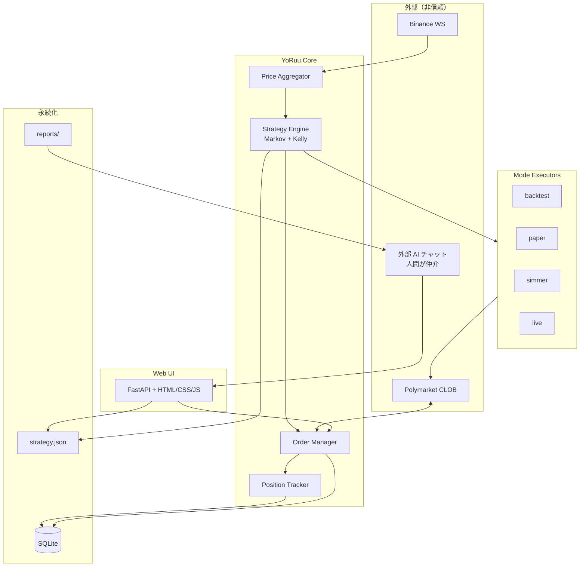

<div align="center">

# YoRuu

### 夜間レビューで進化する、Polymarket BTC 5分 Up/Down 自動売買 Bot

*Markov · Kelly · Zero LLM at runtime · Human-in-the-loop nightly review*

<br>

[-1a1a2e?style=for-the-badge&logo=gitbook&logoColor=c9b8ff&labelColor=2d2d44)](https://github.com/matrix9neonebuchadnezzar2199-sketch/YoRuu/blob/main/docs/design/PHASE5_ROADMAP_v1.md)
[](https://github.com/matrix9neonebuchadnezzar2199-sketch/YoRuu)
[](https://www.python.org/downloads/)
[](https://fastapi.tiangolo.com/)
[](https://www.sqlite.org/)
[](https://polymarket.com/)
[](https://github.com/matrix9neonebuchadnezzar2199-sketch/YoRuu)
[](https://github.com/matrix9neonebuchadnezzar2199-sketch/YoRuu)
[-555555?style=for-the-badge)](https://github.com/matrix9neonebuchadnezzar2199-sketch/YoRuu)

<br>

[](docs/design/)
[-d68910?style=flat-square&logo=html5&logoColor=white)](docs/mockups/)
[-2c5f8d?style=flat-square)](https://github.com/matrix9neonebuchadnezzar2199-sketch/YoRuu)
[](https://www.hetzner.com/)
[](docs/design/00_INSTRUCTIONS_ch01-07.md)
[](https://github.com/matrix9neonebuchadnezzar2199-sketch/YoRuu)

<br>

[概要](#概要) ·
[Quick Start](#quick-start) ·
[特徴](#特徴) ·
[アーキテクチャ](#アーキテクチャ) ·
[動作モード](#動作モード) ·
[夜間レビュー](#夜間レビュー) ·
[ドキュメント](#ドキュメント) ·
[ロードマップ](#ロードマップ) ·
[免責](#免責事項)

</div>

---

## 概要

**YoRuu**（ヨルー）は、Polymarket の **BTC 5分 Up/Down** 市場向けに設計された個人運用型の自動売買 Bot である。  
取引判定は **Markov 2状態遷移** と **Kelly 基準** による純粋な Python 数式のみで行い、**ランタイムでは LLM を一切使用しない**。

「夜（Yo）」とループ感のある響き（Ruu）から名付けられた通り、**1日1回の夜間レビュー**で戦略パラメータを人間が監督しながら進化させる——安全とコスト効率を両立する設計が核となる。

> **設計思想**  
> マスターによる **オリジナル設計**（Markov + Kelly・ランタイム LLM 不使用・低コスト運用）。  
> 通知と操作は **Web UI + ローカルファイル + CLI** に集約し、夜間レビューは **人間監督 + 外部 AI** で行う。

| | |
|---|---|
| **対象市場** | Polymarket · BTC 5分 Up/Down |
| **判定頻度** | 5分ごと（最大 288 回/日） |
| **戦略** | Markov persistence + Kelly sizing |
| **夜間レビュー** | レポート JSON → 外部 AI（手動）→ Web UI で apply |
| **想定運用** | ローカル PC または Hetzner VPS（〜 $6/月） |
| **現フェーズ** | **PHASE 5 着手** — OHLC HUD · SSE severity · ADR-001 |
| **テスト** | `pytest` **146** passed、カバレッジ **≈88%**、`fail_under` **80** |
| **会計（H-1）** | `balance` = 自由資金、`principal` = 累積入出金、`total_assets` = balance + locked |

### 全 PHASE マイルストン一覧

正本: [`docs/design/00_ROADMAP.md`](docs/design/00_ROADMAP.md)

#### PHASE 0 — 基盤合意 ✅

| ID | 内容 | 状態 |
|:---|:---|:---:|
| — | ch1〜7 初版・24章構成合意・モック運用ルール | ✅ |

#### PHASE 1 — 設計書執筆 ✅

| ID | 内容 | 状態 |
|:---|:---|:---:|
| M1.0 | ロードマップ整備（`00_ROADMAP` / INDEX） | ✅ |
| M1.1 | ch1〜7 `APPROVED` | ✅ |
| M1.2 | ch8 UIモック設計書 | ✅ |
| M1.3 | ch9〜14 詳細設計 | ✅ |
| M1.4 | ch15 夜間レビュー | ✅ |
| M1.5 | ch16〜24 + 付録 A（a/b/c 分割） | ✅ |

#### PHASE 2 — UIモック ✅

| ID | 内容 | 状態 |
|:---|:---|:---:|
| M2.1 | shared + hub + dashboard + trade log | ✅ |
| M2.2 | nightly + strategy + markov live | ✅ |
| M2.3 | settings〜what-if（11画面） | ✅ |

#### PHASE 3 — コア実装 ✅

| ID | 内容 | 状態 |
|:---|:---|:---:|
| M3.1 | Binance WS + Polymarket CLOB（lab） | ✅ |
| M3.2 | Markov + Kelly | ✅ |
| M3.3 | ペーパー約定 | ✅ |
| M3.4 | SQLite + StateMachine | ✅ |
| M3.5 | 夜間レポート | ✅ |
| M3.6 | 戦略 Apply（CLI + REST） | ✅ |
| M3.7 | FastAPI + SSE 契約 | ✅ |

品質トラック・Exit: [`PHASE3_EXIT_DECLARATION.md`](docs/design/PHASE3_EXIT_DECLARATION.md)

#### PHASE 4 — HUD + 元本 ✅

| ID | 内容 | 状態 |
|:---|:---|:---:|
| M4.1 | FastAPI + SSE 契約 | ✅ |
| M4.2 | 静的モック + EventSource | ✅ |
| M4.3 | 設計章追補（ch10/13/16/18/22） | ✅ |
| M4.4 | 元本コア（INV-D-06 v2） | ✅ |
| M4.5 | principal REST/CLI/SSE + FX API | ✅ |
| M4.6 | mock-data principal/FX/HUD | ✅ |
| M4.7 | `00_hud.html` 主入口 | ✅ |
| M4.8 | en i18n + serve smoke | ✅ |
| M4.9 | PHASE 4 Exit | ✅ |

正本: [`PHASE4_EXIT_DECLARATION.md`](docs/design/PHASE4_EXIT_DECLARATION.md)

#### PHASE 5 — 観察・統合（進行中）

| ID | 内容 | 状態 |
|:---|:---|:---:|
| M5.0 | `PHASE5_ROADMAP_v1.md` | ✅ |
| M5.1 | ADR-001 + archive クリーンアップ | ✅ |
| M5.2 | ローソク足 SSOT（ch10 §10.3.15） | ✅ |
| M5.3 | `GET /api/v1/ohlc` + ring buffer | ✅ |
| M5.4 | HUD SVG チャート + polling | ✅ |
| M5.5 | SSE 全イベント `severity` 必須 | ✅ |
| M5.6 | lab 24h paper レポート | ⏳ 運用 |
| M5.7 | PHASE 5 Exit · v0.6.0 | ⏳ |

正本: [`PHASE5_ROADMAP_v1.md`](docs/design/PHASE5_ROADMAP_v1.md)

#### PHASE 6 — ペーパー運用（予定）

| ID | 内容 | 状態 |
|:---|:---|:---:|
| M6.1 | 初期戦略パラメータ確定 | ⏳ |
| M6.2 | 1週目運用 + 日次レビュー | ⏳ |
| M6.3 | 2週目運用 + パラメータ調整 | ⏳ |

#### PHASE 7 — 段階移行 LIVE（任意・予定）

| ID | 内容 | 状態 |
|:---|:---|:---:|
| M7 | $10 → $50 → $100 → 本格、各段階1週間+ | ⏳ |

テンプレ 14: [`PHASE3_PARALLEL_CHAT_TEMPLATES.md`](docs/design/PHASE3_PARALLEL_CHAT_TEMPLATES.md)

---

## Quick Start

前提: Python 3.11+、[uv](https://github.com/astral-sh/uv) 推奨。

```powershell
cd YoRuu
uv sync
copy config\yoruu.yaml.example config\yoruu.yaml
uv run yoruu config validate
uv run yoruu db init
uv run yoruu principal show
uv run yoruu principal deposit 100 --note lab
# 既存 DB（PHASE 3 以前）がある場合:
uv run yoruu db migrate --dry-run
uv run yoruu db migrate
uv run yoruu paper evaluate-once
uv run yoruu serve
# HUD 主入口: http://127.0.0.1:8765/pages/00_hud.html  (ルート / も同じへリダイレクト)
# Hub (10画面): http://127.0.0.1:8765/pages/index.html
# 言語: 各画面の EN/JA トグル、または DevTools で localStorage yoruu.lang = "en"
uv run yoruu nightly generate
uv run yoruu strategy apply path\to\proposal.json --by USER
uv run pytest -q
```

設計 SSOT: [`docs/design/INDEX.md`](docs/design/INDEX.md)。PHASE 3 Exit: [`PHASE3_EXIT_DECLARATION.md`](docs/design/PHASE3_EXIT_DECLARATION.md)。PHASE 4: [`PHASE4_ROADMAP_v1.md`](docs/design/PHASE4_ROADMAP_v1.md)。

**テスト**: `uv run pytest -q` — **146** passed、カバレッジ **≈88%**。**静的 UI 再生成**: `uv run python tools/build_web_static.py`（`docs/mockups/` 正本は保持）。

**設定**: `initial_principal`（推奨）。`initial_balance` は後方互換のみ（DeprecationWarning）。

**元本 API（M4.5）**: `GET/POST /api/v1/principal/*`、`GET /api/v1/fx/usd_jpy`、`yoruu principal deposit|withdraw|show|transactions`。

**OHLC（M5.3）**: `GET /api/v1/ohlc?bars=60` — HUD チャート用 5分足（lab seed）。

---

## 特徴

<table>
<tr>
<td width="50%" valign="top">

### 安全性ファースト

- 信頼境界線に基づく入力検証（外部 API · AI JSON · UI）
- **不変条件**（`MIN_PROB` · `KELLY_FRACTION` · **INV-D-06 v2** 元本保存則 等）の機械的 assert
- **元本**（`principal`）入出金と `balance`（自由資金）の分離（ch10 v1.2 / ch13 D11 v2）
- **キル・スイッチ** · 二重承認（paper → live は `"LIVE"` 手入力）
- `strategy.json` はバックアップ後にのみ上書き
- 監査ログ（append-only）

</td>
<td width="50%" valign="top">

### シンプル & 低コスト

- ランタイム LLM API コスト **$0**（夜間レビューは利用者が選ぶ外部 AI・手動）
- Python 単体（エージェント基盤なし）
- SQLite + JSON · 単一 `yoruu.yaml` 設定
- UI は **Vanilla HTML/CSS/JS**（モックアップから本実装へ移植）

</td>
</tr>
<tr>
<td width="50%" valign="top">

### テスト可能性

| モード | 用途 |
|:---|:---|
| `backtest` | 過去データで戦略検証 |
| `paper` | リアルタイム・仮想約定 |
| `simmer` | Polymarket 向けペーパー連携 |
| `live` | 本番（多段確認必須） |

</td>
<td width="50%" valign="top">

### 可観測性

- 構造化ログ（`structlog`）+ エラーコード体系
- 取引ログ · ポジション · 日次レポート JSON
- 戦略パラメータのバージョン履歴
- `mode: live` 時は UI 全体で視覚的警告（赤バー）

</td>
</tr>
</table>

---

## アーキテクチャ



<details>
<summary><strong>レイヤー構成（クリックで展開）</strong></summary>

| レイヤー | コンポーネント | 責務 |
|:---|:---|:---|
| データソース | Binance WS · Polymarket REST/WS | 価格・板・注文 |
| コア | Strategy Engine · Order Manager | 判定・発注・ポジション |
| モード | 4 Executors | 戦略結果の実行先分岐 |
| 永続化 | SQLite · JSON | 取引・監査・戦略・レポート |
| UI | FastAPI Web | 操作・監視・apply · 緊急停止 |
| 横断 | Scheduler · Logger · Safety | 5分境界 · ログ · 不変条件 |

</details>

---

## 動作モード

```
┌─────────────┐     ┌─────────────┐     ┌─────────────┐     ┌─────────────┐
│  backtest   │ ──▶ │    paper    │ ──▶ │   simmer    │ ──▶ │    live     │
│  過去検証   │     │  仮想約定   │     │  外部PT連携 │     │  本番取引   │
└─────────────┘     └─────────────┘     └─────────────┘     └─────────────┘
       │                    │                    │                    │
       └────────────────────┴────────────────────┴────────────────────┘
                    各段階で不変条件・損失上限・監査ログが有効
```

| モード | 実取引 | 典型用途 |
|:---|:---:|:---|
| `backtest` | ✗ | パラメータ探索・回帰テスト |
| `paper` | ✗ | フォワード検証（リアルタイム） |
| `simmer` | ✗ | Polymarket エコシステムとの整合確認 |
| `live` | ✓ | 本番（二重承認 · 残高確認 · UI 赤強調） |

---

## 夜間レビュー

毎日、設定時刻に `report_YYYY-MM-DD.json`（集計データ + AI 用プロンプト）をローカル出力。  
人間が **外部 AI**（ブラウザ上のチャット等）に分析を依頼し、返却 JSON を Web UI で検証・二重承認のうえ `strategy.json` に反映する。

```
  report.json ──copy──▶ 外部 AI ──copy──▶ Web UI (/review)
       ▲                      │                    │
       │                      │                    ▼
  Scheduler              人間が監督          Schema + Range 検証
  (send_time)                                 Diff プレビュー
                                                    │
                                                    ▼
                                            strategy.json + audit_log
```

| ステップ | 操作 | 安全装置 |
|:---:|:---|:---|
| 1 | レポートをコピー（または添付） | ローカル保存のみ（NW 不要） |
| 2 | AI 分析 → JSON を取得 | 人間が内容を確認 |
| 3 | Web UI に貼り付け | 即時スキーマ検証 + 差分表示 |
| 4 | Apply 確定 | 範囲検証 · `E_NIGHTLY_008`（±10% 警告 / ±20% 拒否）· バックアップ |

---

## ドキュメント

| 種別 | パス | 説明 |
|:---|:---|:---|
| 設計指示書（第1〜7章） | [`docs/design/00_INSTRUCTIONS_ch01-07.md`](docs/design/00_INSTRUCTIONS_ch01-07.md) | 設計書生成・レビュー用仕様 |
| レビュー用チェックリスト | [`docs/design/REVIEW_CHECKLIST_ch01-07.md`](docs/design/REVIEW_CHECKLIST_ch01-07.md) | 第1〜7章の人間レビュー基準 |
| 開発日記 | [`docs/2026-05-27_開発日記.html`](docs/2026-05-27_%E9%96%8B%E7%99%BA%E6%97%A5%E8%A8%98.html) | 設計判断の時系列ログ |
| UI モックアップ | [`docs/mockups/`](docs/mockups/) | HTML **12** 画面（HUD + Hub + 10）· serve 対応 |
| 設計 INDEX | [`docs/design/INDEX.md`](docs/design/INDEX.md) | 24章 + 付録 A APPROVED |
| PHASE 3 監査 | [`docs/design/PHASE3_QUALITY_AUDIT.md`](docs/design/PHASE3_QUALITY_AUDIT.md) | A-HIGH / 4 Track |
| PHASE 4 ロードマップ | [`docs/design/PHASE4_ROADMAP_v1.md`](docs/design/PHASE4_ROADMAP_v1.md) | HUD · 元本 · FX 表示 |
| 並列チャットテンプレ | [`docs/design/PHASE3_PARALLEL_CHAT_TEMPLATES.md`](docs/design/PHASE3_PARALLEL_CHAT_TEMPLATES.md) | テンプレ 14 `phase4-hud-principal` |
| 開発日記 | [`docs/2026-05-28_開発日記.html`](docs/2026-05-28_%E9%96%8B%E7%99%BA%E6%97%A5%E8%A8%98.html) | M4.3〜M4.4 ローリング・実装ログ |

### 設計書 24章（APPROVED）

<details>
<summary><strong>章一覧を表示</strong></summary>

| # | 章 | モック更新 |
|:---:|:---|:---:|
| 1 | 概要 | — |
| 2 | アーキテクチャ概観 | — |
| 3 | 状態遷移図 | — |
| 4 | データフロー図（DFD） | — |
| 5 | 信頼境界線図 | — |
| 6 | シーケンス図 | — |
| 7 | I/O 図 | — |
| 8 | **UI モックアップ一式** | ★ 全画面初版 |
| 9〜24 | 操作フロー · 戦略 · 安全 · デプロイ 等 | 該当画面を随時更新 |

</details>

---

## リポジトリ構成

```
YoRuu/
├── README.md
├── pyproject.toml            # v0.5.0, fail_under 80
├── config/yoruu.yaml.example # initial_principal, principal.*, display.fx
├── docs/design/              # 設計書 24章 + 付録 A + PHASE ロードマップ
├── docs/adr/                 # ADR-001 等
├── docs/mockups/             # モック 12画面（00_hud + 10 + hub）
├── src/yoruu/
│   ├── cli.py
│   ├── core/                 # StateMachine, EventBus
│   ├── strategy/             # Markov, Kelly, Evaluator
│   ├── execution/            # PaperExecutor, FillModel, PrincipalService
│   ├── data/                 # SQLite schema, migrate
│   ├── api/sse/              # SSE 契約（M4.1）
│   ├── web/                  # FastAPI + static（M4.2）
│   ├── review/               # Nightly, Apply
│   └── safety/               # Invariants
└── tests/
```

---

## ロードマップ

| フェーズ | 内容 | 状態 |
|:---|:---|:---:|
| **PHASE 0** | ch1〜7 基盤合意 | ✅ |
| **PHASE 1** | 設計書 24章 + 付録 A | ✅ |
| **PHASE 2** | HTML モック 11画面 | ✅ |
| **PHASE 3** | コア CLI + 品質トラック | ✅ [`PHASE3_EXIT`](docs/design/PHASE3_EXIT_DECLARATION.md) |
| **PHASE 4** | HUD + 元本 + 静的 UI | ✅ [`PHASE4_EXIT`](docs/design/PHASE4_EXIT_DECLARATION.md) |
| **PHASE 5** | OHLC · severity · ADR · lab 24h | **進行中** [`PHASE5_ROADMAP`](docs/design/PHASE5_ROADMAP_v1.md) |
| **PHASE 6** | ペーパー運用 14日 | ⏳ |
| **PHASE 7** | 段階 LIVE 移行（任意） | ⏳ |

マイルストン詳細は本文 [全 PHASE マイルストン一覧](#全-phase-マイルストン一覧)。SSOT: [`docs/design/00_ROADMAP.md`](docs/design/00_ROADMAP.md)

---

## 技術スタック

| カテゴリ | 選定 |
|:---|:---|
| 言語 | Python 3.11+ · [uv](https://github.com/astral-sh/uv) |
| CLI | Click（`yoruu` エントリポイント） |
| API / UI（PHASE 4） | FastAPI · SSE |
| 取引所 | py-clob-client（Polymarket 公式） |
| データ | SQLite · SQLAlchemy · alembic |
| 設定 | pydantic-settings · `yoruu.yaml` |
| ログ | structlog |
| テスト | pytest · pytest-asyncio |
| プロセス管理 | systemd / supervisor |

---

## 免責事項

> **本リポジトリは教育・個人研究目的の設計・実装プロジェクトである。**
>
> - 金融商品取引に関する助言・勧誘ではない  
> - 過去のバックテスト結果は将来の利益を保証しない  
> - `live` モードでの取引は **自己責任** — 損失上限・キルスイッチを必ず理解したうえで運用すること  
> - API キー・秘密鍵は `.env` で管理し、リポジトリにコミットしない  

---

<div align="center">

<br>

**YoRuu** — *trade with math. evolve at night.*

<br>

[](https://github.com/matrix9neonebuchadnezzar2199-sketch/YoRuu)
[](https://github.com/matrix9neonebuchadnezzar2199-sketch/YoRuu/issues)
[](https://github.com/matrix9neonebuchadnezzar2199-sketch/YoRuu/stargazers)

<sub>README · v0.5.0 · PHASE 5 着手 · last updated 2026-05-28</sub>

</div>
