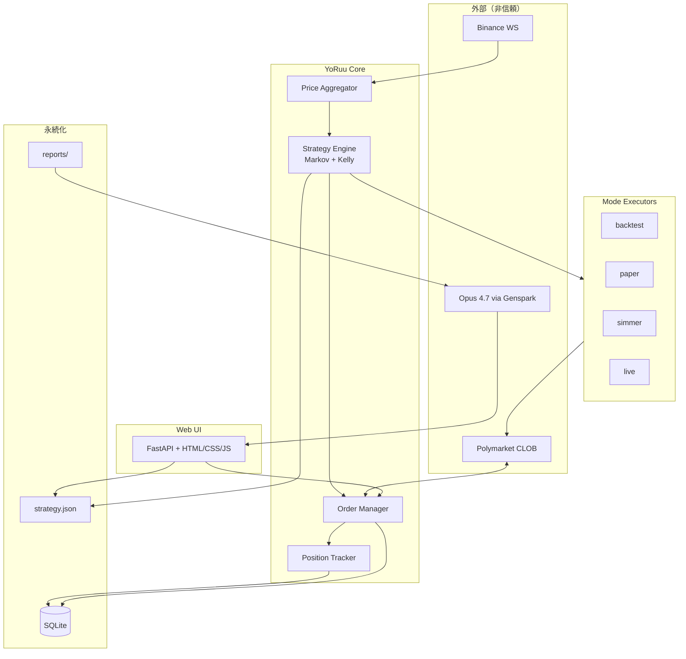

<div align="center">

# YoRuu

### 夜間レビューで進化する、Polymarket BTC 5分 Up/Down 自動売買 Bot

*Markov · Kelly · Zero LLM at runtime · Human-in-the-loop nightly review*

<br>

[](https://github.com/matrix9neonebuchadnezzar2199-sketch/YoRuu)
[](https://www.python.org/downloads/)
[](https://fastapi.tiangolo.com/)
[](https://www.sqlite.org/)
[](https://polymarket.com/)
[](https://github.com/matrix9neonebuchadnezzar2199-sketch/YoRuu)
[](https://github.com/matrix9neonebuchadnezzar2199-sketch/YoRuu)
[-555555?style=for-the-badge)](https://github.com/matrix9neonebuchadnezzar2199-sketch/YoRuu)

<br>

[](docs/design/)
[-d68910?style=flat-square&logo=html5&logoColor=white)](docs/mockups/)
[-2c5f8d?style=flat-square)](https://github.com/matrix9neonebuchadnezzar2199-sketch/YoRuu)
[](https://www.hetzner.com/)
[](docs/design/00_INSTRUCTIONS_ch01-07.md)
[](https://github.com/matrix9neonebuchadnezzar2199-sketch/YoRuu)

<br>

[概要](#概要) ·
[特徴](#特徴) ·
[アーキテクチャ](#アーキテクチャ) ·
[動作モード](#動作モード) ·
[夜間レビュー](#夜間レビュー) ·
[ドキュメント](#ドキュメント) ·
[ロードマップ](#ロードマップ) ·
[免責](#免責事項)

</div>

---

## 概要

**YoRuu**（ヨルー）は、Polymarket の **BTC 5分 Up/Down** 市場向けに設計された個人運用型の自動売買 Bot である。  
取引判定は **Markov 2状態遷移** と **Kelly 基準** による純粋な Python 数式のみで行い、**ランタイムでは LLM を一切使用しない**。

「夜（Yo）」とループ感のある響き（Ruu）から名付けられた通り、**1日1回の夜間レビュー**で戦略パラメータを人間が監督しながら進化させる——安全とコスト効率を両立する設計が核となる。

> **設計思想**  
> Bonereaper 系エージェントの「再現」ではなく、本質（Markov + Kelly・低コスト運用）を抽出した **自分用の実装**。  
> Telegram 通知は廃止し、**Web UI + ローカルファイル + CLI** に集約する。

| | |
|---|---|
| **対象市場** | Polymarket · BTC 5分 Up/Down |
| **判定頻度** | 5分ごと（最大 288 回/日） |
| **戦略** | Markov persistence + Kelly sizing |
| **夜間レビュー** | レポート JSON → Genspark / Opus 4.7 → Web UI で apply |
| **想定運用** | ローカル PC または Hetzner VPS（〜 $6/月） |
| **現フェーズ** | **設計・ドキュメント整備**（実装前） |

---

## 特徴

<table>
<tr>
<td width="50%" valign="top">

### 安全性ファースト

- 信頼境界線に基づく入力検証（外部 API · AI JSON · UI）
- **不変条件**（`MIN_PROB` · `KELLY_FRACTION` 等）の機械的 assert
- **キル・スイッチ** · 二重承認（paper → live は `"LIVE"` 手入力）
- `strategy.json` はバックアップ後にのみ上書き
- 監査ログ（append-only）

</td>
<td width="50%" valign="top">

### シンプル & 低コスト

- ランタイム LLM API コスト **$0**（夜間レビューは既存 Genspark 契約）
- Python 単体（Hermes 等のエージェント基盤なし）
- SQLite + JSON · 単一 `yoruu.yaml` 設定
- UI は **Vanilla HTML/CSS/JS**（モックアップから本実装へ移植）

</td>
</tr>
<tr>
<td width="50%" valign="top">

### テスト可能性

| モード | 用途 |
|:---|:---|
| `backtest` | 過去データで戦略検証 |
| `paper` | リアルタイム・仮想約定 |
| `simmer` | Polymarket 向けペーパー連携 |
| `live` | 本番（多段確認必須） |

</td>
<td width="50%" valign="top">

### 可観測性

- 構造化ログ（`structlog`）+ エラーコード体系
- 取引ログ · ポジション · 日次レポート JSON
- 戦略パラメータのバージョン履歴
- `mode: live` 時は UI 全体で視覚的警告（赤バー）

</td>
</tr>
</table>

---

## アーキテクチャ



<details>
<summary><strong>レイヤー構成（クリックで展開）</strong></summary>

| レイヤー | コンポーネント | 責務 |
|:---|:---|:---|
| データソース | Binance WS · Polymarket REST/WS | 価格・板・注文 |
| コア | Strategy Engine · Order Manager | 判定・発注・ポジション |
| モード | 4 Executors | 戦略結果の実行先分岐 |
| 永続化 | SQLite · JSON | 取引・監査・戦略・レポート |
| UI | FastAPI Web | 操作・監視・apply · 緊急停止 |
| 横断 | Scheduler · Logger · Safety | 5分境界 · ログ · 不変条件 |

</details>

---

## 動作モード

```
┌─────────────┐     ┌─────────────┐     ┌─────────────┐     ┌─────────────┐
│  backtest   │ ──▶ │    paper    │ ──▶ │   simmer    │ ──▶ │    live     │
│  過去検証   │     │  仮想約定   │     │  外部PT連携 │     │  本番取引   │
└─────────────┘     └─────────────┘     └─────────────┘     └─────────────┘
       │                    │                    │                    │
       └────────────────────┴────────────────────┴────────────────────┘
                    各段階で不変条件・損失上限・監査ログが有効
```

| モード | 実取引 | 典型用途 |
|:---|:---:|:---|
| `backtest` | ✗ | パラメータ探索・回帰テスト |
| `paper` | ✗ | フォワード検証（リアルタイム） |
| `simmer` | ✗ | Polymarket エコシステムとの整合確認 |
| `live` | ✓ | 本番（二重承認 · 残高確認 · UI 赤強調） |

---

## 夜間レビュー

毎日、設定時刻に `report_YYYY-MM-DD.json`（集計データ + AI 用プロンプト）をローカル出力。  
人間が Genspark 経由で **Opus 4.7** に分析を依頼し、返却 JSON を Web UI で検証・二重承認のうえ `strategy.json` に反映する。

```
  report.json ──copy──▶ Opus 4.7 ──copy──▶ Web UI (/review)
       ▲                      │                    │
       │                      │                    ▼
  Scheduler              人間が監督          Schema + Range 検証
  (send_time)                                 Diff プレビュー
                                                    │
                                                    ▼
                                            strategy.json + audit_log
```

| ステップ | 操作 | 安全装置 |
|:---:|:---|:---|
| 1 | レポートをコピー（または添付） | ローカル保存のみ（NW 不要） |
| 2 | AI 分析 → JSON を取得 | 人間が内容を確認 |
| 3 | Web UI に貼り付け | 即時スキーマ検証 + 差分表示 |
| 4 | Apply 確定 | 範囲検証 · 変化率 ±10% · バックアップ |

---

## ドキュメント

| 種別 | パス | 説明 |
|:---|:---|:---|
| 設計指示書（第1〜7章） | [`docs/design/00_INSTRUCTIONS_ch01-07.md`](docs/design/00_INSTRUCTIONS_ch01-07.md) | Cursor / Opus 4.7 向け生成仕様 |
| レビュー用チェックリスト | [`docs/design/REVIEW_CHECKLIST_ch01-07.md`](docs/design/REVIEW_CHECKLIST_ch01-07.md) | 第1〜7章の人間レビュー基準 |
| 開発日記 | [`docs/2026-05-27_開発日記.html`](docs/2026-05-27_%E9%96%8B%E7%99%BA%E6%97%A5%E8%A8%98.html) | 設計判断の時系列ログ |
| UI モックアップ | `docs/mockups/` | 単一 HTML · オフライン動作（準備中） |
| 正式設計書 | `docs/design/01_overview.md` 〜 | 24章構成（生成予定） |

### 設計書 24章（予定）

<details>
<summary><strong>章一覧を表示</strong></summary>

| # | 章 | モック更新 |
|:---:|:---|:---:|
| 1 | 概要 | — |
| 2 | アーキテクチャ概観 | — |
| 3 | 状態遷移図 | — |
| 4 | データフロー図（DFD） | — |
| 5 | 信頼境界線図 | — |
| 6 | シーケンス図 | — |
| 7 | I/O 図 | — |
| 8 | **UI モックアップ一式** | ★ 全画面初版 |
| 9〜24 | 操作フロー · 戦略 · 安全 · デプロイ 等 | 該当画面を随時更新 |

</details>

---

## リポジトリ構成（予定）

```
YoRuu/
├── README.md                 ← 本ファイル
├── pyproject.toml            （予定）
├── yoruu.yaml.example        （予定）
├── docs/
│   ├── design/               # 設計書
│   ├── mockups/              # HTML モックアップ
│   └── YYYY-MM-DD_開発日記.html
└── src/yoruu/                # 実装（予定）
    ├── core/                 # 戦略・約定
    ├── exchange/             # Polymarket クライアント
    ├── modes/                # 4モード
    ├── web/                  # FastAPI UI
    └── safety/               # 不変条件・キルスイッチ
```

---

## ロードマップ

| フェーズ | 内容 | 状態 |
|:---|:---|:---:|
| **Phase 0** | 設計書第1〜7章 · モックアップ運用ルール | 🟣 進行中 |
| **Phase 1** | 第8章 UI モック全画面 · 設計書第8〜24章 | ⚪ 予定 |
| **Phase 2** | コア実装（Markov + Kelly · paper モード） | ⚪ 予定 |
| **Phase 3** | Web UI · 夜間レビュー · apply パイプライン | ⚪ 予定 |
| **Phase 4** | simmer / live · VPS デプロイ手順 | ⚪ 予定 |

---

## 技術スタック（予定）

| カテゴリ | 選定 |
|:---|:---|
| 言語 | Python 3.11+ |
| API / UI | FastAPI · SSE |
| 取引所 | py-clob-client（Polymarket 公式） |
| データ | SQLite · SQLAlchemy · alembic |
| 設定 | pydantic-settings · `yoruu.yaml` |
| ログ | structlog |
| テスト | pytest · pytest-asyncio |
| プロセス管理 | systemd / supervisor |

---

## 免責事項

> **本リポジトリは教育・個人研究目的の設計・実装プロジェクトである。**
>
> - 金融商品取引に関する助言・勧誘ではない  
> - 過去のバックテスト結果は将来の利益を保証しない  
> - `live` モードでの取引は **自己責任** — 損失上限・キルスイッチを必ず理解したうえで運用すること  
> - API キー・秘密鍵は `.env` で管理し、リポジトリにコミットしない  

---

<div align="center">

<br>

**YoRuu** — *trade with math. evolve at night.*

<br>

[](https://github.com/matrix9neonebuchadnezzar2199-sketch/YoRuu)
[](https://github.com/matrix9neonebuchadnezzar2199-sketch/YoRuu/issues)
[](https://github.com/matrix9neonebuchadnezzar2199-sketch/YoRuu/stargazers)

<sub>README · design phase · last updated 2026-05-27</sub>

</div>
