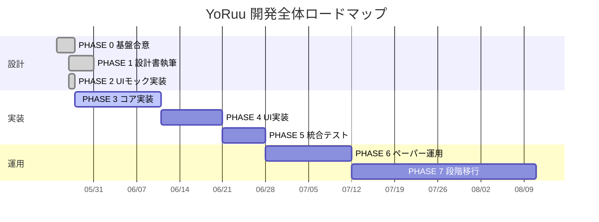
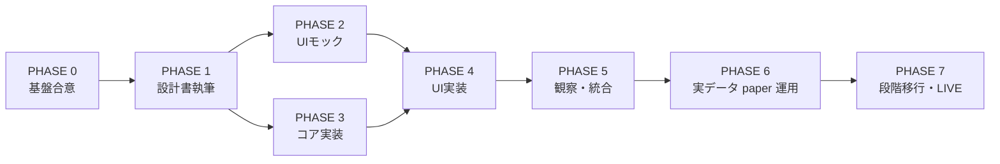

# YoRuu 開発ロードマップ

> **目的**: YoRuu の全工程を PHASE 0〜7 に分割し、各 PHASE の Exit Criteria・成果物・マイルストーンを SSOT として管理する。本ドキュメントは設計・実装・運用すべての判断基準であり、章番号変更・スコープ変更が発生した場合は本ファイルを最初に更新する。

**バージョン**: v1.6  
**作成日**: 2026-05-27（最終更新: 2026-05-31）  
**承認**: PHASE 0 完了時点  
**現在 PHASE**: **PHASE 5 完了**（v0.6.0、M5.0–M5.7）→ **PHASE 6 着手可**（計画策定済）  
**関連**: `INDEX.md`、`PHASE5_ROADMAP_v1.md`、`PHASE6_ROADMAP_v1.md`、`REVIEW_CHECKLIST_ch01-07.md`

---

## 1. 全体 Gantt

---

## 2. PHASE 一覧（Exit Criteria 確定版）

### PHASE 0: 基盤合意 — 完了（2026-05-25 〜 2026-05-27）

**目的**: 設計方針・章構成・運用ルールの合意形成と ch1〜7 の初版確定。

**成果物**:

- `00_INSTRUCTIONS_ch01-07.md`（指示書）
- `REVIEW_CHECKLIST_ch01-07.md`（レビュー基準）
- `08_mockup_carryover.md`（第8章持ち越し事項）
- `docs/design/01_overview.md` 〜 `07_io_diagram.md`（ch1〜7 初版 + 補助レビュー反映）
- `INDEX.md`（24章構成の合意）

**Exit Criteria**:

- 24章構成の合意完了
- モック運用ルールの合意完了
- ch1〜7 初版生成完了
- ch1〜7 補助レビュー反映完了（コミット `49fccec`）
- ch1〜7 正式 `APPROVED`（コミット `2623330`）

### PHASE 1: 設計書執筆 — 完了（2026-05-27）

**目的**: ch1〜24 すべての設計書を `APPROVED` 状態に到達させる（付録 A 用語集を含む）。

**成果物**: `docs/design/01_*.md` 〜 `docs/design/24_*.md`、`appendix_a_glossary.md`

**期間再見積（2026-05-27 中間レビュー）**:

| 項目 | 目標日 |
|------|--------|
| PHASE 1 完了 | **2026-05-31** |
| PHASE 2 着手 | **ch15 APPROVED 翌営業日**（**2026-06-01 週**想定） |

**マイルストーン**:

| ID | 内容 | 期間目安 | 状態 |
|----|------|----------|------|
| M1.0 | ロードマップ整備（本ファイル + INDEX/§1.7 + cross-ref + carryover 更新） | 半日 | 完了 |
| M1.1 | ch1〜7 `APPROVED` | — | 完了 |
| M1.2 | ch8 UIモック**設計書のみ** `APPROVED`（HTML は PHASE 2） | 2日 | **完了**（v1.2.1、`08_ui_mockup.md`） |
| M1.3 | ch9〜14 詳細設計 | 3日 | **完了**（6/6 APPROVED、14/24） |
| M1.4 | ch15 夜間レビューフロー | 1〜2日 | **完了**（v1.0.1 APPROVED） |
| M1.5 | ch16〜24 + 付録 A（下記 a/b/c 分割） | 2日 | **完了**（2026-05-27） |

**M1.5 執筆分割（INDEX 準拠・2026-05-27 合意）**:

| サブ ID | 章順 | 内容 |
|---------|------|------|
| M1.5a | ch17 → ch18 → ch19 | リスク・エラー・キル — **完了**（2026-05-27） |
| M1.5b | ch20 → ch16 → ch23 | 監査・不変条件・テスト — **完了**（2026-05-27、§23.8-9 デプロイ統合） |
| M1.5c | ch21 → ch22 → ch24 | 設定影響・設定仕様・CLOB — **完了**（2026-05-27） |

**中間レビュー確定（案 Y）**: ch21 = 設定影響（維持）、ch24 = Polymarket CLOB クライアント詳細、付録 A = 用語集。旧 ch24「デプロイ + ロールバック」は **ch23** に統合予定。詳細: [`PHASE1_M13_MIDPOINT_REVIEW.md`](./PHASE1_M13_MIDPOINT_REVIEW.md)。

**Exit Criteria**:

- 全24章が `APPROVED`
- `INDEX.md` の全章ステータスが `APPROVED`
- cross-ref（章番号参照）の全件整合確認完了
- 章間矛盾レビュー完了

### PHASE 2: UIモック実装 — 完了（2026-05-27）

**目的**: 11画面の HTML モックを動作可能な状態で完成させる。

**成果物**:

- `docs/mockups/index.html`（ハブ）
- `docs/mockups/01_dashboard.html` 〜 `10_what_if.html`（10画面 + ハブ）
- `docs/mockups/shared/style.css`（GitHub Dark）
- `docs/mockups/shared/i18n.js`（ja 完備、en 枠）
- `docs/mockups/shared/mock-data.js`（リアル系数値）

**マイルストーン**:

| ID | 内容 |
|----|------|
| M2.1 | shared/* + index.html + ダッシュボード + 取引履歴 | **完了**（2026-05-27） |
| M2.2 | 夜間レビュー + 戦略履歴 + Markov ライブビュー | **完了**（2026-05-27） |
| M2.3 | 設定 + アラート + モード切替 + 緊急停止 + What‑If | **完了**（2026-05-27） |

**Exit Criteria**:

- 全画面マスター承認
- ブラウザ（Chrome / Firefox）でダブルクリック起動・動作確認済み
- 外部CDN依存ゼロ確認

### PHASE 3: コア実装（14日、2026-05-28 着手）— **コード実装 Exit（2026-05-28）**

**目的**: 取引ロジックの実装（UI なし、CLI + API で動作）。

**成果物**: `src/yoruu/`（`core/`、`strategy/`、`execution/`、`data/`、`review/`、`safety/`、`infra/`、`web/`、`api/sse/`）、`tests/`

**Exit 宣言**: [`PHASE3_EXIT_DECLARATION.md`](./PHASE3_EXIT_DECLARATION.md)（`3f17b1d`）

### PHASE 3 品質トラック（監査書 §F）

| Track | 内容 | 状態（2026-05-28） |
|-------|------|-------------------|
| 1 | A-HIGH 8 + Q1〜Q3 + 第二フェーズ | **完了** `579402f` |
| 2 | 設計書ローリング（2A〜2D） | **完了** `c8fa393` |
| 3 | README / INDEX / ROADMAP / CHECKLIST | **完了** `085cad5` |
| 4 | モック（T4.1 B1 + T4.2 + INV-D-02） | **完了** `7cbfd49` / `55d1682` / `a2b6081` |
| Exit A | WS → CLOB → FastAPI → 24h harness | **完了** `18fb05c` |
| テンプレ 9 | FastAPI SSE 契約 + Strategy API | **完了** `dea96e0` |

**カバレッジ `fail_under`**: **80** 到達（`pyproject.toml`、ch23 §23.3）

**マイルストーン**:

| ID | 内容 |
|----|------|
| M3.1 | データ取得層（Binance WS + Polymarket CLOB） | **完了**（lab URL + fixture、`yoruu market run`） |
| M3.2 | Markov 推定 + Kelly サイジング | **完了** |
| M3.3 | ペーパー約定エンジン | **完了** |
| M3.4 | SQLite 永続化 + StateMachine | **完了** |
| M3.5 | 夜間レポート生成 | **完了** |
| M3.6 | 戦略 Apply（CLI + REST） | **完了** |
| M3.7 | FastAPI + SSE 契約 | **完了**（PHASE 4 前倒し分） |

**Exit Criteria**:

| 区分 | 項目 | 状態 |
|------|------|------|
| コード | pytest pass、カバレッジ ≥ 80% | ✅ 114 tests / 87.89% |
| コード | INV-* 全件 | ✅ 19/19 |
| コード | WS / CLOB / REST / SSE / Strategy API | ✅ |
| コード | 24h paper ハーネス | ✅ `paper-24h` + smoke UT |
| **運用** | lab VM で 24h 連続実行 | ⏳ マスター作業 |
| **任意** | ch10 v1.2 全 SSE severity 必須 | ⏸ PHASE 4 キックオフ時判断 |

### PHASE 4: UI実装（HUD + 元本）

**目的**: 参照画像準拠の HUD 体験 + 元本概念（A-2/B-2）を Web UI で実現。既存 10 モック画面は温存。

**成果物**: `yoruu/web/`、`docs/mockups/00_hud.html`、principal API/CLI、設計章 v1.2 追補

**正本**: [`PHASE4_ROADMAP_v1.md`](./PHASE4_ROADMAP_v1.md) · 突き合わせ [`../mockups/REF_IMAGE_GAP_MATRIX_v2.md`](../mockups/REF_IMAGE_GAP_MATRIX_v2.md)

**ナビ（I-1）**: 主入口 `00_hud.html`、Hub `index.html` 温存・相互リンク。

| ID | 内容 | 状態 |
|----|------|------|
| M4.1 | FastAPI + SSE 契約 | ✅ `dea96e0` |
| M4.2 | 静的モック + EventSource | ✅ `02edfa0` |
| M4.3 | 設計章追補（ch10/13/16/18/22） | ✅ 完了（2026-05-28） |
| M4.4 | 元本コア（DB、PrincipalService、INV-D-06 v2） | ✅ 完了（2026-05-28） |
| M4.5 | principal REST/CLI/SSE + FX API | ✅ 完了（2026-05-28） |
| M4.6 | `mock-data.js` 拡張（principal/FX/HUD aggregates） | ✅ 完了 |
| M4.7 | `00_hud.html`（I-1 相互リンク、チャート placeholder） | ✅ 完了 |
| M4.8 | i18n（en）+ `build_web_static`、12 画面 serve | ✅ 完了 |
| M4.9 | PHASE 4 Exit 宣言（v0.5.0、`feaa328`） | ✅ 完了 |

**Exit Criteria**（PHASE 4）:

- HUD が参照画像と視覚的に概ね一致（マスター OK）
- principal 入出金・保存則（INV-D-06 v2）が pytest で担保
- 既存 10 モック画面の挙動不変
- SSE 契約（B1 + `principal_changed`）動作

**PHASE 3 運用残**: lab 24h paper → **PHASE 5**（HUD 完成後）

### PHASE 5: 観察・統合 — **コード完了 / 運用待ち**（2026-05-28〜）

> **再スコープ注記**: 当初 PHASE 5 は「統合テスト（不変条件・カオス・緊急停止・backtest）」だったが、2026-05-28 に **観察・統合**（ローソク足 HUD・OHLC API・SSE severity・ADR-001 マージ）へ再定義した（[`PHASE5_ROADMAP_v1.md`](./PHASE5_ROADMAP_v1.md) **ADOPTED**）。当初の統合テスト項目（カオス・キルスイッチ・backtest）は **PHASE 6 へ移管**（[`PHASE6_ROADMAP_v1.md`](./PHASE6_ROADMAP_v1.md)）。

**目的**: ローソク足 HUD・lab 24h paper レポート・設計ドラフト本体マージ（ADR-001）。

**正本**: [`PHASE5_ROADMAP_v1.md`](./PHASE5_ROADMAP_v1.md)（マイルストン SSOT） · Exit: [`PHASE5_EXIT_DECLARATION.md`](./PHASE5_EXIT_DECLARATION.md)（**DRAFT**）

| ID | 内容 | 状態 |
|----|------|------|
| M5.0 | ロードマップ確定 | ✅ 完了 |
| M5.1 | ADR-001 + archive クリーンアップ | ✅ 完了（`e383345`） |
| M5.2 | ローソク足 SSOT（ch10 §10.3.15 / §10.6.14） | ✅ 完了 |
| M5.3 | OHLC API（`GET /api/v1/ohlc`、ring buffer 60） | ✅ 完了（`9fb57a9`） |
| M5.4 | HUD チャート SVG + 5s polling | ✅ 完了 |
| M5.5 | SSE severity 必須（全 12 イベント） | ✅ 完了 |
| M5.6 | lab paper ハーネス安定性（短縮スモーク 5 cycle、INV 0） | ✅ 完了（2026-05-31、24h は冗長判断で短縮） |
| M5.7 | PHASE 5 Exit 確定 + `pyproject.toml` v0.6.0 | ✅ 完了（2026-05-31） |

**Exit Criteria**:

- M5.0〜M5.5 コード完了（✅）、`pytest` **146** passed・カバレッジ ≈**88%**
- lab paper ハーネス安定性確認（M5.6、短縮スモーク）→ [`LAB_PAPER_24H_2026-05-31.md`](../operations/LAB_PAPER_24H_2026-05-31.md)
- Exit 宣言確定・v0.6.0 bump（M5.7、[`PHASE5_EXIT_DECLARATION.md`](./PHASE5_EXIT_DECLARATION.md) CONFIRMED）
- **約定パス検証は PHASE 6 へ繰り越し**（決定論モックでは約定が発生しないため）

### PHASE 6: 実データ paper 運用（14日）— **計画策定済**

**目的**: 実市場データでのペーパートレード運用。当初 PHASE 5 から移管した安全系テストと、実装ギャップ（C1〜C4）を吸収する。

**正本**: [`PHASE6_ROADMAP_v1.md`](./PHASE6_ROADMAP_v1.md)（**PROPOSED**、マイルストン SSOT）

**着手ゲート**: PHASE 5 の M5.6 + M5.7 完了。

| ID | 内容 | 由来 |
|----|------|------|
| M6.0 | PHASE 6 ロードマップ確定 | — |
| M6.1 | 常駐評価ループ統合（単一 asyncio プロセス） | C4 |
| M6.2 | OHLC 実データ接続（`update_from_tick` 配線） | C2 |
| M6.3 | BacktestExecutor（`backtest run`） | C1 |
| M6.4 | 夜間レビュー自動化（04:00 OS タイマー） | V1 |
| M6.5 | 安全リハーサル（カオス + キルスイッチ） | 旧 PHASE5 統合テスト |
| M6.6 | 初期戦略パラメータ確定 | 旧 M6.1 |
| M6.7 | paper 運用 14 日 + 日次レビュー | 旧 M6.2/M6.3 |
| M6.8 | PHASE 6 Exit 宣言 + v0.7.0 | — |

**Exit Criteria**:

- 全自動テスト pass、行カバレッジ ≥ 80%
- 実データ paper **14 日連続**稼働、INV 違反 0・CRITICAL エラー 0
- カオス全シナリオで安全停止確認
- 夜間レビューサイクルが自動起動で安定稼働
- 参考 KPI: 累積勝率 > 50%（絶対基準ではない）、最大ドローダウン < 20%

### PHASE 7: 段階移行（30日、任意）

**目的**: 少額からの実運用。

**前提実装**: C3（LIVE 配線 — `LiveExecutor` の CLI 公開、`live` モード許可）は本フェーズで実装する。PHASE 6 までは非ゴール。

**マイルストーン**: $10 → $50 → $100 → 本格運用、各段階で1週間以上の検証。

**Exit Criteria**: マスター判断。

---

## 3. PHASE 間の依存関係

PHASE 2 と PHASE 3 は PHASE 1 完了後に**並行可能**。PHASE 4 は両者の完了後に着手する。

---

## 4. 章番号と PHASE の対応表

| PHASE | 関連章 |
|-------|--------|
| PHASE 0 | ch1〜7 初版 |
| PHASE 1 M1.2 | ch8 |
| PHASE 1 M1.3 | ch9, ch10, ch11, ch12, ch13, ch14 |
| PHASE 1 M1.4 | ch15 |
| PHASE 1 M1.5a | ch17, ch18, ch19 |
| PHASE 1 M1.5b | ch20, ch16, ch23 |
| PHASE 1 M1.5c | ch21, ch22, ch24（CLOB） |
| 付録 A | 用語集 |
| PHASE 2 | ch8 の HTML 実装 |
| PHASE 3 | ch11, ch13, ch10, ch24（CLOB）が主要参照 |
| PHASE 4 | ch8, ch14 が主要参照 |
| PHASE 5 | ch16, ch17, ch18, ch19, ch23 が主要参照 |
| PHASE 6 | ch15, ch20 が主要参照 |
| PHASE 7 | ch22, ch23（デプロイ統合）, ch24（CLOB）が主要参照 |

---

## 5. 変更管理ルール

- **章番号変更**: 本ファイル §4 と `INDEX.md` を同時更新、`01_overview.md` §1.7 も同期。
- **PHASE 期間変更**: §1 Gantt と該当 PHASE の節を更新、変更理由を §6 変更履歴に追記。
- **マイルストーン追加・削除**: 該当 PHASE の表を更新、`INDEX.md` の進捗にも反映。
- **APPROVED 章の追補**: 論理・アルゴリズム・API 契約の変更を伴う修正は再レビュー必須。SSOT 整合のための**注記・cross-ref・型定義の追記のみ**はマイナーバージョン（v1.0.1 / v1.0.2 等）のローリング更新とし、`APPROVED` を維持。該当 `REVIEW_CHECKLIST_ch*.md` に 1 行追記する。

## 6. 変更履歴

| 日付 | バージョン | 変更内容 | コミット |
|------|-----------|----------|----------|
| 2026-05-27 | v1.0 | 初版作成、PHASE 0 完了確認、M1.0 ロードマップ整備 | `bce8a03` |
| 2026-05-27 | v1.0 | M1.2 完了、第8章 APPROVED（v1.2.1、severity 変数追記） | `832ad1e` |
| 2026-05-27 | v1.0 | M1.3 ch9 完了、第9章 APPROVED（§9.16.5） | `06c0398` |
| 2026-05-27 | v1.0 | M1.3 完了（ch9〜14 APPROVED）、PHASE 1 進捗 14/24 | `3e16689` |
| 2026-05-27 | v1.0 | M1.3 中間レビュー合意（A-1・M1.5 分割・PHASE 2 タイミング） | `1a35cdb` |
| 2026-05-27 | v1.0 | 案 Y: ch24=CLOB、付録 A=用語集、M1.5a/b/c、PHASE 1 5/31 目標 | `89d76d6` |
| 2026-05-27 | v1.1 | **PHASE 1 完了**（24/24 + 付録 A、M1.5a/b/c） | `1117eca` |
| 2026-05-27 | v1.1 | PHASE 2 M2.1 完了（shared + hub + dashboard + trade log） | `c4e20a4` |
| 2026-05-27 | v1.1 | PHASE 2 M2.2 完了（nightly + strategy + markov live） | `9b4ce17` |
| 2026-05-27 | v1.1 | PHASE 2 M2.3 完了（settings〜what-if、PHASE 2 Exit） | `4e2395b` |
| 2026-05-27 | v1.2 | PHASE 3 scaffold（CLI + paper + nightly） | `005fdcd` |
| 2026-05-27 | v1.2 | PHASE 3 `src/yoruu/data/` 追加 | `a040f41` |
| 2026-05-28 | v1.3 | **Track 1 完了**（A-HIGH 8 + Q1〜Q3、fail_under 55） | `f499778` |
| 2026-05-28 | v1.3 | **Track 2 完了**（設計ローリング 2A〜2D、T4.2 ゲート成立） | `c8fa393` |
| 2026-05-28 | v1.3 | README Track 進捗表 + ROADMAP Track 表同期 | `704e387` |
| 2026-05-28 | v1.4 | **PHASE 3 コード Exit**（Exit A + テンプレ 9、114 tests / 87.89%） | `dea96e0` |
| 2026-05-28 | v1.4 | PHASE3_EXIT_DECLARATION 新設 | `3f17b1d` |
| 2026-05-28 | v1.4 | **PHASE 4 Exit**（v0.5.0、HUD + 元本） | `feaa328` |
| 2026-05-28 | v1.4 | PHASE 5 再スコープ（観察・統合、M5.0–M5.7 ADOPTED） | `9fb57a9` |
| 2026-05-31 | v1.5 | **マイルストーン同期**: PHASE 4 重複行修正、PHASE 5 を実態（M5.0–M5.5 完了 / M5.6・M5.7 待ち）へ更新、PHASE 6 を PHASE6_ROADMAP_v1 と同期、C3 を PHASE 7 へ明記、Mermaid ラベル更新 | `d2dcf13` |
| 2026-05-31 | v1.6 | **PHASE 5 完了**: M5.6 短縮スモーク + M5.7 Exit CONFIRMED + v0.6.0 bump、約定検証は PHASE 6 繰越 | `pending` |
