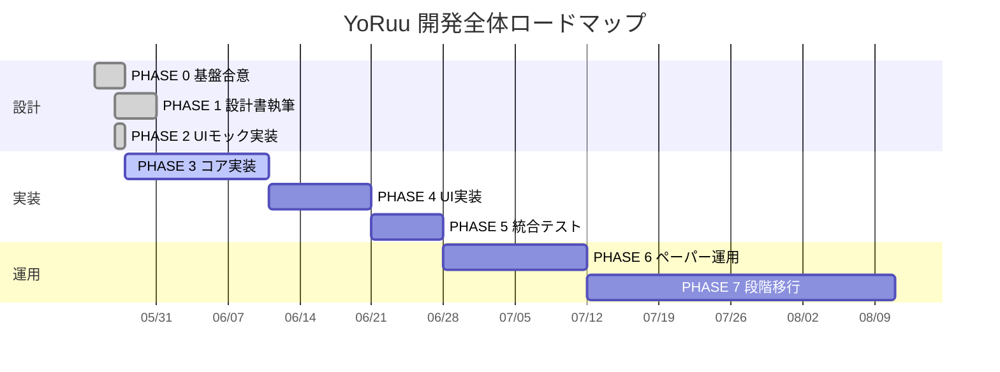
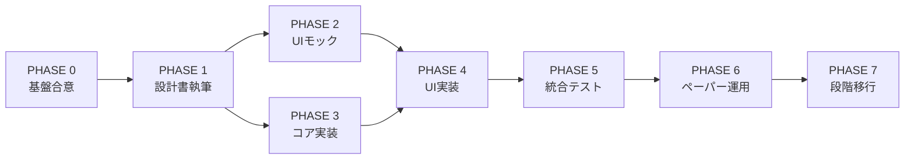

# YoRuu 開発ロードマップ

> **目的**: YoRuu の全工程を PHASE 0〜7 に分割し、各 PHASE の Exit Criteria・成果物・マイルストーンを SSOT として管理する。本ドキュメントは設計・実装・運用すべての判断基準であり、章番号変更・スコープ変更が発生した場合は本ファイルを最初に更新する。

**バージョン**: v1.0  
**作成日**: 2026-05-27  
**承認**: PHASE 0 完了時点  
**関連**: `INDEX.md`、`REVIEW_CHECKLIST_ch01-07.md`、`08_mockup_carryover.md`

---

## 1. 全体 Gantt

---

## 2. PHASE 一覧（Exit Criteria 確定版）

### PHASE 0: 基盤合意 — 完了（2026-05-25 〜 2026-05-27）

**目的**: 設計方針・章構成・運用ルールの合意形成と ch1〜7 の初版確定。

**成果物**:

- `00_INSTRUCTIONS_ch01-07.md`（指示書）
- `REVIEW_CHECKLIST_ch01-07.md`（レビュー基準）
- `08_mockup_carryover.md`（第8章持ち越し事項）
- `docs/design/01_overview.md` 〜 `07_io_diagram.md`（ch1〜7 初版 + 補助レビュー反映）
- `INDEX.md`（24章構成の合意）

**Exit Criteria**:

- 24章構成の合意完了
- モック運用ルールの合意完了
- ch1〜7 初版生成完了
- ch1〜7 補助レビュー反映完了（コミット `49fccec`）
- ch1〜7 正式 `APPROVED`（コミット `2623330`）

### PHASE 1: 設計書執筆 — 完了（2026-05-27）

**目的**: ch1〜24 すべての設計書を `APPROVED` 状態に到達させる（付録 A 用語集を含む）。

**成果物**: `docs/design/01_*.md` 〜 `docs/design/24_*.md`、`appendix_a_glossary.md`

**期間再見積（2026-05-27 中間レビュー）**:

| 項目 | 目標日 |
|------|--------|
| PHASE 1 完了 | **2026-05-31** |
| PHASE 2 着手 | **ch15 APPROVED 翌営業日**（**2026-06-01 週**想定） |

**マイルストーン**:

| ID | 内容 | 期間目安 | 状態 |
|----|------|----------|------|
| M1.0 | ロードマップ整備（本ファイル + INDEX/§1.7 + cross-ref + carryover 更新） | 半日 | 完了 |
| M1.1 | ch1〜7 `APPROVED` | — | 完了 |
| M1.2 | ch8 UIモック**設計書のみ** `APPROVED`（HTML は PHASE 2） | 2日 | **完了**（v1.2.1、`08_ui_mockup.md`） |
| M1.3 | ch9〜14 詳細設計 | 3日 | **完了**（6/6 APPROVED、14/24） |
| M1.4 | ch15 夜間レビューフロー | 1〜2日 | **完了**（v1.0.1 APPROVED） |
| M1.5 | ch16〜24 + 付録 A（下記 a/b/c 分割） | 2日 | **完了**（2026-05-27） |

**M1.5 執筆分割（INDEX 準拠・2026-05-27 合意）**:

| サブ ID | 章順 | 内容 |
|---------|------|------|
| M1.5a | ch17 → ch18 → ch19 | リスク・エラー・キル — **完了**（2026-05-27） |
| M1.5b | ch20 → ch16 → ch23 | 監査・不変条件・テスト — **完了**（2026-05-27、§23.8-9 デプロイ統合） |
| M1.5c | ch21 → ch22 → ch24 | 設定影響・設定仕様・CLOB — **完了**（2026-05-27） |

**中間レビュー確定（案 Y）**: ch21 = 設定影響（維持）、ch24 = Polymarket CLOB クライアント詳細、付録 A = 用語集。旧 ch24「デプロイ + ロールバック」は **ch23** に統合予定。詳細: [`PHASE1_M13_MIDPOINT_REVIEW.md`](./PHASE1_M13_MIDPOINT_REVIEW.md)。

**Exit Criteria**:

- 全24章が `APPROVED`
- `INDEX.md` の全章ステータスが `APPROVED`
- cross-ref（章番号参照）の全件整合確認完了
- 章間矛盾レビュー完了

### PHASE 2: UIモック実装 — 完了（2026-05-27）

**目的**: 11画面の HTML モックを動作可能な状態で完成させる。

**成果物**:

- `docs/mockups/index.html`（ハブ）
- `docs/mockups/01_dashboard.html` 〜 `10_what_if.html`（10画面 + ハブ）
- `docs/mockups/shared/style.css`（GitHub Dark）
- `docs/mockups/shared/i18n.js`（ja 完備、en 枠）
- `docs/mockups/shared/mock-data.js`（リアル系数値）

**マイルストーン**:

| ID | 内容 |
|----|------|
| M2.1 | shared/* + index.html + ダッシュボード + 取引履歴 | **完了**（2026-05-27） |
| M2.2 | 夜間レビュー + 戦略履歴 + Markov ライブビュー | **完了**（2026-05-27） |
| M2.3 | 設定 + アラート + モード切替 + 緊急停止 + What‑If | **完了**（2026-05-27） |

**Exit Criteria**:

- 全画面マスター承認
- ブラウザ（Chrome / Firefox）でダブルクリック起動・動作確認済み
- 外部CDN依存ゼロ確認

### PHASE 3: コア実装（14日、2026-05-28 着手）

**目的**: 取引ロジックの実装（UI なし、CLI で動作）。

**成果物**: `src/yoruu/`（`core/`、`strategy/`、`execution/`、`data/`、`review/`、`safety/`）、`tests/`

### PHASE 3 品質トラック（監査書 §F）

| Track | 内容 | 状態（2026-05-28） |
|-------|------|-------------------|
| 1 | A-HIGH 8 + Q1〜Q3 | **完了** `f499778` |
| 2 | 設計書ローリング（Opus ch3〜） | 未着手 |
| 3 | README / INDEX / ROADMAP / CHECKLIST | Track 3 docs-sync |
| 4 | モック後修正（§F T4.1〜） | Q3-MOCK 先行可、SSE は別チャット |

**カバレッジ `fail_under` 段階**: **55**（現状、`pyproject.toml`）→ **70**（Track 1 安定後）→ **80**（PHASE 3 Exit、ch23 §23.3）

**マイルストーン**:

| ID | 内容 |
|----|------|
| M3.1 | データ取得層（Binance WS + Polymarket CLOB） | **一部**（`MockMarketProvider` + CLI mock。live WS は未接続） |
| M3.2 | Markov 推定 + Kelly サイジング | **完了**（`src/yoruu/strategy/`） |
| M3.3 | ペーパー約定エンジン（スリッページ・手数料・遅延モデル） | **完了**（`FillModel` / `PaperExecutor`） |
| M3.4 | SQLite 永続化 + StateMachine | **完了**（`Database` + `StateMachine`） |
| M3.5 | 夜間レポート生成（JSON 出力） | **完了**（`NightlyReporter` + CLI） |
| M3.6 | 戦略 Apply ロジック（CLI から） | **完了**（`ApplyValidator` + `strategy apply`） |

**Exit Criteria**（具体化）:

- ペーパーモードで **24 時間連続稼働**
- ユニットテスト pass、**行カバレッジ ≥ 80%**（`fail_under` 80、ch23 §23.3）
- 不変条件（ch16）**INV-* assertion 全件** pass
- `pytest` 現状: 20 passed、≈65%（`fail_under` 55 暫定）

### PHASE 4: UI実装（10日）

**目的**: モックを実動 Web UI に変換。

**成果物**: `yoruu/web/`（FastAPI + 静的 HTML + REST + SSE）

**マイルストーン**:

| ID | 内容 |
|----|------|
| M4.1 | FastAPI 基盤 + SSE（リアルタイム更新） |
| M4.2 | ダッシュボード + 取引履歴 + Markov ライブビュー |
| M4.3 | 夜間レビュー Apply 画面（JSON 貼付け） |
| M4.4 | 設定・モード切替・緊急停止 |
| M4.5 | i18n 適用（日本語完備）・What‑If 実計算 |

**Exit Criteria**:

- モックと同等の動作
- API 応答時間 < 200ms（ローカル）
- SSE イベント全件動作確認

### PHASE 5: 統合テスト（7日）

**目的**: 安全性・例外系の最終検証。

**マイルストーン**:

| ID | 内容 |
|----|------|
| M5.1 | 不変条件テスト |
| M5.2 | カオステスト（WS切断・API障害・ディスクフル） |
| M5.3 | 緊急停止リハーサル |
| M5.4 | バックテストでの妥当性検証 |

**Exit Criteria**:

- 全テスト pass
- 72 時間ペーパー連続稼働
- カオステスト全シナリオで安全停止確認

### PHASE 6: ペーパー運用（14日）

**目的**: 実市場データでのペーパートレード運用。

**マイルストーン**:

| ID | 内容 |
|----|------|
| M6.1 | 初期戦略パラメータ確定 |
| M6.2 | 1週目運用 + 日次レビュー |
| M6.3 | 2週目運用 + 戦略パラメータ調整 |

**Exit Criteria**:

- 累積勝率 > 50%（参考値、絶対基準ではない）
- 最大ドローダウン < 20%
- 夜間レビューサイクル安定稼働

### PHASE 7: 段階移行（30日、任意）

**目的**: 少額からの実運用。

**マイルストーン**: $10 → $50 → $100 → 本格運用、各段階で1週間以上の検証。

**Exit Criteria**: マスター判断。

---

## 3. PHASE 間の依存関係

PHASE 2 と PHASE 3 は PHASE 1 完了後に**並行可能**。PHASE 4 は両者の完了後に着手する。

---

## 4. 章番号と PHASE の対応表

| PHASE | 関連章 |
|-------|--------|
| PHASE 0 | ch1〜7 初版 |
| PHASE 1 M1.2 | ch8 |
| PHASE 1 M1.3 | ch9, ch10, ch11, ch12, ch13, ch14 |
| PHASE 1 M1.4 | ch15 |
| PHASE 1 M1.5a | ch17, ch18, ch19 |
| PHASE 1 M1.5b | ch20, ch16, ch23 |
| PHASE 1 M1.5c | ch21, ch22, ch24（CLOB） |
| 付録 A | 用語集 |
| PHASE 2 | ch8 の HTML 実装 |
| PHASE 3 | ch11, ch13, ch10, ch24（CLOB）が主要参照 |
| PHASE 4 | ch8, ch14 が主要参照 |
| PHASE 5 | ch16, ch17, ch18, ch19, ch23 が主要参照 |
| PHASE 6 | ch15, ch20 が主要参照 |
| PHASE 7 | ch22, ch23（デプロイ統合）, ch24（CLOB）が主要参照 |

---

## 5. 変更管理ルール

- **章番号変更**: 本ファイル §4 と `INDEX.md` を同時更新、`01_overview.md` §1.7 も同期。
- **PHASE 期間変更**: §1 Gantt と該当 PHASE の節を更新、変更理由を §6 変更履歴に追記。
- **マイルストーン追加・削除**: 該当 PHASE の表を更新、`INDEX.md` の進捗にも反映。
- **APPROVED 章の追補**: 論理・アルゴリズム・API 契約の変更を伴う修正は再レビュー必須。SSOT 整合のための**注記・cross-ref・型定義の追記のみ**はマイナーバージョン（v1.0.1 / v1.0.2 等）のローリング更新とし、`APPROVED` を維持。該当 `REVIEW_CHECKLIST_ch*.md` に 1 行追記する。

## 6. 変更履歴

| 日付 | バージョン | 変更内容 | コミット |
|------|-----------|----------|----------|
| 2026-05-27 | v1.0 | 初版作成、PHASE 0 完了確認、M1.0 ロードマップ整備 | `bce8a03` |
| 2026-05-27 | v1.0 | M1.2 完了、第8章 APPROVED（v1.2.1、severity 変数追記） | `832ad1e` |
| 2026-05-27 | v1.0 | M1.3 ch9 完了、第9章 APPROVED（§9.16.5） | `06c0398` |
| 2026-05-27 | v1.0 | M1.3 完了（ch9〜14 APPROVED）、PHASE 1 進捗 14/24 | `3e16689` |
| 2026-05-27 | v1.0 | M1.3 中間レビュー合意（A-1・M1.5 分割・PHASE 2 タイミング） | `1a35cdb` |
| 2026-05-27 | v1.0 | 案 Y: ch24=CLOB、付録 A=用語集、M1.5a/b/c、PHASE 1 5/31 目標 | `89d76d6` |
| 2026-05-27 | v1.1 | **PHASE 1 完了**（24/24 + 付録 A、M1.5a/b/c） | `1117eca` |
| 2026-05-27 | v1.1 | PHASE 2 M2.1 完了（shared + hub + dashboard + trade log） | `c4e20a4` |
| 2026-05-27 | v1.1 | PHASE 2 M2.2 完了（nightly + strategy + markov live） | `9b4ce17` |
| 2026-05-27 | v1.1 | PHASE 2 M2.3 完了（settings〜what-if、PHASE 2 Exit） | `4e2395b` |
| 2026-05-27 | v1.2 | PHASE 3 scaffold（CLI + paper + nightly） | `005fdcd` |
| 2026-05-27 | v1.2 | PHASE 3 `src/yoruu/data/` 追加 | `a040f41` |
| 2026-05-28 | v1.3 | **Track 1 完了**（A-HIGH 8 + Q1〜Q3、fail_under 55） | `f499778` |
