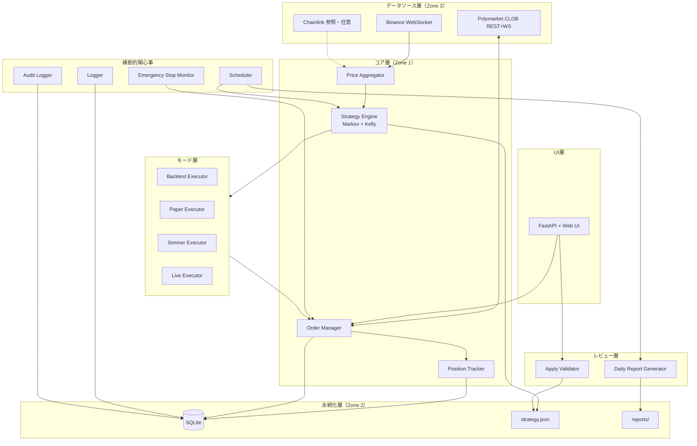
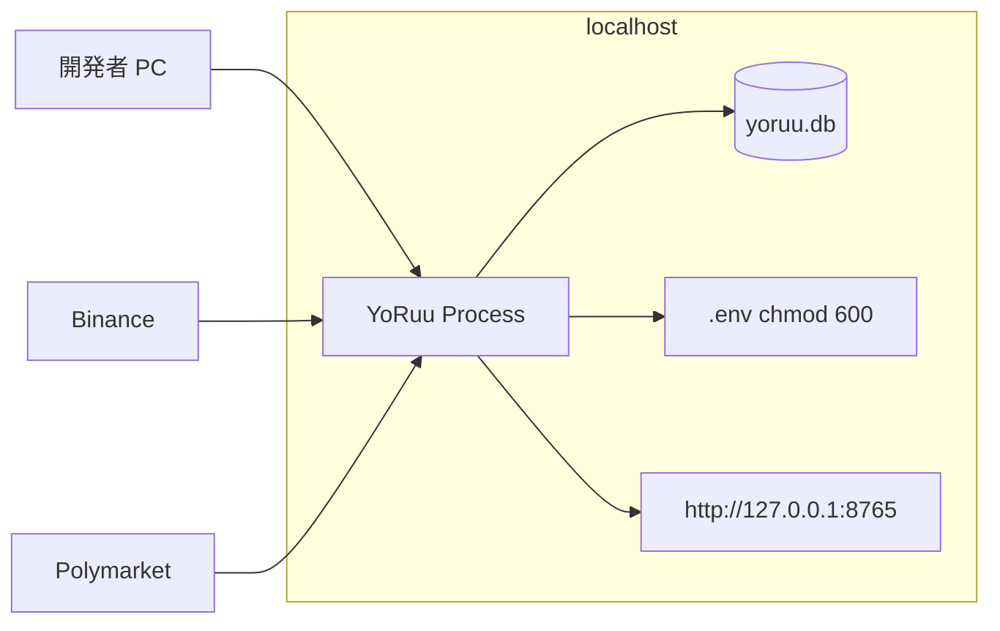
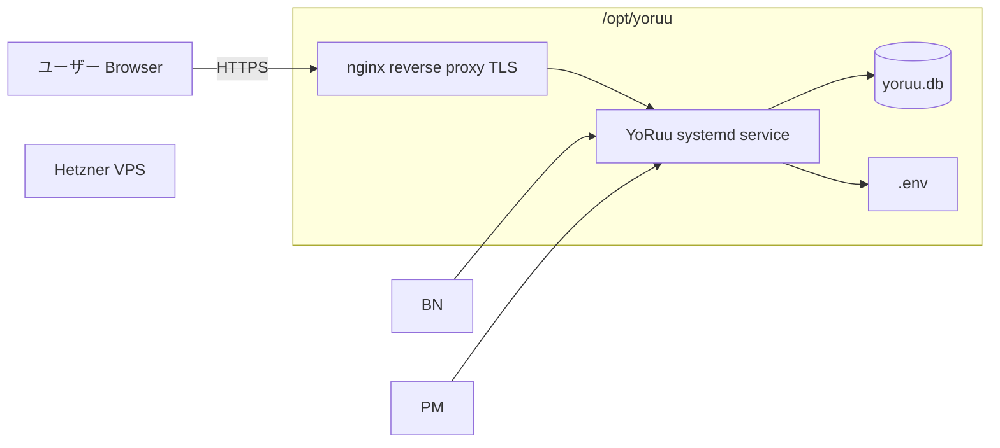

# 第2章 アーキテクチャ概観

## この章の目的

YoRuu の論理レイヤー構成、技術スタック、デプロイパターン、ディレクトリ構造、横断的関心事を定義する。第3章以降の状態・データ・境界・シーケンスの物理配置の前提となる。

---

## 2.1 全体アーキテクチャ図



**図 2-1: YoRuu 全体アーキテクチャ（論理レイヤー）**

データは下位層（外部）からコアへ流入し、モード層が実行先を分岐する。UI・レビュー層は人間操作と夜間レビューを担い、横断関心事がスケジュール・ログ・緊急停止を監視する。

---

## 2.2 技術スタック表

| 層 | 技術 | バージョン目安 | 選定理由 |
|:---|:---|:---|:---|
| 言語 | Python | 3.11+ | エコシステム、可読性、Polymarket SDK 対応 |
| Web Framework | FastAPI | 最新安定版 | 軽量、型安全、自動 API docs |
| WS Client | websockets | — | 標準的・安定 |
| HTTP Client | httpx | — | async 対応、リトライ記述が容易 |
| Polymarket | py-clob-client | — | 公式 SDK |
| DB | SQLite | 3.40+ | 単一ファイル、バックアップ容易 |
| ORM | SQLAlchemy | — | 型安全、alembic マイグレーション |
| スケジューラ | APScheduler | — | cron 相当、Python 内完結 |
| 設定 | pydantic-settings | — | 型検証込み YAML 読込 |
| ログ | structlog | — | 構造化ログ、JSON 出力可 |
| テスト | pytest + pytest-asyncio | — | 標準 |
| Web UI | 素の HTML/CSS/JS | — | 依存最小、モックアップとの一貫性 |
| リアルタイム UI | Server-Sent Events | — | WebSocket より単純で十分 |
| プロセス管理 | systemd / supervisor | — | VPS 運用標準 |

---

## 2.3 デプロイ構成図

### パターンA: ローカル PC 運用



**図 2-2: パターンA — ローカル PC**

| 項目 | 配置 |
|:---|:---|
| SQLite | `./data/yoruu.db` |
| Web UI | `127.0.0.1:8765`（LAN 公開は `[要確認: セキュリティ方針]`） |
| 秘密鍵 | `.env`（プロジェクト外配置も可） |

### パターンB: Hetzner VPS 運用



**図 2-3: パターンB — Hetzner VPS**

| 項目 | 配置 |
|:---|:---|
| SQLite | `/opt/yoruu/data/yoruu.db`（日次バックアップ） |
| Web UI | nginx 経由 HTTPS（自己署名 or Let's Encrypt） |
| 秘密鍵 | `/opt/yoruu/.env`、所有者のみ |

---

## 2.4 ディレクトリ構造

```
yoruu/
├── pyproject.toml
├── README.md
├── .env.example
├── yoruu.yaml.example
├── .cursor/rules/project.md
├── docs/
│   ├── design/
│   └── mockups/
├── src/yoruu/
│   ├── __main__.py
│   ├── config.py
│   ├── core/
│   ├── data/
│   ├── exchange/
│   ├── modes/
│   ├── review/
│   ├── persistence/
│   ├── safety/
│   ├── audit/
│   ├── scheduler/
│   ├── web/
│   └── utils/
├── tests/{unit,integration,e2e}/
└── scripts/
```

| パス | 責務 |
|:---|:---|
| `src/yoruu/core/` | Markov 推定、Kelly サイジング、状態機械 |
| `src/yoruu/data/` | Binance WS、価格バッファ、5分足集計 |
| `src/yoruu/exchange/` | Polymarket CLOB クライアント、EIP-712 署名呼び出し |
| `src/yoruu/modes/` | backtest / paper / simmer / live の Executor |
| `src/yoruu/review/` | 日次レポート生成、apply 検証 |
| `src/yoruu/persistence/` | SQLite ORM、JSON I/O |
| `src/yoruu/safety/` | 不変条件、キル・スイッチ |
| `src/yoruu/audit/` | 監査ログ append |
| `src/yoruu/scheduler/` | 5分境界、夜間レビュー時刻 |
| `src/yoruu/web/` | FastAPI ルート、SSE、静的 HTML |

---

## 2.5 横断的関心事

### ロギング

全モジュールは `structlog.get_logger(__name__)` を使用する。ログレベル定義は (→ 第18章)。

### エラー処理

例外は `YoRuuError` 階層を経由する。Zone 3 入力の検証失敗は専用サブクラス（例: `ValidationError`）とする (→ 第5章 5.3節)。

### 時刻

- 内部処理は **UTC** 固定
- 表示・レポートはユーザー TZ（デフォルト `Asia/Tokyo`）
- 5分境界は UTC 基準でスケジューラが合わせる

### 乱数

テスト用シードを `yoruu.yaml` で固定可能にし、バックテスト再現性を確保する。

### シャットダウン

`SIGTERM` 受信時:

1. 新規発注停止
2. 現ポジションを DB 保存
3. WebSocket 切断
4. 状態を `SHUTDOWN` へ遷移 (→ 第3章 3.2節)

---

## 品質チェック

- [x] 章の冒頭に「この章の目的」を記載した
- [x] 図はすべて Mermaid で描画した
- [x] 図にキャプションを付けた
- [x] 他章への参照は `(→ 第X章 X.Y節)` 形式
- [x] 用語は第1章 1.6 と一致
- [x] 出力ファイル名 `02_architecture.md`
- [x] 章内矛盾なし
- [x] 詳細は後続章へ委譲
