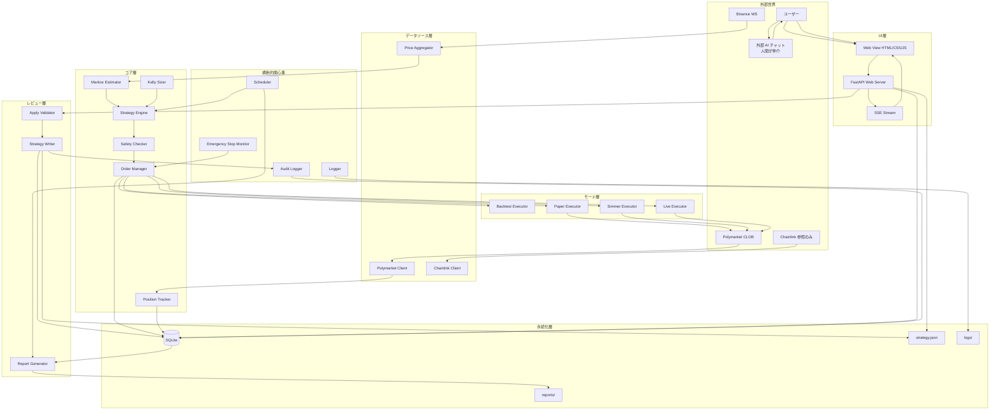
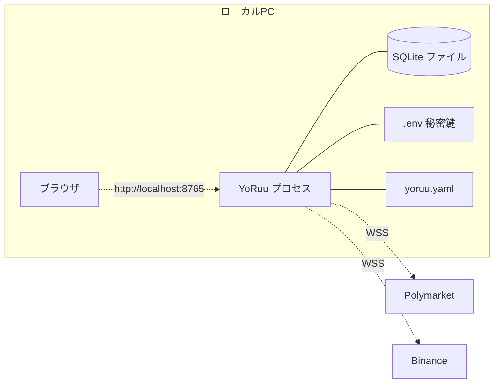
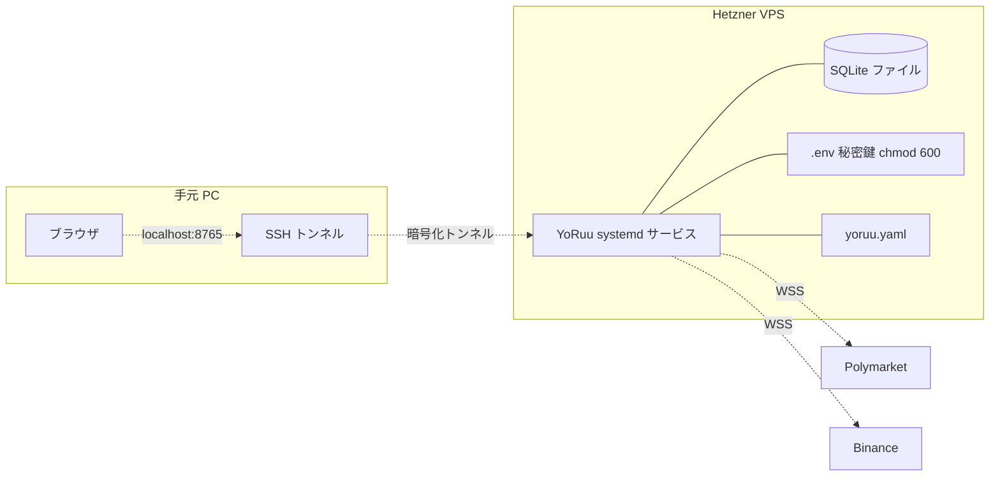

# 第2章 アーキテクチャ概観

> この章の目的
> YoRuu 全体の構造を俯瞰し、技術スタックとディレクトリ構成を確定する。以降の章で詳細化される個別要素の位置付けを与える。

## 2.1 全体アーキテクチャ図

YoRuu は層構造で設計される。各層は下位層に依存するが、上位層には依存しない。



*図 2-1: YoRuu 全体アーキテクチャ*

矢印は「呼び出し」または「データの流れ」を示す。詳細なデータフローは第4章、関数呼び出しの正確な姿は第10章で示す。

## 2.2 技術スタック

| 層 | 技術 | バージョン目安 | 選定理由 |
|---|---|---|---|
| 言語 | Python | 3.11+ | エコシステム、可読性、Polymarket SDK の対応 |
| Web Framework | FastAPI | 最新安定版 | 軽量、型安全、自動 API docs |
| WS Client | websockets | 最新 | 標準的・安定 |
| HTTP Client | httpx | 最新 | async 対応、リトライが書きやすい |
| Polymarket | py-clob-client | 公式最新 | 公式 SDK |
| DB | SQLite | 3.40+ | 単一ファイル、バックアップ容易、十分高速 |
| ORM | SQLAlchemy | 2.x | 型安全、マイグレーション (Alembic) |
| スケジューラ | APScheduler | 最新 | cron 相当、Python 内で完結 |
| 設定 | pydantic-settings | 最新 | 型検証込み YAML 読込 |
| ログ | structlog | 最新 | 構造化ログ、JSON 出力可能 |
| テスト | pytest + pytest-asyncio | 最新 | 標準 |
| Web UI | 素の HTML/CSS/JS | — | 依存最小、モックアップとの一貫性 |
| Web UI (リアルタイム) | Server-Sent Events | — | WebSocket より単純、十分 |
| プロセス管理 | systemd または supervisor | — | VPS 運用標準 |
| マイグレーション | Alembic | 最新 | SQLAlchemy 標準 |

技術選定の基本姿勢は **「枯れた技術を優先、流行を避ける」** である。トレード Bot の中核はシンプルな数値計算と DB I/O であり、最新フレームワークの採用メリットよりも安定性のメリットが大きい。

## 2.3 デプロイ構成

YoRuu は2パターンの運用形態を想定する。

### パターン A: ローカル PC 運用

開発・初期検証用。Web UI へは `http://localhost:8765` でアクセスする。



*図 2-2: ローカル PC 運用構成*

### パターン B: Hetzner VPS 運用

本番。Web UI には SSH トンネル経由 (`ssh -L 8765:localhost:8765 user@vps`) でアクセスする。インターネット直接公開はしない。



*図 2-3: VPS 運用構成*

VPS 運用では Web UI を 0.0.0.0 にバインドせず、必ず 127.0.0.1 にバインドする。理由はセキュリティで、第5章 (信頼境界線) と整合する。

## 2.4 ディレクトリ構造

```
yoruu/
├── pyproject.toml
├── README.md
├── .env.example
├── .gitignore
├── yoruu.yaml.example
├── .cursor/
│   └── rules/
│       └── project.md            # Cursor 運用ルール
├── docs/
│   ├── design/                   # 設計書 (本ファイル群)
│   └── mockups/                  # HTML モックアップ
├── src/yoruu/
│   ├── __init__.py
│   ├── __main__.py               # CLI エントリポイント
│   ├── config.py                 # 設定ファイル読み込み
│   ├── core/                     # 戦略・約定・状態管理
│   │   ├── markov.py
│   │   ├── kelly.py
│   │   ├── strategy.py
│   │   ├── order_manager.py
│   │   └── position_tracker.py
│   ├── data/                     # 価格データ取得
│   │   ├── binance.py
│   │   ├── price_aggregator.py
│   │   └── chainlink.py
│   ├── exchange/                 # Polymarket クライアント
│   │   ├── polymarket_client.py
│   │   └── clob_ws.py
│   ├── modes/                    # 4モードの分岐実装
│   │   ├── base.py
│   │   ├── backtest.py
│   │   ├── paper.py
│   │   ├── simmer.py
│   │   └── live.py
│   ├── review/                   # 夜間レビュー
│   │   ├── report_generator.py
│   │   ├── apply_validator.py
│   │   └── strategy_writer.py
│   ├── persistence/              # DB, JSON I/O
│   │   ├── db.py
│   │   ├── models.py             # SQLAlchemy モデル
│   │   └── strategy_io.py
│   ├── safety/                   # 不変条件・キル・スイッチ
│   │   ├── invariants.py
│   │   ├── kill_switch.py
│   │   └── safety_checker.py
│   ├── audit/                    # 監査ログ
│   │   └── audit_logger.py
│   ├── scheduler/                # cron 的スケジューリング
│   │   └── scheduler.py
│   ├── web/                      # FastAPI Web UI
│   │   ├── app.py
│   │   ├── routes/
│   │   │   ├── dashboard.py
│   │   │   ├── trades.py
│   │   │   ├── review.py
│   │   │   ├── settings.py
│   │   │   ├── strategy.py
│   │   │   ├── alerts.py
│   │   │   ├── mode.py
│   │   │   └── emergency.py
│   │   ├── static/               # CSS / JS / 画像
│   │   └── templates/            # HTML テンプレート
│   └── utils/                    # 共通ユーティリティ
│       ├── time.py
│       ├── errors.py
│       └── ids.py
├── tests/
│   ├── unit/
│   ├── integration/
│   └── e2e/
├── alembic/                      # DB マイグレーション
│   └── versions/
├── scripts/                      # 運用補助スクリプト
│   ├── backup.sh
│   └── restore.sh
└── data/                         # ランタイム生成 (gitignore)
    ├── yoruu.db
    ├── strategy.json
    ├── strategy_history/
    ├── reports/
    └── logs/
```

各ディレクトリの責務は以下のとおり。

| ディレクトリ | 責務 |
|---|---|
| `core/` | 戦略の中核ロジック。LLM 非依存、純粋関数中心 |
| `data/` | 外部からの価格データ取得、正規化 |
| `exchange/` | Polymarket への発注・板取得・WS 購読 |
| `modes/` | 動作モード分岐。同一インターフェースで4実装 |
| `review/` | 夜間レポート生成と Apply プロセス |
| `persistence/` | SQLite・JSON 永続化の唯一の窓口 |
| `safety/` | 不変条件検証・キル・スイッチ |
| `audit/` | 監査ログ専用 (改ざん検知) |
| `scheduler/` | 5分判定・夜間レビューの起動 |
| `web/` | FastAPI ベースの Web UI |
| `utils/` | 時刻・例外クラス・ID 採番など |

## 2.5 横断的関心事

以下は全モジュールに共通する規約である。実装時に各モジュールでこれらが守られていることをコードレビューで確認する。

### 2.5.1 ロギング

全モジュールが `structlog.get_logger(__name__)` を使う。print 文の使用は禁止。ログレベルの使い分けの詳細は第18章で定義する。

### 2.5.2 エラー処理

例外は専用クラス階層 (`YoRuuError` を継承) を必ず通す。Python 標準例外を直接 raise する箇所は外部ライブラリ呼び出し直後のみとし、即座に YoRuu 例外でラップして上位に渡す。例外階層の詳細は第18章で定義する。

### 2.5.3 時刻

内部表現は全て UTC で行う。`datetime.now()` の素の使用は禁止し、`yoruu.utils.time.now_utc()` を使う。表示時のみユーザー設定のタイムゾーン (デフォルト `Asia/Tokyo`) に変換する。

### 2.5.4 乱数

シミュレーション・テストで乱数を使う場合、シード固定で再現性を確保する。`yoruu.utils.random.seeded_random(seed)` 経由でのみ取得する。

### 2.5.5 シャットダウン

SIGTERM 受信時の動作は次の順序で行う。

1. 新規取引判定を停止 (Scheduler 停止)
2. 未約定注文をキャンセル
3. 現ポジションの状態を DB に永続化
4. WS 切断
5. Web Server 停止
6. ログフラッシュ
7. プロセス終了

タイムアウトは30秒。これを超えたら強制終了するが、その場合は次回起動時に「異常終了からの復旧」モードで起動する。詳細は第3章状態遷移と第19章で定義する。

## 2.6 依存関係の方向

層間の依存方向を明示する。これに反する依存は実装段階で禁止する。

```
UI層 → コア層 → データソース層
モード層 → コア層 + 外部
レビュー層 → コア層 + 永続化層
横断的関心事 ← すべての層から利用される
永続化層 ← コア層・モード層・レビュー層から利用される
```

例えば `core/` から `web/` を import する実装は禁止である。これにより Web UI を取り外しても Bot 本体は動作する状態を維持する。

## 品質チェック

- [x] 章の冒頭に「この章の目的」を記載した
- [x] 図はすべて Mermaid で描画した
- [x] 図にキャプションを付けた
- [x] 他章への参照は `(→ 第X章)` 形式で記載した
- [x] 用語は第1章 1.6 の用語集と一致している
- [x] 出力ファイル名: `02_architecture.md`
- [x] 章内で矛盾する記述がない
- [x] 後続章で詳細化される項目は明示的に「(→ 第X章で詳細)」と書いた