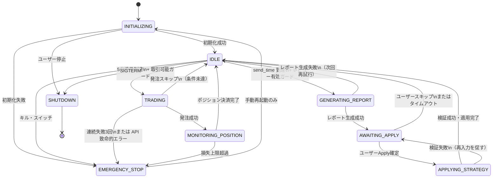

# 第3章 状態遷移図

> この章の目的
> YoRuu Bot が取り得る全ての状態と、その間の遷移を厳密に定義する。実装時の状態管理コードはこの章を直接の根拠とする。

## 3.1 状態の定義

YoRuu Bot は以下の9状態のいずれかに常に位置する。複数状態の同時保持はない (排他的)。

| 状態 | 説明 | 進入条件 | 主な滞在時間 |
|---|---|---|---|
| `INITIALIZING` | 起動直後、設定読込・DB接続・依存サービス確認 | プロセス起動時 | 1〜10秒程度 (概算、測定前) |
| `IDLE` | 稼働中だが次の判定時刻待ち | INITIALIZING または TRADING の完了 | 大半の時間 |
| `TRADING` | 5分境界での判定・発注実行中 | 5分境界到達 | 数秒程度 (概算、測定前) |
| `MONITORING_POSITION` | 約定後、市場決済まで待機 | 発注成功 | 最大5分弱 |
| `GENERATING_REPORT` | 夜間レポート生成中 | `nightly_review.send_time` 到達 | 数秒〜数十秒 (概算、測定前) |
| `AWAITING_APPLY` | レポート出力済、ユーザーからの apply 待ち | GENERATING_REPORT の完了 | 数時間 (人間次第) |
| `APPLYING_STRATEGY` | 新パラメータの検証・適用中 | ユーザーが Apply 確定 | 1秒以下 (概算、測定前) |
| `EMERGENCY_STOP` | キル・スイッチ発動、全停止状態 | キル・スイッチ・損失超過・連続失敗等 | 手動復帰まで |
| `SHUTDOWN` | 正常終了処理中 | SIGTERM 受信または UI 停止操作 | 数秒〜30秒以内 |

注: 滞在時間はいずれも設計時の概算であり、実測値ではない。実測は第13章 (ペーパー約定エンジン仕様) および本番稼働後に確認する。

## 3.2 状態遷移図

*図 3-1: YoRuu Bot 状態遷移図*

## 3.3 遷移トリガーとガード条件

各遷移に対して、トリガー (何が遷移を引き起こすか) とガード条件 (遷移が許可される前提) を明示する。

| 遷移 | トリガー | ガード条件 |
|---|---|---|
| `INITIALIZING → IDLE` | 全初期化処理の完了 | DB 接続成功 AND 設定検証成功 AND strategy.json 存在 |
| `INITIALIZING → EMERGENCY_STOP` | 致命的初期化失敗 | (なし、即遷移) |
| `IDLE → TRADING` | 5分境界到達 (00:00, 00:05, ... UTC) | `mode ∈ {paper, simmer, live}` AND `websocket_connected` (Polymarket + Binance) AND `strategy_loaded` AND `daily_loss < daily_loss_limit` |
| `IDLE → GENERATING_REPORT` | スケジューラがレビュー時刻到達検知 | `nightly_review.enabled = true` AND 当日未生成 |
| `TRADING → MONITORING_POSITION` | 発注 API 成功応答受信 | 注文 ID 取得済 AND DB へ保存成功 |
| `TRADING → IDLE` | 判定結果がエントリー条件未達 | 条件未達 (persistence < threshold など) |
| `TRADING → EMERGENCY_STOP` | 致命的失敗 | 連続失敗カウント >= 3 OR API 認証エラー OR 不変条件違反 |
| `MONITORING_POSITION → IDLE` | 市場決済時刻到達かつ結果確認 | Polymarket からの決済通知受信 |
| `MONITORING_POSITION → EMERGENCY_STOP` | 損失監視 | `daily_loss >= daily_loss_limit` |
| `GENERATING_REPORT → AWAITING_APPLY` | レポートファイル書き込み成功 | `reports/YYYY-MM-DD.json` 生成完了 |
| `GENERATING_REPORT → IDLE` | レポート生成失敗 (DB読込エラー等) | エラー発生・次回再試行をスケジュール |
| `AWAITING_APPLY → APPLYING_STRATEGY` | ユーザーが Apply 二次確認ボタン押下 | スキーマ検証 OK AND 範囲検証 OK |
| `AWAITING_APPLY → IDLE` | ユーザーが Skip ボタン押下 OR 24時間経過 | (常に許可) |
| `APPLYING_STRATEGY → IDLE` | strategy.json 書き換え完了 | バックアップ作成成功 AND 監査ログ書き込み成功 |
| `APPLYING_STRATEGY → AWAITING_APPLY` | 検証失敗または書き込み失敗 | 検証エラーまたは I/O エラー |
| `(任意) → EMERGENCY_STOP` | キル・スイッチ押下 | 常に許可 |
| `EMERGENCY_STOP → INITIALIZING` | ユーザーが「再起動」を明示操作 | プロセス再起動のみ可、自動復帰なし |
| `(任意) → SHUTDOWN` | SIGTERM OR UI 停止ボタン | 常に許可 |

**備考 (`IDLE → TRADING`)**: backtest モードは `BacktestExecutor` が別経路で実行され、本状態機械は経由しない (→ 第3章 3.7節、第12章)。

※ backtest は図 3-1 および本表の `IDLE → TRADING` のスコープ外である。backtest 実行中も `bot_state` は原則 `IDLE` を維持する。

## 3.4 遷移時の副作用

状態遷移時には必ず以下の副作用が実行される。これらは状態遷移コードと密結合で実装する。

| 遷移 | 副作用 |
|---|---|
| `* → EMERGENCY_STOP` | 1) 全 WS 切断、2) 未約定注文キャンセル試行、3) 現状態を DB の `bot_state` に永続化、4) Web UI へ SSE 経由で通知 (最大強調表示)、5) CRITICAL ログ出力、6) 監査ログ書き込み |
| `IDLE → TRADING` | 1) 監査ログ書き込み (判定開始)、2) Web UI にステータス通知 |
| `TRADING → MONITORING_POSITION` | 1) DB に注文レコード作成、2) Web UI に新ポジション通知 |
| `MONITORING_POSITION → IDLE` | 1) DB のポジションレコードを `closed` に更新、2) 損益確定、3) `daily_pnl` 更新 |
| `IDLE → GENERATING_REPORT` | 1) 監査ログ書き込み (レポート生成開始) |
| `GENERATING_REPORT → AWAITING_APPLY` | 1) ファイル `reports/YYYY-MM-DD.json` 生成、2) Web UI に通知 |
| `AWAITING_APPLY → APPLYING_STRATEGY` | 1) `strategy.json` のバックアップを `strategy_history/YYYY-MM-DD_HHMMSS.json` として作成 |
| `APPLYING_STRATEGY → IDLE` | 1) 監査ログ書き込み (パラメータ変更内容)、2) Web UI に反映完了通知 |
| `* → SHUTDOWN` | 2.5.5 節の手順を実行 |
| `INITIALIZING → IDLE` | 1) 監査ログ書き込み (起動完了)、2) `bot_state` を `IDLE` に永続化 |

## 3.5 禁止される遷移

以下の遷移は実装で明示的に禁止する。実装時には `assert` または専用ガード関数で防ぐ。

| 禁止遷移 | 禁止理由 | 防止策 |
|---|---|---|
| `EMERGENCY_STOP → TRADING` | 自動復帰は危険、必ず人間が判断 | プロセス再起動以外で IDLE に戻る経路を持たない |
| `EMERGENCY_STOP → IDLE` | 同上 | 同上 |
| `APPLYING_STRATEGY → APPLYING_STRATEGY` | 再入による二重適用 | 排他ロック取得、取得失敗時はエラー |
| `TRADING → TRADING` | 5分境界判定の二重起動 | スケジューラ側でデバウンス、状態チェック |
| `MONITORING_POSITION → TRADING` | ポジション保有中の追加発注 (本設計では1ポジ運用) | エントリー判定の前提に `current_state == IDLE` |
| `SHUTDOWN → *` | シャットダウン中の他状態への遷移 | 終端状態として扱う |
| `IDLE → APPLYING_STRATEGY` | レポート生成と Awaiting を飛ばす不正経路 | Apply API エンドポイントで状態チェック |

## 3.6 状態の永続化

`bot_state` は SQLite の `bot_runtime` テーブルに常に最新値を保持する。これは以下の目的による。

- 異常終了からの復旧時に「直前何をしていたか」を判定できる
- Web UI のステータス表示で即座に取得できる
- 監査ログとの突き合わせができる

ただし `bot_state` の永続化頻度は **状態遷移時のみ** とし、`MONITORING_POSITION` のような長時間滞在状態で秒単位の永続化は行わない。

異常終了後の起動時は、永続化された前回状態を読み取り、次のいずれかを行う。

| 前回状態 | 起動時の動作 |
|---|---|
| `IDLE` | 通常起動 |
| `TRADING` | 当該5分窓の判定をスキップ、次の窓から再開、警告ログ |
| `MONITORING_POSITION` | ポジションの実際の状態を Polymarket に問い合わせ、整合性確認後 IDLE へ |
| `GENERATING_REPORT` | レポートを再生成 |
| `AWAITING_APPLY` | そのまま AWAITING_APPLY を継続 |
| `APPLYING_STRATEGY` | バックアップから復旧、AWAITING_APPLY へ戻す |
| `EMERGENCY_STOP` | EMERGENCY_STOP を維持、手動操作待ち |
| `SHUTDOWN` | 通常起動 |

## 3.7 状態とモードの直交性

`bot_state` (本章) と `mode` (backtest/paper/simmer/live、→ 第12章) は直交する概念である。任意の組み合わせが理論上存在するが、以下は実用上意味を持たない。

- `backtest` モード × `MONITORING_POSITION`: backtest では決済まで瞬時に完了するため通常通過する状態
- `backtest` モード × `AWAITING_APPLY`: backtest 中は夜間レビュー機構を無効化することを推奨

これらの組み合わせはコードで明示的に分岐する。

## 品質チェック

- [x] 章の冒頭に「この章の目的」を記載した
- [x] 図はすべて Mermaid で描画した
- [x] 図にキャプションを付けた
- [x] 他章への参照は `(→ 第X章)` 形式で記載した
- [x] 用語は第1章 1.6 の用語集と一致している
- [x] 出力ファイル名: `03_state_diagram.md`
- [x] 章内で矛盾する記述がない
- [x] 後続章で詳細化される項目は明示的に「(→ 第X章で詳細)」と書いた
- [x] 時間に関する数値はすべて「概算、測定前」を明記した