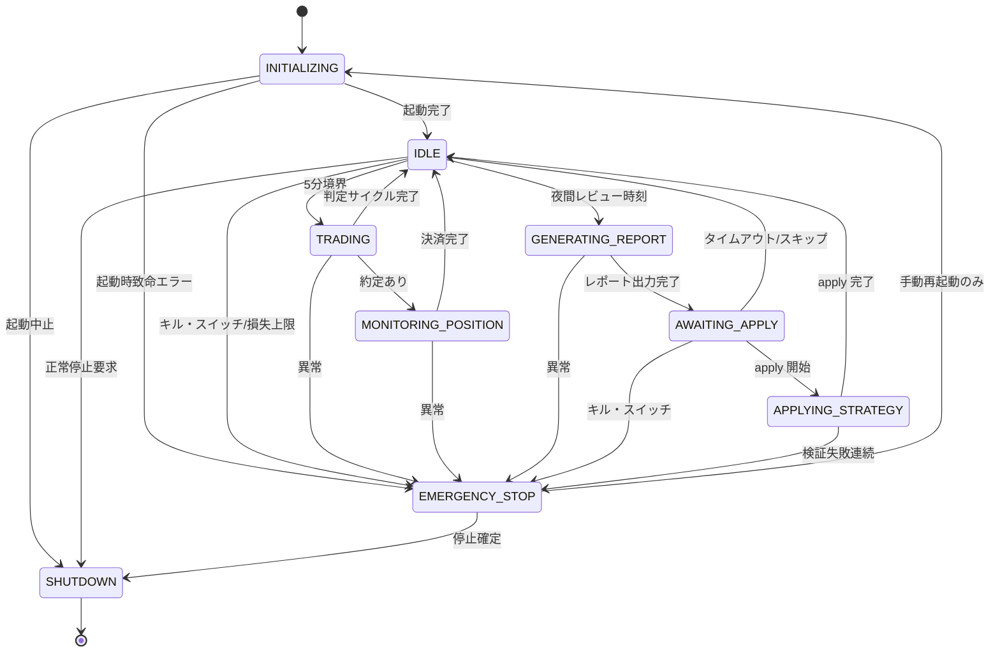

# 第3章 状態遷移図

## この章の目的

YoRuu Bot プロセス全体の状態、遷移トリガー・ガード条件、遷移副作用、禁止遷移を定義する。第6章シーケンス図および実装の状態機械の単一の真実の源（SSOT）とする。

---

## 3.1 Bot 全体の状態定義

**図 3-1: Bot 全体状態遷移（9状態）**

| 状態 | 説明 |
|:---|:---|
| `INITIALIZING` | 起動直後。設定読込・DB 接続・戦略ロード |
| `IDLE` | 稼働中。次の5分境界または夜間レビュー待ち |
| `TRADING` | 5分ごとの Markov + Kelly 判定・発注実行中 |
| `MONITORING_POSITION` | 約定後、市場決済（Resolution）待ち |
| `GENERATING_REPORT` | 夜間レビュー用レポート生成中 |
| `AWAITING_APPLY` | レポート出力済。ユーザー apply 待ち |
| `APPLYING_STRATEGY` | 新戦略パラメータ検証・適用中 |
| `EMERGENCY_STOP` | キル・スイッチまたは自動トリガーによる全停止 |
| `SHUTDOWN` | 正常終了処理中 |

---

## 3.2 遷移条件

| 遷移 | トリガー | ガード条件 |
|:---|:---|:---|
| `[*] → INITIALIZING` | プロセス起動 | なし |
| `INITIALIZING → IDLE` | 設定・DB・Scheduler 準備完了 | 不変条件初期チェック OK |
| `INITIALIZING → EMERGENCY_STOP` | 秘密鍵読込失敗等 | なし（常に許可） |
| `IDLE → TRADING` | 5分境界到達 | `daily_loss < daily_loss_limit` AND `mode ∈ {paper, simmer, live}` OR `mode = backtest` |
| `IDLE → GENERATING_REPORT` | `nightly_review.send_time` 到達 | `mode ≠ backtest`（任意ポリシー） |
| `IDLE → EMERGENCY_STOP` | キル・スイッチ / 損失上限 | なし |
| `TRADING → MONITORING_POSITION` | 注文約定イベント | ポジション未決済が1件以下 (不変条件) |
| `TRADING → IDLE` | 判定完了（注文なし or 処理完了） | なし |
| `MONITORING_POSITION → IDLE` | Resolution 完了 | ポジションクローズ記録済 |
| `GENERATING_REPORT → AWAITING_APPLY` | `report_YYYY-MM-DD.json` 書込完了 | なし |
| `AWAITING_APPLY → APPLYING_STRATEGY` | ユーザー apply 確定（2段階目） | スキーマ・範囲検証 OK |
| `APPLYING_STRATEGY → IDLE` | `strategy.json` 更新完了 | バックアップ成功 |
| `* → EMERGENCY_STOP` | キル・スイッチ OR `daily_loss_limit` 超過 OR 連続注文失敗3回 | **なし（常に許可）** |
| `EMERGENCY_STOP → INITIALIZING` | ユーザー手動再起動 | 明示確認済 |
| `* → SHUTDOWN` | SIGTERM / ユーザー停止 | `EMERGENCY_STOP` 中でも可 |

---

## 3.3 遷移時の副作用

| 遷移 | 副作用 |
|:---|:---|
| `* → EMERGENCY_STOP` | 全 WS 切断、未約定注文キャンセル試行、状態 DB 永続化、Web UI 最大強調、CRITICAL ログ |
| `IDLE → TRADING` | 監査ログ `state_transition` 記録 |
| `TRADING → MONITORING_POSITION` | `positions` テーブル INSERT |
| `MONITORING_POSITION → IDLE` | `positions` クローズ UPDATE、`trades` 確定 |
| `GENERATING_REPORT → AWAITING_APPLY` | `reports/` へ JSON 書込、UI 通知（SSE） |
| `AWAITING_APPLY → APPLYING_STRATEGY` | `strategy.json` を `strategy_history/` にバックアップ |
| `APPLYING_STRATEGY → IDLE` | 新 `strategy.json` 読込、Strategy Engine キャッシュ無効化 |
| `* → SHUTDOWN` | Scheduler 停止、WS 切断、DB flush |

---

## 3.4 禁止される遷移

実装時に `assert` または状態機械ライブラリのガードで防ぐ。

| 禁止遷移 | 理由 | 正しい経路 |
|:---|:---|:---|
| `EMERGENCY_STOP → TRADING` | 異常状態からの直接取引再開 | `EMERGENCY_STOP → INITIALIZING → IDLE → TRADING` |
| `EMERGENCY_STOP → APPLYING_STRATEGY` | 停止中のパラメータ変更 | 再起動後に apply |
| `APPLYING_STRATEGY → APPLYING_STRATEGY` | 再入・競合 | 排他ロック、二重 apply 拒否 |
| `TRADING → GENERATING_REPORT` | 取引中レポート生成の競合 | `TRADING → IDLE` 後に `GENERATING_REPORT` |
| `SHUTDOWN → 任意` | 終了後の処理 | プロセス再起動のみ |

---

## 品質チェック

- [x] 章の冒頭に「この章の目的」を記載した
- [x] Mermaid stateDiagram-v2 を使用
- [x] 図 3-1 にキャプション
- [x] `(→ 第6章)` 等の参照
- [x] 状態名は本章 SSOT（第6章で同一綴りを使用）
- [x] `03_state_diagram.md`
- [x] 9状態すべて `* → EMERGENCY_STOP` を図上で表現（任意状態からの遷移は表 3.2 で明示）
- [x] 戦略ロジック詳細は (→ 第12章)
