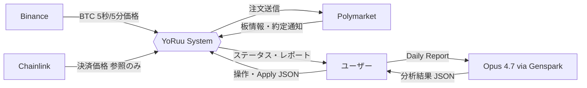
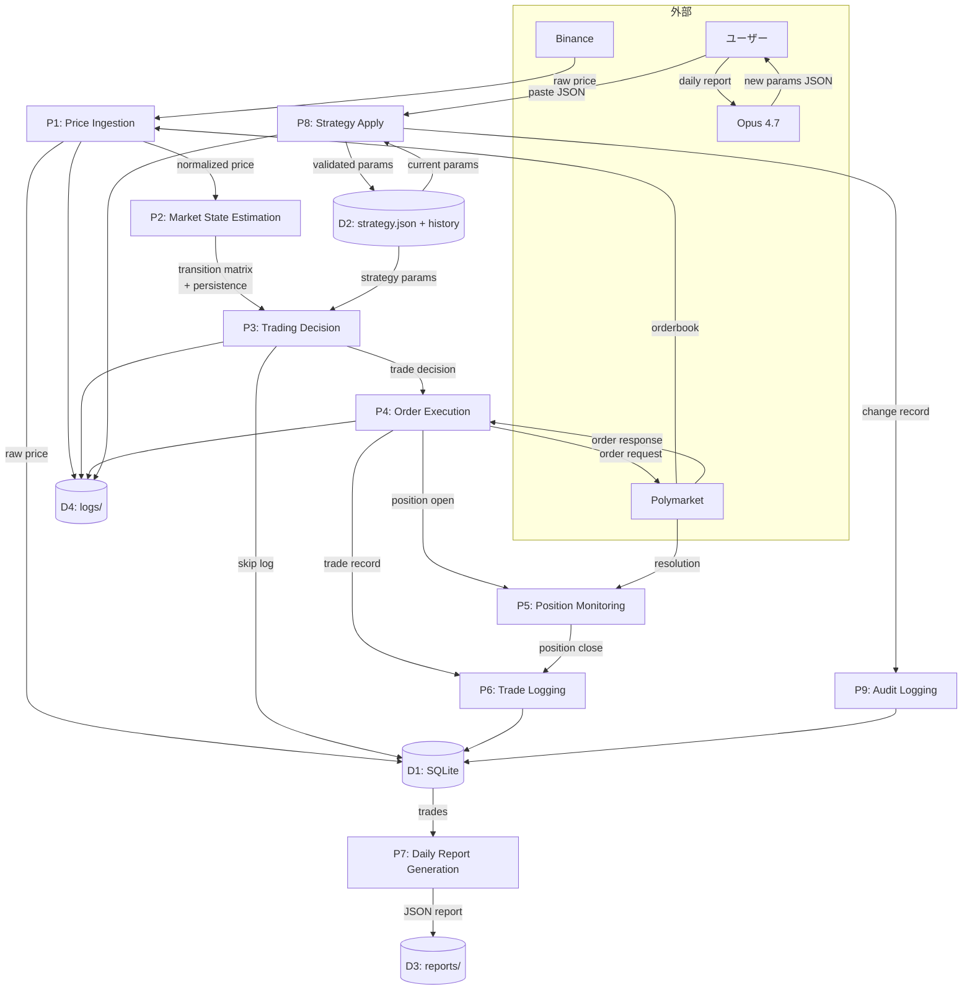

# 第4章 データフロー図 (DFD)

> この章の目的
> YoRuu 内部のデータの流れを階層的に明示する。データの発生源・変換ポイント・保存先・寿命を確定し、バックアップ戦略の根拠を与える。

## 4.1 DFD レベル0 (コンテキスト図)

YoRuu を1つの箱として、外部エンティティとのデータ授受を示す。

*図 4-1: DFD レベル0 コンテキスト図*

YoRuu と Opus 4.7 は**直接通信しない**。常に人間が間を仲介する。これは第5章 (信頼境界線) の Zone 3 境界と整合する。

## 4.2 DFD レベル1 (主要プロセス)

YoRuu 内部を主要9プロセスとデータストアに分解する。

*図 4-2: DFD レベル1 主要プロセス*

## 4.3 データの寿命表

各データがいつ生まれ、どこに保存され、いつ消えるかを表で明示する。バックアップ戦略の根拠とする。

| データ | 発生タイミング | 保存先 | 寿命 | バックアップ |
|---|---|---|---|---|
| BTC 価格 (5秒足、tick) | リアルタイム | メモリのみ (リングバッファ) | 直近100本のみ | なし (再取得可能) |
| BTC 価格 (5分足、確定後) | 5分境界 | SQLite `prices_5min` | 90日 | 日次 |
| Polymarket 板スナップショット | 判定時のみ | SQLite `orderbook_snapshots` | 30日 | 日次 |
| 取引判定ログ | 5分ごと判定時 | SQLite `decisions` | 無期限 | 日次 |
| 取引ログ (注文・約定・決済) | 発注・約定・決済時 | SQLite `trades`, `positions` | 無期限 | 日次 |
| 監査ログ | 任意の重要操作時 | SQLite `audit_log` (append-only) | 無期限 | 日次 |
| 日次レポート | 夜間レビュー時 | `data/reports/YYYY-MM-DD.json` | 無期限 | 週次 |
| strategy.json (現行) | Apply 時 | `data/strategy.json` | 現行版のみ | 即時 (Apply時バックアップ) |
| strategy 履歴 | Apply 時 | `data/strategy_history/YYYY-MM-DD_HHMMSS.json` | 無期限 | 週次 |
| アプリログ | リアルタイム | `data/logs/yoruu.log` | 30日でローテーション | 週次 (圧縮済) |
| Bot 状態 (`bot_state`) | 状態遷移時 | SQLite `bot_runtime` | 上書き | 日次 (DB バックアップに含まれる) |
| 設定 (`yoruu.yaml`) | ユーザー編集時 | プロジェクトルート | 現行版のみ | バージョン管理 (Git) |
| 秘密鍵 / API キー (`.env`) | ユーザー設定時 | プロジェクトルート (chmod 600) | 現行版のみ | バックアップ対象外 |

### バックアップ戦略

- **日次バックアップ**: SQLite ファイル全体を `scripts/backup.sh` で `data/backups/YYYY-MM-DD/` にコピー。30日保持。
- **週次バックアップ**: 日次バックアップを圧縮 (`.tar.gz`) し、別ディスクまたは S3 互換ストレージへ転送 (オプション)。1年保持。
- **即時バックアップ**: Apply 操作時の strategy.json は上書き前に必ず履歴に保存。

## 4.4 データの変換ポイント

外部データが YoRuu 内部の正規化された形に変換される地点を明示する。

| 変換 | 入力 | 出力 | 実施場所 |
|---|---|---|---|
| Binance WS JSON → `Price` | `{"e":"kline","k":{"o":"...","c":"...",...}}` | `Price(timestamp_utc, open, high, low, close, volume)` | `data/binance.py` |
| Polymarket 板 JSON → `Orderbook` | Polymarket CLOB レスポンス | `Orderbook(market_id, bids, asks, ts)` | `exchange/polymarket_client.py` |
| Polymarket 注文応答 → `Trade` | 注文 API レスポンス | `Trade(order_id, market_id, side, size, price, ts, status)` | `exchange/polymarket_client.py` |
| Polymarket 決済通知 → `Resolution` | WS 通知 | `Resolution(market_id, outcome, ts)` | `exchange/clob_ws.py` |
| Opus JSON → `StrategyUpdate` | UI 経由のテキスト入力 | 検証済 `StrategyUpdate(min_prob, min_edge, kelly_fraction, persistence_threshold, reason)` | `review/apply_validator.py` |
| 内部 `Trade` → 日次レポート JSON | DB レコード群 | レポート JSON (→ 第15章スキーマ) | `review/report_generator.py` |
| 内部 `Trade` → CSV | DB レコード群 | CSV ファイル | `web/routes/trades.py` |

各変換関数は Pydantic モデルで型を強制する。スキーマ検証失敗時は Zone 3 → Zone 1 違反として例外を投げる (→ 第5章)。

## 4.5 データの一意性とID採番

データの一意性を保証するための ID 採番ルール。

| 対象 | ID 形式 | 採番場所 | 用途 |
|---|---|---|---|
| 取引判定 | `decision_id`: UUIDv4 | YoRuu 内部 | 判定単位 |
| 注文 | `order_id`: Polymarket 採番 | Polymarket | 注文単位 (冪等性キーとしても使用) |
| ポジション | `position_id`: UUIDv4 | YoRuu 内部 | エントリーから決済までの単位 |
| 監査ログエントリ | `audit_id`: UUIDv7 (時系列順) | YoRuu 内部 | 監査追跡用 |
| 日次レポート | ファイル名 = 日付 | YoRuu 内部 | 1日1ファイル |
| strategy 履歴 | ファイル名 = タイムスタンプ | YoRuu 内部 | 履歴順序 |
| エラーコード | `E_<CATEGORY>_<NNN>` | 設計時固定 | エラートリアージ (→ 第18章) |

冪等性: 同一 `order_id` での再発注リクエストは DB レベルで重複検出し、ブロックする。これは Polymarket 側でも保証されるが、二重防止のため YoRuu 側でも実施する (→ 第17章リスクマトリクス)。

## 4.6 データの優先度とリカバリ可能性

データの重要度に応じて、損失時の影響度を分類する。

| 重要度 | データ | 損失時の影響 | リカバリ方法 |
|---|---|---|---|
| 致命的 | `.env` (秘密鍵) | 資金にアクセスできなくなる | バックアップ不可 (オフライン管理) |
| 高 | SQLite (取引・監査ログ) | 取引履歴・経緯が失われる | 日次バックアップから復元 |
| 高 | strategy.json + history | 戦略が失われる | 履歴から復元、または初期値から再学習 |
| 中 | reports/ | 過去レポートが失われるが、DBから再生成可能 | DBから再生成 |
| 低 | logs/ | デバッグ情報が失われるが運用継続可能 | (再生成不可、放置) |
| 不要 | メモリ上の価格バッファ | 数分の遅延で再構築 | 自動再構築 |

## 品質チェック

- [x] 章の冒頭に「この章の目的」を記載した
- [x] 図はすべて Mermaid で描画した
- [x] 図にキャプションを付けた
- [x] 他章への参照は `(→ 第X章)` 形式で記載した
- [x] 用語は第1章 1.6 の用語集と一致している
- [x] 出力ファイル名: `04_data_flow.md`
- [x] 章内で矛盾する記述がない
- [x] 後続章で詳細化される項目は明示的に「(→ 第X章で詳細)」と書いた