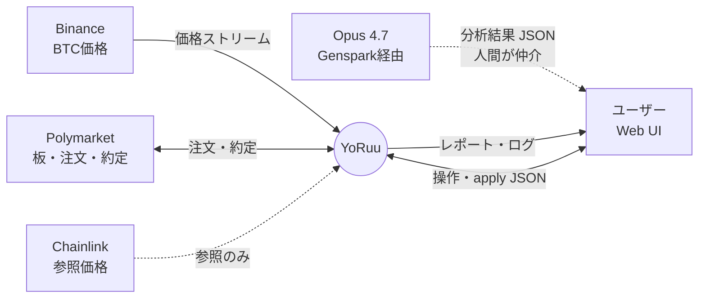
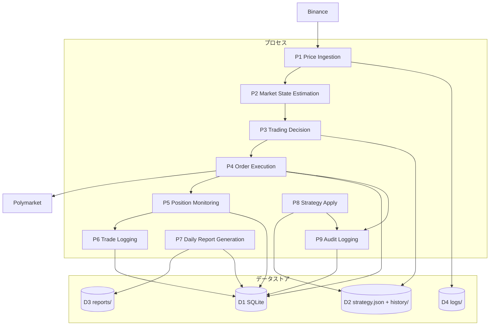

# 第4章 データフロー図（DFD）

## この章の目的

YoRuu におけるデータの発生源、加工、永続化、消費先をレベル0・1の DFD で可視化する。バックアップ戦略と第6章の DB 書き込みポイントの整合の基準とする。

---

## 4.1 DFD レベル0（コンテキスト図）

**図 4-1: DFD レベル0 — コンテキスト図**

Opus 4.7 との直接通信は行わない。人間がレポートをコピーし、返却 JSON を Web UI に貼り付ける (→ 第6章 6.5節)。

---

## 4.2 DFD レベル1（主要プロセス）

**図 4-2: DFD レベル1 — 主要プロセスとデータストア**

| プロセス | 責務 |
|:---|:---|
| P1 | Binance WS 受信、5秒バッファ、5分足集計 |
| P2 | Markov 遷移確率・Persistence 推定 |
| P3 | Kelly サイジング、エントリー可否判定 |
| P4 | モード別 Executor 経由の発注 |
| P5 | 約定後 Resolution 監視 |
| P6 | `trades` テーブルへの確定記録 |
| P7 | 日次集計、`report_YYYY-MM-DD.json` 生成 |
| P8 | apply 検証・`strategy.json` 更新 |
| P9 | 全重要操作の監査ログ追記 |

---

## 4.3 データの寿命表

| データ | 発生 | 保存先 | 寿命 | バックアップ |
|:---|:---|:---|:---|:---|
| BTC価格（5秒足） | リアルタイム | メモリのみ | 直近100本 | なし |
| BTC価格（5分足） | 5分ごと集計 | SQLite `prices_5min` | 90日 | 日次 |
| 取引ログ | 約定時 | SQLite `trades` | 無期限 | 日次 |
| ポジション | エントリー時 | SQLite `positions` | 決済まで | 日次 |
| 監査ログ | 任意操作時 | SQLite `audit_log` | 無期限・追記専用 | 日次 |
| 日次レポート | 夜間レビュー時 | `reports/YYYY-MM-DD.json` | 無期限 | 週次 |
| strategy.json | apply 時 | ルート + `strategy_history/` | 全バージョン保持 | 週次 |
| アプリログ | リアルタイム | `logs/yoruu.log` | 30日ローテーション | 週次 |

---

## 4.4 データの変換ポイント

| 入力 | 変換箇所 | 出力（内部型） |
|:---|:---|:---|
| Binance WS JSON | P1 | `PriceTick` dataclass |
| 5秒バッファ | P1 集計 | `PriceBar5m` |
| 価格系列 | P2 | `MarkovState`（UP/DOWN + 遷移行列） |
| Markov + 板情報 | P3 | `TradeSignal`（方向・サイズ・確率） |
| Polymarket Order Response | P4 検証後 | `OrderRecord` |
| Polymarket Fill Event | P5 | `PositionUpdate` |
| 確定取引 | P6 | `Trade` ORM 行 |
| 日次 DB 集計 | P7 | `DailyReport` dict → JSON ファイル |
| Opus 返却 JSON（Zone 3） | P8 検証後 | `StrategyParams` → `strategy.json` |
| ユーザー UI 入力 | Web API 検証後 | pydantic モデル |

完全スキーマ定義は (→ 第11章)。

---

## 品質チェック

- [x] 章の冒頭に目的を記載
- [x] Mermaid DFD 2図、キャプション付き
- [x] 第6章 DB 書き込みと D1 の対応を P4/P5/P6/P7/P8/P9 で明示
- [x] `(→ 第11章)` でスキーマ委譲
- [x] `04_data_flow.md`
