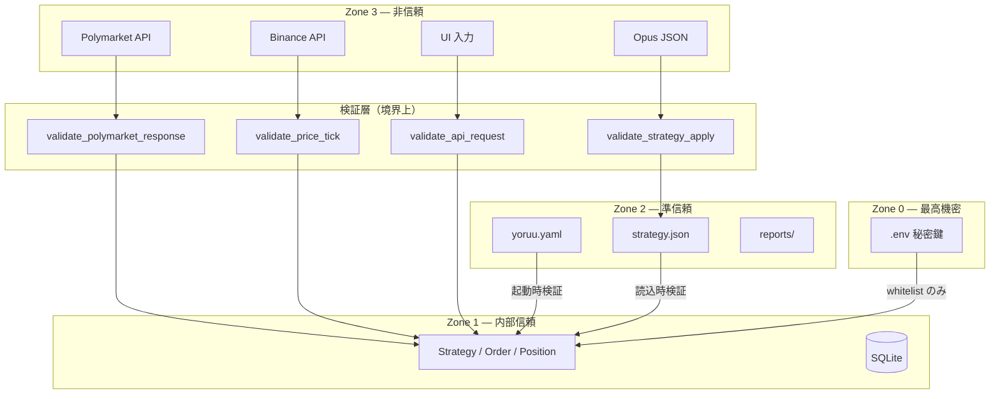

# 第5章 信頼境界線図

## この章の目的

Zone 0〜3 の信頼ゾーン定義、境界を越えるデータに必須の検証、機密情報ポリシーを定める。第6章の `alt` 分岐および第7章の検証マトリクスと整合させる。

---

## 5.1 信頼ゾーン定義

| ゾーン | 名称 | 含まれるもの | 信頼度 |
|:---:|:---|:---|:---|
| **Zone 0** | 最高機密 | 秘密鍵、API キー、wallet seed | 触れる関数をホワイトリスト化 |
| **Zone 1** | 内部信頼 | YoRuu プロセス内メモリ、検証済み DB 行 | 検証通過後のみ |
| **Zone 2** | 準信頼 | ローカル FS（`yoruu.yaml`、ログ、レポート、strategy 履歴） | 読込時に再検証 |
| **Zone 3** | 非信頼 | Polymarket / Binance / Chainlink 応答、Opus JSON、ユーザー UI 入力 | 常に検証必須 |

---

## 5.2 信頼境界線図

**図 5-1: 信頼境界と検証関数の配置**

Zone 3 から Zone 1 へは **必ず** 検証層を通過する。Zone 0 へのアクセスは署名・発注モジュールのホワイトリストに限定する。

---

## 5.3 境界別の検証ルール表

| 境界 | 入力 | 必須検証 | 違反時の動作 |
|:---|:---|:---|:---|
| Zone 3 → Zone 1 (Polymarket) | 注文応答 | JSON スキーマ、金額符号、order_id 整合 | 例外 → 監査ログ → 再試行（最大3回） |
| Zone 3 → Zone 1 (Binance) | 価格 tick | 前値 ±5% 以内、タイムスタンプ単調増加 | 異常値スキップ + WARN ログ |
| Zone 3 → Zone 1 (Opus JSON) | 戦略パラメータ | スキーマ、範囲、変化率 ±10% 以内 | apply 拒否 + UI エラー表示 |
| Zone 3 → Zone 1 (UI) | 全 API ボディ | pydantic サーバ側再検証 | 400 + エラーコード |
| Zone 0 アクセス | 秘密鍵読出 | 呼び出し元ホワイトリスト | 例外 + CRITICAL + `EMERGENCY_STOP` 検討 |
| Zone 2 → Zone 1 (strategy.json) | ファイル読込 | スキーマ検証 | 直前バージョンへフォールバック |
| Zone 2 → Zone 1 (yoruu.yaml) | 設定読込 | pydantic-settings | 起動失敗（安全側） |

第7章 7.2 の入力検証マトリクスと **同一の範囲・関数** を用いる。

---

## 5.4 機密情報の取り扱いポリシー

1. **保管**: `.env` に集約。`chmod 600`、プロセス所有者のみ読取可
2. **ログ**: 秘密鍵・API キー・seed の **部分列・ハッシュ・base64 含め一切出力禁止**
3. **メモリ**: 使用後は参照を解放（Python ではスコープ終了 + 可能なら `del`）
4. **Git**: `.gitignore` で `.env`, `*.key`, `*.pem`, `wallet.json` を除外（リポジトリに ` .gitignore` 済）
5. **バックアップ**: DB バックアップに秘密情報を含めない（Zone 0 はバックアップ対象外）

EIP-712 署名の詳細は (→ 第10章・第12章)。

---

## 品質チェック

- [x] 章の冒頭に目的を記載
- [x] Mermaid 図 5-1、キャプション
- [x] 第7章 7.2 との整合を 5.3 で宣言
- [x] Zone 0〜3 命名を第6章でも使用
- [x] `05_trust_boundary.md`
