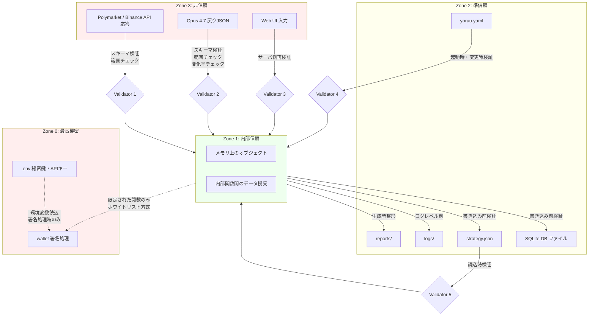

# 第5章 信頼境界線図

> この章の目的
> YoRuu システム内で「信頼できる領域」と「信頼できない領域」を明示し、両者の境界で必要となる検証・サニタイズを定義する。お金が動くシステムの安全性の根幹をなす章である。

## 5.1 信頼ゾーン定義

YoRuu は4つの信頼ゾーンを定義する。

| ゾーン | 名称 | 内容 | 信頼レベル |
|---|---|---|---|
| Zone 0 | 最高機密 | 秘密鍵、API キー、wallet seed | 最大限保護 |
| Zone 1 | 内部信頼 | YoRuu プロセス内のメモリ、内部関数間のデータ | 信頼する |
| Zone 2 | 準信頼 | ローカルファイルシステム (設定、ログ、レポート、DB) | 条件付き信頼 |
| Zone 3 | 非信頼 | 外部 API 応答、Opus 4.7 からの戻り JSON、UI からの入力 | 全て検証 |

## 5.2 信頼境界線図

*図 5-1: 信頼境界線図*

色の凡例: 赤系 = 危険 (Zone 0 と Zone 3)、黄 = 中間 (Zone 2)、緑 = 安全 (Zone 1)。

## 5.3 境界別の検証ルール

各境界における検証ルールを明示する。

### 5.3.1 Zone 3 → Zone 1 の境界

| 入力 | 必須検証 | 違反時の動作 |
|---|---|---|
| Polymarket 注文応答 | スキーマ検証 (Pydantic)、`order_id` 存在、金額の符号、エラーコード確認 | YoRuuExchangeError 例外 → 監査ログ → 設定回数まで再試行 |
| Polymarket 板情報 | スキーマ検証、bid <= ask、価格が `[0.01, 0.99]` 範囲内 | 異常データスキップ + WARN ログ |
| Binance 価格応答 | スキーマ検証、`close > 0`、前値からの変動が ±5% 以内 | 異常値スキップ + WARN ログ、3回連続で WS 再接続 |
| Chainlink 価格 (オンチェーン) | スキーマ検証、ステイル判定 (heartbeat 超過) | ステイル時は使用しない |
| Opus 4.7 戻り JSON | スキーマ検証、必須キー (`MIN_PROB`, `MIN_EDGE`, `KELLY_FRACTION`, `PERSISTENCE_THRESHOLD`)、各値の範囲、前値からの変化率 ±10% 以内 | apply 拒否 + UI に詳細エラー表示 |
| Web UI 入力 (フォーム) | サーバ側で必ず再検証 (クライアント検証は信用しない)、CSRF トークン確認 | HTTP 422 エラー応答 + UI に詳細表示 |
| Web UI 入力 (モード切替の "LIVE") | 厳密な文字列一致 (大文字小文字区別)、CSRF トークン | 拒否、UI に再入力を促す |

### 5.3.2 Zone 2 → Zone 1 の境界

| 入力 | 必須検証 | 違反時の動作 |
|---|---|---|
| `yoruu.yaml` 読込 | Pydantic スキーマ、必須キー、値の範囲 | 起動失敗、CRITICAL ログ、Web UI は別ポートで起動して設定修正画面を表示 (検討) |
| `strategy.json` 読込 | Pydantic スキーマ、不変条件 (→ 第16章) | 前バージョン (history/) へ自動フォールバック + WARN ログ |
| SQLite からのレコード読込 | スキーマ整合性 (SQLAlchemy)、参照整合性 | 該当レコードをスキップ + WARN ログ |

### 5.3.3 Zone 1 → Zone 0 の境界

最も厳格な境界。Zone 0 へのアクセスは以下のホワイトリスト関数のみ許可する。

| 許可される関数 | 用途 |
|---|---|
| `wallet.sign_order(order)` | Polymarket 注文の EIP-712 署名 |
| `wallet.get_address()` | 自ウォレットアドレスの取得 (公開情報) |
| `config.load_env()` | 起動時の環境変数読込 (1回のみ) |

これ以外の関数からの `.env` 読込・wallet オブジェクトへのアクセスは禁止する。実装時には:

- `WalletManager` クラスを singleton として実装
- private 属性で `_private_key` を保持
- 外部公開メソッドは上記3つのみ
- ログ出力時には自動マスキング (`***`)

### 5.3.4 Zone 0 アクセス時の不変条件

- 秘密鍵のメモリ上保持時間を最小化する
- ログ・例外メッセージ・スタックトレースのいかなる箇所にも秘密鍵が出力されない
- 秘密鍵を引数として渡す関数は作らない (常に Singleton 経由)

## 5.4 機密情報の取り扱いポリシー

### 5.4.1 保存

- 環境変数 `.env` で管理 (プロジェクトルート)
- ファイル権限 `chmod 600`、所有者のみ読み取り可
- Git 管理対象から完全に除外 (`.gitignore` で `.env`, `*.key`, `*.pem` を明示除外)
- バックアップ対象から除外

### 5.4.2 メモリ

- 起動時に1回読込、Singleton で保持
- 不要になったメモリ領域は明示的に上書き (Python の制約上完全保証は不可だが努力する)
- ログ出力時には自動マスキング処理を全 Logger に適用

### 5.4.3 検知

- 起動時に `.env` の権限をチェック、`chmod 600` 以外なら CRITICAL ログ + 警告 (起動は継続可能、設定で厳格化可能)
- 起動時に `.env` がリポジトリ追跡対象に含まれていないか確認
- ログファイルのスキャン (`grep`) で疑似的に秘密鍵が漏れていないか定期チェックするスクリプトを `scripts/audit_logs.sh` として用意 (→ 第23章 §23.x デプロイ統合予定)

## 5.5 ネットワーク境界

YoRuu の Web UI は外部公開しない。これは追加の信頼境界である。

| 境界 | 方針 |
|---|---|
| Web UI バインド | `127.0.0.1:8765` のみ。`0.0.0.0` バインド禁止 |
| VPS でのアクセス | SSH トンネルのみ。SSH キー認証必須、パスワード認証無効 |
| Polymarket / Binance への接続 | HTTPS / WSS のみ、証明書検証必須 |
| 内部プロセス間通信 | なし (単一プロセス設計) |

## 5.6 認証・認可

YoRuu は単一ユーザー前提のため、認証機構を持たない。代わりに以下で代替する。

- Web UI はローカルホスト限定 (5.5 と同様)
- VPS 運用時は SSH の認証に依存する
- API キー漏洩時の影響範囲は本人ウォレットのみ

将来複数ユーザー対応が必要になった場合は別途認証層を追加するが、本設計のスコープ外。

## 5.7 ログ・エラーメッセージのサニタイズ

ログ出力時に自動でマスキングする対象を定義する。

| 対象 | マスキングルール |
|---|---|
| 秘密鍵 (0x で始まる64桁hex) | 全てマスク `***` |
| API キー (環境変数経由のもの全て) | 全てマスク `***` |
| Wallet アドレス | 先頭6 + 末尾4 を残す (`0xabc123...d4e5`) |
| 注文 ID | そのまま出力 (公開情報) |
| 金額 | そのまま出力 |

実装は `structlog` のプロセッサとして組み込む。

## 品質チェック

- [x] 章の冒頭に「この章の目的」を記載した
- [x] 図はすべて Mermaid で描画した
- [x] 図にキャプションを付けた
- [x] 他章への参照は `(→ 第X章)` 形式で記載した
- [x] 用語は第1章 1.6 の用語集と一致している
- [x] 出力ファイル名: `05_trust_boundary.md`
- [x] 章内で矛盾する記述がない
- [x] 後続章で詳細化される項目は明示的に「(→ 第X章で詳細)」と書いた