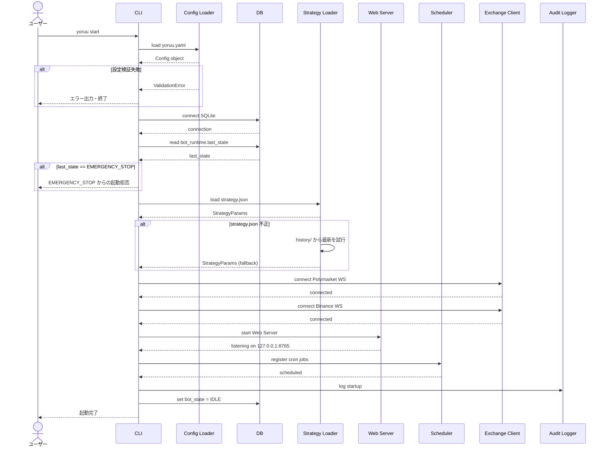
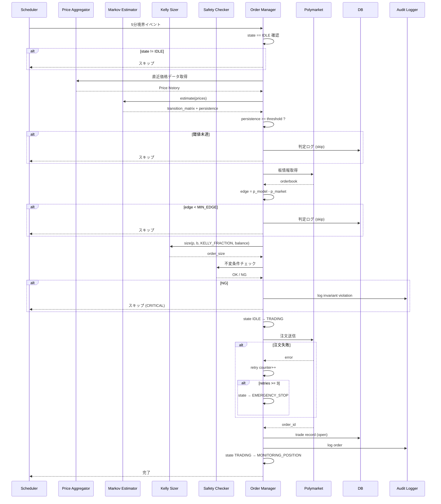
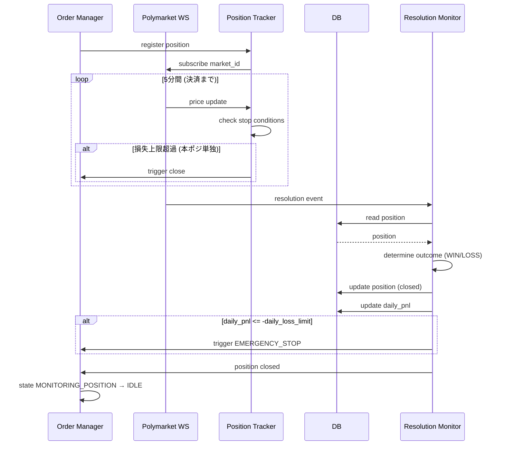
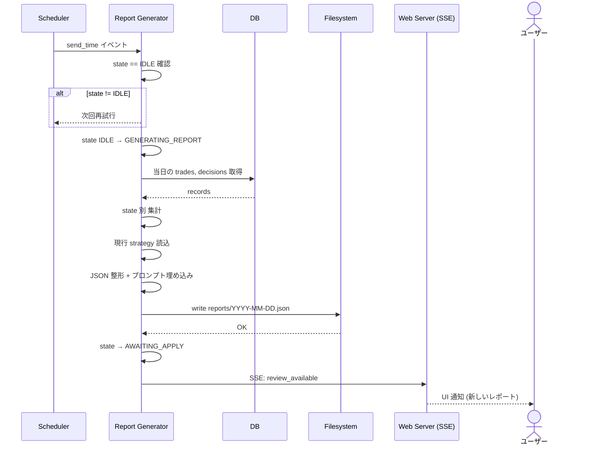
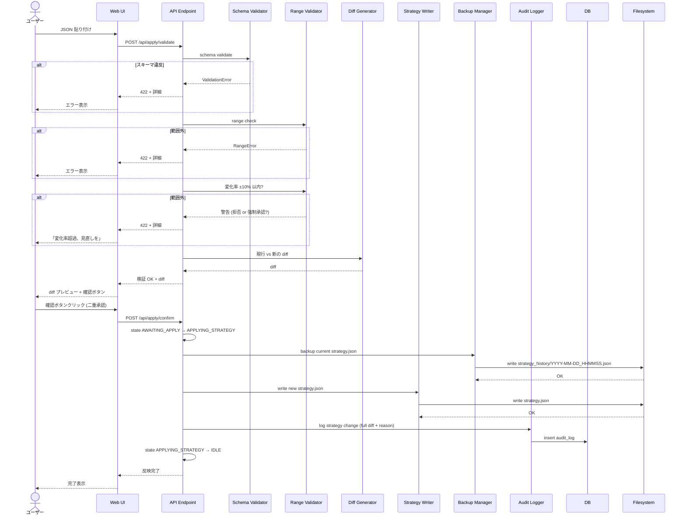
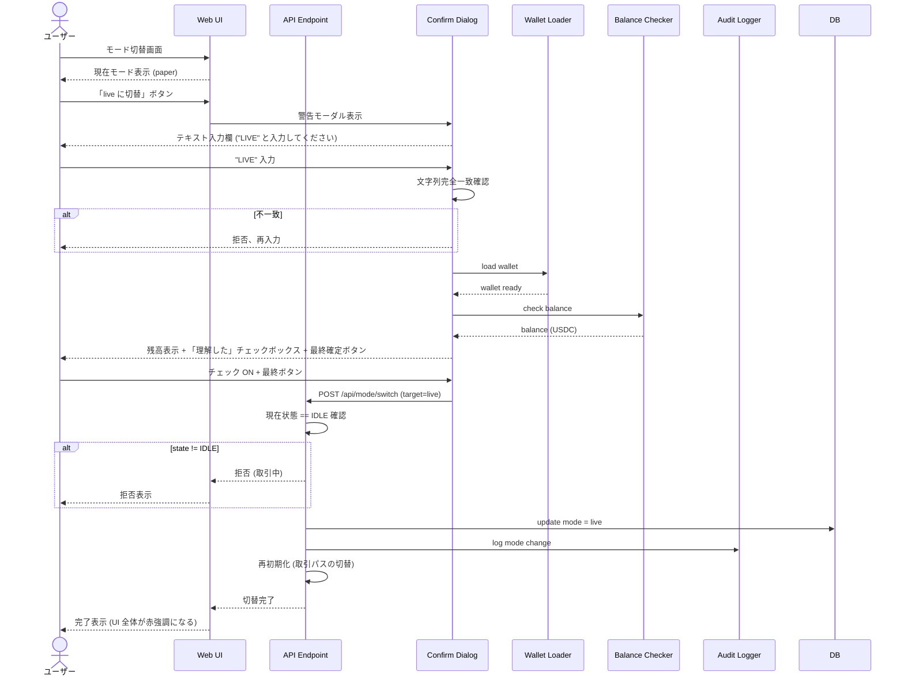
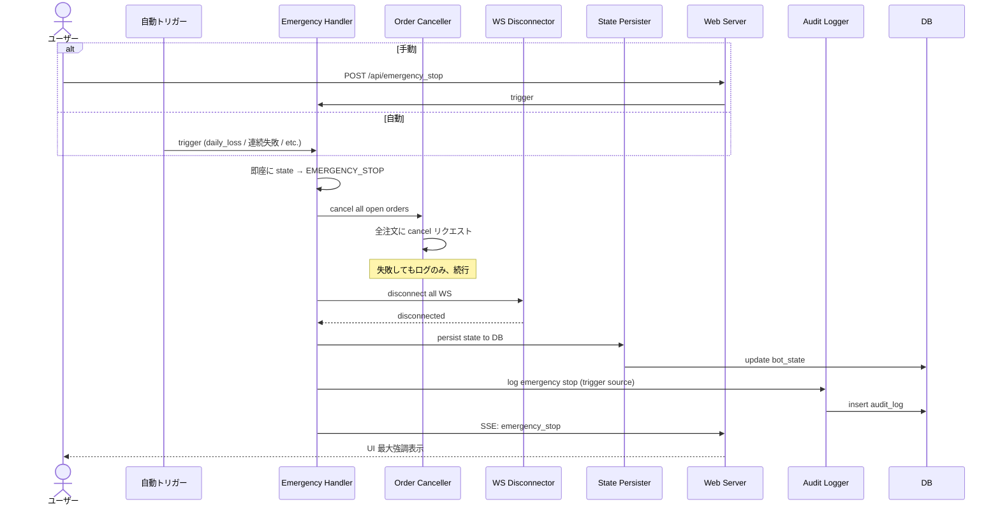

# 第6章 シーケンス図

> この章の目的
> YoRuu の主要ユースケースを時系列の処理フローとして示す。各シーケンスは第3章状態遷移と第5章信頼境界と整合する。

> 注: 本章で示す「想定実行時間」は全て設計段階の概算であり、実測値ではない。実測は本番稼働後に確認する。

## 6.1 Bot 起動シーケンス

*図 6-1: Bot 起動シーケンス*

想定実行時間: 数秒程度 (概算、測定前)。
クリティカルポイント: `EMERGENCY_STOP` 状態からの自動起動を禁止する判定。Polymarket / Binance WS 接続失敗時のリトライ戦略 (→ 第18章)。

## 6.2 5分判定 → 注文シーケンス

*図 6-2: 5分判定 → 注文シーケンス*

想定実行時間: 1〜3秒程度 (概算、測定前)。
クリティカルポイント: 不変条件チェックは注文送信の直前に必ず実施。連続失敗3回で EMERGENCY_STOP へ。

## 6.3 約定 → 決済監視 → クローズシーケンス

*図 6-3: 約定 → 決済監視 → クローズシーケンス*

想定実行時間: 最大約5分 (市場決済まで)。
クリティカルポイント: 5分市場では事実上のストップロスは難しい (流動性が薄いため)。日次損失上限による全体停止を主たる安全装置とする (→ 第17章)。

## 6.4 夜間レビュー (レポート生成) シーケンス

*図 6-4: 夜間レビュー (レポート生成) シーケンス*

想定実行時間: 数秒〜数十秒 (概算、測定前、件数依存)。
クリティカルポイント: レポート生成中は新規取引判定を停止する (state ガード)。生成失敗時は次の5分境界で再試行。

## 6.5 Apply シーケンス (ユーザーが JSON 貼り付け)

*図 6-5: Apply シーケンス*

想定実行時間: ユーザー入力待ちを除き 1秒以下 (概算、測定前)。
クリティカルポイント: 二重承認 (検証→ diff 表示→確認) を必ず通過させる。バックアップは strategy.json 書き換えの**前**に必ず行う。

## 6.6 モード切替シーケンス (paper → live)

*図 6-6: モード切替シーケンス*

想定実行時間: ユーザー入力待ちを除き 1秒以下 (概算、測定前)。
クリティカルポイント: テキスト一致確認 + 残高表示 + 最終承認の3段階。state が IDLE 以外なら拒否。

## 6.7 緊急停止シーケンス

*図 6-7: 緊急停止シーケンス*

想定実行時間: 1秒以下 (概算、測定前)。
クリティカルポイント: 注文キャンセル失敗でも処理は続行する (停止優先)。自動・手動のいずれのトリガーでも同じシーケンスを通る。

## 6.8 シーケンス間の共通規約

- 全シーケンスで監査ログへの書き込みポイントを明示する
- DB への書き込みは順序が重要 (バックアップ → 上書き → 監査ログ)
- 外部 API への呼び出し前に必ず Zone 1 内での検証を完了する
- 状態遷移は第3章定義の遷移のみを使用する

## 品質チェック

- [x] 章の冒頭に「この章の目的」を記載した
- [x] 図はすべて Mermaid sequenceDiagram で描画した
- [x] 図にキャプションを付けた
- [x] 他章への参照は `(→ 第X章)` 形式で記載した
- [x] 用語は第1章 1.6 の用語集と一致している
- [x] 出力ファイル名: `06_sequence.md`
- [x] 章内で矛盾する記述がない
- [x] 後続章で詳細化される項目は明示的に「(→ 第X章で詳細)」と書いた
- [x] 想定実行時間は全て「概算、測定前」を明記した
- [x] エラー分岐は `alt` で表現した
- [x] DB への書き込みポイントを明示した