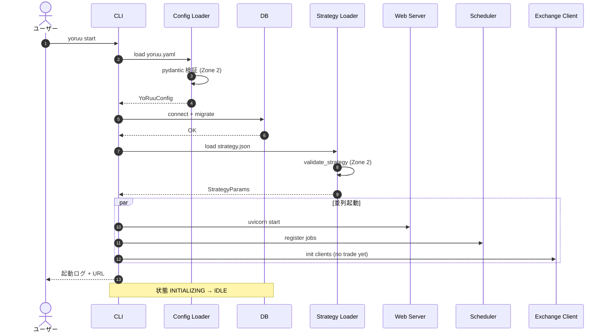
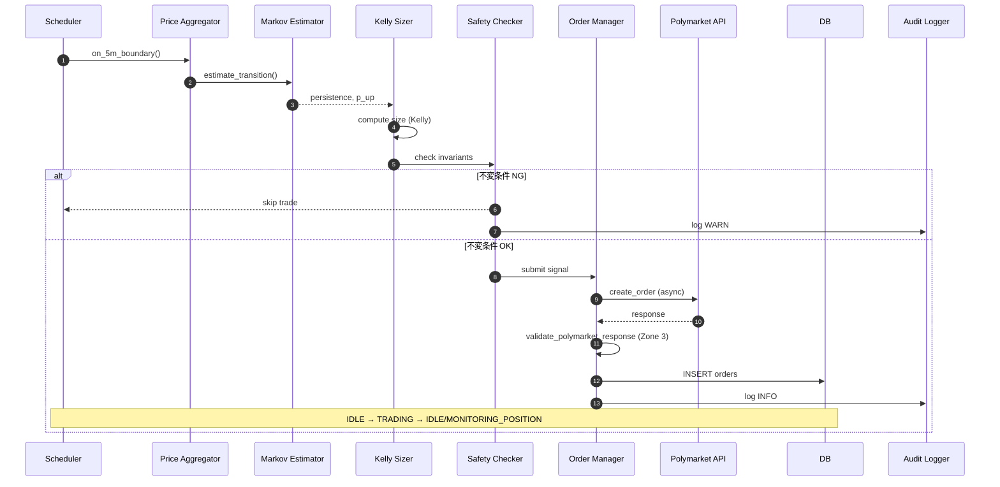
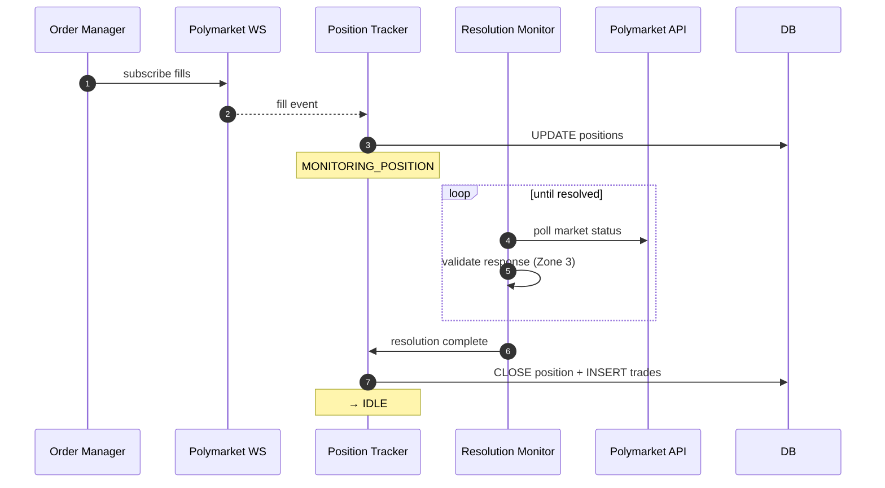
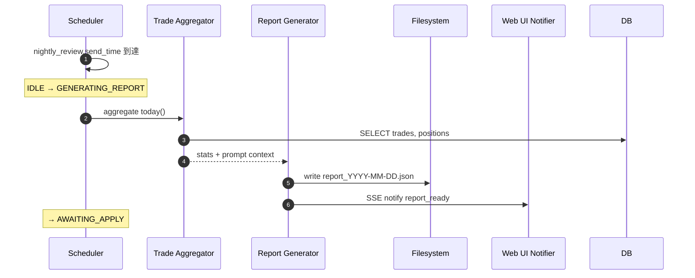
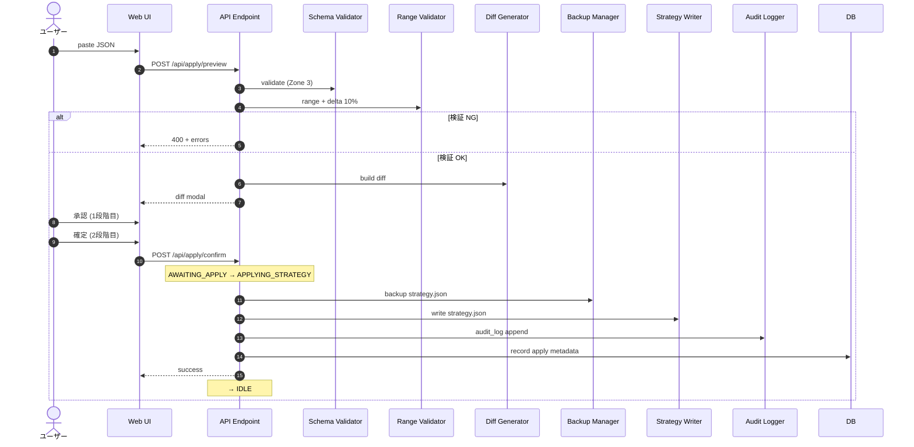
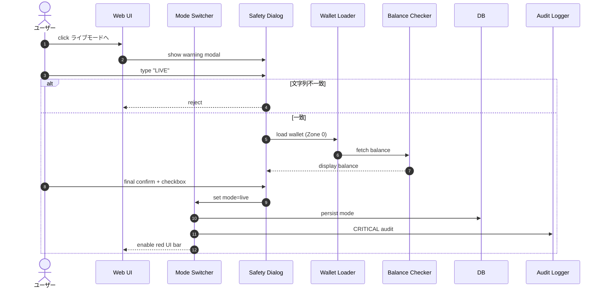
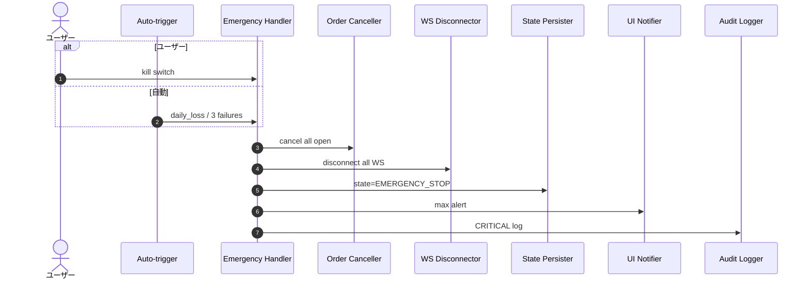

# 第6章 シーケンス図

## この章の目的

主要ユースケース7種の時系列相互作用を sequenceDiagram で定義する。第3章の状態遷移・第5章の信頼境界と整合し、実装時の非同期境界と DB 書き込みポイントを明示する。

**想定実行時間の記述ルール**: 本章の数値はすべて **測定前**。修飾語 `概算` / `目安` / `未測定` を付与する。根拠のない具体ミリ秒は記載しない。

---

## 6.1 Bot 起動シーケンス

**図 6-1: Bot 起動**

- **想定実行時間（測定前）**: 概算 5〜15秒（DB サイズ・マイグレーション有無に依存）`[要確認: 実測後に更新]`
- **クリティカルポイント**: `strategy.json` 検証失敗時は起動中止（`EMERGENCY_STOP` ではなく起動エラー終了）

---

## 6.2 5分判定 → 注文シーケンス

**図 6-2: 5分判定 → 注文**

- **想定実行時間（測定前）**: 目安 2〜8秒（ネットワーク・板深度に依存）。Polymarket CLOB の p99 レイテンシ公式値は `[要確認: 公式ドキュメント参照]`
- **クリティカルポイント**: `Safety Checker` が `MIN_PROB`, `MIN_EDGE`, `KELLY_FRACTION`, `daily_loss` を検証 (→ 第16章)

---

## 6.3 約定 → 決済監視 → クローズ

**図 6-3: 約定 → 決済監視 → クローズ**

- **想定実行時間（測定前）**: 未測定（市場 Resolution 時刻は外部依存、最大5分市場サイクル）
- **クリティカルポイント**: 同一 `market_id` の未決済ポジションは1件まで (不変条件)

---

## 6.4 夜間レビュー（レポート生成）

**図 6-4: 夜間レポート生成**

- **想定実行時間（測定前）**: 概算 1〜30秒（当日取引件数に比例）
- **クリティカルポイント**: レポートには分析用プロンプトを同梱 (→ 第15章)。本章では生成フローのみ

---

## 6.5 Apply（JSON 貼り付け・二重承認）

**図 6-5: Apply 二重承認**

- **想定実行時間（測定前）**: 概算 &lt; 1秒（ローカル検証・ファイル I/O のみ）
- **クリティカルポイント**: Zone 3 Opus JSON は **2回** 検証（preview + confirm）

---

## 6.6 モード切替（paper → live）

**図 6-6: paper → live（4ステップ）**

1. 警告モーダル表示  
2. `"LIVE"` 手入力（大文字小文字区別）  
3. 残高表示  
4. 最終確認チェック + 確定  

- **想定実行時間（測定前）**: 人間操作時間に依存（システム処理は概算 &lt; 3秒）
- **クリティカルポイント**: 秘密鍵読込は Zone 0 ホワイトリスト経由のみ

---

## 6.7 緊急停止

**図 6-7: 緊急停止（手動・自動共通経路）**

- **想定実行時間（測定前）**: 目安 1〜5秒（未約定キャンセル数に依存）`[要確認: 実測後に更新]`
- **クリティカルポイント**: 全状態から `EMERGENCY_STOP` へ遷移可能 (→ 第3章 3.2節)

---

## 品質チェック

- [x] 7シーケンスすべて Mermaid sequenceDiagram
- [x] 各図にキャプション・実行時間（測定前修飾）・クリティカルポイント
- [x] 状態名は第3章と同一（INITIALIZING, IDLE, TRADING, …）
- [x] DB 書き込みポイント明示（6.2, 6.3, 6.5, 6.6）
- [x] Zone 3 検証を alt/注釈で明示
- [x] 第8章以降の詳細スキーマには踏み込まない
- [x] `06_sequence.md`
