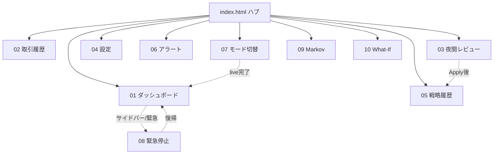

# 第8章 UIモックアップ

> **目的**: YoRuu の Web UI 全画面（ハブ + 10画面）の設計仕様を確定する。本章は第7章 §7.6 の画面一覧を**正式に上書き**し、PHASE 2 で実装する HTML モックおよび PHASE 4 で実装する本実装 UI の SSOT となる。

**バージョン**: v1.0  
**作成日**: 2026-05-27  
**ステータス**: REVIEW_PENDING  
**関連章**: 第3章（状態遷移）、第6章（シーケンス）、第7章（入出力）、第14章（i18n）、第19章（キルスイッチ）  
**関連ファイル**: [`00_ROADMAP.md`](./00_ROADMAP.md)、[`08_mockup_carryover.md`](./08_mockup_carryover.md)（本章に統合済み・アーカイブ）

---

## 8.1 本章の目的とスコープ

### 8.1.1 目的

PHASE 2（M2.1〜M2.3）で実装する `docs/mockups/*.html` の設計仕様、および PHASE 4 で実装する `yoruu/web/` の UI 仕様を確定する。

### 8.1.2 スコープ内

- ハブ + 10画面の画面一覧と遷移
- 各画面の用途・UI要素・データソース・SSE・操作・i18n キー
- 共通レイアウト、GitHub Dark パレット、モックデータ方針
- 緊急停止の二重配置、コマンドパレット、ヘルスバナー

### 8.1.3 スコープ外

- HTML/CSS/JS 実装本体（PHASE 2）
- FastAPI エンドポイント実装（PHASE 4）
- i18n キー全件・翻訳文（第14章）
- SSE プロトコル詳細スキーマ（第10章）

### 8.1.4 第7章 §7.6 との関係

第7章 §7.6 の「9画面」は本章で**上書き**する。第7章本文の遡及修正は PHASE 1 終了時の横断レビューで実施し、参照時は本章を優先する。

---

## 8.2 モック運用ルール（再定義）

### 8.2.1 単一HTMLの定義

- **1画面1ファイル**: 1 HTML に1画面を完結
- **外部CDN依存ゼロ**: ダブルクリックでオフライン表示可能
- **`shared/*` 参照可**: 同一リポジトリ内の `style.css` / `i18n.js` / `mock-data.js`

「単一HTML」は **外部CDN・npm 依存ゼロ** を意味し、`shared/` ローカル参照は許可する。

### 8.2.2 ファイル配置

```
docs/mockups/
├── index.html
├── 01_dashboard.html … 10_what_if.html
└── shared/
    ├── style.css
    ├── i18n.js
    └── mock-data.js
```

### 8.2.3 ヘッダーコメント規約

```html
<!--
  YoRuu Mockup: <画面名>
  Version: 0.1.0
  Last Updated: YYYY-MM-DD
  Status: DRAFT | REVIEW_PENDING | APPROVED | IMPLEMENTED
  Linked Design Chapter: 8.X
  Related Mockups: ...
-->
```

### 8.2.4 本実装移植方針

- モック HTML/CSS を FastAPI `static/` に配置
- `mock-data.js` を REST API に置換
- `/sse/events` でリアルタイム更新
- **Vanilla JS 継続**（React 移植は行わない）

---

## 8.3 画面一覧（§7.6 正式上書き）

| # | 画面 | ファイル | 主目的 | i18n キー |
|---|------|----------|--------|-----------|
| — | ハブ | `index.html` | 全画面リンク + 状態サマリ | `nav.hub` |
| 1 | ダッシュボード | `01_dashboard.html` | 状態・P&L・ポジション・緊急停止（右下） | `nav.dashboard` |
| 2 | 取引履歴 | `02_trade_log.html` | フィルタ・エクスポート | `nav.trade_log` |
| 3 | 夜間レビュー | `03_nightly_review.html` | レポート + Apply 差分 | `nav.nightly_review` |
| 4 | 設定 | `04_settings.html` | `yoruu.yaml` 編集 | `nav.settings` |
| 5 | 戦略履歴 | `05_strategy_history.html` | `strategy.json` 履歴 | `nav.strategy_history` |
| 6 | アラート | `06_alerts.html` | アラート・エラーログ | `nav.alerts` |
| 7 | モード切替 | `07_mode_switch.html` | paper → live 二段階確認 | `nav.mode_switch` |
| 8 | 緊急停止 | `08_emergency_stop.html` | 停止後確認・復帰 | `nav.emergency_stop` |
| 9 | Markov ライブ | `09_markov_live.html` | 遷移確率・直近 N 本 | `nav.markov_live` |
| 10 | What‑If | `10_what_if.html` | パラメータ変更の静的シナリオ | `nav.what_if` |

**用語**: 文書上「11画面」= ハブ + 上表10画面。backtest 専用 UI はライブ取引画面と分離し、PHASE 2 で別タブまたは別 HTML を追加する（→ 第12章、§8.25）。

### 8.3.2 画面遷移図



*図 8-1: 画面遷移図*

---

## 8.4 デザイン基準

### 8.4.1 カラーパレット（GitHub Dark）

`shared/style.css` で定義（抜粋）:

```css
:root {
  --bg-canvas: #0d1117;
  --bg-default: #161b22;
  --bg-subtle: #21262d;
  --border-default: #30363d;
  --text-primary: #e6edf3;
  --text-secondary: #7d8590;
  --text-link: #2f81f7;
  --accent-emphasis: #1f6feb;
  --success-fg: #3fb950;
  --danger-fg: #f85149;
  --attention-fg: #d29922;
  --done-fg: #a371f7;
  --mode-paper: #7d8590;
  --mode-simmer: #2f81f7;
  --mode-live: #f85149;
  --mode-backtest: #a371f7;
  --font-mono: ui-monospace, 'SF Mono', Menlo, Consolas, monospace;
  --font-sans: -apple-system, BlinkMacSystemFont, 'Segoe UI', sans-serif;
  --sidebar-width: 240px;
  --header-height: 48px;
  --banner-height: 36px;
}
```

旧ベージュ（`#f5f1e8` 系）は廃止。

### 8.4.2 タグ・ステータス

Issue ラベル風 `.tag` と、状態用 `.status`（`PENDING` / `RUNNING` / `APPROVED` 等）を共通定義する。

---

## 8.5 共通レイアウト

```
┌────────────────────────────────────────────┐
│ ヘルスバナー（36px、条件付き）              │
├──────────┬─────────────────────────────────┤
│ サイド   │ ヘッダー（48px）モード・⌘K・言語 │
│ 240px    ├─────────────────────────────────┤
│          │ メインコンテンツ                 │
└──────────┴─────────────────────────────────┘
```

---

## 8.6 サイドバー詳細仕様

### 8.6.1 ナビゲーション項目

| 順 | 項目 | リンク | バッジ |
|----|------|--------|--------|
| 1 | モードバッジ | `07_mode_switch.html` | 色は mode |
| 2 | ダッシュボード | `01_dashboard.html` | — |
| 3 | 取引履歴 | `02_trade_log.html` | — |
| 4 | 夜間レビュー | `03_nightly_review.html` | 未消化時 |
| 5 | 戦略履歴 | `05_strategy_history.html` | — |
| 6 | Markov ライブ | `09_markov_live.html` | — |
| 7 | What‑If | `10_what_if.html` | — |
| 8 | 設定 | `04_settings.html` | — |
| 9 | アラート | `06_alerts.html` | 未読件数 |
| 10 | モード切替 | `07_mode_switch.html` | — |
| 下 | 状態・WS・最終取引 | — | SSE 更新 |
| 最下 | 緊急停止 | 即時 API | §8.10 |

### 8.6.2 アイコン方針

モックでは簡易記号可。**本実装はインライン SVG + `t('nav.*')` テキスト**。絵文字を本実装の SSOT にしない。

### 8.6.3 緊急停止（サイドバー）

- 最下部固定、`--danger-fg`、ホバーで `--severity-danger-bg`
- 確認なし即発火 → `08_emergency_stop.html` へ遷移

---

## 8.7 コマンドパレット

| 操作 | 動作 |
|------|------|
| `Cmd/Ctrl+K` | 起動 |
| `Esc` | 閉じる |

初版コマンド: 各画面遷移、言語切替、**緊急停止**（確認なし）、ヘルプ。緊急停止は `stop` 等の短縮一致不可（§8.7.4）。

---

## 8.8 i18n 適用方針

- 全表示テキストに `data-i18n="nav.dashboard"` 等
- `shared/i18n.js` の `t(key, lang)` で起動時置換
- ja 完備、en は枠のみ（詳細は第14章）
- プレフィクス: `nav.*` `page.*` `action.*` `metric.*` `state.*` `mode.*` `cmd.*` `alert.*` `error.*`

---

## 8.9 SSE イベント一覧

### 8.9.1 本章で確定するイベント

| イベント名 | 発火 | 主な受信先 |
|-----------|------|------------|
| `markov_update` | Markov 更新 | ダッシュボード、Markov、ハブ |
| `health_degraded` | WS/API/ディスク警告 | 全画面（バナー） |
| `health_recovered` | 劣化解消 | 全画面 |
| `position_opened` | 建玉 | ダッシュボード、取引履歴 |
| `position_closed` | 決済 | 同上 |
| `nightly_report_ready` | レポート生成完了 | 夜間レビュー、サイドバー |
| `mode_changed` | モード変更 | ヘッダー |
| `emergency_stop_triggered` | 緊急停止 | 全画面 |
| `state_changed` | StateMachine 遷移 | サイドバー、ダッシュボード |
| `alert_added` | アラート追加 | アラート、サイドバー |
| `strategy_applied` | strategy 更新 | 戦略履歴 |

### 8.9.2 第7章 §7.5 との対応（レガシー名）

| 第7章 | 本章（統一案） |
|-------|----------------|
| `state_change` | `state_changed` |
| `trade_opened` | `position_opened` |
| `trade_closed` | `position_closed` |
| `review_available` | `nightly_report_ready` |
| `mode_change` | `mode_changed` |
| `critical`（緊急系） | `emergency_stop_triggered` |

PHASE 4 実装時は本章名に統一する。第7章 §7.5 の追記は PHASE 1 横断レビューで実施。

### 8.9.3 モックでの擬似発火

```javascript
// shared/mock-data.js（概要）
function mockSSE(eventName, payload, delayMs = 0) {
  setTimeout(() => {
    document.dispatchEvent(new CustomEvent(eventName, { detail: payload }));
  }, delayMs);
}
```

---

## 8.10 緊急停止の二重配置

| # | 配置 | 仕様 |
|---|------|------|
| 1 | サイドバー最下部 | 控えめ表示、ホバー強調、確認なし |
| 2 | ダッシュボード右下 | `--danger-fg` 単色、他ボタン 70%、周囲 40px |

発火後: `emergency_stop_triggered` → `08_emergency_stop.html` へ。復帰のみ確認ダイアログあり（→ 第3章、第6章 6.7、第19章）。

---

## 8.11 画面仕様: ハブ（index.html）

### 8.11.1 用途

全モックへの入口。Bot 状態・モード・当日 P&L のサマリを表示。

### 8.11.2 ワイヤー

```text
[ヘッダー] YoRuu | PAPER | ⌘K
[カード] 状態: IDLE | WS: OK/OK | 当日 P&L: +$8.42
[グリッド] 各画面へのリンクカード（10枚）
[フッター] 最終更新時刻
```

### 8.11.3 主要UI要素

リンクカード10枚、状態サマリ、モードバッジ。

### 8.11.4 データソース

`mock-data.js` の `MOCK.summary`。

### 8.11.5 SSE

`state_changed`, `markov_update`, `health_degraded`。

### 8.11.6 操作

各画面へ遷移、コマンドパレット。

### 8.11.7 i18n キー

`nav.hub`, `page.hub.title`, `metric.daily_pnl`, `state.*`

### 8.11.8 関連章

第7章 I/O #25、第3章状態名。

---

## 8.12 画面仕様: ダッシュボード

### 8.12.1 用途

稼働中の一次監視画面。ポジション・P&L・Markov サマリ・緊急停止（右下）。

### 8.12.2 ワイヤー

```text
[モードバー固定] paper=灰
[2列] 左: 状態+WS / 右: 当日P&L + 勝率
[ポジションカード] YES @ $0.62 size $7.10 expires 03:24
[Markovミニ] P(UP→UP)=0.578  rolling persistence=0.71
[右下浮動] 緊急停止（小さめ・40px余白）
```

### 8.12.3 主要UI要素

モードバー、状態 pill、P&L（色: 正=success / 負=danger）、ポジション1件（複数時はリスト）、Markov サマリ、緊急停止 FAB。

### 8.12.4 データソース

REST `/api/status`（本番）、モックは `MOCK.dashboard`。

### 8.12.5 SSE

`position_opened`, `position_closed`, `state_changed`, `markov_update`, `daily_pnl`（第7章互換）。

### 8.12.6 操作

ポジション詳細→取引履歴、緊急停止、サイドバー遷移。

### 8.12.7 i18n

`page.dashboard.title`, `metric.daily_pnl`, `metric.win_rate`, `action.emergency_stop`

### 8.12.8 関連章

第6章 6.2、第7章 #3/#25、§8.10。

---

## 8.13 画面仕様: 取引履歴

### 8.13.1 用途

過去取引の一覧・フィルタ・エクスポート（△将来は本実装）。

### 8.13.2 ワイヤー

フィルタ行（日付・結果・モード）+ テーブル + ページング。

### 8.13.3 主要UI要素

テーブル列: 時刻、市場、方向、サイズ、価格、結果、PnL。エクスポートボタン（モックは disabled + tooltip）。

### 8.13.4 データソース

SQLite `trades`（本番）、`MOCK.trades[]`。

### 8.13.5 SSE

`position_closed` で行追加。

### 8.13.6 操作

フィルタ適用、行クリックで詳細（モックはアラート表示のみ可）。

### 8.13.7 i18n

`page.trade_log.title`, `col.time`, `col.pnl`, `action.export_csv`

### 8.13.8 関連章

第7章 #4〜7、第10章データモデル。

---

## 8.14 画面仕様: 夜間レビュー

### 8.14.1 用途

日次レポート表示、Opus 提案 JSON の検証・差分確認・Apply（二重承認）。

### 8.14.2 ワイヤー

```text
[左] レポートサマリ（日付・勝率・損益）
[右] JSON 貼付テキストエリア
[下] 差分テーブル: キー | 旧 | 新 | 変化率% | 判定色
[ボタン] 検証 → 確認 → Apply（段階活性）
```

### 8.14.3 主要UI要素

レポートプレビュー、`POST /api/apply/validate` 結果表示、差分表（範囲外=赤、±10%超=黄）、Apply / Skip。

### 8.14.4 データソース

`reports/YYYY-MM-DD.json`、現行 `strategy.json`。

### 8.14.5 SSE

`nightly_report_ready`。

### 8.14.6 操作

JSON 貼付、検証、二重承認 Apply、Skip（→ 第6章 6.5）。

### 8.14.7 i18n

`page.nightly_review.title`, `action.validate`, `action.apply`, `diff.out_of_range`

### 8.14.8 関連章

第7章 #8〜14、第15章、第7章 7.2 検証マトリクス。

**差分表示例**: `MIN_PROB: 0.85 → 0.87 (+2.4%)`

---

## 8.15 画面仕様: 設定

### 8.15.1 用途

`yoruu.yaml` の編集（Zone 3 入力、サーバ再検証）。

### 8.15.2 主要UI要素

フォーム: `mode`（表示のみまたはリンク）、`send_time`, `timezone`, `max_trade_size_usd`, `daily_loss_limit_usd`。保存前確認モーダル。

### 8.15.3 データソース

`yoruu.yaml`、第22章スキーマ。

### 8.15.4 SSE

`health_degraded`（保存失敗時）。

### 8.15.5 操作

保存、リセット、backtest 入口リンク（別画面へ、第12章）。

### 8.15.6 i18n

`page.settings.title`, `field.daily_loss_limit`

### 8.15.7 関連章

第7章 #15、第5章 Zone 3、第21章影響マトリクス。

---

## 8.16 画面仕様: 戦略履歴

### 8.16.1 用途

`strategy.json` の変更履歴・ロールバック（確認モーダルあり）。

### 8.16.2 主要UI要素

時系列リスト、diff 展開、ロールバックボタン。

### 8.16.3 データソース

`strategy_history/`、監査ログ（第20章）。

### 8.16.4 SSE

`strategy_applied`。

### 8.16.5 操作

履歴選択、ロールバック確認。

### 8.16.6 i18n

`page.strategy_history.title`, `action.rollback`

### 8.16.7 関連章

第7章 #20/#21、第6章 6.5。

---

## 8.17 画面仕様: アラート

### 8.17.1 用途

アラート・ERROR/CRITICAL ログの一覧。

### 8.17.2 主要UI要素

重大度フィルタ、未読/既読、メッセージ、タイムスタンプ。

### 8.17.3 データソース

`audit_log` / ログファイル（本番）、`MOCK.alerts[]`。

### 8.17.4 SSE

`alert_added`, `error`（第7章互換）。

### 8.17.5 操作

既読化、詳細展開。

### 8.17.6 i18n

`page.alerts.title`, `alert.severity.*`

### 8.17.7 関連章

第7章 #22/#23、第18章。

---

## 8.18 画面仕様: モード切替

### 8.18.1 用途

`paper` / `simmer` / `live` / `backtest` の切替。live は二重確認（→ 第6章 6.6）。

### 8.18.2 主要UI要素

現在モード表示、ターゲット選択、live 時: テキスト `LIVE` 一致、残高表示、チェックボックス、確定。

### 8.18.3 データソース

`bot_runtime.mode`、ウォレット残高 API。

### 8.18.4 SSE

`mode_changed`。

### 8.18.5 操作

切替申請、live 三段階確認、拒否（state != IDLE）。

### 8.18.6 i18n

`page.mode_switch.title`, `mode.paper`, `mode.live`, `confirm.live_type`

### 8.18.7 関連章

第12章、第7章 #16〜18、第3章 3.3。

---

## 8.19 画面仕様: 緊急停止

### 8.19.1 用途

停止後の状態表示、トリガー理由、手動復帰。

### 8.19.2 主要UI要素

`EMERGENCY_STOP` 強調表示、トリガー（手動/自動）、未約定キャンセル結果、復帰ボタン（確認あり）。

### 8.19.3 データソース

`bot_state`、直近 `audit_log`。

### 8.19.4 SSE

`emergency_stop_triggered` 受信で本画面へ遷移済み想定。

### 8.19.5 操作

復帰（→ INITIALIZING 経由は第3章）、ログ参照リンク。

### 8.19.6 i18n

`page.emergency_stop.title`, `action.recover`, `state.EMERGENCY_STOP`

### 8.19.7 関連章

第6章 6.7、第19章。

---

## 8.20 画面仕様: Markov ライブビュー

### 8.20.1 用途

「なぜ今エントリーしないか」を可視化。Bonereaper 差別化機能。

### 8.20.2 ワイヤー

```text
[大表示] P(UP→UP)  P(DOWN→DOWN)  rolling persistence
[ヒートマップ/チェーン] 直近 N=20 本の UP/DOWN 列
[閾値線] MIN_PROB, PERSISTENCE_THRESHOLD との比較
```

### 8.20.3 主要UI要素

確率カード、N 本状態列、スキップ理由テキスト（閾値未達時）。

### 8.20.4 データソース

Markov 推定器出力、第11章。

### 8.20.5 SSE

`markov_update`。

### 8.20.6 操作

N の表示切替（20/50、モックは固定20）、ダッシュボードへ戻る。

### 8.20.7 i18n

`page.markov.title`, `metric.p_uu`, `metric.p_dd`, `metric.rolling_persistence`

### 8.20.8 関連章

第11章、第7章 7.2.1、第6章 6.2。

**モック数値例**: `P(UP→UP)=0.578`, `P(DOWN→DOWN)=0.612`

---

## 8.21 画面仕様: What‑If シミュレーター

### 8.21.1 用途

パラメータ変更の影響を過去7日で試算（**モックは静的シナリオのみ**）。

### 8.21.2 主要UI要素

スライダー: `MIN_PROB`, `PERSISTENCE_THRESHOLD` 等。結果: 仮想勝率・PnL（固定計算済み表示）。

### 8.21.3 データソース

モック: 事前計算シナリオ。本番: SQLite 履歴（PHASE 4 M4.5、第11章）。

### 8.21.4 SSE

なし（モック）。

### 8.21.5 操作

シナリオ切替、夜間レビューへリンク。

### 8.21.6 i18n

`page.what_if.title`, `action.run_simulation`

### 8.21.7 関連章

第11章、PHASE 4 M4.5。

---

## 8.22 アクセシビリティ・キーボードショートカット

| キー | 動作 |
|------|------|
| `?` | ショートカット一覧 |
| `g` `d` | ダッシュボード |
| `g` `l` | 取引履歴 |
| `g` `r` | 夜間レビュー |
| `Esc` | モーダル/パレット閉じる |

初版: 主要リンクに `aria-label`、フォーカスリング可視。スクリーンリーダ完全対応は △将来。

---

## 8.23 モックデータ方針（リアル系数値）

派手な勝ち額を避け、判断を歪めない**控えめな現実値**で固定する。

| 項目 | 例 |
|------|-----|
| 初期残高（paper） | $1,000 |
| 当日 P&L | `+$8.42 (+0.84%)` |
| 勝率 | `54.3% (38W / 32L)` |
| ポジション | `YES @ $0.62, size $7.10, expires in 03:24` |
| Apply 差分 | `MIN_PROB: 0.85 → 0.87 (+2.4%)` |

`shared/mock-data.js` に定数として集約。画面ごとにハードコードしない。

---

## 8.24 将来機能（△）

| 機能 | 扱い |
|------|------|
| ダーク/ライト/auto | CSS 変数のみ二重定義の枠 |
| エクスポート CSV/JSON | ボタン UI のみ |
| 通知音・Desktop Notification | 未実装 |
| ログ zip ダウンロード | 緊急停止画面に将来枠 |
| backtest 専用画面 | 別 HTML または設定タブ（第12章） |

---

## 8.25 PHASE 2 への引き継ぎ

| 優先 | 成果物 | 参照節 |
|------|--------|--------|
| M2.1 | `shared/*`, `index.html`, `01`, `02` | §8.4, §8.23 |
| M2.2 | `03`, `05`, `09` | §8.14, §8.20 |
| M2.3 | `04`, `06`, `07`, `08`, `10` | §8.10, §8.18 |

**完了条件**: 全 HTML が `REVIEW_PENDING` → マスター `APPROVED`。`08_mockup_carryover.md` は本章承認後アーカイブのまま維持。

**backtest UI**: `11_backtest.html` または設定内タブのいずれかを PHASE 2 で追加（本章の10画面に含めない）。

---

## 8.26 品質チェック

- [x] 章の冒頭に「この章の目的」を記載した
- [x] 第7章 §7.6 を §8.3 で正式上書きした
- [x] `08_mockup_carryover.md` の合意事項を本章に統合した
- [x] 図は Mermaid / ASCII で描画しキャプションを付けた
- [x] 他章への参照は `(→ 第X章)` 形式で記載した
- [x] 用語は第1章 1.6 と一致させた
- [x] 緊急停止二重配置・確認なし発火を §8.10 で明示した
- [x] i18n・SSE・モック運用を再定義した（React 移植廃止）
- [x] HTML 実装は PHASE 2 に分離しスコープ外とした
- [x] 出力ファイル名: `08_ui_mockup.md`
- [x] 各画面仕様に 8.X.1〜8.X.8（または同等）のサブ構造を設けた
