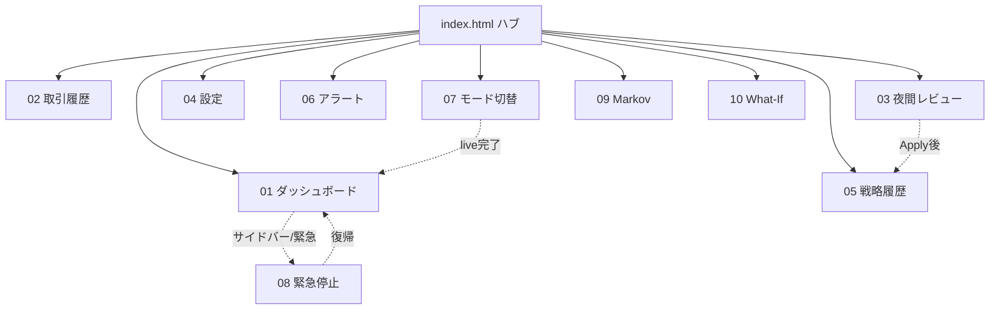

# 第8章 UIモックアップ

> **目的**: YoRuu の Web UI 全画面（ハブ + 10画面）の設計仕様を確定する。本章は第7章 §7.6 の画面一覧を**正式に上書き**し、PHASE 2 で実装する HTML モックおよび PHASE 4 で実装する本実装 UI の SSOT となる。

**バージョン**: v1.2  
**作成日**: 2026-05-27  
**ステータス**: REVIEW_PENDING  
**関連章**: 第3章（状態遷移）、第6章（シーケンス）、第7章（入出力）、第14章（i18n）、第19章（キルスイッチ）  
**関連ファイル**: [`00_ROADMAP.md`](./00_ROADMAP.md)、[`08_mockup_carryover.md`](./08_mockup_carryover.md)（本章に統合済み・アーカイブ）

---

## 8.1 本章の目的とスコープ

### 8.1.1 目的

PHASE 2（M2.1〜M2.3）で実装する `docs/mockups/*.html` の設計仕様、および PHASE 4 で実装する `yoruu/web/` の UI 仕様を確定する。

### 8.1.2 スコープ内

- ハブ + 10画面の画面一覧と遷移
- 各画面の用途・UI要素・データソース・SSE・操作・i18n キー
- 共通レイアウト、GitHub Dark パレット、モックデータ方針
- 緊急停止の二重配置、コマンドパレット、ヘルスバナー

### 8.1.3 スコープ外

- HTML/CSS/JS 実装本体（PHASE 2）
- FastAPI エンドポイント実装（PHASE 4）
- i18n キー全件・翻訳文（第14章）
- SSE プロトコル詳細スキーマ（第10章）

### 8.1.4 第7章 §7.6 との関係

第7章 §7.6 の「9画面」は本章で**上書き**する。第7章本文の遡及修正は PHASE 1 終了時の横断レビューで実施し、参照時は本章を優先する。

---

## 8.2 モック運用ルール（再定義）

### 8.2.1 単一HTMLの定義

- **1画面1ファイル**: 1 HTML に1画面を完結
- **外部CDN依存ゼロ**: ダブルクリックでオフライン表示可能
- **`shared/*` 参照可**: 同一リポジトリ内の `style.css` / `i18n.js` / `mock-data.js`

「単一HTML」は **外部CDN・npm 依存ゼロ** を意味し、`shared/` ローカル参照は許可する。

### 8.2.2 ファイル配置

```
docs/mockups/
├── index.html
├── 01_dashboard.html … 10_what_if.html
└── shared/
    ├── style.css
    ├── i18n.js
    └── mock-data.js
```

### 8.2.3 ヘッダーコメント規約

```html
<!--
  YoRuu Mockup: <画面名>
  Version: 0.1.0
  Last Updated: YYYY-MM-DD
  Status: DRAFT | REVIEW_PENDING | APPROVED | IMPLEMENTED
  Linked Design Chapter: 8.X
  Related Mockups: ...
-->
```

### 8.2.4 本実装移植方針

- モック HTML/CSS を FastAPI `static/` に配置
- `mock-data.js` を REST API に置換
- `/sse/events` でリアルタイム更新
- **Vanilla JS 継続**（React 移植は行わない）

---

## 8.3 画面一覧（§7.6 正式上書き）

| # | 画面 | ファイル | 主目的 | i18n キー |
|---|------|----------|--------|-----------|
| — | ハブ | `index.html` | 全画面リンク + 状態サマリ | `nav.hub` |
| 1 | ダッシュボード | `01_dashboard.html` | 状態・P&L・ポジション・緊急停止（右下） | `nav.dashboard` |
| 2 | 取引履歴 | `02_trade_log.html` | フィルタ・エクスポート | `nav.trade_log` |
| 3 | 夜間レビュー | `03_nightly_review.html` | レポート + Apply 差分 | `nav.nightly_review` |
| 4 | 設定 | `04_settings.html` | `yoruu.yaml` 編集 | `nav.settings` |
| 5 | 戦略履歴 | `05_strategy_history.html` | `strategy.json` 履歴 | `nav.strategy_history` |
| 6 | アラート | `06_alerts.html` | アラート・エラーログ | `nav.alerts` |
| 7 | モード切替 | `07_mode_switch.html` | paper → live 二段階確認 | `nav.mode_switch` |
| 8 | 緊急停止 | `08_emergency_stop.html` | 停止後確認・復帰 | `nav.emergency_stop` |
| 9 | Markov ライブ | `09_markov_live.html` | 遷移確率・直近 N 本 | `nav.markov_live` |
| 10 | What‑If | `10_what_if.html` | パラメータ変更の静的シナリオ | `nav.what_if` |

**用語**: 文書上「11画面」= ハブ + 上表10画面。backtest 専用 UI はライブ取引画面と分離し、PHASE 2 で別タブまたは別 HTML を追加する（→ 第12章、§8.25）。

### 8.3.2 画面遷移図



*図 8-1: 画面遷移図*

---

## 8.4 デザイン基準

### 8.4.1 カラーパレット（GitHub Dark）

`shared/style.css` で定義（抜粋）:

```css
:root {
  --bg-canvas: #0d1117;
  --bg-default: #161b22;
  --bg-subtle: #21262d;
  --border-default: #30363d;
  --text-primary: #e6edf3;
  --text-secondary: #7d8590;
  --text-link: #2f81f7;
  --accent-emphasis: #1f6feb;
  --success-fg: #3fb950;
  --danger-fg: #f85149;
  --attention-fg: #d29922;
  --done-fg: #a371f7;
  --mode-paper: #7d8590;
  --mode-simmer: #2f81f7;
  --mode-live: #f85149;
  --mode-backtest: #a371f7;
  --font-mono: ui-monospace, 'SF Mono', Menlo, Consolas, monospace;
  --font-sans: -apple-system, BlinkMacSystemFont, 'Segoe UI', sans-serif;
  --sidebar-width: 240px;
  --header-height: 48px;
  --banner-height: 36px;
}
```

旧ベージュ（`#f5f1e8` 系）は廃止。

### 8.4.2 タグ・ステータス

Issue ラベル風 `.tag` と、状態用 `.status`（`PENDING` / `RUNNING` / `APPROVED` 等）を共通定義する。

---

## 8.5 共通レイアウト

```
┌────────────────────────────────────────────┐
│ ヘルスバナー（36px、条件付き）              │
├──────────┬─────────────────────────────────┤
│ サイド   │ ヘッダー（48px）モード・⌘K・言語 │
│ 240px    ├─────────────────────────────────┤
│          │ メインコンテンツ                 │
└──────────┴─────────────────────────────────┘
```

---

## 8.6 サイドバー詳細仕様

### 8.6.1 ナビゲーション項目

| 順 | 項目 | リンク | バッジ |
|----|------|--------|--------|
| 1 | モードバッジ | `07_mode_switch.html` | 色は mode |
| 2 | ダッシュボード | `01_dashboard.html` | — |
| 3 | 取引履歴 | `02_trade_log.html` | — |
| 4 | 夜間レビュー | `03_nightly_review.html` | 未消化時 |
| 5 | 戦略履歴 | `05_strategy_history.html` | — |
| 6 | Markov ライブ | `09_markov_live.html` | — |
| 7 | What‑If | `10_what_if.html` | — |
| 8 | 設定 | `04_settings.html` | — |
| 9 | アラート | `06_alerts.html` | 未読件数 |
| 10 | モード切替 | `07_mode_switch.html` | — |
| 下 | 状態・WS・最終取引 | — | SSE 更新 |
| 最下 | 緊急停止 | 即時 API | §8.10 |

### 8.6.2 アイコン方針

モックでは簡易記号可。**本実装はインライン SVG + `t('nav.*')` テキスト**。絵文字を本実装の SSOT にしない。

### 8.6.3 緊急停止（サイドバー）

- 最下部固定、`--danger-fg`、ホバーで `--severity-danger-bg`
- 確認なし即発火 → `08_emergency_stop.html` へ遷移

---

## 8.7 コマンドパレット

| 操作 | 動作 |
|------|------|
| `Cmd/Ctrl+K` | 起動 |
| `Esc` | 閉じる |

初版コマンド: 各画面遷移、言語切替、**緊急停止**（確認なし）、ヘルプ。緊急停止は `stop` 等の短縮一致不可（§8.7.4）。

---

## 8.8 i18n 適用方針

- 全表示テキストに `data-i18n="nav.dashboard"` 等
- `shared/i18n.js` の `t(key, lang)` で起動時置換
- ja 完備、en は枠のみ（詳細は第14章）
- プレフィクス: `nav.*` `page.*` `action.*` `metric.*` `state.*` `mode.*` `cmd.*` `alert.*` `error.*`

---

## 8.9 SSE イベント一覧

### 8.9.1 本章で確定するイベント

| イベント名 | 発火 | 主な受信先 |
|-----------|------|------------|
| `markov_update` | Markov 更新 | ダッシュボード、Markov、ハブ |
| `health_degraded` | WS/API/ディスク警告 | 全画面（バナー） |
| `health_recovered` | 劣化解消 | 全画面 |
| `position_opened` | 建玉 | ダッシュボード、取引履歴 |
| `position_closed` | 決済 | 同上 |
| `nightly_report_ready` | レポート生成完了 | 夜間レビュー、サイドバー |
| `mode_changed` | モード変更 | ヘッダー |
| `emergency_stop_triggered` | 緊急停止 | 全画面 |
| `state_changed` | StateMachine 遷移 | サイドバー、ダッシュボード |
| `alert_added` | アラート追加 | アラート、サイドバー |
| `strategy_applied` | strategy 更新 | 戦略履歴 |

### 8.9.2 第7章 §7.5 との対応（レガシー名）

| 第7章 | 本章（統一案） |
|-------|----------------|
| `state_change` | `state_changed` |
| `trade_opened` | `position_opened` |
| `trade_closed` | `position_closed` |
| `review_available` | `nightly_report_ready` |
| `mode_change` | `mode_changed` |
| `critical`（緊急系） | `emergency_stop_triggered` |

PHASE 4 実装時は本章名に統一する。第7章 §7.5 の追記は PHASE 1 横断レビューで実施。

### 8.9.3 モックでの擬似発火

```javascript
// shared/mock-data.js（概要）
function mockSSE(eventName, payload, delayMs = 0) {
  setTimeout(() => {
    document.dispatchEvent(new CustomEvent(eventName, { detail: payload }));
  }, delayMs);
}
```

---

## 8.10 緊急停止の二重配置

| # | 配置 | 仕様 |
|---|------|------|
| 1 | サイドバー最下部 | 控えめ表示、ホバー強調、確認なし |
| 2 | ダッシュボード右下 | `--danger-fg` 単色、他ボタン 70%、周囲 40px |

発火後: `emergency_stop_triggered` → `08_emergency_stop.html` へ。復帰のみ確認ダイアログあり（→ 第3章、第6章 6.7、第19章）。

---

## 8.11 画面仕様: ハブ（index.html）

### 8.11.1 用途

全画面へのリンクと、現在のシステム状態のサマリを一画面で確認できるエントリーポイント。デモ・レビュー時の起点として機能する。ハブは**共通サイドバーなしのフル幅レイアウト**とする（他画面は §8.5）。

### 8.11.2 ワイヤー記述

```
┌─────────────────────────────────────────────────────────┐
│  YoRuu v0.1.0                       PAPER MODE            │
├─────────────────────────────────────────────────────────┤
│  ┌─────────────────┐  ┌─────────────────┐               │
│  │ 当日損益         │  │ 累積損益         │               │
│  │ +$8.42 (+0.84%)  │  │ +$42.18 (+4.22%) │               │
│  └─────────────────┘  └─────────────────┘               │
│  ┌─────────────────┐  ┌─────────────────┐               │
│  │ 勝率             │  │ 現在状態         │               │
│  │ 54.3% (38W/32L)  │  │ TRADING          │               │
│  └─────────────────┘  └─────────────────┘               │
│  画面一覧（10項目 + 補足）                               │
│                                          [緊急停止]       │
└─────────────────────────────────────────────────────────┘
```

### 8.11.3 主要UI要素

- システム状態サマリカード（4枚）: 当日損益、累積損益、勝率、現在状態
- 画面一覧リスト（10項目）: 各画面へのリンク + 補足情報
- 緊急停止ボタン（右下、§8.10 二重配置のうちハブ側。ダッシュボード側 FAB も併用）

### 8.11.4 データソース

| 表示項目 | データソース |
|----------|--------------|
| 当日損益 | `trades` テーブルから当日分集計 |
| 累積損益 | `trades` テーブル全期間集計 |
| 勝率 | `trades` テーブルから集計 |
| 現在状態 | `bot_state` テーブル最新行 |
| 取引履歴件数 | `trades` `COUNT(*)` |
| 夜間レビュー未消化 | `reports/` + `strategy_history` 比較 |
| 戦略バージョン | `strategy_history` 最新行 |
| Markov P(UP→UP) | `markov_state` 最新行 |
| アラート未読数 | `alerts` `WHERE read=false` |
| 現在モード | `bot_state.mode` |

### 8.11.5 SSE イベント

| イベント | 動作 |
|----------|------|
| `state_changed` | 「現在状態」カード更新 |
| `position_closed` | 損益・勝率カード更新 |
| `markov_update` | Markov 行更新 |
| `nightly_report_ready` | 夜間レビュー行に未消化バッジ |
| `strategy_applied` | 戦略履歴行のバージョン更新 |
| `alert_added` | アラート未読数更新 |
| `mode_changed` | ヘッダーモード表示更新 |

### 8.11.6 操作可能アクション

| アクション | 動作 |
|------------|------|
| カード/リスト項目クリック | 対応画面へ遷移 |
| 緊急停止ボタン | 即時発火、`08_emergency_stop.html` 遷移 |
| `Cmd/Ctrl+K` | コマンドパレット起動 |
| 言語切替 | ja ⇄ en |

### 8.11.7 i18n キー一覧

`page.hub.title`, `metric.daily_pnl`, `metric.cumulative_pnl`, `metric.win_rate`, `metric.current_state`, `nav.*`, `action.emergency_stop`, `alert.unread_count`, `nightly.unconsumed`

### 8.11.8 関連章

第3章（状態）、第7章（入出力）、第15章（夜間レビュー）、第19章（キルスイッチ）

---

## 8.12 画面仕様: ダッシュボード

### 8.12.1 用途

リアルタイム監視のメイン画面。ポジション、当日P&L、最近の取引、Markov 状態を一画面で確認。緊急停止 FAB の主要配置場所（§8.10）。

### 8.12.2 ワイヤー記述

```
┌─────────────────────────────────────────────────────────┐
│ [サイドバー] │ ダッシュボード          PAPER MODE        │
│              │  [状態][当日P&L][勝率]                      │
│              │  現在ポジション: YES @0.62 size $7.10      │
│              │  Markov 直近20本 + P(UP→UP)=0.578         │
│              │  最近の取引 5件                           │
│              │                          [緊急停止]       │
└─────────────────────────────────────────────────────────┘
```

### 8.12.3 主要UI要素

- 状態カード3枚、現在ポジション（最大1、→ 第11章）
- Markov ミニビュー（N=20、詳細は §8.20）
- 最近の取引5件
- 緊急停止 FAB（右下、70%、40px 余白）

### 8.12.4 データソース

| 表示項目 | データソース |
|----------|--------------|
| 現在状態 | `bot_state` |
| 当日損益・勝率 | `trades` 当日 |
| 現在ポジション | `positions` `status='open'` |
| Markov 直近20本 | `markov_state` 直近20行 |
| 最近の取引 | `trades` `ORDER BY closed_at DESC LIMIT 5` |

### 8.12.5 SSE イベント

| イベント | 動作 |
|----------|------|
| `state_changed` | 状態カード更新 |
| `markov_update` | Markov ミニビュー更新 |
| `position_opened` | ポジションパネル表示 |
| `position_closed` | ポジション非表示、取引リスト・損益更新 |
| `health_degraded` | ヘルスバナー表示 |

### 8.12.6 操作可能アクション

| アクション | 動作 |
|------------|------|
| Markov ミニビュークリック | `09_markov_live.html` |
| 取引リストクリック | `02_trade_log.html` |
| 緊急停止 | 即時発火 |
| ポジションパネル | 詳細モーダル（任意） |

### 8.12.7 i18n キー一覧

`page.dashboard.title`, `metric.state`, `metric.daily_pnl`, `metric.win_rate`, `page.dashboard.current_position`, `page.dashboard.markov_state`, `page.dashboard.recent_trades`, `metric.expires_in`, `metric.edge`, `metric.kelly`, `metric.persistence`, `action.emergency_stop`

### 8.12.8 関連章

第3章、第6章 §6.2-6.3、第11章、第19章

---

## 8.13 画面仕様: 取引履歴

### 8.13.1 用途

全取引履歴の閲覧、フィルタ、CSV/JSON エクスポート（△将来本実装、モックは UI のみ）。

### 8.13.2 ワイヤー記述

フィルタ（期間・結果・方向・モード）+ テーブル + ページネーション（50件/頁）+ サマリ行。

### 8.13.3 主要UI要素

- フィルタパネル、CSV/JSON エクスポートボタン
- 列: 時刻、方向、サイズ、Entry、結果、P&L、Strategy 版

### 8.13.4 データソース

| 表示項目 | データソース |
|----------|--------------|
| 取引一覧 | `trades`（フィルタ適用） |
| サマリ | フィルタ後集計 |

### 8.13.5 SSE イベント

| イベント | 動作 |
|----------|------|
| `position_closed` | テーブル先頭追加、サマリ更新 |

### 8.13.6 操作可能アクション

フィルタ変更、CSV/JSON エクスポート、行クリックで詳細モーダル（任意）、ページ切替。

### 8.13.7 エクスポートフォーマット

CSV ヘッダー:

```
trade_id,opened_at,closed_at,side,size_usd,entry_price,exit_price,result,pnl_usd,strategy_version,mode
```

JSON 形式は第10章で確定。

### 8.13.8 i18n キー一覧

`page.trade_log.title`, `filter.period`, `filter.result`, `filter.direction`, `filter.mode`, `action.export_csv`, `action.export_json`, `table.*`, `result.won`, `result.lost`, `summary.total_trades`

### 8.13.9 関連章

第10章（§10.3 `trades`）、第11章

---

## 8.14 画面仕様: 夜間レビュー

### 8.14.1 用途

日次レポート確認、Opus 出力 JSON のペースト、差分確認、Apply（検証 → 差分 → 確認ダイアログ → 適用）。

### 8.14.2 ワイヤー記述

レポートサマリ、AI プロンプト+JSON コピー領域、JSON 貼付、差分プレビュー表（色分け）、Apply/破棄。

### 8.14.3 主要UI要素

- レポートサマリ（状態別パフォーマンス含む）
- プロンプト全文コピー
- 差分プレビュー（旧→新、変化率%、赤/黄）
- Apply / 破棄

### 8.14.4 データソース

| 表示項目 | データソース |
|----------|--------------|
| レポート | `reports/report_YYYY-MM-DD.json` |
| 現行戦略 | `strategy.json` |

### 8.14.5 差分検証ロジック

| 検証 | 動作 |
|------|------|
| 必須キー | `MIN_PROB`, `MIN_EDGE`, `KELLY_FRACTION`, `PERSISTENCE_THRESHOLD` |
| 範囲 | 第7章 §7.2（`PERSISTENCE_THRESHOLD` は §7.2.1: 0.50〜0.90） |
| 変化率 | ±10% 超は警告（Apply は有効、ユーザー判断） |
| Apply 活性 | 差分確認成功後 |

### 8.14.6 SSE イベント

| イベント | 動作 |
|----------|------|
| `nightly_report_ready` | レポート自動読込 |
| `strategy_applied` | Apply 完了メッセージ |

### 8.14.7 操作可能アクション

プロンプトコピー、JSON 貼付、差分確認、Apply、破棄。

### 8.14.8 Apply 確認フロー

1. JSON 貼付
2. 差分確認 → 範囲外なら Apply **無効**
3. ±10% 超は警告表示
4. Apply → 確認ダイアログ（例: v3→v4）
5. OK → `strategy.json` 更新、`strategy_applied` 発火

（API 層の二重承認は第6章 6.5: validate → confirm エンドポイント）

### 8.14.9 i18n キー一覧

`page.nightly_review.title`, `nightly.*`, `action.copy_all`, `action.diff_check`, `action.apply`, `action.discard`, `diff.preview`, `error.missing_key`, `error.out_of_range`, `warning.large_change`

### 8.14.10 関連章

第6章 §6.4、第10章、第15章、第20章

---

## 8.15 画面仕様: 設定

### 8.15.1 用途

`yoruu.yaml` の閲覧・編集。変更影響を可視化（第21章）。

### 8.15.2 ワイヤー記述

基本設定フォーム、戦略パラメータ（読み取り専用→戦略履歴へ）、夜間レビュー設定、YAML 直接編集、保存/キャンセル。

### 8.15.3 主要UI要素

フォーム編集、YAML エリア、再起動必要バナー、保存・キャンセル。

### 8.15.4 データソース

`yoruu.yaml`（編集）、`strategy.json`（表示のみ）。

### 8.15.5 設定変更の影響区分

| 設定 | 影響 |
|------|------|
| mode, initial_balance_usd | 再起動必要 |
| max_trade_size_usd | 次回取引から |
| daily_loss_limit_usd, nightly_review.* | 即時 |

### 8.15.6 SSE イベント

なし（API のみ）。

### 8.15.7 操作可能アクション

フォーム/YAML 編集、保存（バリデーション後）、キャンセル、戦略履歴へ遷移。

### 8.15.8 バリデーション

数値 > 0、`send_time` が `HH:MM`、IANA タイムゾーン、YAML 構文。

### 8.15.9 i18n キー一覧

`page.settings.title`, `settings.*`, `action.save`, `action.cancel`, `warning.restart_required`

### 8.15.10 関連章

第21章、第22章、第11章

---

## 8.16 画面仕様: 戦略履歴

### 8.16.1 用途

`strategy.json` 変更履歴、適用後パフォーマンス、ロールバック。

### 8.16.2 ワイヤー記述

バージョンカード降順（v3, v2, v1…）。各カード: 差分、パフォーマンス、理由、詳細/ロールバック。

### 8.16.3 主要UI要素

履歴カード、詳細モーダル、ロールバック（確認あり）。

### 8.16.4 データソース

`strategy_history` テーブル、`trades`（version 別集計）。

### 8.16.5 SSE イベント

`strategy_applied` で先頭に新バージョン追加。

### 8.16.6 操作可能アクション

詳細表示、ロールバック。

### 8.16.7 ロールバック仕様

過去版を**新規バージョン**として適用（履歴改竄なし）。例: v1→v4 として記録。

### 8.16.8 i18n キー一覧

`page.strategy_history.title`, `strategy.*`, `action.details`, `action.rollback`, `confirm.rollback`

### 8.16.9 関連章

第10章、第15章、第20章

---

## 8.17 画面仕様: アラート

### 8.17.1 用途

エラー・警告・情報の一覧と既読管理。

### 8.17.2 ワイヤー記述

重大度フィルタ、未読フィルタ、カード一覧（コード・メッセージ・関数位置）、ページネーション。

### 8.17.3 主要UI要素

フィルタ、カード、既読/一括既読。

### 8.17.4 データソース

`alerts` テーブル。

### 8.17.5 重要度区分

CRITICAL / ERROR / WARN / INFO（第18章、色は §8.4）。

### 8.17.6 SSE イベント

`alert_added`。

### 8.17.7 操作可能アクション

既読化、一括既読、詳細モーダル、エラーコード参照（オフライン doc リンク可）。

### 8.17.8 エラーコード体系

`E_*` / `W_*` / `I_*` / `C_*` + モジュール + 連番（第18章詳細）。

### 8.17.9 i18n キー一覧

`page.alerts.title`, `filter.*`, `action.mark_all_read`, `severity.*`

### 8.17.10 関連章

第18章、第20章

---

## 8.18 画面仕様: モード切替

### 8.18.1 用途

backtest / paper / simmer / live 切替。live は2段階確認（第6章 6.6）。

### 8.18.2 ワイヤー記述

4モードカード、現在モード・残高表示。live 時は2段階モーダル（`LIVE` 入力 + 最終確認）。

### 8.18.3 主要UI要素

モードカード、切替ボタン、live 確認フロー。

### 8.18.4 LIVE 2段階確認

ステップ1: 警告 + `LIVE` 完全一致入力。ステップ2: ウォレット・残高・損失上限・緊急停止確認チェックリスト。

### 8.18.5 backtest の分離

backtest は別タブ/別画面。StateMachine は変更しない（→ 第12章）。

### 8.18.6 データソース

`bot_state`、モード別残高、ヘルスチェック。

### 8.18.7 SSE イベント

`mode_changed`。

### 8.18.8 操作可能アクション

backtest「別タブ」、paper/simmer 即時（1段確認）、live 2段階。

### 8.18.9 i18n キー一覧

`page.mode_switch.title`, `mode.*`, `confirm.live_step1`, `confirm.live_step2`, `warning.live_real_money`

### 8.18.10 関連章

第3章、第6章 §6.6、第12章、第13章、第19章

---

## 8.19 画面仕様: 緊急停止

### 8.19.1 用途

停止後の状態確認、ログ表示、復帰。

### 8.19.2 ワイヤー記述

停止時刻・理由・トリガ、状態スナップショット、処理チェックリスト、最終ログ、zip ダウンロード、復帰ボタン。

### 8.19.3 主要UI要素

停止情報ヘッダー、スナップショット、ログビュー、復帰（確認あり）。

### 8.19.4 データソース

`emergency_stops` 最新行、スナップショット JSON、`logs/`。

### 8.19.5 復帰フロー

復帰ボタン → 確認ダイアログ → `EMERGENCY_STOP → IDLE`（第3章）→ ダッシュボード遷移。

### 8.19.6 SSE イベント

なし（停止後静的画面）。

### 8.19.7 操作可能アクション

ログ zip ダウンロード（△モックはボタンのみ可）、復帰。

### 8.19.8 i18n キー一覧

`page.emergency_stop.title`, `emergency.*`, `action.download_logs`, `action.recover`, `confirm.recover`

### 8.19.9 関連章

第3章 §3.6、第6章 §6.7、第19章、第20章

---

## 8.20 画面仕様: Markov ライブビュー

### 8.20.1 用途

遷移確率・直近 N 本・Rolling Persistence・Edge を可視化。「なぜエントリーしないか」を表示。

### 8.20.2 ワイヤー記述

2×2 遷移行列、直近 N=20 系列、Persistence 時系列グラフ（閾値線）、Edge パネル、総合判定バナー。

### 8.20.3 主要UI要素

行列表、系列表示、グラフ、Edge 計算、判定バナー（緑/黄/灰）。

### 8.20.4 データソース

`markov_state`、`strategy.json`、Polymarket CLOB 価格。

### 8.20.5 計算ロジック

詳細は第11章。Persistence 表示 = `(P(UP→UP)+P(DOWN→DOWN))/2`。Rolling Persistence = 案α（§7.2.1）。

### 8.20.6 SSE イベント

`markov_update`（高頻度）。

### 8.20.7 操作可能アクション

ホバーツールチップ、N 切替（10/20/50）。

### 8.20.8 判定バナー色

エントリー可=success、待機=attention、データ不足=secondary。

### 8.20.9 i18n キー一覧

`page.markov_live.title`, `markov.*`, `judgment.*`

### 8.20.10 関連章

第10章（`markov_state`）、第11章

---

## 8.21 画面仕様: What‑If シミュレーター

### 8.21.1 用途

パラメータ変更の過去再計算で夜間レビュー判断を支援。

### 8.21.2 PHASE 区分

- **PHASE 2**: 静的シナリオ（`mock-data.js` に3〜5パターン）
- **PHASE 4 M4.5**: SQLite から実再計算（第11章）

### 8.21.3 ワイヤー記述

期間ピッカー、スライダー4キー、再計算、現在 vs シミュレーション表、累積P&Lグラフ、シナリオ保存。

### 8.21.4 主要UI要素

スライダー、比較表、グラフ、保存フォーム。

### 8.21.5 PHASE 2 モック

スライダー操作可だが再計算は事前シナリオ切替のみ。

### 8.21.6 PHASE 4 実計算

`price_ticks` + 戦略再評価 + ペーパー約定シミュレーション（別スレッド推奨）。

### 8.21.7 データソース

`strategy.json`, `price_ticks`, `trades`, `what_if_scenarios`（第10章）

### 8.21.8 SSE イベント

なし。

### 8.21.9 操作可能アクション

期間変更、スライダー、再計算、シナリオ保存。

### 8.21.10 制限事項

最大30日、計算中は取引判定と分離。

### 8.21.11 i18n キー一覧

`page.what_if.title`, `whatif.*`, `action.recalculate`, `action.save`

### 8.21.12 関連章

第10章、第11章、第13章

## 8.22 アクセシビリティ・キーボードショートカット

### 8.22.1 基本方針

初版から WAI-ARIA 属性とキーボードナビゲーションの構造を組み込む。完全な準拠は将来課題（△将来）とするが、後から大規模改修が不要な状態を目指す。

### 8.22.2 ARIA 属性の最低基準

| 要素 | 必須属性 |
|------|----------|
| サイドバーナビゲーション | `role="navigation"`, `aria-label="メインナビゲーション"` |
| 現在画面リンク | `aria-current="page"` |
| 緊急停止ボタン | `role="button"`, `aria-label="緊急停止"` |
| モーダルダイアログ | `role="dialog"`, `aria-modal="true"`, `aria-labelledby="..."` |
| ヘルスバナー | `role="alert"`, `aria-live="polite"` または `assertive` |
| アラートリスト | `role="log"`, `aria-live="polite"` |
| 取引履歴テーブル | `role="table"`, 各セル `role="cell"` |
| 状態バッジ | `role="status"`, `aria-label="現在の状態: TRADING"` |
| フォーム入力 | `<label>` 紐付け必須、`aria-invalid` バリデーション時 |

### 8.22.3 キーボードショートカット一覧

| ショートカット | 動作 | スコープ |
|----------------|------|----------|
| `?` | ヘルプ表示（ショートカット一覧モーダル） | グローバル |
| `Cmd/Ctrl+K` | コマンドパレット起動 | グローバル |
| `Esc` | モーダル・コマンドパレット閉じる | グローバル |
| `g d` | ダッシュボードへ | グローバル |
| `g l` | 取引履歴へ | グローバル |
| `g r` | 夜間レビューへ | グローバル |
| `g s` | 設定へ | グローバル |
| `g h` | 戦略履歴へ | グローバル |
| `g m` | Markov ライブへ | グローバル |
| `g w` | What-If へ | グローバル |
| `g a` | アラートへ | グローバル |
| `g x` | モード切替へ | グローバル |
| `Tab` / `Shift+Tab` | フォーカス移動 | グローバル |
| `Enter` / `Space` | フォーカス要素を実行 | グローバル |

`g X` 形式は GitHub と同様のシーケンス入力（`g` 押下後1秒以内に次キー）。

### 8.22.4 フォーカスリング

すべてのインタラクティブ要素にフォーカスリングを表示：

```css
*:focus-visible {
  outline: 2px solid var(--accent-emphasis);
  outline-offset: 2px;
  border-radius: 4px;
}
```

`focus-visible` を使用することで、マウスクリック時のフォーカスリング表示を抑制（GitHub と同様の挙動）。

### 8.22.5 緊急停止ボタンの注意

緊急停止ボタンに `Tab` でフォーカスが当たった状態で誤って `Enter` を押すと即時発火する。これは「即時アクセス優先」の方針であり、誤発火リスクは以下で抑制：

- フォーカスリングを `--danger-fg` の太いリングで強調表示
- スクリーンリーダーに対し `aria-label="緊急停止（確認なしで即時発火）"` で警告
- キーボードナビゲーション順序では他のインタラクティブ要素の後ろに配置

### 8.22.6 色覚多様性への配慮

| 配慮事項 | 実装 |
|----------|------|
| 利益/損失 | 色だけでなく `+` / `-` 記号併記 |
| 状態バッジ | 色だけでなくテキスト併記 |
| グラフ | 色だけでなく形状（実線/破線/点線）併記 |
| アラート重要度 | 色だけでなくアイコン併記 |

### 8.22.7 スクリーンリーダー対応

- 動的更新領域（SSE 受信箇所）は `aria-live` 設定
- 数値変化の通知レベル: `polite`（緊急停止のみ `assertive`）
- グラフは代替テキストまたはデータテーブルとして提供（PHASE 4 で実装）

### 8.22.8 i18n キー一覧

`a11y.main_nav`, `a11y.current_page`, `a11y.emergency_stop_label`, `a11y.modal_label`, `help.shortcuts_title`, `help.shortcut.cmd_k`, `help.shortcut.go_dashboard`（以下省略）

---

## 8.23 モックデータ方針（リアル系数値）

### 8.23.1 基本方針

派手な勝ち額表示は判断を歪めるため、**意図的に控えめなリアル値**で固定する。PHASE 6 のペーパー運用で得られた実数値に近い水準を採用。

### 8.23.2 数値レンジ

| 項目 | レンジ | 例 |
|------|--------|-----|
| 初期残高 | $1,000 想定 | $1000.00 |
| 当日損益 | -$15 〜 +$15 | +$8.42 |
| 当日損益率 | -1.5% 〜 +1.5% | +0.84% |
| 累積損益（7日） | -$30 〜 +$60 | +$42.18 |
| 取引サイズ | $5 〜 $10 | $7.10 |
| 勝率 | 48% 〜 62% | 54.3% |
| 1取引 P&L | -$1.50 〜 +$1.50 | +$1.24 |
| P(UP→UP) | 0.50 〜 0.65 | 0.578 |
| P(DOWN→DOWN) | 0.55 〜 0.65 | 0.612 |
| Persistence | 0.55 〜 0.75 | 0.595 |
| Edge | -0.08 〜 +0.10 | +0.028 |
| Kelly fraction | 0.50 〜 0.75 | 0.65 |
| MIN_PROB | 0.80 〜 0.92 | 0.87 |

### 8.23.3 避けるべき表示

| 避ける | 採用 | 理由 |
|--------|------|------|
| +$120,000 | +$8.42 | 過大な期待を抱かせない |
| 勝率 95% | 勝率 54.3% | 現実的な範囲 |
| 連勝 50回 | 連勝 4回 | 統計的に妥当な水準 |
| Sharpe 5.0 | Sharpe 1.42 | プロ運用でも稀な数値 |

### 8.23.4 シナリオ多様性

`mock-data.js` には3シナリオを含めて切替可能とする：

| シナリオ | 用途 |
|----------|------|
| `normal` | 標準的な運用状態（デフォルト表示） |
| `winning_streak` | 連勝中の状態（楽観バイアスのテスト用） |
| `drawdown` | ドローダウン中の状態（緊急停止フロー検証用） |

切替は URL クエリ `?scenario=drawdown` または `mock-data.js` 内の `CURRENT_SCENARIO` 定数で行う。

### 8.23.5 タイムスタンプ

固定日時を使用（再現性のため）：

- 基準時刻: `2026-05-27T14:32:00+09:00`
- 全モックデータはこの時刻から逆算した過去時刻を使用

### 8.23.6 通貨・市場固定

- 通貨: USD（ペーパーモードでも USD 表記）
- 市場: `BTC_5MIN_UPDOWN`
- BTC 価格基準: $95,000 帯（モック内固定）

### 8.23.7 モックデータ生成方針

完全なランダム生成は避け、**手動でシナリオを設計**したデータを使用。理由：

- レビュー時の再現性確保
- 統計的に矛盾しないシナリオ構成
- エッジケース（DD 中の緊急停止等）を意図的に含める

### 8.23.8 mock-data.js の構造（参考）

```javascript
// shared/mock-data.js（PHASE 2 で詳細実装）
const SCENARIOS = {
  normal: {
    bot_state: { state: 'TRADING', mode: 'paper' },
    balance: { current: 1042.18, initial: 1000.00 },
    daily_pnl: { value: 8.42, percent: 0.84 },
    win_rate: { value: 0.543, wins: 38, losses: 32 },
    current_position: {
      side: 'YES', size: 7.10, entry: 0.62, expires_in_sec: 204
    },
    markov: {
      p_uu: 0.578, p_dd: 0.612, persistence: 0.595,
      recent_series: ['U','U','U','D','U','U','D','D','U','U',
                      'U','U','D','U','U','U','D','U','U','U']
    },
    recent_trades: [
      { time: '14:32', side: 'YES', pnl: +1.24, result: 'WON' },
      { time: '14:27', side: 'NO',  pnl: -0.82, result: 'LOST' },
    ],
  },
  winning_streak: { /* PHASE 2 で定義 */ },
  drawdown: { /* PHASE 2 で定義 */ }
};

const CURRENT_SCENARIO = 'normal';
```

---

## 8.24 将来機能（△項目）

PHASE 2 〜 PHASE 5 では実装せず、PHASE 6 以降または別途要望時に検討する機能。本章では存在のみ記載し、画面仕様には反映しない。

### 8.24.1 △項目一覧

| 機能 | 想定実装フェーズ | 備考 |
|------|------------------|------|
| ダーク/ライト切替 | 将来 | 初版はダーク固定。CSS 変数は切替可能な構造で用意 |
| 完全な ARIA 準拠 | 将来 | §8.22 で最低基準のみ満たす |
| エクスポート機能拡張 | PHASE 4 M4.2 | 取引履歴は実装、戦略履歴・アラートは将来 |
| 通知音 | 将来 | 緊急停止・夜間レビュー完了時 |
| デスクトップ通知 | 将来 | ブラウザ Notification API |
| ログ zip ダウンロード（拡張） | 将来 | 緊急停止画面のみ初版で対応 |
| マルチ言語完全対応 | 将来 | 初版は ja のみ、en は枠のみ |
| カスタムアラート | 将来 | ユーザー定義条件でのアラート |
| 統計レポート PDF 出力 | 将来 | 月次・週次の自動生成 |
| 戦略バックアップ自動化 | 将来 | strategy.json の定期的な外部保存 |

### 8.24.2 将来機能の追加判断基準

以下のいずれかに該当する場合のみ追加：

- マスターからの明示的な要望
- PHASE 6 の運用で安全性・利便性に直結する不便が発覚
- 第17章リスクマトリクスで対策として有効と判断

---

## 8.25 PHASE 2 への引き継ぎ事項

### 8.25.1 実装順序（M2.1 〜 M2.3）

第8章 `APPROVED` 後、PHASE 2 を以下の順で実施：

**M2.1: 共通基盤 + 主要画面**

- `shared/style.css`（GitHub Dark パレット全件）
- `shared/i18n.js`（ja 完備、en 空枠、`t()` 関数）
- `shared/mock-data.js`（3シナリオ、normal をデフォルト）
- `index.html`（ハブ）
- `01_dashboard.html`
- `02_trade_log.html`

**M2.2: レビュー・分析系**

- `03_nightly_review.html`
- `05_strategy_history.html`
- `09_markov_live.html`

**M2.3: 設定・運用系**

- `04_settings.html`
- `06_alerts.html`
- `07_mode_switch.html`
- `08_emergency_stop.html`
- `10_what_if.html`（静的シナリオ表示のみ）

### 8.25.2 各 HTML 共通実装事項

すべての画面 HTML で以下を共通実装：

1. ヘッダーコメント（§8.2.3）
2. サイドバー（§8.6）
3. ヘッダーバー（§8.5.2）
4. ヘルスバナー（§8.5.3、初期非表示）
5. コマンドパレット（§8.7、`Cmd/Ctrl+K` で起動）
6. キーボードショートカット（§8.22.3）
7. `data-i18n` 属性の全テキストへの付与
8. ARIA 属性の最低基準（§8.22.2）
9. フォーカスリング（§8.22.4）

これらは `shared/` から `<script>` / `<link>` で読み込む構造を推奨。

### 8.25.3 検証チェックリスト

PHASE 2 完了時、各 HTML が以下を満たすことを確認：

- [ ] ダブルクリックでブラウザ起動、表示崩れなし
- [ ] 外部 CDN/npm 依存ゼロ（オフライン環境で動作）
- [ ] `Cmd/Ctrl+K` でコマンドパレット起動
- [ ] `?` でヘルプ表示
- [ ] 緊急停止ボタンがサイドバー最下部に存在（全画面）
- [ ] 言語切替で ja → en（en は未翻訳でキー表示）→ ja に戻ることを確認
- [ ] `mock-data.js` のシナリオ切替が機能
- [ ] フォーカスリング表示
- [ ] Chrome / Firefox / Safari で動作確認
- [ ] ヘッダーコメントが規約通り

### 8.25.4 PHASE 3 / PHASE 4 への連携

- PHASE 3（コア実装）では本章の SSE イベント一覧（§8.9）を契約として使用
- PHASE 4（UI実装）では本章のモックを REST API + SSE 接続版に置き換え
- PHASE 4 M4.5 で What-If の実計算を実装
- HTML/CSS の構造はモックをそのまま流用、JS のみ書き換え

### 8.25.5 carryover.md のアーカイブ化

第8章 `APPROVED` 時点で `08_mockup_carryover.md` は本章に統合済みとなる。以下の措置を取る：

- ファイル先頭にアーカイブ注記を追加（実施済み）
- 必要に応じて `08_mockup_carryover.archived.md` へリネーム（オプション）

---

## 8.26 品質チェック

### 8.26.1 章単位の確認事項

| # | 確認項目 | 状態 |
|---|----------|------|
| 1 | 本章の目的とスコープが明示されている | §8.1 |
| 2 | 第7章 §7.6 を上書きする旨が明記されている | §8.1.4, §8.3 |
| 3 | 全11画面 + ハブの仕様が記載されている | §8.11〜§8.21 |
| 4 | 各画面に用途・ワイヤー・UI要素・データソース・SSE・アクションが揃っている | §8.11〜§8.21 |
| 5 | カラーパレットが GitHub Dark 準拠で CSS 変数化されている | §8.4.1 |
| 6 | 旧ベージュ系パレット（`#f5f1e8`）への参照が残っていない | §8.4.1 |
| 7 | i18n が初版から組み込まれている | §8.8 |
| 8 | SSE イベントが全11種類定義されている | §8.9.1 |
| 9 | 緊急停止が2箇所配置・確認なし・復帰時は確認あり | §8.10, §8.19.5 |
| 10 | サイドバー仕様が確定している | §8.6 |
| 11 | コマンドパレット仕様が確定している | §8.7 |
| 12 | モックデータ方針がリアル系で確定している | §8.23 |
| 13 | アクセシビリティの最低基準が記載されている | §8.22 |
| 14 | キーボードショートカット一覧が記載されている | §8.22.3 |
| 15 | 将来機能（△項目）が脚注として整理されている | §8.24 |
| 16 | PHASE 2 への引き継ぎ事項が明示されている | §8.25 |
| 17 | M2.1 〜 M2.3 の実装順序が定義されている | §8.25.1 |
| 18 | 全章相互参照が新章番号（24章再編後）と整合している | 各 §8.X.8/9/10/12 |
| 19 | Mermaid 図のコードフェンスが閉じている | §8.3.2 |
| 20 | 章末「品質チェック」セクション存在 | 本セクション |

### 8.26.2 cross-ref 一覧（再編後章番号）

| 参照先 | 文脈 |
|--------|------|
| 第3章 | 状態遷移、EMERGENCY_STOP |
| 第6章 §6.2-6.3 | 取引シーケンス |
| 第6章 §6.4 | 夜間レビューシーケンス |
| 第6章 §6.6 | モード切替シーケンス |
| 第6章 §6.7 | 緊急停止シーケンス |
| 第7章 §7.2.1 | PERSISTENCE_THRESHOLD 範囲 |
| 第7章 §7.6 | 旧画面一覧（本章で上書き） |
| 第10章 | 関数+データフォーマット+データモデル |
| 第11章 | 戦略ロジック（Markov + Kelly） |
| 第12章 | モード仕様 |
| 第13章 | ペーパー約定エンジン |
| 第14章 | i18n 設計詳細 |
| 第15章 | 夜間レビューフロー |
| 第17章 | リスクマトリクス |
| 第18章 | エラーハンドリング |
| 第19章 | キルスイッチ + 2段階確認 |
| 第20章 | 監査ログ |
| 第21章 | 設定影響マトリクス |
| 第22章 | 設定仕様 |

### 8.26.3 後続章で確定すべき項目

| 項目 | 確定章 |
|------|--------|
| SSE イベントの完全 JSON スキーマ | 第10章 |
| 取引履歴 JSON エクスポート完全形式 | 第10章 |
| i18n 翻訳キー全件 | 第14章 |
| t() 関数の詳細仕様 | 第14章 |
| Markov 計算アルゴリズム | 第11章 |
| What-If 計算ロジック | 第11章 |
| エラーコード体系の完全一覧 | 第18章 |
| 設定影響の完全マトリクス | 第21章 |
| `yoruu.yaml` の全フィールド | 第22章 |

### 8.26.4 既知の未確定事項

| 項目 | 対応方針 |
|------|----------|
| What-If 計算の実装時間 | PHASE 4 M4.5 で実測、本章記述は概算 |
| Markov ライブの SSE 更新頻度 | PHASE 4 で実測、過剰時は throttle |
| グラフ描画ライブラリ | 外部CDN禁止のため自前 SVG/Canvas、PHASE 2 着手時に決定 |
| 緊急停止 FAB とヘルスバナーの重なり | PHASE 2 で z-index 調整、バナー優先 |

### 8.26.5 レビュー観点（第8章 APPROVED 判定用）

- [ ] §8.1 〜 §8.26 がすべて存在
- [ ] 全11画面 + ハブの仕様が揃っている
- [ ] §8.4 のカラー変数が `shared/style.css` にそのまま貼り付け可能
- [ ] §8.9 の SSE イベントが第10章で再利用できる詳細度
- [ ] §8.25 の引き継ぎが PHASE 2 着手者に十分
- [ ] 章間相互参照が新章番号と整合
- [ ] cross-ref 表に重複・抜け漏れがない

---

## 第8章 終了

本章により、YoRuu Web UI の全画面仕様が確定した。次の M1.3（ch9〜14）では、本章で参照した第10章、第11章、第14章等の詳細を確定する。
