# 第9章 ユーザー操作フロー

> **目的**: YoRuu Web UI 全11画面における代表的なユーザー操作の開始から結果までを定義する。本章は第6章（システム内部シーケンス）と対をなし、**ユーザー視点**でのフロー設計を担う。PHASE 2（UIモック）および PHASE 4（UI実装）でユーザビリティ検証の基準となる。

**バージョン**: v1.0  
**作成日**: 2026-05-27  
**ステータス**: REVIEW_PENDING  
**関連章**: 第3章（状態遷移）、第6章（シーケンス図）、第7章（入出力）、第8章（UIモック）、第15章（夜間レビュー）、第18章（エラーハンドリング）、第19章（キルスイッチ）

---

## 9.1 本章の目的とスコープ

### 9.1.1 目的

YoRuu Web UI を使用するユーザー（マスター）が、どの画面でどのボタンを押し、どの順序で操作し、どのような結果を得るかを定義する。設計の SSOT として、PHASE 2 のモック実装と PHASE 4 の本実装で操作フローの一貫性を保証する。

### 9.1.2 スコープ内

- 全10種類のユーザー操作フロー（§9.4〜§9.13）
- 各フローの前提条件、操作手順、UI 状態遷移、エラー分岐
- 横断的なエラー分岐と復旧フロー（§9.14）
- 共通操作（言語切替、コマンドパレット、ショートカット）

### 9.1.3 スコープ外

- システム内部の関数呼び出し詳細（第6章）
- データスキーマ詳細（第10章）
- 戦略計算ロジック（第11章）
- HTML/CSS 実装コード（第8章 + PHASE 2）

### 9.1.4 想定ユーザー

- **マスター（単一ユーザー）**: YoRuu を所有・運用する個人。技術的素養あり、Cursor / GitHub / コマンドライン使用可能、日本語ネイティブ。
- 第三者ユーザー・複数ユーザー運用は想定しない（第5章 信頼境界線図準拠）。

---

## 9.2 第6章との役割分担

### 9.2.1 視点の違い

| 軸 | 第6章 シーケンス図 | 本章（第9章） |
|----|--------------------|---------------|
| 視点 | システム内部（actor 間メッセージ） | ユーザー操作（クリック・入力起点） |
| 表現 | Mermaid sequenceDiagram | flowchart + 操作手順表 |
| 粒度 | 関数呼び出しレベル | UI 要素クリックレベル |
| 主目的 | 実装者向けの内部処理理解 | 操作設計の妥当性検証 |
| 含む内容 | DB 書き込み、状態遷移、API 呼び出し | ボタン配置、入力検証、エラー画面遷移 |

### 9.2.2 同じユースケースの扱い

第6章と本章で同じユースケース（例: 夜間レビュー）を扱う場合、以下のように分担：

- **第6章 §6.4**: 夜間レポート生成 → ファイル保存 → SSE 発火 → フロントエンド受信 の内部シーケンス
- **第9章 §9.6**: ダッシュボードでバナー受領 → 夜間レビュー画面遷移 → JSON コピー → Genspark で解析 → 結果ペースト → 差分確認 → Apply ボタン → 戦略履歴で確認 のユーザー操作

両章は相互補完関係にあり、片方だけでは設計が完結しない。

---

## 9.3 共通操作

すべての画面で利用可能な操作。フロー定義の前提として本節で先に定義する。

### 9.3.1 言語切替

| ステップ | 操作 | 結果 |
|----------|------|------|
| 1 | ヘッダー右の言語ドロップダウンクリック | 言語選択メニュー表示（日本語 / English） |
| 2 | 言語選択 | 全画面のテキストが選択言語に切替、`localStorage` に保存 |
| 3 | 次回アクセス時 | 保存された言語で表示 |

未翻訳キーは原文（i18n キー）が表示される。初版では en の翻訳は空のため、英語選択時はキーが表示される。

### 9.3.2 コマンドパレット

| ステップ | 操作 | 結果 |
|----------|------|------|
| 1 | `Cmd/Ctrl+K` 押下 | コマンドパレットモーダル表示 |
| 2 | コマンド名入力（インクリメンタル検索） | マッチするコマンドが上から表示 |
| 3 | 上下矢印で選択 | フォーカス移動 |
| 4 | Enter | コマンド実行 |
| 5 | Esc | パレット閉じる |

利用可能コマンドは第8章 §8.7 参照。

### 9.3.3 キーボードショートカット

第8章 §8.22.3 で定義された全ショートカットが全画面で有効。ヘルプは `?` で表示。

### 9.3.4 サイドバーナビゲーション

サイドバー（240px、左固定）から全画面に1クリックで遷移可能。第8章 §8.6 参照。

### 9.3.5 緊急停止

緊急停止ボタンはサイドバー最下部とダッシュボード右下の2箇所に常時配置。確認なしで即時発火。詳細フローは §9.8 参照。

---

## 9.4 フロー1: 初回起動

### 9.4.1 ユースケース概要

YoRuu を初めて起動したユーザーが、設定確認 → モード選択 → 取引開始までを行う。

### 9.4.2 前提条件

- `yoruu.yaml` が存在し、最小限の必須項目が記入されている
- Polymarket / Binance への接続情報（環境変数 `.env`）が設定済み
- Python 環境が構築済み（PHASE 5 完了後）

### 9.4.3 操作手順

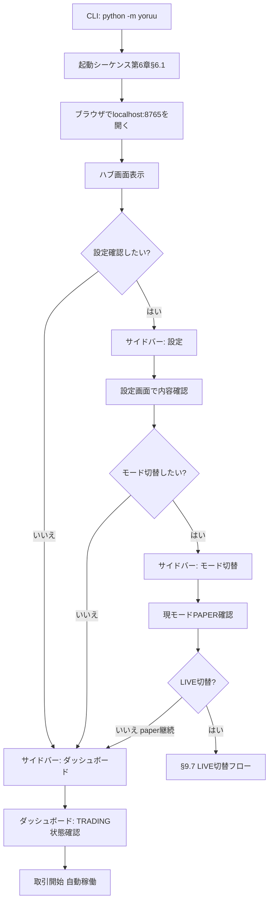

### 9.4.4 各ステップの UI 状態

| ステップ | 画面 | 主要表示 |
|----------|------|----------|
| C | ハブ | 当日損益 $0.00、累積 $0.00、勝率 N/A、状態 IDLE |
| D-G | ハブ → ダッシュボード | サイドバーから遷移 |
| H | 設定 | yoruu.yaml の現在値表示 |
| K | モード切替 | 4モードカード、PAPER に [現在] バッジ |
| N | ダッシュボード | 状態 TRADING、ポジション「待機中」 |

### 9.4.5 エラー分岐

| エラー | 表示 | 復旧 |
|--------|------|------|
| WS 接続失敗 | ヘルスバナー「Binance/Polymarket 接続不可」 | 自動再接続、§9.14.1 参照 |
| yoruu.yaml 不正 | 起動失敗、CLI にエラー出力 | CLI で修正後再起動 |
| ポート 8765 使用中 | 起動失敗 | 別ポート指定または競合プロセス停止 |

### 9.4.6 関連画面

ハブ（§8.11）、ダッシュボード（§8.12）、設定（§8.15）、モード切替（§8.18）

### 9.4.7 関連章

第3章（IDLE → TRADING 遷移）、第6章 §6.1（起動シーケンス）、第22章（yoruu.yaml）

---

## 9.5 フロー2: 取引監視（日常運用）

### 9.5.1 ユースケース概要

YoRuu が稼働中の状態で、日中にユーザーが状態確認・取引履歴確認・Markov ライブビュー確認を行う日常運用フロー。

### 9.5.2 前提条件

- YoRuu が起動済み、TRADING 状態
- ブラウザでアクセス可能

### 9.5.3 操作手順

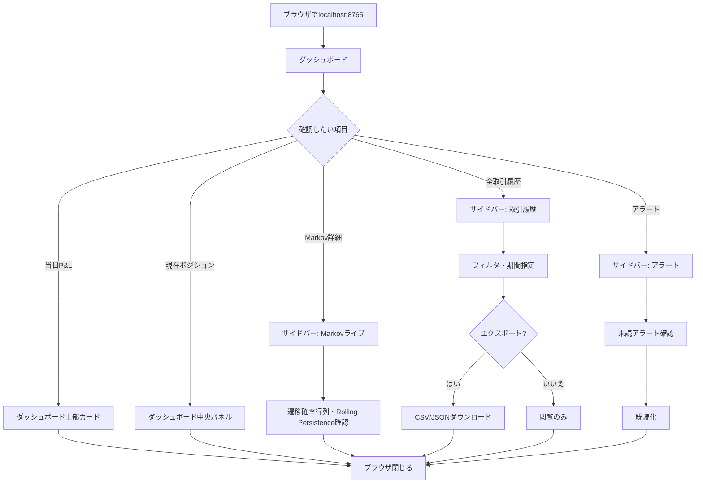

### 9.5.4 各ステップの UI 状態

| ステップ | 画面 | 主要表示 |
|----------|------|----------|
| B | ダッシュボード | リアルタイム更新中（SSE 接続中アイコン） |
| F-I | Markov ライブ | P(UP→UP), P(DOWN→DOWN), 直近20本系列 |
| G-J | 取引履歴 | テーブル表示、フィルタパネル |
| H-N | アラート | 未読バッジ、フィルタ済リスト |

### 9.5.5 SSE による自動更新

ユーザー操作なしでも以下が自動更新：

- ダッシュボード: position_opened / closed、markov_update
- サイドバー: state_changed、alert_added、健全性
- 全画面: health_degraded / recovered

### 9.5.6 エラー分岐

| エラー | 表示 | 復旧 |
|--------|------|------|
| SSE 切断 | サイドバー WS インジケータ赤、ヘルスバナー表示 | 自動再接続 |
| API 応答遅延 | データ表示「読込中…」 | タイムアウト後リトライ |

### 9.5.7 関連画面

ダッシュボード（§8.12）、取引履歴（§8.13）、Markov ライブ（§8.20）、アラート（§8.17）

### 9.5.8 関連章

第6章 §6.2-6.3（取引シーケンス）、第8章 §8.9（SSE イベント）

---

## 9.6 フロー3: 夜間レビュー完全フロー ★最重要

### 9.6.1 ユースケース概要

YoRuu の中核となる「夜間自己学習ループ」のユーザー操作部分。Bot が深夜にレポートを生成し、ユーザーが Genspark Opus 4.7 で解析、結果を Bot に返して戦略パラメータを更新する。

### 9.6.2 前提条件

- 当日の取引が一定数以上完了している（推奨: 20取引以上）
- `nightly_review.send_time` で設定した時刻を経過
- ユーザーが Genspark アカウントにログイン可能

### 9.6.3 操作手順

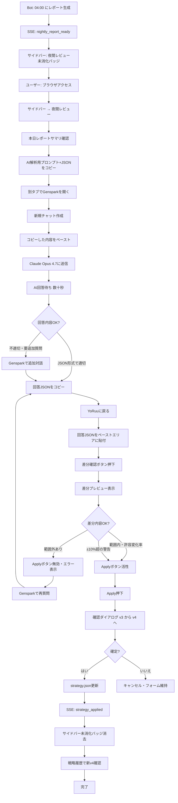

### 9.6.4 各ステップの UI 状態詳細

| ステップ | 画面 | UI 状態 |
|----------|------|---------|
| C | 全画面（サイドバー） | 夜間レビュー項目に「⚠️ 未消化」バッジ |
| F | 夜間レビュー | サマリパネル展開、取引数・勝率・状態別パフォーマンス表示 |
| G | 夜間レビュー | 「📋 全選択コピー」ボタンクリックでクリップボードコピー、トースト「コピーしました」表示 |
| Q | 夜間レビュー | ペーストエリアにテキスト入力、リアルタイムバリデーション |
| R-S | 夜間レビュー | 差分プレビューが折りたたみから展開 |
| U | 夜間レビュー | 該当キーが赤ハイライト、エラーメッセージ「MIN_PROB は 0.80〜0.95 の範囲指定」 |
| V | 夜間レビュー | Apply ボタンが活性（青色） |
| Y | モーダル | 「v3 から v4 へ更新します。よろしいですか？」「キャンセル」「Apply」 |
| AE | 戦略履歴 | リスト最上部に v4 カード、差分・適用日時表示 |

### 9.6.5 エラー分岐

| エラー | 表示 | 復旧 |
|--------|------|------|
| JSON 構文エラー | ペーストエリア下に赤エラー「JSON 構文エラー: 行X」 | 修正して再ペースト |
| 必須キー不足 | 「MIN_PROB, MIN_EDGE, KELLY_FRACTION, PERSISTENCE_THRESHOLD のうち X が不足」 | Genspark で再質問 |
| 範囲外値 | 「MIN_PROB=0.75 は 0.80〜0.95 範囲外」、Apply 無効 | Genspark で再質問または手動修正 |
| Apply 失敗 | トースト「strategy.json 書き込み失敗」 | ログ確認、ファイル権限確認 |
| 差分なし | 「現在と同じパラメータです。Apply 不要。」 | キャンセル |

### 9.6.6 ±10% 超の警告時の挙動

範囲内であっても変化率が ±10% を超える場合、警告を表示するが Apply は活性のまま：

```
⚠️ MIN_EDGE: 0.05 → 0.07 (+40.0%)
   大幅な変更です。意図的であることを確認してください。
   [理由メモを記載してください: _____]
```

理由メモは `strategy_history` テーブルの `reason` カラムに記録される。

### 9.6.7 Apply タイミングの注意

Apply は即時反映されるが、新パラメータは**次回のエントリー判定から適用**される。現在オープン中のポジションには影響しない。これにより、Apply 中の決済不整合を回避する。

### 9.6.8 関連画面

夜間レビュー（§8.14）、戦略履歴（§8.16）、アラート（§8.17）

### 9.6.9 関連章

第6章 §6.4（夜間レビューシーケンス）、第10章（report JSON / strategy.json スキーマ）、第15章（夜間レビュー詳細フロー）、第20章（監査ログ）

---

## 9.7 フロー4: モード切替

### 9.7.1 ユースケース概要

backtest / paper / simmer / live モード間の切替。paper → live は2段階確認必須。

### 9.7.2 前提条件

- 現在のモードでオープンポジションがない（推奨）
- live 切替時は Polymarket ウォレット接続済み、USDC 残高あり

### 9.7.3 操作手順（paper → simmer）

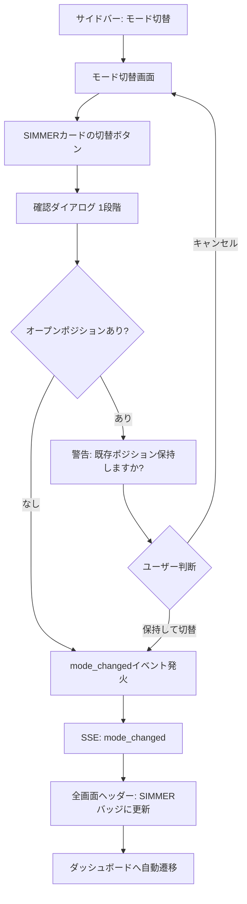

### 9.7.4 操作手順（paper → live）2段階確認

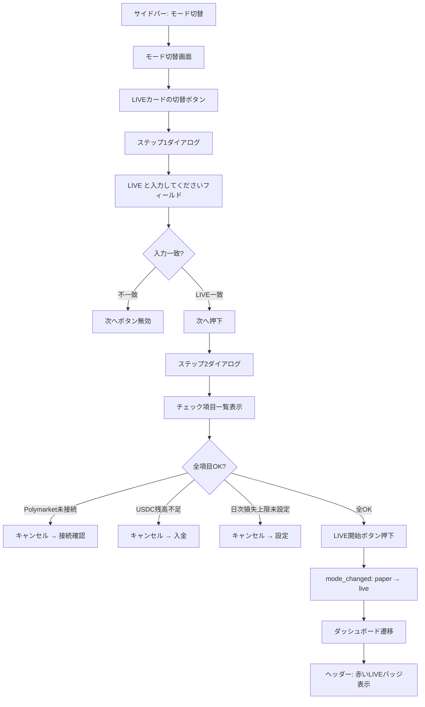

### 9.7.5 各ステップの UI 状態

| ステップ | UI 状態 |
|----------|---------|
| D | ステップ1ダイアログ、警告アイコン、入力フィールド |
| E | プレースホルダ「LIVE と大文字で入力」、入力中はリアルタイム比較 |
| I | チェック項目: Polymarket 接続・USDC 残高・日次損失上限・緊急停止動作 |
| J | 各項目に ✓ または ❌、❌ の場合は理由表示 |
| R | 全画面ヘッダーが赤色 LIVE モードバー、視覚的に常時警告 |

### 9.7.6 backtest モードへの切替

backtest は他モードと物理的に分離される。本画面の backtest カード「→ 別タブ」ボタン押下時：

- 新規ブラウザタブが開く（URL: `localhost:8765/backtest`）
- 元タブの StateMachine は変更されない（現モードは継続）
- backtest 専用 UI で過去データ検証を実施

### 9.7.7 エラー分岐

| エラー | 表示 | 復旧 |
|--------|------|------|
| live 切替時 Polymarket 未接続 | ステップ2でチェック失敗 | 接続情報確認 |
| live 切替時 USDC 残高不足 | ステップ2でチェック失敗 | 入金後再試行 |
| mode_changed イベント未受信 | 切替後もヘッダー更新されず | リロード |

### 9.7.8 切替後の取引再開

新モードでの取引再開条件：

- StateMachine が IDLE → TRADING へ自動遷移
- 必要に応じて第3章 §3.3 のガード条件を再評価
- 直前モードでの statistics は別管理（モード横断の累積 P&L は表示しない）

### 9.7.9 関連画面

モード切替（§8.18）、ダッシュボード（§8.12）

### 9.7.10 関連章

第3章 §3.3（IDLE → TRADING ガード）、第6章 §6.6（モード切替シーケンス）、第12章（モード仕様）、第19章（2段階確認）

---

## 9.8 フロー5: 緊急停止と復帰

### 9.8.1 ユースケース概要

異常検知時や手動判断で取引を即時停止し、状況確認後に復帰する。緊急停止は**確認なし**、復帰は**確認あり**の非対称設計。

### 9.8.2 前提条件

- YoRuu が TRADING または MONITORING_POSITION 状態
- 緊急停止ボタンが視認可能（全画面のサイドバー最下部、ダッシュボードの右下）

### 9.8.3 操作手順（停止）

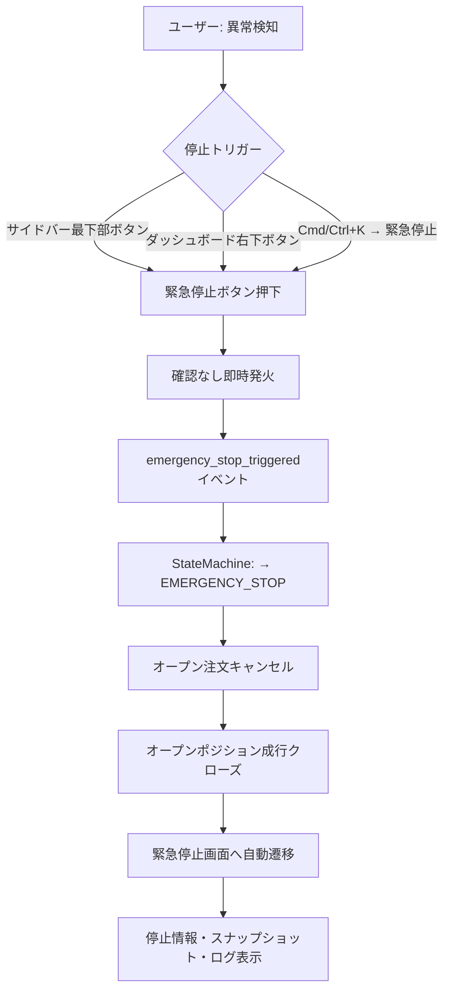

### 9.8.4 操作手順（復帰）

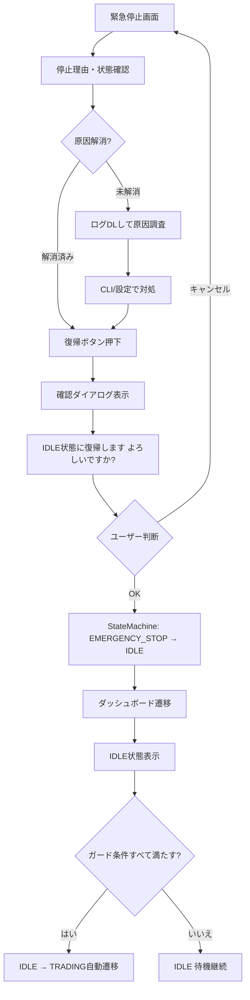

### 9.8.5 各ステップの UI 状態

| ステップ | UI 状態 |
|----------|---------|
| C | 緊急停止ボタン押下、フォーカスリング赤色強調 |
| D-I | 緊急停止画面、停止時刻・理由・トリガ元・状態スナップショット・最終ログ20件表示 |
| G | 復帰確認モーダル、「キャンセル」「IDLE へ復帰」 |
| L | ダッシュボード、状態「IDLE」、ポジション「なし」 |

### 9.8.6 確認の非対称性（重要）

| 操作 | 確認 | 理由 |
|------|------|------|
| 緊急停止 | **なし** | 緊急時に確認を挟むと致命的遅延となる |
| 復帰 | **あり** | 誤って復帰させて意図せず取引再開を防ぐ |

この非対称性は意図的設計であり、第19章で詳細議論される。

### 9.8.7 トリガ元の記録

緊急停止の発火源を `emergency_stops` テーブルに記録：

| トリガ元 | 記録値 |
|----------|--------|
| サイドバーボタン | `sidebar_button` |
| ダッシュボードボタン | `dashboard_button` |
| コマンドパレット | `command_palette` |
| 自動発火（日次損失上限） | `auto_daily_loss` |
| 自動発火（不変条件違反） | `auto_invariant_violation` |
| 自動発火（致命的エラー） | `auto_critical_error` |

### 9.8.8 ログ zip ダウンロード

緊急停止画面の「ログ zip ダウンロード」ボタンで `logs/` ディレクトリ全体を zip 化してダウンロード。トリアージ・原因調査に使用。詳細は第18章。

### 9.8.9 エラー分岐

| エラー | 表示 | 復旧 |
|--------|------|------|
| ポジションクローズ失敗 | スナップショットに「未クローズポジションあり」 | CLI で手動クローズ |
| 復帰時にガード条件未達 | IDLE で待機継続、サイドバー WS インジケータで原因確認 | ガード条件を満たすまで待機 |

### 9.8.10 関連画面

緊急停止（§8.19）、ダッシュボード（§8.12、復帰先）、アラート（§8.17、自動発火時の通知）

### 9.8.11 関連章

第3章 §3.6（EMERGENCY_STOP）、第6章 §6.7（緊急停止シーケンス）、第18章（エラーハンドリング）、第19章（キルスイッチ詳細）、第20章（監査ログ）

---

## 9.9 フロー6: 設定変更

### 9.9.1 ユースケース概要

`yoruu.yaml` の設定をフォーム形式または YAML 直接編集で変更し、変更影響に応じて再起動判断を行う。

### 9.9.2 前提条件

- 設定画面にアクセス可能
- 変更しようとする項目の影響範囲を理解（第21章参照）

### 9.9.3 操作手順

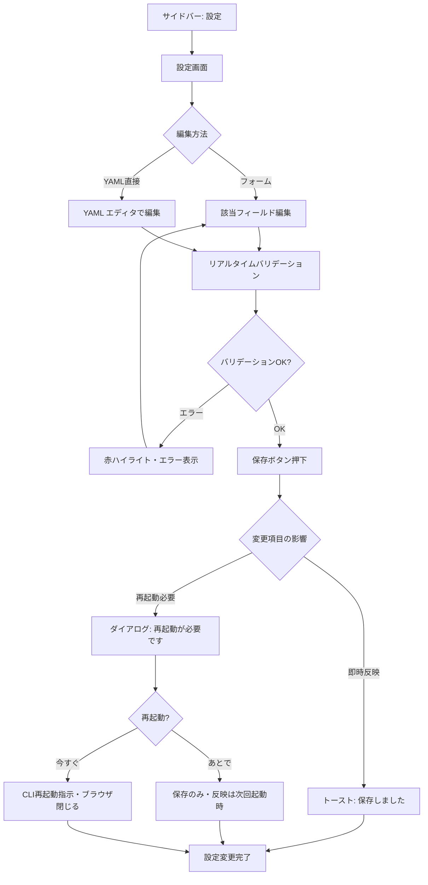

### 9.9.4 即時反映 vs 再起動必要

第21章 設定影響マトリクスを基準（§8.15.5 抜粋）：

| 設定項目 | 影響 |
|----------|------|
| mode | 再起動必要 |
| initial_balance_usd | 再起動必要 |
| max_trade_size_usd | 即時反映 |
| daily_loss_limit_usd | 即時反映 |
| nightly_review.send_time | 即時反映 |
| nightly_review.timezone | 即時反映 |

### 9.9.5 YAML 直接編集の注意

YAML 直接編集は上級者向け。以下の挙動：

- 構文エラー時は赤ハイライト + 保存ボタン無効化
- フォーム編集と YAML 編集は双方向同期（一方を編集すると他方も更新）
- コメント保持: YAML ファイル内のコメントは編集後も保持される

### 9.9.6 監査ログへの記録

設定変更時、`audit_log` テーブルに以下を記録：

- 変更日時
- 変更者（本システムは単一ユーザーのため固定値 `master`）
- 変更前後の差分
- 変更理由（オプション入力フィールド）

### 9.9.7 エラー分岐

| エラー | 表示 | 復旧 |
|--------|------|------|
| YAML 構文エラー | エディタ内赤ハイライト | 構文修正 |
| 数値範囲外 | フィールド下にエラー「最小値: 1」 | 範囲内に修正 |
| ファイル書込失敗 | トースト「yoruu.yaml 書込失敗」 | 権限確認 |
| 必須項目欠落 | 保存時エラー「mode は必須」 | 入力後再保存 |

### 9.9.8 関連画面

設定（§8.15）

### 9.9.9 関連章

第21章（設定影響マトリクス）、第22章（設定仕様）、第20章（監査ログ）

---

## 9.10 フロー7: What-If 検証

### 9.10.1 ユースケース概要

過去データを使って「もし戦略パラメータを変えていたらどうなっていたか」を再計算し、夜間レビューの判断材料とする。

### 9.10.2 PHASE 区分

- **PHASE 2 モック**: 静的シナリオ表示のみ
- **PHASE 4 M4.5 本実装**: 動的再計算

本フローは両 PHASE で共通の UI 操作を定義する。

### 9.10.3 前提条件

- `price_ticks` テーブルに過去データが蓄積されている（推奨: 7日以上）
- `strategy_history` に現在のパラメータが記録されている

### 9.10.4 操作手順

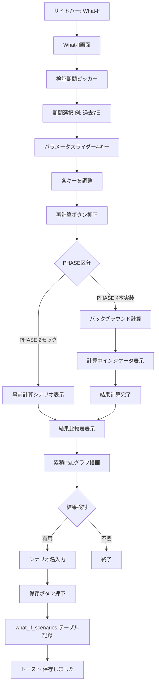

### 9.10.5 各ステップの UI 状態

| ステップ | UI 状態 |
|----------|---------|
| C-D | 日付ピッカー2つ（開始/終了）、デフォルト7日前〜今日 |
| E-F | 4スライダー、現在値を中央に表示、調整範囲は §7.2.1 準拠 |
| K | スピナーアイコン、進捗バーオプション |
| M-N | 結果比較表、累積 P&L グラフ |
| P-R | シナリオ名入力フィールド、保存ボタン |

### 9.10.6 計算時間の表示

PHASE 4 本実装時、計算時間が長い場合（7日分で数十秒想定）の UI 対応：

- 計算開始時にスピナー表示
- 進捗が分かる場合は％表示
- 計算中も他画面操作は可能（バックグラウンド実行）
- 計算完了時にトースト通知「シミュレーション完了」

### 9.10.7 シナリオ保存の利点

保存したシナリオは戦略履歴と紐付け、「v3 適用前に検討した3シナリオ」のような形で参照可能。夜間レビュー時の判断記録として有用。

### 9.10.8 エラー分岐

| エラー | 表示 | 復旧 |
|--------|------|------|
| 過去データ不足 | 「指定期間のデータが不足しています」 | 期間短縮 |
| パラメータ範囲外 | スライダー赤ハイライト | 範囲内調整 |
| 計算タイムアウト | 「計算がタイムアウトしました」 | 期間短縮または PHASE 4 でリトライ |
| 保存失敗 | トースト「シナリオ保存失敗」 | DB 確認 |

### 9.10.9 関連画面

What-If シミュレーター（§8.21）、戦略履歴（§8.16、シナリオ紐付け参照）、夜間レビュー（§8.14、検証結果を判断材料に）

### 9.10.10 関連章

第10章（price_ticks, what_if_scenarios スキーマ）、第11章（戦略ロジック、再計算アルゴリズム）、第13章（ペーパー約定エンジン）

---

## 9.11 フロー8: アラート対応とエラートリアージ

### 9.11.1 ユースケース概要

ヘルスバナー受領 → アラート画面 → エラーコード参照 → 第18章ドキュメント参照 → 既読化までの対応フロー。

### 9.11.2 前提条件

- アラートがシステムから発生している（または過去発生）

### 9.11.3 操作手順

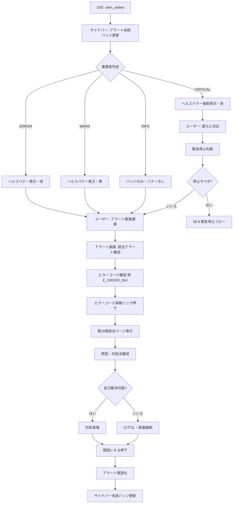

### 9.11.4 重要度別の表示優先順位

| 重要度 | バナー | バッジ | サウンド（将来） |
|--------|--------|--------|------------------|
| CRITICAL | 強制表示・閉じても再表示 | あり | 将来あり |
| ERROR | 表示・閉じれば消える | あり | なし |
| WARN | 表示・閉じれば消える | あり | なし |
| INFO | なし | あり | なし |

### 9.11.5 エラーコード参照フロー

エラーコード（例: `E_ORDER_004`）クリック時：

- 第18章該当ページにオフラインリンク（同リポジトリ内ファイルへのアンカー）
- 表示内容: エラー定義、典型的原因、対処法、関連関数、関連章

### 9.11.6 自動既読化の不採用

時間経過による自動既読化は採用しない。ユーザーが明示的に既読化することで、トリアージの履歴が残る。「すべて既読にする」一括操作は提供。

### 9.11.7 エラー分岐

| エラー | 表示 | 復旧 |
|--------|------|------|
| アラート読込失敗 | 画面に「アラート読込エラー」 | リロード |
| エラーコード詳細リンク先不在 | 第18章未執筆部分 | 一般エラーコード説明にフォールバック |

### 9.11.8 関連画面

アラート（§8.17）、ダッシュボード（§8.12、緊急停止判断時）、緊急停止（§8.19）

### 9.11.9 関連章

第18章（エラーハンドリング + ログトリアージ）、第8章 §8.9（SSE）、第20章（監査ログ）

---

## 9.12 フロー9: 戦略ロールバック

### 9.12.1 ユースケース概要

夜間レビューで適用した戦略パラメータの結果が悪かった場合、過去バージョンに戻す操作。

### 9.12.2 前提条件

- `strategy_history` に2バージョン以上の履歴が存在
- 現在のパラメータでの取引結果が確認できる状態

### 9.12.3 操作手順

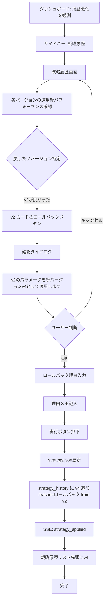

### 9.12.4 ロールバックの仕組み

ロールバックは過去バージョンへの上書きではなく、**過去バージョンの値を新バージョンとして適用**する。例：

- 現在: v3 適用中
- v1 にロールバックしたい
- 結果: v4 が新規追加され、v4 のパラメータは v1 と同じ
- `strategy_history` には v1, v2, v3, v4 すべて記録される
- v4 の `reason` カラムに「v1 からロールバック」と記録

これにより履歴の改竄を防ぎ、すべての変更を追跡可能とする。

### 9.12.5 ロールバック理由の必須化

ロールバックは通常の Apply より重大な操作のため、理由メモを**必須入力**とする：

| 入力例 | 妥当性 |
|--------|--------|
| 「v3で3日連続損失。v2の方が安定していた」 | 良 |
| 「(空白)」 | 不可、保存不可 |

### 9.12.6 連続ロールバックの制限

短時間で連続ロールバックを実行すると判断ループに陥る可能性があるため、以下を推奨（強制ではない）：

- 24時間以内に複数回ロールバックを実行する場合、警告表示
- 「直近24時間で X 回のロールバックを実行しています。冷静な判断を推奨します」

### 9.12.7 エラー分岐

| エラー | 表示 | 復旧 |
|--------|------|------|
| 履歴が1バージョンしかない | ロールバックボタン非活性 | 履歴蓄積を待つ |
| 理由未入力 | 「理由は必須です」 | 入力 |
| Apply 失敗 | トースト「ロールバック失敗」 | 通常 Apply と同様の対処 |

### 9.12.8 関連画面

戦略履歴（§8.16）、ダッシュボード（§8.12、結果観測元）

### 9.12.9 関連章

第10章（strategy_history スキーマ）、第15章（夜間レビュー）、第20章（監査ログ）

---

## 9.13 フロー10: 言語切替

### 9.13.1 ユースケース概要

UI 表示言語を日本語 ⇄ 英語で切替。初版では英語翻訳は空のためキー表示となるが、構造は完備。

### 9.13.2 前提条件

- `shared/i18n.js` が読み込まれている
- 切替先言語の辞書が存在（en は空でも可）

### 9.13.3 操作手順

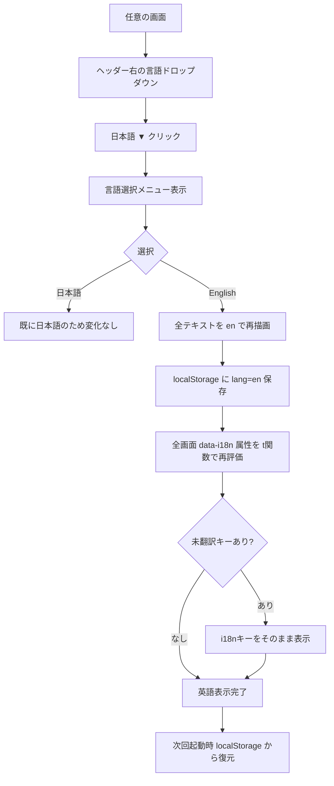

### 9.13.4 各ステップの UI 状態

| ステップ | UI 状態 |
|----------|---------|
| B-D | ヘッダー: 「🌐 日本語 ▼」、クリックでドロップダウン展開 |
| G-I | 一瞬画面が再描画、視覚的にちらつきあり（許容） |
| K | 例: `nav.dashboard`（キー名そのまま）が表示 |

### 9.13.5 コマンドパレット経由の切替

コマンドパレット（`Cmd/Ctrl+K`）から「言語切替（English）」「言語切替（日本語）」を実行可能（§8.7）。

### 9.13.6 未翻訳キーの扱い

初版では en 辞書が空のため、英語選択時はほぼ全テキストが i18n キーとして表示される。これは**意図的設計**であり、PHASE 6 以降に翻訳を追加する際の構造確認用。

将来 en 翻訳を追加する際は `shared/i18n.js` の `I18N.en` オブジェクトにキーを追加するのみ。

### 9.13.7 i18n 詳細仕様

`t()` 関数の補間、フォールバック、ネストキー対応等の詳細は第14章で定義。本章では操作フローのみ。

### 9.13.8 エラー分岐

| エラー | 表示 | 復旧 |
|--------|------|------|
| `shared/i18n.js` 読込失敗 | 全テキストがフォールバック値（HTML 内 textContent）で表示 | リロード |
| localStorage アクセス不可 | 切替は機能するが再起動時に初期値（ja）に戻る | ブラウザ設定確認 |

### 9.13.9 関連画面

全画面

### 9.13.10 関連章

第14章（i18n 設計詳細）、第8章 §8.8（i18n 適用方針）

---

## 9.14 エラー分岐と復旧フロー（横断）

### 9.14.1 WebSocket 切断

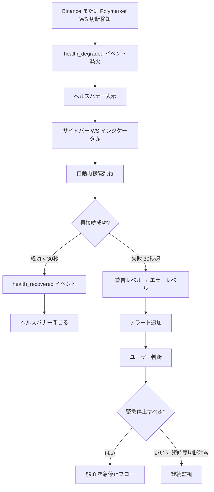

### 9.14.2 ディスク容量不足

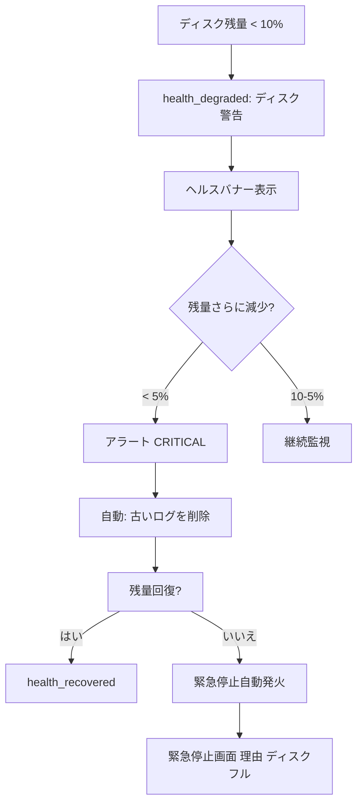

### 9.14.3 API レート制限

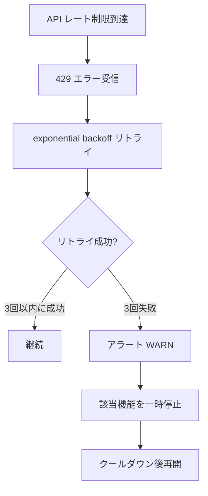

### 9.14.4 不正な状態遷移検出

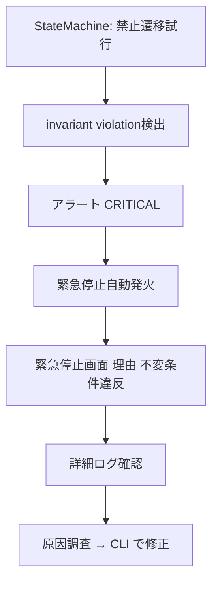

### 9.14.5 strategy.json 破損

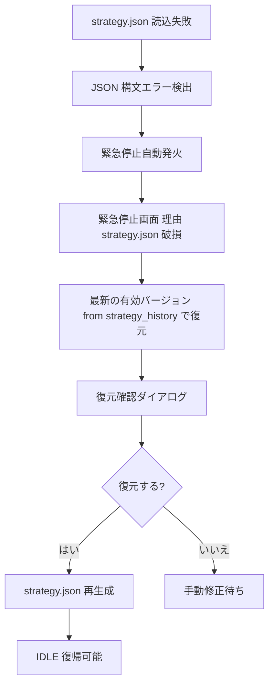

---

## 9.15 PHASE 2 / PHASE 4 への引き継ぎ

### 9.15.1 PHASE 2（UIモック）での反映事項

各 HTML モックで以下を検証可能とする：

| フロー | 検証方法 |
|--------|----------|
| §9.4 初回起動 | ハブ → ダッシュボード遷移をモックで再現 |
| §9.5 取引監視 | mock-data.js で全画面の表示確認 |
| §9.6 夜間レビュー | レポートサマリ表示、JSON ペーストエリア、差分プレビューをモックで再現 |
| §9.7 モード切替 | 2段階確認ダイアログを mock-data シナリオ切替で再現 |
| §9.8 緊急停止 | ボタン押下 → 緊急停止画面遷移（StateMachine は変更しない） |
| §9.9 設定変更 | フォーム入力、保存はトースト表示のみ |
| §9.10 What-If | 静的シナリオ表示、再計算ボタンは事前計算済み結果を表示 |
| §9.11 アラート | mock-data に複数アラート、フィルタ・既読化動作確認 |
| §9.12 ロールバック | mock-data で複数バージョン、ロールバック動作確認 |
| §9.13 言語切替 | en 辞書は空のままで動作確認（キー表示） |

### 9.15.2 PHASE 4（UI実装）での反映事項

各フローを実 API 呼び出しと SSE で接続：

| フロー | 実装ポイント |
|--------|--------------|
| §9.6 夜間レビュー | POST /api/strategy/apply エンドポイント、JSON 検証、`strategy_history` 書込 |
| §9.7 モード切替 | POST /api/mode/switch、2段階確認のサーバ側検証 |
| §9.8 緊急停止 | POST /api/emergency_stop、即時 StateMachine 遷移 |
| §9.9 設定変更 | POST /api/config/update、影響判定 |
| §9.10 What-If | POST /api/whatif/simulate、非同期計算、進捗 SSE |
| §9.12 ロールバック | POST /api/strategy/rollback、理由必須 |

REST エンドポイントの完全定義は第10章。

### 9.15.3 ユーザビリティ検証チェックリスト

PHASE 2 完了時にユーザー（マスター）が実施するチェック：

- [ ] §9.6 夜間レビュー: コピー → ペーストの操作が直感的か
- [ ] §9.7 LIVE 切替: 2段階確認が十分に「重い」と感じるか
- [ ] §9.8 緊急停止: ボタンが必要十分な視認性を持つか
- [ ] §9.8 復帰: 確認ダイアログで誤操作を防げるか
- [ ] §9.11 アラート: 重要度別の表示が直感的か
- [ ] §9.13 言語切替: 切替後の表示崩れがないか

---

## 9.16 品質チェック

### 9.16.1 章単位の確認事項

| # | 確認項目 | 対応セクション |
|---|----------|---------------|
| 1 | 本章の目的とスコープ明示 | §9.1 |
| 2 | 第6章との役割分担明示 | §9.2 |
| 3 | 共通操作（言語切替・コマンドパレット・ショートカット）定義 | §9.3 |
| 4 | 10種類の主要フローを定義 | §9.4〜§9.13 |
| 5 | 各フローに前提条件・操作手順・UI状態・エラー分岐・関連画面・関連章が揃う | §9.4.X〜§9.13.X |
| 6 | 夜間レビュー完全フローを最重要として詳細化 | §9.6 |
| 7 | 緊急停止と復帰の非対称設計を明示 | §9.8.6 |
| 8 | モード切替の2段階確認フローを明示 | §9.7.4 |
| 9 | 戦略ロールバックの履歴管理方針を明示 | §9.12.4 |
| 10 | 横断的なエラー分岐を §9.14 で集約 | §9.14 |
| 11 | PHASE 2 / PHASE 4 への引き継ぎ事項明示 | §9.15 |
| 12 | 全 Mermaid 図のコードフェンスが閉じている | 各フロー図 |
| 13 | 全章相互参照が再編後章番号と整合 | 各 §9.X.最終節 |
| 14 | 章末「品質チェック」セクション存在 | 本セクション |

### 9.16.2 cross-ref 一覧（再編後章番号）

本章で参照する他章：

| 参照先 | 文脈 |
|--------|------|
| 第3章 §3.3 | IDLE → TRADING ガード（モード切替時） |
| 第3章 §3.6 | EMERGENCY_STOP 状態 |
| 第6章 §6.1 | 起動シーケンス |
| 第6章 §6.2-6.3 | 取引シーケンス |
| 第6章 §6.4 | 夜間レビューシーケンス |
| 第6章 §6.6 | モード切替シーケンス |
| 第6章 §6.7 | 緊急停止シーケンス |
| 第7章 §7.2.1 | パラメータ範囲（What-If 検証時） |
| 第8章 §8.6 | サイドバー仕様 |
| 第8章 §8.7 | コマンドパレット |
| 第8章 §8.9 | SSE イベント |
| 第8章 §8.11〜§8.21 | 各画面仕様 |
| 第8章 §8.22.3 | キーボードショートカット |
| 第10章 | データスキーマ、REST エンドポイント |
| 第11章 | 戦略計算ロジック、再計算アルゴリズム |
| 第12章 | モード仕様 |
| 第13章 | ペーパー約定エンジン |
| 第14章 | i18n 詳細 |
| 第15章 | 夜間レビュー詳細フロー |
| 第18章 | エラーハンドリング、エラーコード |
| 第19章 | キルスイッチ、2段階確認 |
| 第20章 | 監査ログ |
| 第21章 | 設定影響マトリクス |
| 第22章 | 設定仕様 |

### 9.16.3 後続章で確定すべき項目

| 項目 | 確定章 |
|------|--------|
| REST API エンドポイント仕様 | 第10章 |
| エラーコード完全一覧 | 第18章 |
| 2段階確認の安全要件詳細 | 第19章 |
| 設定影響マトリクス完全版 | 第21章 |

### 9.16.4 既知の未確定事項

| 項目 | 対応方針 |
|------|----------|
| §9.6 AI 解析の所要時間 | Genspark/Opus 4.7 の応答時間に依存。PHASE 6 で実測 |
| §9.10 What-If 計算時間 | PHASE 4 M4.5 で実測、過剰時は期間制限 |
| §9.12 連続ロールバック警告の閾値 | PHASE 6 運用で調整、初版は24時間内2回 |

### 9.16.5 レビュー観点（第9章 APPROVED 判定用）

- [ ] §9.1 〜 §9.16 がすべて存在
- [ ] 全10フローが定義され、それぞれ前提条件・手順・UI 状態・エラー分岐を含む
- [ ] §9.6 夜間レビュー完全フローが他フローより詳細
- [ ] §9.8 緊急停止と復帰の非対称設計が明示
- [ ] §9.14 横断エラー分岐が定義されている
- [ ] PHASE 2 / PHASE 4 引き継ぎが明示
- [ ] 章間相互参照が新章番号と整合

---

## 第9章 終了

本章により、YoRuu Web UI の全ユーザー操作フローが確定した。次の章（第10章）では、本章で参照した REST API エンドポイント、データスキーマ、SSE ペイロード詳細を確定する。
````

---
