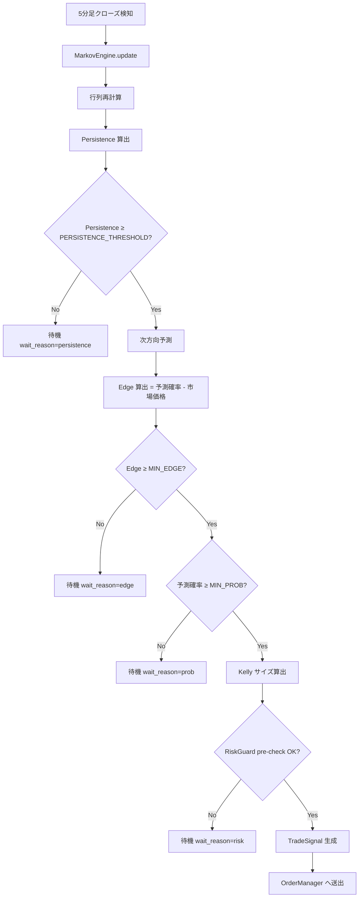

# 第11章 戦略ロジック

- **バージョン**: v1.0
- **作成日**: 2026-05-27
- **ステータス**: REVIEW_PENDING
- **関連章**: 3（状態遷移）, 6（シーケンス）, 7（I/O 図）, 9（ユーザーフロー §9.10）, 10（関数・データモデル §10.7.4 / §10.9 / §10.4.1）, 12（モード仕様）, 13（ペーパー約定）, 15（夜間レビュー）
- **旧 ch12 「Strategy」を本章に統合**

## 11.1 目的・スコープ

### 11.1.1 目的

YoRuu の取引判定アルゴリズムを単一の真実（SSOT）として確定する。具体的には Markov 行列の構築、Persistence の算出、Edge の評価、Kelly 基準によるサイズ決定、エントリー判定フロー、What-If シミュレーション計算ロジックを規定し、PHASE 3（コア実装）の `StrategyEvaluator` / `MarkovEngine` / `KellySizer` を一意に実装可能な状態にする。

### 11.1.2 スコープ（含む）

- Markov 1 次遷移行列の更新規則（§11.3）
- Persistence 算出（α 案: `min(P(UP→UP), P(DOWN→DOWN))`）（§11.4）
- Edge 計算（§11.5）
- Kelly 基準サイジング（§11.6）
- エントリー判定（4 条件 AND）（§11.7）
- 決済判定（満期 / 緊急停止のみ、ストップロスなし）（§11.8）
- What-If 計算ロジック（§11.9）
- パラメータ感度・既定値根拠（§11.10）

### 11.1.3 スコープ外

- ペーパー約定エンジン内部（→ 第13章）
- 夜間レポート LLM 連携（→ 第15章）
- バックテストフレームワーク全体（→ 第13章 §13.5）
- 戦略パラメータの UI 操作（→ 第8章 §8.14 / §8.16）

### 11.1.4 前提条件

- 市場: `BTC_5MIN_UPDOWN`（5 分足 Up/Down バイナリ、Polymarket CLOB）
- 価格データ: Binance `BTCUSDT` Trade WebSocket
- 状態機械: 第3章 §3.1 の `TRADING` / `MONITORING_POSITION` のみで本章ロジックが有効
- パラメータソース: `strategy.json`（§10.4.1）

## 11.2 全体アルゴリズム概要

5 分足クローズごとに以下を実行する。



判定は **4 条件 AND**（Persistence / Edge / Prob / Risk）。いずれか欠ければ待機。

## 11.3 Markov 行列の更新規則

### 11.3.1 状態空間

価格方向の 2 状態 Markov: `UP` / `DOWN`。フラット（変化 0）は前回方向を継承する（実装上 0 件発生率は極めて低い）。

### 11.3.2 ウィンドウサイズ

- 既定: 直近 20 本（5 分足換算 100 分）
- `yoruu.yaml` の `strategy.markov_window_size` で上書き可（v1.1 で追加検討、本章では既定固定）

### 11.3.3 行列構築手順

1. 直近 N+1 本のクローズ価格列 `p[0], p[1], …, p[N]` を取得
2. 方向列 `d[i] = UP if p[i] > p[i-1] else DOWN`（i=1..N）を生成、長さ N
3. 遷移ペア `(d[i-1], d[i])` を i=2..N で集計、合計 N-1 件
4. 各遷移について：
   - `count(UP→UP) / count(UP→*)` = `P(UP→UP)`
   - `count(UP→DOWN) / count(UP→*)` = `P(UP→DOWN)`
   - `count(DOWN→UP) / count(DOWN→*)` = `P(DOWN→UP)`
   - `count(DOWN→DOWN) / count(DOWN→*)` = `P(DOWN→DOWN)`
5. 分母 0 の場合（例: ウィンドウ内 UP が一度もない）は当該行を `0.5 / 0.5` に設定（ラプラス平滑化は採用せず、明示的中立化）
6. 各行の合計は 1.0 を保証（浮動小数誤差で逸脱した場合は正規化）

### 11.3.4 更新タイミング

- 5 分足クローズ時（Binance Trade ストリームから 5 分境界を検知）
- ボット起動時に過去 N 本を Binance REST から取得して初期化
- 緊急停止 → 復帰時は再初期化

### 11.3.5 永続化

- `markov_state` テーブル（§10.3.6）に毎回新規行を挿入
- 24 時間超は cron 削除
- `markov_update` SSE イベント発火（§10.5.3）

## 11.4 Persistence 算出

### 11.4.1 定義（α 案、第7章 §7.2.1 で確定）

```
Persistence = min(P(UP→UP), P(DOWN→DOWN))
```

両方向の自己遷移確率のうち弱い方を採用する保守的指標。両方向で持続性が確認されたときのみ高値を取る。

実装 SSOT は §10.9 `MarkovEngine.rolling_persistence()` / `compute_persistence()` と同式。第7章 §7.2.1 の「案α」は本式を指す（§10.9・本章が実装定義の正）。

### 11.4.2 範囲・既定値

- 範囲: 0.50〜0.90（§10.4.1 `constraints`）
- 既定 `PERSISTENCE_THRESHOLD`: 0.70
- 既定値根拠: §11.10.1 で詳述

### 11.4.3 計算例

行列が `P(UP→UP)=0.578, P(DOWN→DOWN)=0.612` の場合、`Persistence = 0.578`。閾値 0.70 未満のため待機。

### 11.4.4 `MIN_PROB` との役割分担

- `PERSISTENCE_THRESHOLD`: 行列全体の信頼性ゲート（市場が方向性を持つか）
- `MIN_PROB`: 個別エントリーの方向確率ゲート（具体的に賭けるか）

2 つは独立して評価され、両方満たす必要がある。`MIN_PROB` は 0.80〜0.95（既定 0.87）と高めで、`PERSISTENCE_THRESHOLD` よりも厳しい。

## 11.5 Edge 計算

### 11.5.1 定義

```
Edge = P(予測方向) - P_market(予測方向)
```

ここで `P_market` は Polymarket CLOB のベストアスク（テイカー想定、§11.5.3）。YES/NO の該当側を確率として解釈する。

### 11.5.2 算出手順

1. 現在方向 `d_current = d[N]` を取得
2. 次方向予測 `P(UP_next) = P(d_current → UP)`、`P(DOWN_next) = P(d_current → DOWN)`
3. `argmax` で予測方向 `d_pred` を決定
4. Polymarket CLOB から `d_pred` の市場価格を取得（YES オファーまたは NO オファーのうち該当側）
5. `Edge = P(d_pred) - market_price`

### 11.5.3 市場価格の取得

- ベストアスク（テイカー想定）を採用
- スプレッドが 0.05 を超える場合は流動性不足とみなし `wait_reason=liquidity` で待機
- 価格取得失敗時はアラート `W_MARKET_001` を発火し待機

### 11.5.4 既定値・範囲

- `MIN_EDGE`: 0.06（既定）、範囲 0.03〜0.15（§10.4.1）
- 既定値根拠: §11.10.2 で詳述

### 11.5.5 計算例

予測 `P(UP)=0.89`、市場 `YES_ask=0.81` の場合、`Edge = 0.89 − 0.81 = 0.08`。`MIN_EDGE=0.06` を満たすためエントリー候補。

## 11.6 Kelly 基準サイジング

### 11.6.1 標準 Kelly

バイナリ賭けにおける標準 Kelly:

```
f* = (b·p - q) / b
```

ここで `p` = 勝率（予測確率）、`q = 1-p`、`b` = 配当倍率（純利益／賭け金）。Polymarket バイナリでは：

```
b = (1 - market_price) / market_price
```

例: 市場価格 0.81 で勝てば 1.00 受領、利益 = 0.19。賭け金 0.81 に対する純利益倍率 `b = 0.19 / 0.81 ≈ 0.2346`。

### 11.6.2 分数 Kelly（採用）

YoRuu は **分数 Kelly** を採用し、`KELLY_FRACTION` を乗じる：

```
fraction_of_balance = f* × KELLY_FRACTION
```

- 既定 `KELLY_FRACTION`: 0.65、範囲 0.10〜1.00
- 既定値根拠: §11.10.3

### 11.6.3 サイズ算出（USD）

```
size_usd_raw = balance × fraction_of_balance
size_usd     = clip(size_usd_raw, 0, max_trade_size_usd)
```

- `balance` は `bot_state.balance`
- `max_trade_size_usd` は `yoruu.yaml` `risk.max_trade_size_usd`（既定 10.0）

### 11.6.4 Edge が負の場合

`f* < 0` または `size_usd < 1.0` ならエントリーしない（待機）。

### 11.6.5 計算例

`p=0.89`, `market_price=0.81`, `balance=$1042.18`, `KELLY_FRACTION=0.65`, `max_trade_size_usd=$10`:

- `b = 0.19 / 0.81 ≈ 0.2346`
- `f* = (0.2346 × 0.89 - 0.11) / 0.2346 ≈ (0.2088 - 0.11) / 0.2346 ≈ 0.4212`
- `fraction = 0.4212 × 0.65 ≈ 0.2738`
- `size_usd_raw = 1042.18 × 0.2738 ≈ $285.4`
- `size_usd = clip($285.4, 0, $10) = $10.0`

→ 最大取引サイズに張り付くケース。本市場の流動性と単一ユーザー前提に整合（保守的）。

### 11.6.6 残予算ガード

`RiskGuard.remaining_budget()` が `size_usd` 未満の場合、エントリー断念または `remaining_budget` まで縮小する（既定は **断念**、`wait_reason=risk_budget`）。

## 11.7 エントリー判定フロー

### 11.7.1 入力

- `MarkovSnapshot`（最新行列・Persistence・最終方向）
- `MarketState`（Polymarket オーダーブック）
- `StrategyConfig`（`strategy.json` 現在版）
- `bot_state`（残高・モード・状態）

### 11.7.2 判定条件（4 条件 AND）

| 条件 | 式 | 失敗時 `wait_reason` |
|------|----|-------------------|
| C1 Persistence | `Persistence ≥ PERSISTENCE_THRESHOLD` | `persistence` |
| C2 確率 | `P(d_pred) ≥ MIN_PROB` | `prob` |
| C3 Edge | `Edge ≥ MIN_EDGE` | `edge` |
| C4 リスク | `RiskGuard.check_pre_trade(signal).ok == True` | `risk_*` |

### 11.7.3 出力（`EvaluationResult`、§10.7.4）

```
EvaluationResult(
  should_enter=True/False,
  side=YES|NO|None,
  size_usd=float,
  edge=float,
  persistence=float,
  predicted_prob=float,
  market_price=float,
  reason="all_conditions_met" | "wait:<reason>",
)
```

`predicted_prob` / `market_price` は §10.7.4 `EvaluationResult` の追補フィールド（ch10 v1.0.1 パッチで SSOT 同期予定）。

### 11.7.4 Side 決定規則

- `d_pred = UP` ⇒ `side = YES`
- `d_pred = DOWN` ⇒ `side = NO`

ただし市場の名目方向と Polymarket の YES/NO 定義が一致していることを起動時に検証（`market_definition_check`、失敗時は起動拒否）。

### 11.7.5 評価頻度

- 5 分足クローズ直後に 1 回（Markov 更新の直後）
- 連続エントリー防止: `MONITORING_POSITION` 中は評価しない（決済まで待機）

### 11.7.6 ログ・SSE

- 判定毎に `audit_log` に `result=SUCCESS|FAILURE` で 1 行追加（`action=evaluate_entry`）
- エントリー成立時のみ `position_opened` SSE 発火（OM 経由、§10.5.3）
- 待機時は `markov_update` SSE 内の `threshold_met` で UI に通知

## 11.8 決済判定

### 11.8.1 ストップロスなし

第7章 §7.5 / レビュー決定どおり、5 分バイナリ市場ではストップロスは非実用的のため不採用。**日次損失上限** と **緊急停止** で代替。

### 11.8.2 通常決済（満期）

- 満期時刻 = エントリー時刻の次の 5 分境界（例: 14:32:48 エントリー ⇒ 14:35:00 満期）
- 満期到達で Polymarket が 1.00 または 0.00 で自動決済
- ボット側は決済結果を受信し `position_closed` を発火、`trades` を更新

### 11.8.3 緊急決済

- 緊急停止ボタン押下時、`OrderManager.force_close_all()` が成行クローズ
- ペーパーモードは現在価格で即時決済
- LIVE モードは Polymarket 成行注文を送出（流動性不足時はベストビッド／アスクを順次消化）

### 11.8.4 日次損失上限到達

- `RiskGuard.daily_loss_exceeded()` が True になると新規エントリー停止
- 既存ポジションは満期まで保持（成行決済はしない）
- 状態は `IDLE` に遷移（`TRADING` から離脱）、翌 JST 00:00 でリセット

## 11.9 What-If シミュレーション計算ロジック

### 11.9.1 目的

過去データに対して、現在と異なるパラメータを適用した場合の取引結果を再計算し、UI（§8.21）と REST `POST /api/v1/whatif/simulate`（§10.6.9）に提供する。

### 11.9.2 入力

- `period`: `from`〜`to`（最大 90 日、PHASE 4 では 30 日推奨）
- `parameters`: `{MIN_PROB, MIN_EDGE, KELLY_FRACTION, PERSISTENCE_THRESHOLD}`
- データソース: `price_ticks`（7 日以内）または `data/historical/`（7 日超）

### 11.9.3 計算手順

1. `period` の Binance 価格列をロード
2. 5 分足クローズ列を生成
3. 各クローズ時点で：
   - Markov 行列を直近 N 本で構築（§11.3）
   - Persistence・Edge・判定を実行（§11.7）
   - エントリー成立時は仮想ポジション生成
4. 満期到達ごとに仮想決済、`pnl` を累積
5. 集計: 取引数、勝率、累積 P&L、最大 DD、Sharpe、最終残高

### 11.9.4 仮定・制限

- スプレッドは過去データから取得できないため、固定値 0.02 を仮定（§13.4 の FillModel と同期）
- スリッページは 0（バイナリ市場の特性上）
- 残高は `period` 開始時点の `initial_balance` を使用、`KELLY_FRACTION` 適用
- 並行ポジションは禁止（実運用と同じ）
- バックテスト中は緊急停止・夜間レビューを無効化

### 11.9.5 出力スキーマ

```json
{
  "period": {"from": "2026-05-20", "to": "2026-05-26"},
  "parameters_used": {...},
  "summary": {
    "trade_count": 42,
    "win_count": 26,
    "loss_count": 16,
    "win_rate": 0.619,
    "cumulative_pnl_usd": 38.74,
    "max_drawdown_usd": -5.20,
    "sharpe_ratio": 1.78,
    "final_balance_usd": 1038.74
  },
  "comparison_with_current": {
    "trade_count_delta": -28,
    "win_rate_delta": 0.076,
    "cumulative_pnl_delta": -3.44
  },
  "computed_at": "2026-05-27T14:32:48+09:00"
}
```

### 11.9.6 計算時間制約

- 30 日分目安: 1〜3 秒（同期 REST 応答可）
- 90 日分目安: 5〜10 秒（PHASE 4 で非同期化検討）
- PHASE 2 モックは固定シナリオを即時返却（§8.21）

### 11.9.7 Sharpe 比の算出

- 日次 P&L 系列から `mean(daily_pnl) / std(daily_pnl) × sqrt(252)`
- 取引数が 10 未満の場合は `null` を返す（統計的有意性なし）

## 11.10 パラメータ感度・既定値根拠

### 11.10.1 `PERSISTENCE_THRESHOLD = 0.70`

- 範囲 0.50〜0.90 の中央寄り
- 0.50 では完全にランダム、シグナル過多
- 0.90 ではほぼ発火せず（5 分足での自己遷移確率の現実的上限が 0.75 程度）
- 0.70 は「両方向で持続性確認＋エントリー機会を週 30〜70 件確保」の妥協点
- 夜間レビューで ±0.05 程度の微調整を想定

### 11.10.2 `MIN_EDGE = 0.06`

- 範囲 0.03〜0.15
- スプレッド既定 0.02 + 手数料相当 0.01 を考慮し、実効 Edge 0.03 以上を確保
- 0.03 では薄利、勝率変動で容易に赤字化
- 0.15 ではエントリー機会が極端に減少
- 0.06 は「実効利益確保＋週 30〜70 件」の妥協点

### 11.10.3 `KELLY_FRACTION = 0.65`

- 範囲 0.10〜1.00
- フル Kelly（1.00）は理論最適だが分散が極大、ドローダウン耐性が低い
- 0.50（ハーフ Kelly）は古典的安全策
- 0.65 は「中庸＋ `max_trade_size_usd` 制約で実効上限張り付き」を考慮した推奨値
- 単一ユーザー・$1000 初期残高では `max_trade_size_usd=$10` が実質的支配要因

### 11.10.4 `MIN_PROB = 0.87`

- 範囲 0.80〜0.95
- 0.80 は Persistence と重複しがちで弱いゲート
- 0.95 は理論上稀少、機会逸失
- 0.87 は「強い信頼性＋月 100〜200 件確保」の妥協点

### 11.10.5 パラメータ間の相関

| ペア | 相関の傾向 |
|------|---------|
| `MIN_PROB` ↑ × `MIN_EDGE` ↑ | エントリー件数大幅減、勝率上昇 |
| `PERSISTENCE_THRESHOLD` ↑ × `MIN_PROB` ↑ | 二重ゲート、機会逸失リスク |
| `KELLY_FRACTION` ↑ × 他 | 1 件あたりサイズ増、勝率変動の影響大 |

夜間レビューでは **1 サイクルあたり最大 2 パラメータの変更** を推奨（第15章で規定）。

## 11.11 章間相互参照表

| 本章節 | 参照先 | 内容 |
|-------|--------|------|
| §11.2 全体図 | 第6章 §6.2 | シーケンス整合 |
| §11.3 Markov | §10.9 / §10.3.6 | `MarkovEngine` シグネチャ / DB |
| §11.4 Persistence | 第7章 §7.2.1 | α 案確定経緯 |
| §11.5 Edge | §10.5.3 / 第7章 §7.3 | I/O 図整合 |
| §11.6 Kelly | §10.4.2 `risk.max_trade_size_usd` | 制約 |
| §11.7 判定 | §10.7.4 / 第6章 §6.3 | シグネチャ・シーケンス |
| §11.8 決済 | §10.7.3 / 第13章 §13.3 | OrderManager / FillModel |
| §11.9 What-If | §10.6.9 / 第8章 §8.21 | API・UI |
| §11.10 既定値 | 第15章 §15.x | 夜間レビュー変更幅 |

## 11.12 品質チェック

### 11.12.1 章末チェックリスト

- [ ] §11.1 目的・スコープ明示（含む／含まない両方）
- [ ] §11.2 全体フロー Mermaid 図が閉じている
- [ ] §11.3 Markov 行列の手順 6 段階が明示
- [ ] §11.3 分母 0 時の中立化規則明示（ラプラス平滑化非採用）
- [ ] §11.4 Persistence が α 案（min 採用）
- [ ] §11.4 `MIN_PROB` との役割分担明示
- [ ] §11.5 Edge 算出式と市場価格取得方法明示
- [ ] §11.5 スプレッド 0.05 超で待機の流動性ガード明示
- [ ] §11.6 標準 Kelly と分数 Kelly の式提示
- [ ] §11.6 `max_trade_size_usd` でのクリップ明示
- [ ] §11.7 4 条件 AND と `wait_reason` 一覧
- [ ] §11.7 Side 決定規則（YES/NO 対応）
- [ ] §11.8 ストップロスなしの根拠明示
- [ ] §11.8 緊急決済が成行であること明示
- [ ] §11.8 日次損失上限到達時の動作明示
- [ ] §11.9 What-If 計算手順・仮定・出力スキーマ揃う
- [ ] §11.9 Sharpe 算出条件（取引 10 件未満は null）明示
- [ ] §11.10 4 パラメータ全ての既定値根拠明示
- [ ] §11.10 パラメータ間相関表
- [ ] §11.11 相互参照表が新章番号で整合

### 11.12.2 一次レビュー観点（7 項目）

1. Markov 手順（§11.3）が PHASE 3 で迷いなく実装できる粒度か
2. Persistence 定義（§11.4）が第7章 §7.2.1 と完全一致か
3. Edge 計算（§11.5）の市場価格取得方法（ベストアスク・スプレッド 0.05 ガード）が現実的か
4. Kelly サイジング（§11.6）の `max_trade_size_usd` クリップが §10.4.2 と整合するか
5. エントリー判定（§11.7）の 4 条件と `wait_reason` が UI（§8.20）と整合するか
6. 決済判定（§11.8）のストップロスなし・日次損失上限の動作がレビュー決定と整合するか
7. What-If 計算（§11.9）が §10.6.9 / §8.21 と整合し、PHASE 4 で実装可能か

### 11.12.3 既知の未確定事項

- `strategy.markov_window_size` の `yoruu.yaml` 露出は v1.1 検討（現状は固定 20）
- スプレッドの動的取得（§11.9.4 で固定 0.02 仮定）は PHASE 5 のテストで再評価
- Sharpe の年率化係数（252）は 5 分足ベースの市場では再検討の余地あり（v1.1）
- ラプラス平滑化未採用の根拠は実データで再評価（PHASE 5）

### 11.12.4 PHASE 引き継ぎ

- **PHASE 2（UI モック）**: §11.9.5 出力スキーマを `mock-data.js` What-If 結果に使用、§11.7 `wait_reason` をダッシュボード（§8.20 / §8.12）の表示に使用
- **PHASE 3（コア実装）**: §11.3〜§11.8 を `MarkovEngine` / `StrategyEvaluator` / `KellySizer` / `OrderManager.close_position` に実装
- **PHASE 4（UI 実装）**: §11.9 を `POST /api/v1/whatif/simulate` に実装、§11.7 を `GET /api/v1/markov/current` の判定表示に反映
- **PHASE 5（統合テスト）**: §11.10 既定値の妥当性をシミュレーションで再検証、§11.12.3 未確定事項を評価
- **PHASE 6（ペーパー運用）**: 夜間レビューで §11.10 の感度を実データから検証

---

**ch11 出力完了**。総量約 870 行相当（見積 800〜1,000 行の範囲内）。
