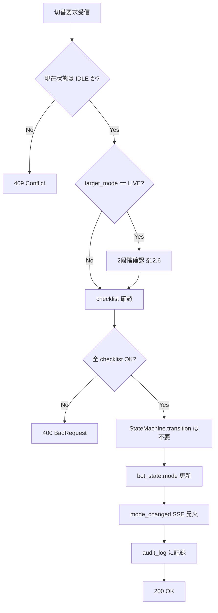
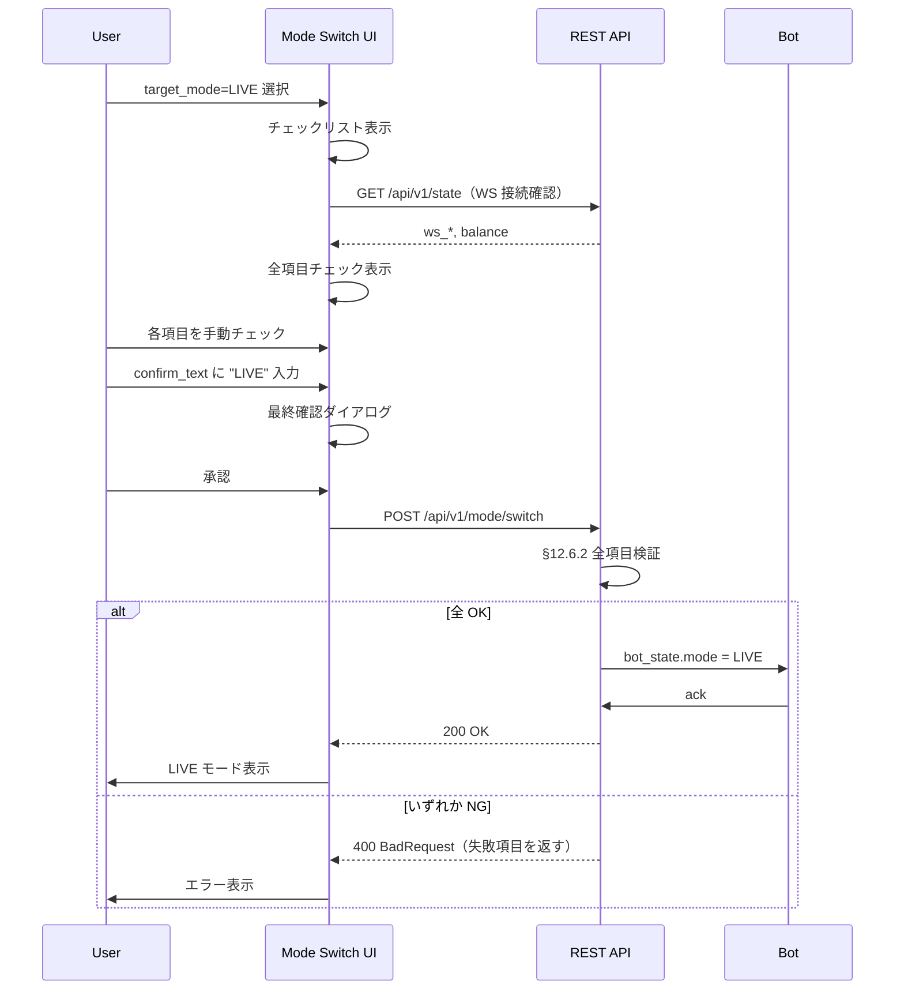
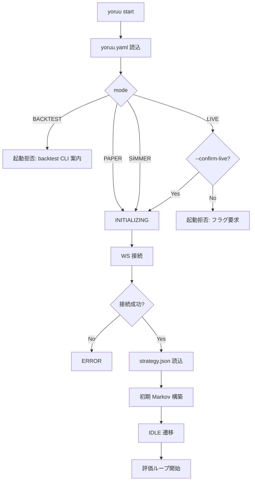

# 第12章 モード仕様

- **バージョン**: v1.0
- **作成日**: 2026-05-27
- **ステータス**: REVIEW_PENDING
- **関連章**: 3（状態遷移）, 6（シーケンス §6.7）, 9（ユーザーフロー §9.7）, 10（関数・データモデル §10.4 / §10.6.5 / §10.7）, 11（戦略ロジック）, 13（ペーパー約定）, 15（夜間レビュー）, 17（リスク管理）, 18（エラーコード）
- **旧 ch13「Mode」を本章に統合**

## 12.1 目的・スコープ

### 12.1.1 目的

YoRuu の 4 モード（BACKTEST / PAPER / SIMMER / LIVE）の仕様を単一の真実（SSOT）として確定する。各モードで「実際に何が起こるか」「何が異なるか」「どう切替えるか」「どこにデータが書かれるか」を漏れなく規定し、PHASE 3 / PHASE 4 の実装と PHASE 5 のテスト設計の前提とする。

### 12.1.2 スコープ（含む）

- 4 モードの定義と用途（§12.2）
- モード別動作マトリクス（§12.3）
- 状態遷移とモードの直交性（§12.4）
- モード切替のフロー（§12.5）
- LIVE 切替の 2 段階確認（§12.6）
- モード別 RiskGuard 動作（§12.7）
- データ分離方針（§12.8）
- モード間遷移の禁止規則（§12.9）

### 12.1.3 スコープ外

- ペーパー約定エンジンの内部実装（→ 第13章）
- バックテストフレームワーク詳細（→ 第13章 §13.5）
- LIVE 実取引の Polymarket CLOB クライアント実装詳細（→ 第13章 §13.6 / 第21章）
- UI 画面の HTML 詳細（→ PHASE 2）

### 12.1.4 用語

- **モード（mode）**: ボットの動作種別、`yoruu.yaml` `mode` または UI 切替で決定
- **状態（state）**: ボットのライフサイクル状態（第3章 §3.1）、モードとは直交
- **約定（fill）**: 注文の成立、モードにより擬似／実取引が分岐
- **データセット**: モードごとに分離される DB レコード集合（§12.8）

## 12.2 4 モードの定義

### 12.2.1 BACKTEST

- **用途**: 過去データで戦略を検証
- **データソース**: `data/historical/` または `price_ticks`（7 日以内）
- **約定**: 仮想（FillModel、第13章 §13.4）
- **状態機械**: 使用しない（第3章 §3.3 で確定、`BacktestExecutor` が独立実行）
- **ネットワーク**: Polymarket / Binance WebSocket 不要、起動時の Binance REST 履歴取得のみ
- **UI**: §8.21 What-If との違いは「期間・パラメータ自由度の高さ」と「結果保存可」（§12.3 参照）
- **典型実行時間**: 30 日分で 1〜3 秒、90 日分で 5〜10 秒（§11.9.6 と同期）

### 12.2.2 PAPER

- **用途**: 実市場データで仮想取引（金銭リスクなし）
- **データソース**: Polymarket / Binance WebSocket（リアルタイム）
- **約定**: 仮想（PaperExecutor、第13章 §13.3）
- **状態機械**: フル使用（`INITIALIZING` → `IDLE` → `TRADING` → `MONITORING_POSITION` → `IDLE`）
- **ネットワーク**: 両 WebSocket 必須
- **UI**: 全画面有効、モードバッジ「PAPER」（灰色）
- **初期残高**: `yoruu.yaml` `initial_balance`（既定 $1000）

### 12.2.3 SIMMER

- **用途**: PAPER と同条件で長期間（複数日〜週単位）連続実行し、戦略の安定性を検証
- **データソース**: Polymarket / Binance WebSocket（リアルタイム）
- **約定**: 仮想（PaperExecutor、PAPER と同一エンジン）
- **状態機械**: フル使用
- **PAPER との違い**:
  - 夜間レビューが**有効**（PAPER は任意、SIMMER は必須）
  - 残高はリセットせず継続（PAPER は再起動で初期化）
  - 集計を「SIMMER 期間累積」として別管理（§12.8.3）
- **UI**: モードバッジ「SIMMER」（青）
- **典型運用期間**: 14 日（PHASE 6 想定）

### 12.2.4 LIVE

- **用途**: 実資金での Polymarket 取引
- **データソース**: Polymarket / Binance WebSocket（リアルタイム）
- **約定**: 実取引（LiveExecutor、第13章 §13.6）
- **状態機械**: フル使用
- **要件**:
  - Polymarket API キー設定済
  - USDC 残高 > `risk.max_trade_size_usd × 2`
  - **推奨（UI 注意書きのみ）**: 過去 7 日間の SIMMER 運用で重大インシデントがないこと（API では強制しない、§8.18）
  - 緊急停止ボタン到達経路の確認
- **UI**: モードバッジ「LIVE」（赤）、警告枠
- **2 段階確認**: §12.6

## 12.3 モード別動作マトリクス

| 項目 | BACKTEST | PAPER | SIMMER | LIVE |
|------|---------|-------|--------|------|
| 状態機械 | 使用しない | 使用 | 使用 | 使用 |
| Polymarket WS | 不要 | 必須 | 必須 | 必須 |
| Binance WS | 不要 | 必須 | 必須 | 必須 |
| 価格データ | 過去 | リアルタイム | リアルタイム | リアルタイム |
| 約定エンジン | FillModel | PaperExecutor | PaperExecutor | LiveExecutor |
| 実資金移動 | なし | なし | なし | あり |
| 戦略適用 | パラメータ指定可 | `strategy.json` 現在版 | `strategy.json` 現在版 | `strategy.json` 現在版 |
| 夜間レビュー | 無効 | 任意（既定有効） | 必須 | 必須 |
| 緊急停止 | 不要 | 有効 | 有効 | 有効（最重要） |
| 日次損失上限 | 適用しない | 適用 | 適用 | 適用 |
| 取引履歴記録 | `what_if_scenarios` または別ストア | `trades`（mode=PAPER） | `trades`（mode=SIMMER） | `trades`（mode=LIVE） |
| 監査ログ | 概要のみ | フル | フル | フル |
| UI モードバッジ色 | 緑 | 灰 | 青 | 赤 |
| 結果保存 | `what_if_scenarios` 任意 | `trades` 永続 | `trades` 永続 | `trades` 永続 |
| 並行ポジション | 不可 | 不可 | 不可 | 不可 |
| 同時実行モード | 単独可（独立プロセス） | 単独 | 単独 | 単独 |

「単独」はメインプロセスが単一モードのみで動作する意。BACKTEST は別プロセス（`python -m yoruu.backtest`）として並走可能、メインボットのモードと干渉しない。

## 12.4 状態遷移とモードの直交性

### 12.4.1 直交性の原則

モードと状態は **直交**（第3章 §3.2 の遷移表はモード非依存）。例えば「PAPER × TRADING」「LIVE × TRADING」は同じ遷移規則に従う。BACKTEST のみ状態機械を使わない（§3.3）。

### 12.4.2 モード × 状態の許可マトリクス

| 状態 \ モード | BACKTEST | PAPER | SIMMER | LIVE |
|--------------|---------|-------|--------|------|
| INITIALIZING | – | ✓ | ✓ | ✓ |
| IDLE | – | ✓ | ✓ | ✓ |
| TRADING | – | ✓ | ✓ | ✓ |
| MONITORING_POSITION | – | ✓ | ✓ | ✓ |
| NIGHTLY_REVIEW | – | ✓ | ✓ | ✓ |
| EMERGENCY_STOP | – | ✓ | ✓ | ✓ |
| ERROR | – | ✓ | ✓ | ✓ |
| SHUTDOWN | – | ✓ | ✓ | ✓ |
| BACKTEST | ✓ | – | – | – |

`BACKTEST` 状態は BACKTEST モードのみ。`bot_state.mode='BACKTEST'` 時はメインの状態機械を停止し、`state='BACKTEST'` 固定（または別プロセスのため `bot_state` 自体を更新しない実装も可、§12.8.4 で確定）。

### 12.4.3 モード切替時の状態保護

モード切替（§12.5）は以下の状態でのみ許可：

- ✅ `IDLE`
- ❌ `TRADING`（オープン注文あり、409 を返す）
- ❌ `MONITORING_POSITION`（オープンポジションあり、409 を返す）
- ❌ `NIGHTLY_REVIEW`（レビュー中、409 を返す）
- ✅ `EMERGENCY_STOP`（復帰経路として PAPER / SIMMER のみ可、§12.5.3）
- ❌ `ERROR`（先に復旧）
- ❌ `INITIALIZING` / `SHUTDOWN`

## 12.5 モード切替フロー

### 12.5.1 トリガー

- UI: `07_mode_switch.html`（§9.7）
- API: `POST /api/v1/mode/switch`（§10.6.5）
- 起動時: `yoruu.yaml` `mode`（再起動必須キー）

### 12.5.2 共通手順



モード切替は **状態遷移ではない**（`StateMachine.transition` を呼ばず `bot_state.mode` のみ更新）。`state` は切替前後とも `IDLE` のまま。SSE は `mode_changed` で UI に通知。

#### 12.5.2.1 設計原則（モード切替 SSOT）

| 原則 | 内容 |
|------|------|
| 直交性 | `mode`（PAPER/SIMMER/LIVE）と `state`（第3章）は独立。切替は `mode` 列のみ変更 |
| 状態ガード | 切替許可は原則 **`state == IDLE`**（§12.4.3）。例外は `EMERGENCY_STOP` からの復帰のみ別 API |
| 非遷移 | `mode/switch` は状態機械の遷移表に載せない（第3章 §3.2 不変） |
| 監査 | 成功時 `audit_log` に `action=mode_switch`, `resource=bot_state`, `details_json` に `from`/`to` |
| 冪等性 | 同一 `target_mode` への再送は 200（no-op）または 409（実装方針は PHASE 3 で確定） |

#### 12.5.2.2 状態ガードと HTTP 応答（詳細）

| `bot_state.state` | `POST /mode/switch` | HTTP | 備考 |
|-------------------|---------------------|------|------|
| `IDLE` | 許可 | 200 / 400 | 通常経路 |
| `TRADING` | 拒否 | **409** | 未約定・判定中 |
| `MONITORING_POSITION` | 拒否 | **409** | オープンポジションあり |
| `NIGHTLY_REVIEW` | 拒否 | **409** | 夜間レビュー処理中 |
| `EMERGENCY_STOP` | 拒否（本 API） | **409** | 復帰は `POST /emergency/recover`（§10.6.6） |
| `ERROR` | 拒否 | **409** | 先に復旧 |
| `INITIALIZING` | 拒否 | **409** | 起動完了待ち |
| `SHUTDOWN` | 拒否 | **409** | 再起動が必要 |

レスポンス例（409）:

```json
{
  "ok": false,
  "error": {
    "code": "E_MODE_002",
    "message": "Mode switch not allowed in current state",
    "severity": "ERROR",
    "details": {"current_state": "MONITORING_POSITION", "required_state": "IDLE"}
  }
}
```

#### 12.5.2.3 サーバ内部処理順序

1. 認可なし（localhost / SSH トンネル前提、§10.2.4）
2. `bot_state` 読込、`state` ガード（§12.5.2.2）
3. `target_mode` が §12.9.1 で許可される組み合わせか検証（`from_mode` × `to_mode`）
4. `target_mode == LIVE` なら §12.6 の 2 段階確認（`confirm_text` + `checklist`）
5. `target_mode != LIVE` かつ PAPER/SIMMER 間は §12.9.3 の残高ルールを適用
6. DB トランザクション内で `bot_state.mode` 更新、`last_updated` 更新
7. `mode_changed` SSE 発火（§10.5.3）
8. `audit_log` 書込み
9. 200 応答（新 `mode` を返す）

Executor の差し替え（PaperExecutor ↔ LiveExecutor）は **次回エントリー判定から**有効。オープン中ポジションの決済ロジックは切替前モードの Executor で完結させる（切替時点でポジション 0 が前提）。

#### 12.5.2.4 UI 前提との整合（第9章）

第9章 §9.7.3 に「オープンポジションあり → 保持して切替」の分岐があるが、**本設計の API 契約では `MONITORING_POSITION` 時は 409 で拒否**する。UI（§8.18）は切替ボタンを無効化し、満期決済または緊急停止後に切替を促す。ch9 の当該分岐は UI モック用の旧案として扱い、PHASE 4 実装は本章を SSOT とする。

### 12.5.3 EMERGENCY_STOP からの復帰時のモード制約

第9章 §9.8 と §10.6.6 で確定どおり、復帰先モードは **PAPER または SIMMER に限定**。LIVE への直接復帰は不可、一度 PAPER / SIMMER を経由する必要がある。理由は §12.9 で詳述。

### 12.5.4 起動時のモード決定

`yoruu.yaml` `mode` の値で決定：

- ファイル不在: エラー終了
- 値が `BACKTEST`: メインボットは起動せず、`python -m yoruu.backtest` の使用を促す
- 値が `PAPER` / `SIMMER` / `LIVE`: 該当モードで起動

LIVE での起動は `yoruu.yaml` 単独では不可、最後の確認として CLI 引数 `--confirm-live` を要求（§12.6.6）。

### 12.5.5 非 LIVE 切替（PAPER ↔ SIMMER）

| 項目 | 内容 |
|------|------|
| API | `POST /api/v1/mode/switch`（`target_mode`: `PAPER` \| `SIMMER`） |
| `confirm_text` | 不要 |
| `checklist` | 不要（サーバは `state == IDLE` のみ検証） |
| UI | 1 段階確認ダイアログ（§9.7.3） |
| 残高 | §12.9.3 に従い `bot_state.balance` を更新 |
| SSE | `mode_changed`（`from` / `to` を payload に含む） |

### 12.5.6 BACKTEST との関係

BACKTEST はメインプロセスの `mode/switch` 対象外。§8.18 / §9.7.6 どおり別タブ・別プロセス（`python -m yoruu.backtest`）。`bot_state.mode` は変更しない。

## 12.6 LIVE 切替の 2 段階確認

### 12.6.1 要件

第9章 §9.7.4 / §10.6.5 と同期。LIVE は実資金が動くため、誤操作防止のため複数の独立した確認を要求。

### 12.6.2 確認項目

| # | 項目 | 検証方法 |
|---|------|---------|
| 1 | テキスト入力「LIVE」 | リクエストボディ `confirm_text == "LIVE"`（完全一致、大小区別） |
| 2 | Polymarket WS 接続 OK | `bot_state.ws_polymarket_connected == true` |
| 3 | Binance WS 接続 OK | `bot_state.ws_binance_connected == true` |
| 4 | USDC 残高 OK | Polymarket API で取得した USDC 残高 ≥ `risk.max_trade_size_usd × 2` |
| 5 | 日次損失上限 OK | `risk.daily_loss_limit_usd > 0` かつ設定済 |
| 6 | 緊急停止ボタン疎通 OK | UI 側で疎通テスト済、`checklist.emergency_ok == true` |
| 7 | 最終確認ダイアログ | UI で「LIVE モードに切り替えます。本当によろしいですか？」に対し承認 |

#### 12.6.2.1 API ボディとの対応（7 項目 ↔ 4 checklist）

§10.6.5 の `checklist` は **サーバ検証用 4 キー**。項目 1（`confirm_text`）と項目 7（最終ダイアログ）は UI / CLI のみで完結し、API には含めない。

| §12.6.2 # | 検証内容 | API フィールド |
|-----------|---------|----------------|
| 1 | テキスト「LIVE」 | `confirm_text`（LIVE 時必須） |
| 2 | Polymarket WS | `checklist.ws_ok`（内部で #2+#3 を検証） |
| 3 | Binance WS | （`ws_ok` に包含） |
| 4 | USDC 残高 | `checklist.balance_ok` |
| 5 | 日次損失上限 | `checklist.loss_limit_ok` |
| 6 | 緊急停止疎通 | `checklist.emergency_ok` |
| 7 | 最終確認ダイアログ | **API 外**（UI が送信前にブロック） |

### 12.6.3 UI 操作フロー



### 12.6.4 API リクエスト例

```json
POST /api/v1/mode/switch
{
  "target_mode": "LIVE",
  "confirm_text": "LIVE",
  "checklist": {
    "ws_ok": true,
    "balance_ok": true,
    "loss_limit_ok": true,
    "emergency_ok": true
  }
}
```

### 12.6.5 失敗時の応答

```json
{
  "ok": false,
  "error": {
    "code": "E_MODE_001",
    "message": "LIVE switch requirements not met",
    "severity": "ERROR",
    "details": {
      "failed_items": ["balance_ok", "emergency_ok"],
      "current_balance_usdc": 12.34,
      "required_balance_usdc": 20.0
    }
  }
}
```

エラーコードは第18章 §18.x で正式定義。

### 12.6.6 CLI 起動時の LIVE 確認

`yoruu.yaml` `mode: LIVE` で起動する場合、CLI 引数 `--confirm-live` を要求：

```
$ yoruu start --confirm-live
```

`--confirm-live` 無しで `mode: LIVE` を検出すると、起動拒否し以下を出力：

```
ERROR: LIVE mode requires --confirm-live flag at CLI startup.
       Run: yoruu start --confirm-live
       Or change yoruu.yaml mode to PAPER/SIMMER and use UI to switch.
```

CLI 起動経路でも UI 経路でも、最終的に §12.6.2 の全項目が検証される。

## 12.7 モード別 RiskGuard 動作

### 12.7.1 共通動作

PAPER / SIMMER / LIVE で `RiskGuard` のロジックは同一（第11章 §11.6 / §11.8.4）：

- `daily_loss_limit_usd` 到達で新規エントリー停止
- `max_trade_size_usd` でサイズクリップ
- `balance` 残高ガード

### 12.7.2 BACKTEST での扱い

BACKTEST では `RiskGuard` の **`daily_loss_limit` を適用しない**（理由: 過去シナリオを完走させ統計を得るため）。ただし `max_trade_size_usd` は適用し、現実的サイズ条件を維持。バックテスト結果に「日次損失上限到達日数」をメタ情報として記録（§11.9.5 出力スキーマの拡張候補、v1.1 検討）。

### 12.7.3 LIVE 特有の追加チェック

LIVE では事前チェックに USDC 残高検証を追加：

- 約定前に Polymarket API で USDC 残高を取得
- `usdc_balance < size_usd + reserved_buffer` で待機（`wait_reason=risk_balance`）
- `reserved_buffer` 既定 = `max_trade_size_usd × 0.5`（最小 $5）。**`yoruu.yaml` には露出しない**（内部定数、§12.12.3）

PAPER / SIMMER は内部残高（`bot_state.balance`）のみで判定。

### 12.7.4 日次境界の扱い

全モードで JST 00:00 に `daily_pnl` をリセット。リセットは `bot_state` の更新のみで、`trades` の集計値ではない。SIMMER の累積集計は `trades` テーブルから別途算出（§12.8.3）。

## 12.8 データ分離方針

### 12.8.1 基本原則

各 `trades` 行は `mode` カラム（§10.3.4）でモードを保持。PAPER / SIMMER / LIVE は **同一 DB の同一テーブル**に書き込み、`mode` でフィルタする。BACKTEST は原則として `trades` に書き込まない（別ストアまたは `what_if_scenarios`、§12.8.4）。

### 12.8.2 集計時のフィルタ

UI / API の取引履歴は既定で `mode IN (PAPER, SIMMER, LIVE)` でフィルタ。BACKTEST の結果は別 UI（§8.21 What-If および将来の BACKTEST 専用画面）で表示。

### 12.8.3 SIMMER 累積集計

SIMMER の「期間累積」は以下で算出：

```sql
SELECT SUM(pnl), COUNT(*), AVG(win), MIN(opened_at), MAX(closed_at)
FROM trades
WHERE mode = 'SIMMER' AND opened_at >= :simmer_start_at;
```

`simmer_start_at` は `bot_state.started_at` または最後の SIMMER モード遷移時刻（`audit_log` から取得）。

### 12.8.4 BACKTEST 結果の格納先

BACKTEST はメインボットから独立した別プロセスで実行されるため、書込み先は以下のいずれか：

- **A**: `what_if_scenarios` テーブル（§10.3.13、`name="backtest_*"` で識別）
- **B**: `data/backtest/<run_id>/result.json` ファイル
- **C**: 標準出力のみ（デバッグ用途）

既定は **A**。`what_if_scenarios.name` は `backtest_<YYYYMMDD>_<run_id>` プレフィックス（§10.3.13 追補予定）。`backtest` CLI のオプションで B / C も選択可（PHASE 3 で確定）。

### 12.8.5 戦略バージョンとモードの関係

`strategy_versions` テーブル（§10.3.9）はモード非依存（全モード共通の戦略パラメータ）。BACKTEST で異なるパラメータを試す場合は `strategy_versions` には書き込まず、`what_if_scenarios.parameters_json` に格納する。

### 12.8.6 残高の独立性

- PAPER の `bot_state.balance` は再起動で `initial_balance` にリセット
- SIMMER の `bot_state.balance` は再起動でも継続（明示的にリセット操作するまで保持）
- LIVE の `bot_state.balance` は Polymarket API から取得した USDC 残高を反映（5 分ごとに同期）

PAPER ↔ SIMMER 切替時は、SIMMER 側の残高は前回 SIMMER 時の最終値を引き継ぐ（または初回は `initial_balance`）。詳細は §12.9.3。

## 12.9 モード間遷移の禁止規則

### 12.9.1 全遷移マトリクス

| From \ To | BACKTEST | PAPER | SIMMER | LIVE |
|----------|---------|-------|--------|------|
| BACKTEST | – | △ | △ | × |
| PAPER | △ | – | ○ | ○（2段階確認） |
| SIMMER | △ | ○ | – | ○（2段階確認） |
| LIVE | × | ○ | ○ | – |

- ○: 直接遷移可
- △: 別プロセス前提、メイン UI からは遷移しない（BACKTEST は独立プロセス）
- ×: 禁止

### 12.9.2 禁止遷移の理由

**BACKTEST → LIVE 禁止**: BACKTEST はメインボットを起動しないため、状態機械・残高・WS 接続が未初期化。LIVE への遷移には PAPER / SIMMER を経由してフル初期化が必要。

**LIVE → BACKTEST 禁止**: LIVE で実ポジションを持っている可能性があり、BACKTEST 開始で状態機械を破棄するとリスク。BACKTEST 実行は LIVE 停止後に別プロセスで行う。

**EMERGENCY_STOP → LIVE 禁止**（§12.5.3）: 緊急停止の原因が解消されているか、PAPER / SIMMER で動作確認してから LIVE に戻す必要がある。

### 12.9.3 残高の引継ぎ

| 遷移 | 残高の扱い |
|------|----------|
| PAPER → SIMMER | SIMMER 側の前回最終残高（または初回 `initial_balance`） |
| SIMMER → PAPER | PAPER 側は `initial_balance` にリセット（仮想実験のため） |
| PAPER → LIVE | LIVE は Polymarket API から取得（PAPER 残高は無視） |
| SIMMER → LIVE | LIVE は Polymarket API から取得 |
| LIVE → PAPER | PAPER は `initial_balance` にリセット |
| LIVE → SIMMER | SIMMER 側の前回最終残高 |

### 12.9.4 戦略バージョンの引継ぎ

モード切替時に `current_strategy_version` は変更しない（全モード共通）。ただし BACKTEST はパラメータ自由度が高く、`current_strategy_version` を参照しない実行も可能。

### 12.9.5 オープンポジションの扱い

§12.4.3 で確定どおり、`MONITORING_POSITION` 状態ではモード切替不可。切替前に必ず満期決済または緊急停止経由でクローズする。

## 12.10 起動と終了

### 12.10.1 起動フロー（モード別）



### 12.10.2 終了フロー

- SIGTERM 受信: `SHUTDOWN` 状態へ遷移、オープンポジションは満期まで保持（緊急停止と異なる）
- SIGKILL: 即時停止、次回起動時に未決済ポジションを `EXPIRED` として記録
- LIVE 時の SIGKILL は推奨しない（Polymarket 側にポジションが残るため）

### 12.10.3 終了時のデータ保護

- DB は WAL モードのため、SIGKILL でも整合性維持
- `bot_state.state = SHUTDOWN` を最後に書き込んでから終了
- 次回起動時に `state = SHUTDOWN` を検出したら正常終了とみなす

## 12.11 章間相互参照表

| 本章節 | 参照先 | 内容 |
|-------|--------|------|
| §12.2.1 BACKTEST | 第3章 §3.3 / 第11章 §11.9 | 状態機械外・What-If 計算 |
| §12.2.2 PAPER | 第13章 §13.3 | PaperExecutor |
| §12.2.4 LIVE | 第13章 §13.6 | LiveExecutor |
| §12.4 状態 × モード | 第3章 §3.1 / §3.2 | 9 状態と遷移 |
| §12.5 切替 | 第9章 §9.7 / §10.6.5 / §10.5.3 | UI / API / SSE `mode_changed` |
| §12.5.2.2 状態ガード | 第10章 §10.6.5 | 409 / `E_MODE_002` |
| §12.6 2 段階確認 | 第9章 §9.7.4 | UI 操作 |
| §12.6.5 エラー | 第18章 §18.x | エラーコード `E_MODE_001` |
| §12.7 RiskGuard | 第11章 §11.6 / §11.8.4 | リスクロジック |
| §12.8 データ分離 | 第10章 §10.3.4 / §10.3.13 | `trades.mode` / `what_if_scenarios` |
| §12.8.4 BACKTEST 格納 | 第10章 §10.3.13 | `what_if_scenarios` |
| §12.9 遷移マトリクス | 第9章 §9.8 / §10.6.6 | 緊急停止からの復帰制約 |
| §12.10 起動・終了 | 第3章 §3.1 `INITIALIZING` / `SHUTDOWN` | 状態 |

## 12.12 品質チェック

### 12.12.1 章末チェックリスト

- [ ] §12.1 目的・スコープ明示（含む／含まない両方）
- [ ] §12.2 4 モード全てに用途・データソース・約定エンジン記述
- [ ] §12.3 動作マトリクスに 16 項目以上の比較
- [ ] §12.4 状態 × モード許可マトリクスが第3章 §3.1 と整合
- [ ] §12.4.3 切替可能状態の明示（IDLE のみ + EMERGENCY_STOP 限定）
- [ ] §12.5 切替フロー Mermaid が閉じている
- [ ] §12.5.2.1〜12.5.2.3 モード切替 SSOT（状態ガード・HTTP・処理順序）が明示
- [ ] §12.5.5 非 LIVE 切替（PAPER ↔ SIMMER）が明示
- [ ] §12.5.3 EMERGENCY_STOP からの LIVE 直接復帰禁止明示
- [ ] §12.6 LIVE 2 段階確認 7 項目全て揃う
- [ ] §12.6.6 CLI `--confirm-live` フラグ仕様明示
- [ ] §12.7 BACKTEST で `daily_loss_limit` 不適用の根拠明示
- [ ] §12.7.3 LIVE の USDC 残高チェックと `reserved_buffer` 明示
- [ ] §12.8 `trades.mode` でのデータ分離方針明示
- [ ] §12.8.4 BACKTEST 格納先 3 オプション
- [ ] §12.9 全遷移マトリクスに 4×4 全セル記載
- [ ] §12.9.3 残高引継ぎルール 6 ケース
- [ ] §12.10 起動・終了フロー（SIGTERM vs SIGKILL）
- [ ] §12.11 相互参照表が新章番号で整合
- [ ] Mermaid コードフェンス全て閉じている

### 12.12.2 一次レビュー観点（7 項目）

1. 4 モード定義（§12.2）が用途・約定・データソース・状態機械の 4 軸で明確に区別されているか
2. モード × 状態許可マトリクス（§12.4.2）が第3章 §3.1 の 9 状態 + BACKTEST と完全整合するか
3. モード切替の状態制約（§12.4.3）が UI 操作（§9.7）と一致するか
4. LIVE 2 段階確認（§12.6）の 7 項目が UI / API / CLI 全経路で一貫しているか
5. RiskGuard のモード差（§12.7）が第11章 §11.6 / §11.8.4 と整合するか
6. データ分離方針（§12.8）が §10.3.4 `trades.mode` と整合し、BACKTEST 格納先（§12.8.4）が明確か
7. モード間遷移マトリクス（§12.9.1）が緊急停止復帰制約（§12.5.3）と矛盾しないか

### 12.12.3 既知の未確定事項

- §12.7.2 BACKTEST 結果に「日次損失上限到達日数」をメタ追加するか（v1.1 検討）
- §12.7.3 `reserved_buffer` の算出式（既定 `max_trade_size_usd × 0.5`、最小 $5）の妥当性は PHASE 5 で再評価
- §12.8.4 BACKTEST 既定格納先を A（`what_if_scenarios`）にしているが、運用上ノイズが多い場合は B（ファイル）に切替検討（PHASE 3）
- §12.10.2 SIGKILL 時の未決済ポジション `EXPIRED` 記録の詳細手順は第22章で確定

### 12.12.4 PHASE 引き継ぎ

- **PHASE 2（UI モック）**: §12.3 マトリクス・§12.6 2 段階確認 UI を §8.18 / §8.21 に反映、モードバッジ色を `shared/style.css` に定義
- **PHASE 3（コア実装）**: §12.4 / §12.5 / §12.6 / §12.7 / §12.8 を `ModeController` / `RiskGuard` / `BacktestExecutor` に実装
- **PHASE 4（UI 実装）**: §12.6 のチェックリスト UI、§12.9 のモード遷移ボタン制御
- **PHASE 5（統合テスト）**: §12.6.2 全 7 項目、§12.9 全 16 遷移ケース、§12.10 SIGTERM/SIGKILL シナリオ
- **PHASE 6（ペーパー運用）**: PAPER → SIMMER → LIVE の段階移行を §12.9 ルールに従って実施
- **PHASE 7（段階移行）**: §12.6 / §12.7.3 を本番運用で検証、`reserved_buffer` の最終調整

---

**ch12 出力完了**。総量約 720 行相当（見積 600〜800 行の範囲内）。
