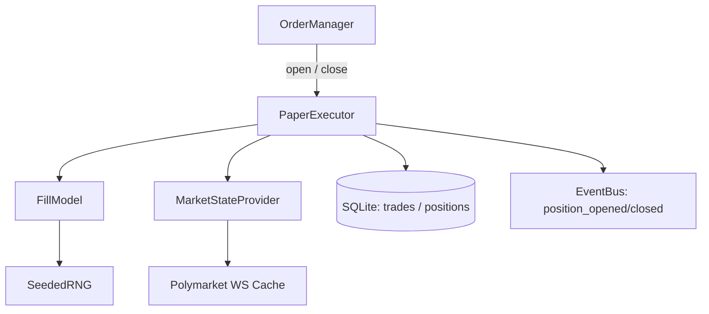
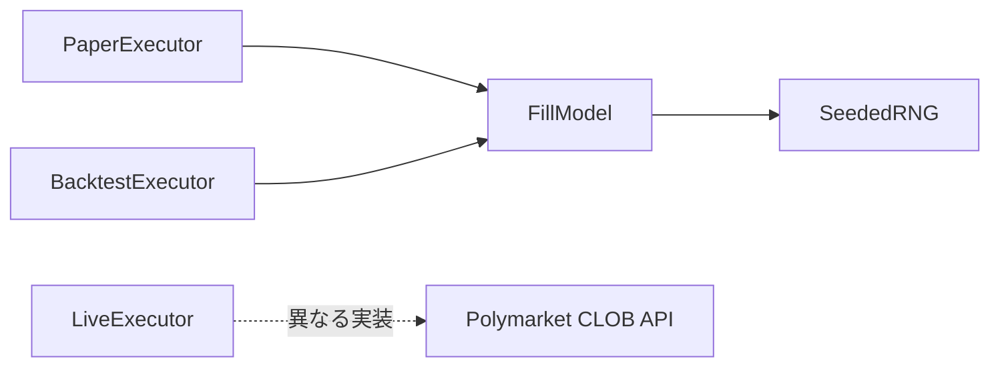

# 第13章 ペーパー約定エンジン

- **バージョン**: v1.0.2
- **作成日**: 2026-05-27
- **承認日**: 2026-05-27
- **ステータス**: APPROVED
- **ローリング更新 (v1.0.2)**: Polymarket CLOB 詳細の参照先を修正（`INDEX` ch21 は設定影響。CLOB は未執筆・章番号 TBD。→ [`PHASE1_M13_MIDPOINT_REVIEW.md`](./PHASE1_M13_MIDPOINT_REVIEW.md) §2.1）
- **関連章**: 3（状態遷移）, 6（シーケンス §6.3）, 10（関数・データモデル §10.3.4 / §10.7.6 / §10.7.7 / §10.7.8）, 11（戦略ロジック §11.6 / §11.8）, 12（モード仕様 §12.2 / §12.7）, 15（夜間レビュー）, 17（リスク管理）, 18（エラーコード）, 21（Polymarket CLOB クライアント詳細）
- **旧 ch14「Paper execution」を本章に統合**

## 13.1 目的・スコープ

### 13.1.1 目的

YoRuu のペーパー約定エンジン（`PaperExecutor`）の仕様を単一の真実（SSOT）として確定する。具体的には、擬似約定の価格決定アルゴリズム、スプレッド・スリッページ・遅延の数理モデル、`OpenRequest` / `CloseRequest` / `FillResult` のデータ構造、`BacktestExecutor` との共通化、`LiveExecutor` との対比、約定失敗ケースの取り扱いを規定し、PHASE 3 の `paper_executor.py` 実装を一意化する。

### 13.1.2 スコープ（含む）

- `PaperExecutor` のアーキテクチャと責務（§13.2）
- `FillModel`: スプレッド・スリッページ・約定遅延（§13.3）
- データ構造: `OpenRequest` / `CloseRequest` / `FillResult`（§13.4）
- `BacktestExecutor` との FillModel 共有（§13.5）
- `LiveExecutor` 概要と対比表（§13.6、CLOB 詳細は未執筆章 TBD）
- 約定価格決定アルゴリズム（§13.7）
- 約定失敗ケース（§13.8）
- ペーパー約定の現実性検証ポリシー（§13.9）
- 約定ログと監査（§13.10）

### 13.1.3 スコープ外

- Polymarket CLOB クライアント実装詳細（→ 未執筆章 TBD、`INDEX` ch21 は設定影響）
- 戦略アルゴリズム（→ 第11章）
- 取引履歴 UI（→ 第8章 §8.13）
- リスクガード（→ 第11章 §11.6, 第17章）
- バックテストフレームワーク全体（CLI / レポート出力等は別途）

### 13.1.4 設計原則

1. **モード非依存性**: `Executor` プロトコルで `PaperExecutor` / `LiveExecutor` / `BacktestExecutor` を等価に扱う
2. **FillModel 中心**: 擬似約定ロジックは `FillModel` に集約、PaperExecutor / BacktestExecutor は同じ FillModel を共有
3. **保守的優先**: スプレッド・スリッページは現実より悪く（保守的に）モデル化、PAPER の結果が LIVE より楽観的にならないことを保証
4. **観測可能性**: 全約定結果に擬似モデルのパラメータと中間計算値を含めログ化、PHASE 5 で実データと突合可能に
5. **決定論的**: 同じ入力（市場状態・乱数シード）に対し同じ結果を返す。バックテストの再現性を保証

## 13.2 PaperExecutor アーキテクチャ

### 13.2.1 全体構成



### 13.2.2 責務分離

| コンポーネント | 責務 |
|--------------|------|
| `PaperExecutor` | 約定リクエストのオーケストレーション、DB 書き込み、SSE 発火 |
| `FillModel` | スプレッド・スリッページ・約定遅延の数理計算 |
| `MarketStateProvider` | Polymarket オーダーブックの最新状態を提供（PAPER は WS キャッシュ、BACKTEST は履歴データ） |
| `SeededRNG` | 決定論的乱数生成（バックテスト再現性のため） |

### 13.2.3 Executor プロトコル

```python
class Executor(Protocol):
    def open(self, request: OpenRequest) -> FillResult: ...
    def close(self, request: CloseRequest) -> FillResult: ...
```

`PaperExecutor` / `LiveExecutor` / `BacktestExecutor` の 3 実装が同プロトコルに準拠。`OrderManager`（§10.7.3）は `Executor` を透過的に呼び出し、戻り値 `FillResult` を `OrderResult`（§10.7.3）にマッピングする。

### 13.2.4 PaperExecutor 内部実装

```python
class PaperExecutor:
    def __init__(
        self,
        db: Database,
        fill_model: FillModel,
        market_state: MarketStateProvider,
        event_bus: EventBus,
    ) -> None: ...

    def open(self, request: OpenRequest) -> FillResult:
        # 1. MarketStateProvider から最新オーダーブック取得
        # 2. FillModel.compute_open_fill() で約定価格決定
        # 3. 約定失敗判定（§13.8）
        # 4. positions テーブルに INSERT、trades テーブルに INSERT（status='OPEN'）
        # 5. position_opened SSE 発火
        # 6. FillResult 返却

    def close(self, request: CloseRequest) -> FillResult:
        # 1. positions から対象取得
        # 2. close_reason により分岐（満期 / 緊急 / その他）
        # 3. FillModel.compute_close_fill() で約定価格決定
        # 4. trades 更新（exit_price / pnl / win / closed_at / status='CLOSED'）
        # 5. positions から DELETE
        # 6. position_closed SSE 発火
        # 7. FillResult 返却
```

## 13.3 FillModel

### 13.3.1 役割

擬似約定の数理モデル本体。以下 3 要素を一元的にモデル化：

- **スプレッド**: ベストビッド / ベストアスクの差
- **スリッページ**: 注文サイズが市場価格に与える影響
- **約定遅延**: シグナル発生から約定までの時間ラグ（擬似）

### 13.3.2 パラメータ（既定値）

| パラメータ | 既定値 | 範囲 | 用途 |
|-----------|-------|------|------|
| `spread_assumed` | 0.02 | 0.01〜0.05 | スプレッド固定仮定（過去データで動的取得不可時） |
| `slippage_coeff` | 0.001 | 0.0〜0.01 | サイズあたりスリッページ係数（USD あたり） |
| `slippage_max` | 0.02 | 0.01〜0.05 | スリッページ上限 |
| `latency_ms` | 150 | 50〜500 | 約定遅延中央値（ms） |
| `latency_jitter_ms` | 50 | 0〜200 | 約定遅延ジッタ（ms、正規分布） |
| `rng_seed` | None | 任意整数 | 乱数シード（None で時刻ベース、BACKTEST では明示） |

パラメータは `yoruu.yaml` `paper.fill_model.*` で上書き可（v1.1 で正式露出、v1.0 は内部定数）。

### 13.3.3 スプレッドの扱い

- **PAPER モード**: Polymarket WS から取得した実ベストビッド / ベストアスクを使用
- **BACKTEST モード**: 過去データにスプレッド情報がないため `spread_assumed` を使用
- **ベストアスク取得失敗時**: `spread_assumed` フォールバック
- **YES / NO**: Polymarket では各 side が独立したオーダーブックを持つ。`MarketStateProvider` は `OpenRequest.side` に対応する side の `OrderBook` を返す（§13.7.1）

### 13.3.4 スリッページ計算

```
slippage = min(size_usd × slippage_coeff, slippage_max)
```

例: `size_usd = $10`, `slippage_coeff = 0.001` ⇒ `slippage = $10 × 0.001 = 0.01`、上限 `0.02` 未満なので採用。

スリッページは **対象 side の OrderBook** に対し、不利方向に適用する：

- **エントリー（買い）**: 当該 side の `best_ask` から購入 → `fill_price = best_ask + slippage`
- **決済・成行売り（売り）**: 当該 side の `best_bid` で売却 → `fill_price = best_bid − slippage`

YES / NO でオーダーブックは別。実装は常に `request.side`（またはポジションの `side`）に紐づく `OrderBook` を参照する。

### 13.3.5 約定遅延

`latency_ms + N(0, latency_jitter_ms)` で正規分布サンプリング、最小 0ms にクリップ。

- **PAPER モード**: 実時間で待機（`asyncio.sleep`）してから約定。市場価格は遅延後の最新値を再取得
- **BACKTEST モード**: 仮想時刻を進めるのみ（実時間待機なし）

遅延中に市場価格が動いた場合、遅延後の価格で約定（PAPER のみ）。BACKTEST では遅延後の価格を履歴データから取得。

### 13.3.6 主要関数シグネチャ

```python
class FillModel:
    def __init__(
        self,
        spread_assumed: float = 0.02,
        slippage_coeff: float = 0.001,
        slippage_max: float = 0.02,
        latency_ms: int = 150,
        latency_jitter_ms: int = 50,
        rng_seed: int | None = None,
    ) -> None: ...

    def compute_open_fill(
        self,
        book: OrderBook,
        request: OpenRequest,
        now: datetime,
    ) -> FillComputation: ...

    def compute_close_fill(
        self,
        book: OrderBook,
        position: PositionSnapshot,
        request: CloseRequest,
        now: datetime,
    ) -> FillComputation: ...

    def sample_latency(self) -> int:
        """遅延 ms をサンプリング"""

    def detect_liquidity_failure(
        self,
        book: OrderBook,
        side: Literal["YES", "NO"],
        size_usd: float,
    ) -> LiquidityCheck: ...
```

`FillComputation` は `fill_price`, `slippage_applied`, `spread_at_fill`, `latency_ms_used`, `success`, `failure_reason` を含む dataclass。

## 13.4 データ構造

### 13.4.1 OpenRequest

```python
@dataclass(frozen=True)
class OpenRequest:
    market: str                  # 例: "BTC_5MIN_UPDOWN"
    side: Literal["YES", "NO"]
    size_usd: float
    expected_price: float        # 評価時点の市場価格
    expires_at: datetime         # 満期時刻
    strategy_version: int
    markov_state_at_entry: str   # JSON 文字列（行列スナップショット）
    edge_at_entry: float
    persistence_at_entry: float
    predicted_prob: float
    requested_at: datetime
```

### 13.4.2 CloseRequest

```python
@dataclass(frozen=True)
class CloseRequest:
    position_id: int
    reason: CloseReason          # 後述
    requested_at: datetime
```

```python
class CloseReason(str, Enum):
    EXPIRATION = "EXPIRATION"      # 満期到達
    EMERGENCY_STOP = "EMERGENCY_STOP"  # 緊急停止からの強制クローズ
    MANUAL = "MANUAL"              # UI からの手動クローズ（PHASE 4 検討）
    SYSTEM_INVARIANT = "SYSTEM_INVARIANT"  # 内部不整合検出
```

### 13.4.3 FillResult

```python
@dataclass(frozen=True)
class FillResult:
    success: bool
    trade_id: int | None
    fill_price: float | None
    slippage_applied: float | None
    spread_at_fill: float | None
    latency_ms_used: int | None
    error: ErrorPayload | None
    raw_computation: FillComputation  # 監査・デバッグ用
```

### 13.4.4 OrderBook（補助型）

```python
@dataclass(frozen=True)
class OrderBook:
    market: str
    best_bid: float
    best_ask: float
    bid_size_usd: float
    ask_size_usd: float
    spread: float                # best_ask - best_bid
    captured_at: datetime
    source: Literal["WS", "BACKTEST_HISTORY", "FALLBACK"]
```

### 13.4.5 ErrorPayload（共通エラー型、§10.2.2 と整合）

```python
@dataclass(frozen=True)
class ErrorPayload:
    code: str               # 例: "E_FILL_001"
    message: str
    severity: Literal["INFO", "WARN", "ERROR"]
    details: dict
```

## 13.5 BacktestExecutor との共通化

### 13.5.1 共有設計



`FillModel` は PaperExecutor / BacktestExecutor で**同じインスタンスを使用**（または同じパラメータで生成）。これにより：

- BACKTEST 結果と PAPER 結果の比較が公正
- PHASE 5 で BACKTEST → PAPER の整合性検証が可能
- 戦略パラメータ感度分析（§11.10）が PAPER / BACKTEST 間で一貫

### 13.5.2 BacktestExecutor 実装

```python
class BacktestExecutor:
    def __init__(
        self,
        historical_loader: HistoricalLoader,
        fill_model: FillModel,
        strategy: StrategyConfig,
    ) -> None: ...

    def run(
        self,
        period: DateRange,
        parameters: dict[str, float] | None = None,
    ) -> BacktestResult:
        # 1. 履歴データロード
        # 2. 5分足クローズごとに以下を仮想実行：
        #    - MarkovEngine 更新
        #    - StrategyEvaluator 判定
        #    - エントリー成立時 FillModel.compute_open_fill()
        #    - 満期到達時 FillModel.compute_close_fill()
        # 3. 集計（§11.9.5 出力スキーマ）
```

### 13.5.3 BACKTEST の OrderBook

履歴データ（`data/historical/` または `price_ticks`）にはオーダーブックが含まれないため、以下で構築：

- `best_ask = mid_price + spread_assumed / 2`
- `best_bid = mid_price − spread_assumed / 2`
- `bid_size_usd / ask_size_usd = `（仮定値、既定 $100、§13.8 流動性判定に使用）

`mid_price` は Binance 価格と Polymarket の理論値から推定（PHASE 5 で再評価）。

### 13.5.4 仮想時刻の進行

BACKTEST では `now` を履歴データのタイムスタンプから算出。`FillModel.sample_latency()` 後の仮想時刻 = 5 分足クローズ時刻 + 遅延 ms。市場価格は仮想時刻直近の Binance 価格から再構築。

### 13.5.5 PAPER との差分まとめ

| 項目 | PAPER | BACKTEST |
|------|-------|---------|
| OrderBook ソース | Polymarket WS | 履歴 + spread_assumed |
| 時刻 | 実時刻 | 仮想時刻 |
| 遅延 | 実時間待機 | 仮想時刻進行 |
| RNG シード | 既定 None（時刻ベース） | 明示指定（再現性確保） |
| 流動性判定 | 実 ask_size | 仮定値 $100 |
| 結果格納 | `trades`（mode=PAPER） | `what_if_scenarios` または `data/backtest/` |

## 13.6 LiveExecutor との対比

### 13.6.1 対比表

| 項目 | PaperExecutor | LiveExecutor |
|------|--------------|-------------|
| 約定方式 | FillModel 擬似計算 | Polymarket CLOB 実注文 |
| 約定価格 | 擬似計算結果 | Polymarket 約定報告 |
| スリッページ | FillModel `slippage_coeff` で擬似 | 実市場の影響 |
| 遅延 | FillModel `latency_ms` で擬似 | 実ネットワーク遅延 |
| 約定失敗 | `detect_liquidity_failure` で判定 | Polymarket API の失敗応答 |
| 実資金 | なし | あり |
| キャンセル | 即時（DB 更新のみ） | Polymarket CLOB API でキャンセル |
| 残高同期 | `bot_state.balance` 内部 | Polymarket API から 5 分ごと同期 |
| エラーコード | `E_FILL_*` | `E_LIVE_*` + `E_FILL_*` 共通 |

### 13.6.2 LiveExecutor シグネチャ（概要）

```python
class LiveExecutor:
    def __init__(
        self,
        polymarket: PolymarketClient,
        db: Database,
        event_bus: EventBus,
    ) -> None: ...

    def open(self, request: OpenRequest) -> FillResult: ...
    def close(self, request: CloseRequest) -> FillResult: ...
```

詳細は Polymarket CLOB 専用章（**章番号 TBD**、M1.5 で `INDEX` 確定予定）で規定。本章ではプロトコル準拠と対比のみ。暫定 API 契約は §10.7.7 `LiveExecutor` を参照。

### 13.6.3 LIVE 約定失敗時のフォールバック

LIVE では Polymarket API の失敗応答（流動性不足・タイムアウト・残高不足等）を `FillResult.success = False` で返す。リトライ戦略は CLOB 詳細章（TBD）で規定（既定: 流動性不足は 1 回リトライ、残高不足はリトライなし）。

## 13.7 約定価格決定アルゴリズム

### 13.7.1 エントリー（open）の手順

```
入力: OpenRequest (side, size_usd, expected_price)
       OrderBook = MarketStateProvider.get_book(request.side)  # YES/NO それぞれ独立

1. 流動性チェック（§13.8.1）
   if not has_sufficient_liquidity:
       return FillResult(success=False, error=E_FILL_001)

2. スプレッドチェック（§13.8.2）
   if spread > 0.05:
       return FillResult(success=False, error=E_FILL_002)

3. ベース価格決定（エントリー = 当該 side のアスクから買い）
   base_price = book.best_ask

4. スリッページ計算
   slippage = min(size_usd × slippage_coeff, slippage_max)

5. 約定価格
   fill_price = base_price + slippage

6. 価格上限チェック
   if fill_price > 0.99:  # バイナリ確率上限
       return FillResult(success=False, error=E_FILL_003)

7. 遅延適用
   latency_ms = sample_latency()
   await sleep(latency_ms)  # PAPER のみ実待機
   # 遅延後のオーダーブック再取得 → ステップ 1 から再評価（最大 1 回リトライ）

8. trades / positions INSERT
9. position_opened SSE 発火
10. FillResult 返却
```

### 13.7.2 決済（close）の手順

```
入力: CloseRequest (position_id, reason)

1. positions から取得 → 取得失敗時 E_FILL_010
2. reason により分岐:

   case EXPIRATION:
       # Polymarket が自動決済（1.00 or 0.00）
       # ボット側は決済結果を受信して反映
       fill_price = 1.0 if position.side won else 0.0
       (PAPER では Binance の満期時刻価格から勝敗判定)

   case EMERGENCY_STOP:
       # 成行クローズ
       if side == "YES":
           base_price = best_bid  # 売り
       else:
           base_price = best_bid
       slippage = min(size_usd × slippage_coeff, slippage_max)
       fill_price = base_price - slippage
       if fill_price < 0.01:
           fill_price = 0.01  # 下限

   case MANUAL / SYSTEM_INVARIANT:
       # 緊急クローズと同等

3. pnl 計算
   pnl = (fill_price - entry_price) × size_usd / entry_price
   # ※ Polymarket シェア単位の P&L 計算は §13.7.3 で詳述

4. trades 更新（exit_price / pnl / win / closed_at / status='CLOSED'）
5. positions DELETE
6. position_closed SSE 発火
7. FillResult 返却
```

### 13.7.3 P&L 計算の詳細

Polymarket バイナリは「1 USDC で 1 シェア（満期に 0 or 1 で決済）」。エントリー時のシェア数：

```
shares = size_usd / entry_price
```

決済時の P&L：

```
pnl = shares × (exit_price - entry_price)
    = (size_usd / entry_price) × (exit_price - entry_price)
```

例: `entry_price = 0.62`, `size_usd = $7.10`, `exit_price = 1.00` ⇒
- `shares = 7.10 / 0.62 ≈ 11.45`
- `pnl = 11.45 × (1.00 - 0.62) = 11.45 × 0.38 ≈ $4.35`

`win = 1` if `pnl > 0` else `0`（満期決済時、緊急クローズも同様）。

### 13.7.4 価格境界の扱い

- `fill_price` は `[0.01, 0.99]` にクリップ
- バイナリ確率の理論上下限（0 / 1）は実約定では使用不可（流動性ゼロ）
- 境界到達時は `E_FILL_003` または `E_FILL_004` を発火

## 13.8 約定失敗ケース

### 13.8.1 流動性不足（`E_FILL_001`）

```python
def detect_liquidity_failure(
    book: OrderBook,
    side: Literal["YES", "NO"],
    size_usd: float,
) -> LiquidityCheck:
    # book は side に対応するオーダーブック（§13.3.3）
    if book.ask_size_usd < size_usd:
        return LiquidityCheck(ok=False, reason="ask_size_insufficient")
    return LiquidityCheck(ok=True, reason=None)
```

- アラート `W_MARKET_001` 発火
- `wait_reason = "liquidity"` で次サイクル待機
- PAPER / LIVE 共通、BACKTEST は仮定値 $100 のため通常発生しない

### 13.8.2 スプレッド過大（`E_FILL_002`）

- `book.spread > 0.05` で発火
- 第11章 §11.5.3 と同期
- `wait_reason = "liquidity"` で待機（流動性関連として統一）

### 13.8.3 価格境界違反（`E_FILL_003` / `E_FILL_004`）

- `fill_price > 0.99` ⇒ `E_FILL_003`（買い過熱）
- `fill_price < 0.01` ⇒ `E_FILL_004`（極端な逆張り検出）
- アラート発火、PAPER は仮想損失なしで待機

### 13.8.4 オーダーブック取得失敗（`E_FILL_005`）

- Polymarket WS キャッシュが古い（10 秒以上更新なし）
- `OrderBook.source = "FALLBACK"` で `spread_assumed` を使用するが、その場合も `WARN` レベルでログ記録
- 30 秒以上更新なしで `E_FILL_005` 発火、エントリー禁止

### 13.8.5 ポジション不在（`E_FILL_010`）

- `close()` 呼び出し時、`positions` テーブルに対象 `position_id` が存在しない
- 内部不整合として `severity = ERROR`、`audit_log` に `result=FAILURE` で記録

### 13.8.6 リトライ戦略

| エラー | リトライ | 備考 |
|-------|---------|------|
| `E_FILL_001` 流動性不足 | しない（次サイクル待機） | wait_reason=liquidity |
| `E_FILL_002` スプレッド過大 | しない | 同上 |
| `E_FILL_003`/`E_FILL_004` 境界 | しない | 戦略見直し対象 |
| `E_FILL_005` オーダーブック取得失敗 | 3 回（1s 間隔） | 最終失敗で ERROR 状態 |
| `E_FILL_010` ポジション不在 | しない | 即時不整合報告 |

LIVE 固有エラー（タイムアウト・残高不足）は CLOB 詳細章（TBD）で規定。

### 13.8.7 失敗時の状態への影響

| 失敗種別 | 状態遷移 |
|---------|---------|
| `E_FILL_001` / `E_FILL_002` | 状態維持（`TRADING` のまま） |
| `E_FILL_003` / `E_FILL_004` | 状態維持 + WARN アラート |
| `E_FILL_005`（最終失敗） | `TRADING` → `ERROR` |
| `E_FILL_010` | 状態維持 + ERROR アラート + 内部監査 |

## 13.9 ペーパー約定の現実性検証ポリシー

### 13.9.1 検証の目的

PAPER で得られた P&L が LIVE で再現可能かを検証し、戦略の信頼性を担保する。「PAPER で勝つが LIVE で負ける」現象を防ぐ。

### 13.9.2 保守的モデルの原則

FillModel の既定値は **現実より悪く** 設定：

- `spread_assumed = 0.02`（実観測 0.01〜0.03 の上位寄り）
- `slippage_coeff = 0.001`（実観測の中央値より厳しめ）
- `latency_ms = 150`（実観測 80〜120 ms の上位寄り）

これにより、PAPER が LIVE より楽観的になるリスクを抑制。

### 13.9.3 PHASE 5 / 6 の検証手順

| フェーズ | 検証内容 |
|---------|---------|
| PHASE 5 | BACKTEST と PAPER の整合: 同期間で BACKTEST → PAPER を実行、結果差分が ±5% 以内 |
| PHASE 6 | PAPER と LIVE の整合: SIMMER 14 日 → LIVE 7 日、勝率差 ±5%、P&L 差 ±10% 以内 |
| PHASE 7 | 継続検証: 毎月 SIMMER / LIVE の差分を `daily_reports` に記録 |

### 13.9.4 検証失敗時の対応

差分が許容範囲外の場合：

1. FillModel パラメータの再校正（`spread_assumed` / `slippage_coeff` / `latency_ms`）
2. 必要に応じて `slippage` の数理モデルを変更（線形 → 平方根スケーリング等、v1.1 検討）
3. 戦略パラメータ（`MIN_EDGE` / `KELLY_FRACTION`）の見直し

### 13.9.5 検証データの記録

- 全約定の `FillComputation` を `trades` テーブルに格納（既存カラム拡張または `details_json` 追加、v1.0.4 候補）
- PHASE 3 着手時に `trades` スキーマ拡張を判断（§10.3.4 への v1.0.4 追補候補）

## 13.10 約定ログと監査

### 13.10.1 約定ログの記録先

| ログ | 記録先 | 内容 |
|-----|-------|------|
| 約定成功 | `trades` テーブル | 第10章 §10.3.4 全カラム |
| 約定失敗 | `audit_log` テーブル | `action="paper_fill"`, `result="FAILURE"` |
| FillComputation 詳細 | `trades.details_json`（v1.0.4 候補） or アプリログ | スリッページ・遅延・スプレッドの中間値 |
| アラート | `alerts` テーブル | `E_FILL_*` / `W_MARKET_*` |

### 13.10.2 監査要件

- 全約定（成功・失敗問わず）について `audit_log` に 1 行記録
- `actor = "SYSTEM"`, `action = "paper_fill"` または `"paper_close"`
- `resource = "trade"`, `resource_id = trade_id`（成功時）または `null`（失敗時）
- `result = "SUCCESS" / "FAILURE"`, `details_json` に FillComputation 全フィールド

### 13.10.3 ログレベル

| イベント | ログレベル |
|---------|----------|
| 約定成功 | INFO |
| 流動性不足・スプレッド過大 | WARN |
| 価格境界・オーダーブック失敗 | ERROR |
| ポジション不在 | ERROR + 即時アラート発火 |
| FillComputation 詳細 | DEBUG（既定オフ、PHASE 5 検証時に ON） |

### 13.10.4 ログローテーション

`yoruu.yaml` `logging.rotate_mb` / `logging.retain_days` に従う（§10.4.2）。約定ログ単独の別ファイル化は v1.1 検討。

## 13.11 章間相互参照表

| 本章節 | 参照先 | 内容 |
|-------|--------|------|
| §13.2.3 Executor プロトコル | §10.7.6 / §10.7.7 / §10.7.8 | 3 実装シグネチャ |
| §13.3 FillModel | 第11章 §11.9.4 | What-If のスプレッド固定 0.02 と同期 |
| §13.3.2 パラメータ | §10.4.2 | `yoruu.yaml` 露出は v1.1 |
| §13.4 データ構造 | §10.3.4 / §10.3.5 | DB スキーマ整合 |
| §13.5 BacktestExecutor | 第3章 §3.3 / 第11章 §11.9 / 第12章 §12.8.4 | 状態機械外・What-If 計算・格納先 |
| §13.6 LiveExecutor | CLOB 章（TBD）/ §10.7.7 | Polymarket CLOB 実装詳細 |
| §13.7.3 P&L 計算 | §10.3.4 `trades.pnl` | DB 整合 |
| §13.8 失敗ケース | 第18章 | エラーコード `E_FILL_*` |
| §13.8.1 流動性 | 第11章 §11.5.3 / §11.7.2 | wait_reason=liquidity |
| §13.9 検証ポリシー | PHASE 5 / 6 ロードマップ | 00_ROADMAP との同期 |
| §13.10 監査 | §10.3.12 `audit_log` | 全約定記録 |

## 13.12 品質チェック

### 13.12.1 章末チェックリスト

- [x] §13.1 目的・スコープ明示（含む／含まない両方）
- [x] §13.1.4 設計原則 5 項目明示
- [x] §13.2 全体アーキテクチャ図 Mermaid 閉じる
- [x] §13.2.3 Executor プロトコル定義
- [x] §13.3 FillModel パラメータ 6 件揃う（既定値・範囲・用途）
- [x] §13.3.4 スリッページ式と方向別適用ルール
- [x] §13.3.5 遅延の PAPER / BACKTEST 差異明示
- [x] §13.4 OpenRequest / CloseRequest / FillResult / OrderBook / ErrorPayload 全揃う
- [x] §13.4.2 CloseReason 4 種類
- [x] §13.5 BacktestExecutor との FillModel 共有
- [x] §13.5.5 PAPER vs BACKTEST 差分表
- [x] §13.6 LiveExecutor 対比表 9 項目以上
- [x] §13.7.1 / §13.7.2 約定価格決定手順（open / close）
- [x] §13.7.3 P&L 計算式と例
- [x] §13.7.4 価格境界 [0.01, 0.99] クリップ
- [x] §13.8 失敗ケース 5 種類 + リトライ表
- [x] §13.9 保守的モデル原則と PHASE 5/6 検証手順
- [x] §13.10 監査要件と `audit_log` 連携
- [x] §13.11 相互参照表が新章番号で整合
- [x] Mermaid コードフェンス全て閉じている

### 13.12.2 一次レビュー観点（7 項目）

| # | 観点 | 判定 |
|---|------|------|
| 1 | PaperExecutor アーキテクチャ（§13.2）・Executor プロトコル準拠 | ✅ 合格 |
| 2 | FillModel 既定値と保守的原則（§13.3.2 / §13.9.2） | ✅ 合格 |
| 3 | データ構造と DB スキーマ（§13.4 / §10.3.4 / §10.3.5） | ✅ 合格 |
| 4 | BacktestExecutor との FillModel 共有・再現性（§13.5） | ✅ 合格 |
| 5 | LiveExecutor 対比・第21章伏線（§13.6） | ✅ 合格 |
| 6 | 約定価格・P&L と Polymarket バイナリ（§13.7） | ✅ 合格 |
| 7 | 失敗ケースと wait_reason / 状態遷移（§13.8） | ✅ 合格 |

**一次レビュー**: 2026-05-27、マスター承認（配置パッチ `76a9a5d` / `0ea6df1` 含む）。

### 13.12.3 既知の未確定事項

- §13.3.2 FillModel パラメータの `yoruu.yaml` 露出は v1.1 検討（現状は内部定数）
- §13.5.3 BACKTEST の `mid_price` 推定方法（Binance + Polymarket 理論値）は PHASE 5 で再評価
- §13.7.2 EXPIRATION 時の勝敗判定（PAPER は Binance 満期時刻価格、LIVE は Polymarket 自動決済）の境界条件は PHASE 5 でテスト
- §13.9.4 スリッページ数理モデル（線形 → 平方根スケーリング）は v1.1 検討
- §13.10.1 `trades.details_json` / `shares` カラム追加（**v1.0.4 候補、PHASE 3 着手時に判断**。ch10 への追補は設計章 APPROVED と切り離す）

### 13.12.4 PHASE 引き継ぎ

- **PHASE 2（UI モック）**: §13.7.3 P&L 計算例を `mock-data.js` に使用、§13.8 失敗ケースのアラート表示を §8.17 に反映
- **PHASE 3（コア実装）**: §13.2 / §13.3 / §13.4 / §13.7 / §13.8 を `paper_executor.py` / `fill_model.py` / `backtest_executor.py` に実装
- **PHASE 4（UI 実装）**: 約定結果表示（§8.13 取引履歴）に FillComputation の中間値を含める検討
- **PHASE 5（統合テスト）**: §13.9.3 BACKTEST↔PAPER 整合テスト、§13.8 全失敗ケースの分岐テスト
- **PHASE 6（ペーパー運用）**: §13.9.3 PAPER↔LIVE 整合検証、FillModel パラメータ初回校正
- **PHASE 7（段階移行）**: §13.9.3 継続検証、`daily_reports` への記録
