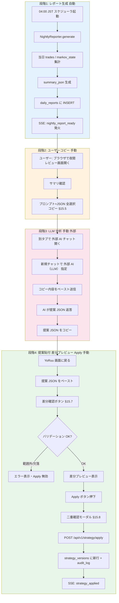
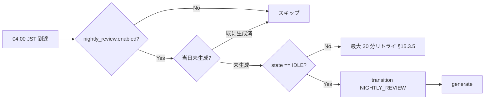
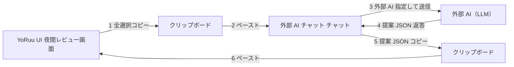
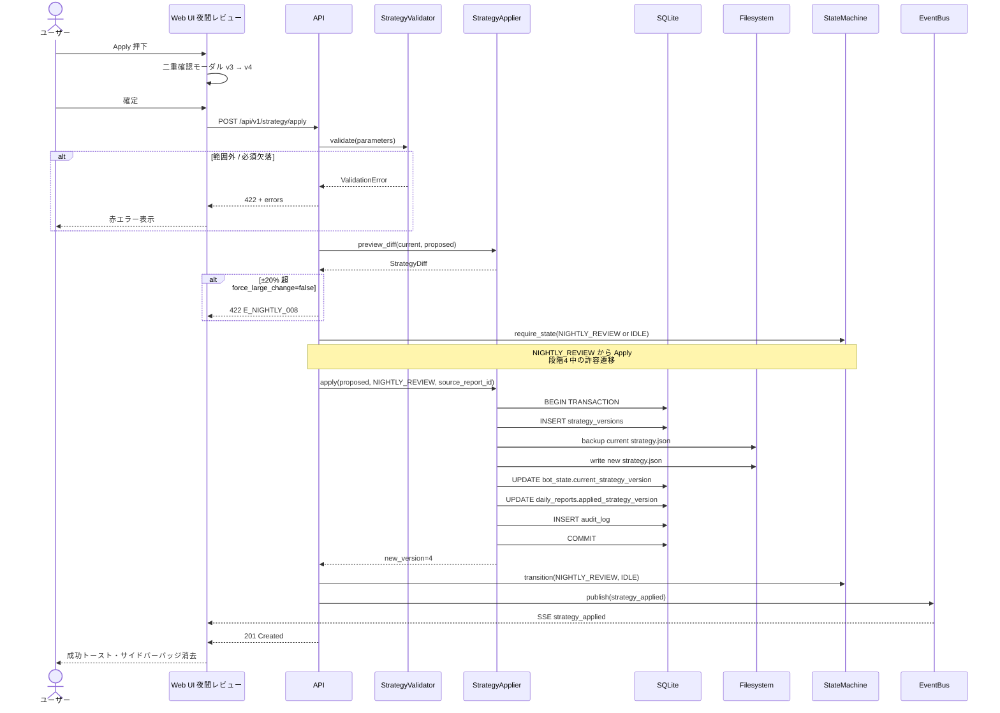

# 第15章 夜間レビューフロー

- **バージョン**: v1.0.2
- **作成日**: 2026-05-27
- **承認日**: 2026-05-27
- **最終更新**: 2026-05-28（v1.0.2: `W_NIGHTLY_001` → `E_NIGHTLY_008`、ch18 §18.3.4 整合）
- **ステータス**: APPROVED
- **関連章**: 1（概要）, 3（状態遷移）, 6（シーケンス §6.4 / §6.5）, 8（UI §8.14）, 9（フロー §9.6）, 10（API・スキーマ §10.3.10 / §10.4.1 / §10.6.4 / §10.6.8）, 11（戦略パラメータ §11.4 / §11.10）, 12（モード §12.4 / §12.4.3）, 17（リスクマトリクス）, 18（エラーコード）, 20（監査ログ）, 21（設定影響）

---

## 15.1 目的・スコープ

### 15.1.1 目的

YoRuu の **夜間自己学習ループ**（ch1 §1.2）の手順を SSOT として確定する。具体的には:

1. 04:00 JST に Bot が当日の取引を集計し、構造化レポート（JSON）を生成する
2. ユーザーが当該 JSON を **手動で** 利用する **外部 AI（チャット等）** に投入し、戦略パラメータの改善提案を JSON として受け取る
3. 提案 JSON を UI（§8.14）に貼付し、差分プレビュー → 二重承認 → Apply で `strategy.json` を更新する
4. 全工程を `daily_reports` / `strategy_versions` / `audit_log` に永続化し、ロールバック可能な状態を保つ

本章は **ch9 §9.6（ユーザー操作の SSOT）** および **ch8 §8.14（UI の SSOT）** とは役割が異なる:

| 章 | 役割 |
|---|---|
| ch8 §8.14 | 画面要素・i18n キー・SSE バインド（**UI SSOT**） |
| ch9 §9.6 | ユーザー視点の操作手順・エラー分岐（**フロー SSOT**） |
| **ch15（本章）** | **データ契約・タイミング・Apply 処理・LLM 連携手順の SSOT** |

UI レイアウトの変更は ch8 で行い、本章は変更しない。逆に JSON スキーマや Apply バリデーションの変更は本章を更新し、ch8 / ch9 から参照させる。

### 15.1.2 スコープ（含む）

- レポート生成のタイミング・条件・状態遷移（§15.3）
- レポート JSON スキーマの完全定義（§15.4）
- 人手 LLM 連携の手順とプロンプト雛形（§15.5）
- 提案 JSON の許容スキーマ・禁止キー（§15.6）
- 差分プレビュー仕様と Apply 活性条件（§15.7）
- Apply 処理の検証・永続化・ロールバック準備（§15.8）
- 失敗ケースとエラーコード候補（§15.10）

### 15.1.3 スコープ外

| 項目 | 担当章 |
|---|---|
| LLM API の自動呼び出し（YoRuu 本体から 外部 LLM API を直接叩く実装） | **将来機能（PHASE 7 以降）。本章では明示的に禁止** |
| Telegram / Slack 等の通知連携 | v1.1 以降検討（§15.9） |
| 提案 JSON の文面ロジック（AI 側プロンプト工夫） | ユーザー責任、本章は雛形のみ提供 |
| 戦略アルゴリズム本体（Markov / Kelly） | ch11 |
| HTML 実装・JavaScript | PHASE 2 / PHASE 4 |
| 監査ログのスキーマ詳細 | ch20（本章は書込項目のみ規定） |
| エラーコードの確定文言 | ch18（本章は `E_NIGHTLY_*` 候補列挙のみ） |

### 15.1.4 設計原則（5 項目）

| # | 原則 | 内容 |
|---|------|------|
| 1 | **安全性優先** | LLM が不適切な提案を返しても、Apply 前の二重検証（範囲・必須キー・変化率）で阻止できる。LLM 単独で `strategy.json` を書き換える経路は **存在しない** |
| 2 | **人間 in the loop** | レポート → LLM → 提案 → 差分確認 → Apply の各段階に **必ず人間の操作** が挟まる。自動化は §15.3 のレポート生成のみ |
| 3 | **検証付き Apply** | 提案 JSON は `StrategyValidator`（ch10 §10.11.1）で範囲チェック → `StrategyApplier.preview_diff`（ch10 §10.10.2）で差分生成 → Apply API で再検証、の 3 段検証を経る |
| 4 | **監査可能性** | 生成・LLM 送付（手動マーク）・提案受領・Apply・ロールバックの全イベントを `audit_log` と `daily_reports.proposed_strategy_json` に永続化し、いつ何を AI から受け取ったか後から追える |
| 5 | **ロールバック可能** | Apply 後 24 時間は直前バージョンを `strategy_versions` から即時呼び出せる（§15.8.5）。ロールバックも新バージョンとして履歴に残す（破壊的変更なし） |

これらは **トレードオフ**として「完全自動化の利便性」を犠牲にして「事故時の説明可能性と取り返し可能性」を取る、という判断である（ch1 §1.2 の合意）。

---

## 15.2 夜間レビュー全体フロー

### 15.2.1 4 段階フロー図



*図 15-1: 夜間レビュー全体フロー（4 段階）*

### 15.2.2 章間の役割分担（再掲）

| 段階 | 自動/手動 | 外部依存 | 主要 SSOT |
|------|-----------|----------|-----------|
| 1. レポート生成 | 自動（スケジューラ） | DB のみ | **本章 §15.3 / §15.4**、ch10 §10.3.10 |
| 2. ユーザーコピー | 手動（コピペ） | ブラウザ | ch8 §8.14, ch9 §9.6.3 ステップ G |
| 3. LLM 分析 | 手動 | 外部 AI チャット + 外部 AI | **本章 §15.5**（YoRuu 本体は関与しない） |
| 4. 貼付・Apply | 手動 | DB + ファイル書込 | **本章 §15.6〜§15.8**、ch6 §6.5、ch10 §10.6.4、ch8 §8.14.8 |

**設計判断**: 段階 3（LLM 連携）を YoRuu 本体から完全に切り離す理由は、(1) 本番 API キーをサーバーに置かないことで漏洩リスクを下げる、(2) AI 出力のレートリミットや失敗を YoRuu 内のリトライ機構で扱わずに済む、(3) ユーザーが AI 出力を「読んで判断する」プロセスを構造的に強制できる、の 3 点。

---

## 15.3 レポート生成タイミングと条件

### 15.3.1 既定スケジュール

| 項目 | 既定値 | 設定キー |
|------|--------|----------|
| 生成時刻 | **04:00 Asia/Tokyo** | `nightly_review.send_time`（ch10 §10.4.2） |
| タイムゾーン | Asia/Tokyo | `nightly_review.timezone` |
| 機能有効化 | `true` | `nightly_review.enabled` |
| 取引停止オプション | `true` | `nightly_review.pause_trading_during_review`（§15.3.4） |

設定変更は即時反映（ch10 §10.4.3、ch9 §9.9）。次回スケジュールが新しい時刻で再計算される。

### 15.3.2 状態遷移との関係

レポート生成中は `bot_state.state = NIGHTLY_REVIEW`（ch10 §10.3.3、ch12 §12.4）に遷移する。`NIGHTLY_REVIEW` 中は以下が拒否される:

- モード切替（`POST /mode/switch` → **409 Conflict**、ch12 §12.5.2.2）
- 戦略 Apply / Rollback（自分自身の Apply は段階 4 で `IDLE` に戻ってから実行、§15.8.2）
- 設定変更のうち `mode` / `market.*` 等の再起動必須キー（ch10 §10.4.3）

> **`[要確認: ch3]`**: ch3 §3.1 では `GENERATING_REPORT` / `AWAITING_APPLY` / `APPLYING_STRATEGY` の 3 つの細分状態が定義されており、ch10 / ch12 の `NIGHTLY_REVIEW`（単一状態）と整合していない。本章は **ch10 §10.3.3 を SSOT** として採用するが、ch3 を更新するか、ch3 の細分状態を内部実装上のサブフェーズとして保持するかは PHASE 1 終了前のレビューで確定すること。本章は単一状態 `NIGHTLY_REVIEW` を前提に記述する。

### 15.3.3 起動条件

スケジューラは送付時刻ヒット時に以下を全てチェックする:



| 条件 | チェック内容 | 違反時動作 |
|------|--------------|-----------|
| `nightly_review.enabled = true` | yoruu.yaml | スキップ・ログのみ |
| 当日未生成 | `daily_reports.report_date` UNIQUE | スキップ・ログのみ |
| `state == IDLE` | `bot_state` | リトライ（§15.3.5） |
| `mode != BACKTEST` | `bot_state.mode` | スキップ（ch3 §3.7、BACKTEST 中は無効化推奨） |

### 15.3.4 取引停止オプション

`pause_trading_during_review = true`（既定）の場合、`NIGHTLY_REVIEW` 状態中は `IDLE → TRADING` 遷移が抑制される。生成自体は数秒〜数十秒（ch6 §6.4）で完了するため通常は影響しないが、04:00 JST 直後の 5 分窓は実質スキップされる可能性がある。

`false` の場合は生成と並行して取引判定を実行するが、Apply 待機中（§15.8 完了まで）も `IDLE` に戻り取引を継続する点に注意。**設計判断**: 既定 `true` を採用。夜間の流動性低下と AI 解析中の人間判断を考えると、年単位で見て取引機会の損失より「Apply タイミングの予測可能性」が勝る。

### 15.3.5 生成失敗時の扱い

| 失敗パターン | 動作 | エラーコード候補 |
|--------------|------|-----------------|
| `state != IDLE` で送付時刻ヒット | 5 分間隔で最大 6 回（30 分）リトライ。全失敗時は当日スキップしアラート発火 | `E_NIGHTLY_001`（§15.10） |
| DB 集計エラー（読込失敗） | リトライなし、`audit_log` に `result=FAILURE`、アラート発火、状態は `IDLE` に戻す | `E_NIGHTLY_002` |
| `daily_reports` への INSERT 失敗（ディスク full 等） | リトライなし、CRITICAL アラート、`ERROR` 状態へ | `E_NIGHTLY_003`（ch18 で `E_DB_*` への移譲を検討） |
| `summary_json` 生成中の例外 | リトライなし、`audit_log` 記録、`IDLE` 復帰、SSE は発火しない | `E_NIGHTLY_004` |

リトライ上限超過後はその日の自動生成を諦め、ユーザーは手動再実行 API（`POST /api/v1/reports/regenerate`、§15.10.5）で当日分を再生成できる。

---

## 15.4 レポート JSON スキーマ（完全版）

### 15.4.1 SSOT 宣言

`daily_reports.summary_json`（ch10 §10.3.10）の中身は **本章 §15.4 が SSOT** である。ch10 はテーブル定義を持つが JSON の内部スキーマは規定しない。

### 15.4.2 トップレベル構造

```json
{
  "schema_version": "1.0",
  "report_date": "2026-05-27",
  "generated_at": "2026-05-28T04:00:12+09:00",
  "mode": "PAPER",
  "current_strategy": { /* §15.4.3 */ },
  "performance": { /* §15.4.4 */ },
  "markov_snapshot": { /* §15.4.5 */ },
  "trade_breakdown": { /* §15.4.6 */ },
  "constraints": { /* §15.4.7 */ },
  "notes": []
}
```

| キー | 型 | 必須 | 内容 |
|------|----|------|------|
| `schema_version` | string | ✓ | 本章スキーマのバージョン。破壊的変更時に bump |
| `report_date` | string (YYYY-MM-DD, JST) | ✓ | 集計対象日。`daily_reports.report_date` と一致 |
| `generated_at` | string (ISO 8601, +09:00) | ✓ | 生成時刻 |
| `mode` | enum | ✓ | `PAPER` / `SIMMER` / `LIVE`。BACKTEST はレポート生成しない |
| `current_strategy` | object | ✓ | 集計時点の `strategy.json`（§10.4.1 完全版） |
| `performance` | object | ✓ | 当日パフォーマンス（§15.4.4） |
| `markov_snapshot` | object | ✓ | 当日終盤の Markov 状態（§15.4.5） |
| `trade_breakdown` | object | ✓ | 取引明細サマリ（§15.4.6） |
| `constraints` | object | ✓ | パラメータ範囲制約（§15.4.7、AI への明示用に再掲） |
| `notes` | array<string> | – | 自動付加メモ（取引数 0、WS 切断発生等） |

### 15.4.3 `current_strategy`

ch10 §10.4.1 の `strategy.json` 全体を **そのまま埋め込む**:

```json
"current_strategy": {
  "version": 3,
  "parameters": {
    "MIN_PROB": 0.87,
    "MIN_EDGE": 0.06,
    "KELLY_FRACTION": 0.65,
    "PERSISTENCE_THRESHOLD": 0.72
  },
  "metadata": {
    "applied_at": "2026-05-26T04:15:00+09:00",
    "applied_by": "NIGHTLY_REVIEW",
    "previous_version": 2
  }
}
```

`constraints` フィールドは `current_strategy` 内ではなくトップレベル `constraints`（§15.4.7）に分離する。AI が「現在値」と「許容範囲」を独立に読み取りやすくするため。

### 15.4.4 `performance`

```json
"performance": {
  "trades_total": 23,
  "trades_win": 14,
  "trades_loss": 9,
  "trades_expired": 0,
  "win_rate": 0.6087,
  "pnl_usd": 8.42,
  "pnl_pct": 0.81,
  "balance_start_usd": 1033.76,
  "balance_end_usd": 1042.18,
  "max_drawdown_usd": -3.50,
  "avg_edge_at_entry": 0.071,
  "avg_persistence_at_entry": 0.74,
  "by_state": {
    "TRADING": { "count": 23, "win": 14 },
    "MONITORING_POSITION": { "count": 23, "win": 14 }
  }
}
```

| キー | 型 | 計算ソース |
|------|----|-----------|
| `trades_total` | int | `SELECT COUNT(*) FROM trades WHERE date(opened_at,'localtime')=:date AND mode=:mode` |
| `trades_win` / `trades_loss` | int | `WHERE win=1` / `WHERE win=0` |
| `trades_expired` | int | `WHERE status='EXPIRED'` |
| `win_rate` | float (0〜1) | `trades_win / (trades_win + trades_loss)`、分母 0 時は `null` |
| `pnl_usd` | float | `SUM(pnl)` |
| `pnl_pct` | float | `pnl_usd / balance_start_usd × 100` |
| `max_drawdown_usd` | float | 当日 PnL カーブの最低点 - ピーク |
| `avg_edge_at_entry` / `avg_persistence_at_entry` | float | `AVG(edge_at_entry)` / `AVG(persistence_at_entry)` |

`trades_total = 0` の場合は `win_rate`, `avg_*` を `null` とし、`notes` に `"no_trades_today"` を付加する。

### 15.4.5 `markov_snapshot`

```json
"markov_snapshot": {
  "computed_at": "2026-05-28T03:55:00+09:00",
  "window_size": 20,
  "matrix": {
    "p_up_up": 0.578,
    "p_up_down": 0.422,
    "p_down_up": 0.388,
    "p_down_down": 0.612
  },
  "rolling_persistence": 0.578,
  "last_direction": "UP",
  "history_summary": {
    "avg_persistence_24h": 0.62,
    "min_persistence_24h": 0.51,
    "max_persistence_24h": 0.78
  }
}
```

`markov_state` テーブル（ch10 §10.3.6）の最新行 + 過去 24 時間の集計。窓幅 / Persistence 算出は ch11 §11.4。

### 15.4.6 `trade_breakdown`

```json
"trade_breakdown": {
  "by_side": {
    "YES": { "count": 12, "win": 8, "pnl_usd": 5.10 },
    "NO":  { "count": 11, "win": 6, "pnl_usd": 3.32 }
  },
  "by_hour_jst": {
    "09": { "count": 3, "win": 2 },
    "10": { "count": 5, "win": 3 }
  },
  "wait_reason_distribution": {
    "persistence": 142,
    "edge": 38,
    "prob": 17,
    "liquidity": 4,
    "risk_budget": 0
  }
}
```

`wait_reason_distribution` は当日の `evaluator.evaluate()` で `should_enter=false` だった回数を `wait_reason`（ch10 §10.7.4 / §10.5.3 `markov_update`）別に集計。AI が「どのゲートで弾かれているか」を把握しやすくするため。

### 15.4.7 `constraints`

```json
"constraints": {
  "MIN_PROB": { "min": 0.80, "max": 0.95, "default": 0.87 },
  "MIN_EDGE": { "min": 0.03, "max": 0.15, "default": 0.06 },
  "KELLY_FRACTION": { "min": 0.10, "max": 1.00, "default": 0.65 },
  "PERSISTENCE_THRESHOLD": { "min": 0.50, "max": 0.90, "default": 0.70 }
}
```

ch10 §10.4.1 / ch11 §11.10 と完全一致。AI に「この範囲外を提案するな」と明示的に制約として渡す目的。**ch10 / ch11 を更新した場合は本フィールドも自動的に追従するよう、`NightlyReporter.generate()` 実装時にハードコードせず `StrategyConfig.constraints` から読み込むこと**（ch10 §10.11.4）。

### 15.4.8 マスク済み完全サンプル

```json
{
  "schema_version": "1.0",
  "report_date": "2026-05-27",
  "generated_at": "2026-05-28T04:00:12+09:00",
  "mode": "PAPER",
  "current_strategy": {
    "version": 3,
    "parameters": {
      "MIN_PROB": 0.87,
      "MIN_EDGE": 0.06,
      "KELLY_FRACTION": 0.65,
      "PERSISTENCE_THRESHOLD": 0.72
    },
    "metadata": {
      "applied_at": "2026-05-26T04:15:00+09:00",
      "applied_by": "NIGHTLY_REVIEW",
      "previous_version": 2
    }
  },
  "performance": {
    "trades_total": 23,
    "trades_win": 14,
    "trades_loss": 9,
    "trades_expired": 0,
    "win_rate": 0.6087,
    "pnl_usd": 8.42,
    "pnl_pct": 0.81,
    "balance_start_usd": 1033.76,
    "balance_end_usd": 1042.18,
    "max_drawdown_usd": -3.50,
    "avg_edge_at_entry": 0.071,
    "avg_persistence_at_entry": 0.74,
    "by_state": {
      "TRADING": { "count": 23, "win": 14 },
      "MONITORING_POSITION": { "count": 23, "win": 14 }
    }
  },
  "markov_snapshot": {
    "computed_at": "2026-05-28T03:55:00+09:00",
    "window_size": 20,
    "matrix": {
      "p_up_up": 0.578, "p_up_down": 0.422,
      "p_down_up": 0.388, "p_down_down": 0.612
    },
    "rolling_persistence": 0.578,
    "last_direction": "UP",
    "history_summary": {
      "avg_persistence_24h": 0.62,
      "min_persistence_24h": 0.51,
      "max_persistence_24h": 0.78
    }
  },
  "trade_breakdown": {
    "by_side": {
      "YES": { "count": 12, "win": 8, "pnl_usd": 5.10 },
      "NO":  { "count": 11, "win": 6, "pnl_usd": 3.32 }
    },
    "by_hour_jst": {
      "09": { "count": 3, "win": 2 },
      "10": { "count": 5, "win": 3 }
    },
    "wait_reason_distribution": {
      "persistence": 142, "edge": 38, "prob": 17,
      "liquidity": 4, "risk_budget": 0
    }
  },
  "constraints": {
    "MIN_PROB": { "min": 0.80, "max": 0.95, "default": 0.87 },
    "MIN_EDGE": { "min": 0.03, "max": 0.15, "default": 0.06 },
    "KELLY_FRACTION": { "min": 0.10, "max": 1.00, "default": 0.65 },
    "PERSISTENCE_THRESHOLD": { "min": 0.50, "max": 0.90, "default": 0.70 }
  },
  "notes": []
}
```

サンプルは `lab.local` 環境想定の値であり、実勘定の値ではない。

---

## 15.5 LLM 連携手順（人手）

### 15.5.1 想定経路



YoRuu 本体から外部 API への発信は **発生しない**。外部 AI チャット / 各 AI サービス側のレートリミット・障害は YoRuu の責務外。

### 15.5.2 プロンプト雛形

UI（§8.14、`action.copy_all`）が以下を 1 つのテキストブロックとしてクリップボードに格納する:

````text
あなたは Polymarket BTC 5 分 Up/Down 予測 Bot YoRuu の戦略チューナーです。
以下の日次レポートを読み、Markov + Kelly 戦略のパラメータを微調整してください。

# 制約
- 出力は JSON のみ。説明文・前置きは不要
- 提案できるキーは MIN_PROB / MIN_EDGE / KELLY_FRACTION / PERSISTENCE_THRESHOLD の 4 つのみ
- 各値は report.constraints の min / max 範囲内に収めること
- 現行値からの変化率は ±20% 以内を推奨（±10% 超は警告対象、±20% 超は原則拒否される）
- 取引数が 20 件未満の日は変更幅を半分以下に抑え、重大変更は避ける
- 必ず 4 キー全てを含めること（変更不要なキーは現行値をそのまま記載）

# 出力フォーマット
{
  "parameters": {
    "MIN_PROB": <float>,
    "MIN_EDGE": <float>,
    "KELLY_FRACTION": <float>,
    "PERSISTENCE_THRESHOLD": <float>
  },
  "rationale": "<日本語 200 字以内、変更理由の要約>"
}

# 日次レポート
<ここに §15.4 の JSON 全体が挿入される>
````

**設計判断**: `rationale` を必須にして提案根拠を `daily_reports.proposed_strategy_json.rationale` に保存する（後日「v4 を Apply した時 AI は何と言っていたか」を監査可能にする）。

### 15.5.3 ユーザー操作手順

1. `nightly_report_ready` SSE 受信 → サイドバー「未消化」バッジ表示（ch9 §9.6.3 ステップ B-C）
2. ユーザーが夜間レビュー画面を開く → 「📋 全選択コピー」押下（ch8 §8.14.7、§15.5.2 のプロンプトがコピーされる）
3. 別タブで 外部 AI チャット を開く → モデルピッカーで **外部 AI（LLM）（Thinking 可）** を選択
4. 新規チャットを作成し、ペースト → 送信
5. 数十秒〜数分で提案 JSON が返る（応答時間は 外部 AI チャット / 各 AI サービス側に依存）
6. 提案 JSON 部分のみをコピー（説明文が混入していたら手動で除去 or 「JSON のみ再出力」と再依頼）
7. YoRuu 画面に戻り `nightly.paste_area` にペースト → 「差分確認」押下（§15.7）

### 15.5.4 OPSEC 規律

| 項目 | 規律 |
|------|------|
| 本番 API キー | 外部 AI チャット チャットに **絶対に貼らない**（雛形に含まれない設計）。万一漏洩リスクを下げるため、レポート JSON にはキー名すら含まない |
| 実 URL / IP | レポート JSON には `polymarket_url` / `binance_url` 等の本番エンドポイントを含めない（§15.4 のスキーマは含まない設計） |
| 残高情報 | `balance_*_usd` は USD 額のみで通貨単位以上の口座識別子を含めない |
| AI 出力に含まれる文 | `rationale` を **そのまま `audit_log` に保存** する。日本語以外（プロンプトインジェクション目的の文字列等）が来た場合は §15.10.4 の検知に該当 |
| ローカル保存 | 段階 3 のクリップボードペーストは OS のクリップボードを経由する。マルチユーザー環境では個別に注意（YoRuu の前提は単一ユーザー、ch5） |

---

## 15.6 提案 JSON 仕様

### 15.6.1 スキーマ定義

`POST /api/v1/strategy/apply`（ch10 §10.6.4）のリクエストボディに使用する **`strategy.json` の部分版**。許容キーは `parameters` の 4 つと付帯情報のみ:

```json
{
  "parameters": {
    "MIN_PROB": 0.89,
    "MIN_EDGE": 0.06,
    "KELLY_FRACTION": 0.65,
    "PERSISTENCE_THRESHOLD": 0.74
  },
  "rationale": "勝率 60.9%、avg_persistence 0.74 と高水準のため MIN_PROB を 0.87→0.89 に微増。他は維持。",
  "applied_by": "NIGHTLY_REVIEW",
  "source_report_id": 7
}
```

### 15.6.2 許容キー一覧

| キー | 型 | 必須 | 制約 |
|------|----|------|------|
| `parameters.MIN_PROB` | float | ✓ | 0.80 ≤ x ≤ 0.95（ch10 §10.4.1） |
| `parameters.MIN_EDGE` | float | ✓ | 0.03 ≤ x ≤ 0.15 |
| `parameters.KELLY_FRACTION` | float | ✓ | 0.10 ≤ x ≤ 1.00 |
| `parameters.PERSISTENCE_THRESHOLD` | float | ✓ | 0.50 ≤ x ≤ 0.90 |
| `rationale` | string | ✓ | 1〜500 文字、`audit_log.details_json.rationale` に保存 |
| `applied_by` | enum | ✓ | `NIGHTLY_REVIEW` 固定（夜間経路）。手動 UI Apply 時は `USER` |
| `source_report_id` | int | – | `daily_reports.id`。指定時は `proposed_strategy_json` に保存 |

### 15.6.3 禁止キー

以下は提案 JSON に含まれていても **無視 or 422 エラー** とする:

| キー | 理由 | 動作 |
|------|------|------|
| `version` | サーバー側で AUTOINCREMENT 採番。ユーザー指定不可 | サイレント無視 |
| `metadata.*` | サーバー側で生成（applied_at / previous_version 等） | サイレント無視 |
| `constraints.*` | 範囲制約はシステム定義（変更は別 API で v1.x 検討） | **422 `E_NIGHTLY_005`** |
| `mode` / `risk.*` / `websocket.*` | 即時危険・別エンドポイント（`POST /api/v1/settings`、ch10 §10.6.10）| **422 `E_NIGHTLY_006`** |
| `daily_loss_limit_usd` 等 yoruu.yaml 由来キー | 戦略パラメータではない | **422 `E_NIGHTLY_006`** |

**設計判断**: `constraints` 変更を Apply API で受けないのは、AI が「制約を緩めれば提案可能」と判断して制約自体を書き換える攻撃を防ぐため。範囲拡張が必要な場合は人間がコードレビュー込みで `02-coding-style` の手順で更新する。

### 15.6.4 部分 Apply の禁止

`parameters` の 4 キーは **全て必須**。3 つだけ提案して 1 つを「省略 = 現行値維持」と解釈する設計は採らない:

- 理由 1: Apply 時の差分が「省略によるもの」か「明示的な維持」か曖昧になる
- 理由 2: AI が一部キーを忘れた時にサイレントに進行するリスク
- 理由 3: 監査ログの `proposed_strategy_json` で「AI が何を提案したか」が完全に再現できなくなる

代替: §15.5.2 の雛形で「変更不要なキーは現行値をそのまま記載」と明示している。

---

## 15.7 差分プレビュー仕様

### 15.7.1 エンドポイント

`POST /api/v1/reports/{id}/preview-apply`（ch10 §10.6.8）。リクエストは §15.6.1 の提案 JSON。レスポンスは差分構造:

```json
{
  "ok": true,
  "data": {
    "current_version": 3,
    "diff": [
      {
        "key": "MIN_PROB",
        "old": 0.87,
        "new": 0.89,
        "delta": 0.02,
        "delta_pct": 2.30,
        "in_range": true,
        "warn_large_change": false
      },
      {
        "key": "MIN_EDGE",
        "old": 0.06,
        "new": 0.06,
        "delta": 0.0,
        "delta_pct": 0.0,
        "in_range": true,
        "warn_large_change": false,
        "unchanged": true
      },
      {
        "key": "KELLY_FRACTION",
        "old": 0.65,
        "new": 0.65,
        "delta": 0.0,
        "delta_pct": 0.0,
        "in_range": true,
        "warn_large_change": false,
        "unchanged": true
      },
      {
        "key": "PERSISTENCE_THRESHOLD",
        "old": 0.72,
        "new": 0.74,
        "delta": 0.02,
        "delta_pct": 2.78,
        "in_range": true,
        "warn_large_change": false
      }
    ],
    "apply_enabled": true,
    "warnings": [],
    "errors": []
  }
}
```

### 15.7.2 表示仕様（ch8 §8.14 と同期）

| 項目 | 表示 |
|------|------|
| `unchanged: true` | グレーアウト「変更なし」 |
| `in_range: false` | 赤背景、`errors[]` に `E_NIGHTLY_007`（範囲外） |
| `warn_large_change: true`（変化率 ±10% 超） | 黄背景、`warnings[]` に `E_NIGHTLY_008`（severity=WARN）、Apply は **活性のまま**（ユーザー判断） |
| 変化率 ±20% 超 | 赤背景、`errors[]` に `E_NIGHTLY_008`（severity=ERROR）、Apply 無効（強制承認パスは v1.1 で検討） |
| 必須キー欠落 | エラー、`errors[]` に `E_NIGHTLY_009`、Apply 無効 |

ch9 §9.6.5 のエラー分岐表と一致させる。Apply 活性条件は `apply_enabled = (errors.length === 0)`。

### 15.7.3 `wait_reason` リスクとの関係

差分プレビューは戦略パラメータの値変更のみを扱う。`wait_reason`（ch10 §10.5.3）や ch11 のリスク制御パラメータには **触れない**:

- `wait_reason_distribution` はレポート §15.4.6 で参照情報として表示するのみ
- `daily_loss_limit_usd` 等のリスク設定は `POST /api/v1/settings` 経由（ch10 §10.6.10、ch9 §9.9）
- ch17 の総合リスクマトリクスとの相互作用は ch17 で規定

**理由**: 夜間レビュー経路で扱うのは「戦略パラメータ 4 つ」に絞り、責任境界を明確化する。`daily_loss_limit_usd` 等の安全関連は別 UI / 別認可フローを通す（手数を増やすことで誤操作リスクを下げる）。

### 15.7.4 Apply ボタン活性条件

ch8 §8.14.5 と同期:

```
apply_enabled = (
  errors.length === 0
  AND parameters の 4 キーが全て存在
  AND 全キーが in_range
  AND 全キーが ±20% 以内
)
```

±10% 超の警告（`E_NIGHTLY_008`、severity=WARN）は **活性を阻害しない**。同一コードで ±20% 超は `errors[]`（severity=ERROR）— ch18 §18.3.4、`ApplyValidator`（`f499778`）と一致。理由: 本質的な変更幅をブロックしないが、ユーザーに視覚的注意を促す。

---

## 15.8 Apply 処理

### 15.8.1 エンドポイント

`POST /api/v1/strategy/apply`（ch10 §10.6.4）。リクエストは §15.6.1 の提案 JSON。

### 15.8.2 処理シーケンス



*図 15-2: Apply 処理シーケンス*

### 15.8.3 バリデーション 3 段

| # | 段階 | 担当 | 失敗時 |
|---|------|------|--------|
| 1 | UI 側事前検証 | フロント JS（ch8 §8.14.5） | 即時赤表示・送信抑制 |
| 2 | API 入口検証 | `StrategyValidator.validate()`（ch10 §10.11.1） | **422** + `errors[]` |
| 3 | トランザクション内最終検証 | `StrategyApplier.apply()` 内で再 validate | **500** + ロールバック（書込前） |

二重・三重に見えるが、(1) UI バイパス攻撃の阻止、(2) 並行 Apply 時の race（極低確率だが排他ロックで解決、§15.8.6）の保険として全段必須。

### 15.8.4 データ書込内容

#### `strategy_versions` 新規行（ch10 §10.3.9）

```sql
INSERT INTO strategy_versions (
  parameters_json,
  applied_at,
  applied_by,
  performance_summary_json
) VALUES (
  '{"version":4,"parameters":{...},"metadata":{...}}',
  '2026-05-28T04:25:13+09:00',
  'NIGHTLY_REVIEW',
  '{"source_report_id":7,"rationale":"...","previous_version":3}'
);
```

`applied_by='NIGHTLY_REVIEW'` で起源を識別。`performance_summary_json` には AI の `rationale` と `source_report_id` を保存。

#### `daily_reports` 更新

```sql
UPDATE daily_reports SET
  proposed_strategy_json = :proposed_full_json,
  applied_strategy_version = 4
WHERE id = 7;
```

`proposed_strategy_json` は §15.6.1 のリクエストボディ全体（rationale 含む）。後日「AI は何を提案して、Apply されたか」を 1 行で参照可能。

#### `audit_log` 書込（ch10 §10.3.12、ch20）

```json
{
  "ts": "2026-05-28T04:25:13+09:00",
  "actor": "NIGHTLY_REVIEW",
  "action": "strategy_apply",
  "resource": "strategy_versions",
  "resource_id": "4",
  "details_json": {
    "previous_version": 3,
    "new_version": 4,
    "source_report_id": 7,
    "diff": [{"key":"MIN_PROB","old":0.87,"new":0.89}, ...],
    "rationale": "勝率 60.9%、avg_persistence 0.74 と高水準のため..."
  },
  "result": "SUCCESS"
}
```

#### ファイルシステム書込

| 操作 | パス |
|------|------|
| バックアップ | `data/strategy_history/<YYYY-MM-DD>_<HHMMSS>_v3.json` |
| 新ファイル | `config/strategy.json`（atomic write: 一時ファイル + rename） |

atomic rename により書込中の中断時に旧ファイルが残る。失敗時は §15.8.6 の挙動。

### 15.8.5 ロールバック準備

Apply 直後 24 時間は直前バージョン（v3）が `data/strategy_history/` に残り、ユーザーは:

```http
POST /api/v1/strategy/rollback
{ "target_version": 3, "reason": "v4 で勝率低下" }
```

で v5 として v3 のパラメータを再適用できる（ch10 §10.6.4）。ロールバックも `applied_by='ROLLBACK'` で `strategy_versions` に新行が追加され、破壊的削除は発生しない。24 時間内に複数回ロールバックすると `confirm_repeated: true` が要求される（連続ロールバックの暴走を防ぐ）。

### 15.8.6 失敗ケースとトランザクション

| 失敗箇所 | 動作 |
|----------|------|
| `INSERT strategy_versions` 失敗 | `ROLLBACK`、ファイル書込なし、500 + `E_NIGHTLY_010` |
| バックアップ書込失敗 | `ROLLBACK`、`strategy.json` 触れず、500 + `E_NIGHTLY_011` |
| `strategy.json` 書込失敗（rename 後） | DB は COMMIT 済 → 矛盾。**復旧手順**: 起動時整合性チェックで `bot_state.current_strategy_version` と `strategy.json` の `version` を照合し、不一致なら `strategy_versions` から再生成（ch20 / 起動時整合性検査） |
| `audit_log` INSERT 失敗 | `ROLLBACK`、500 + `E_NIGHTLY_012`。監査が取れない Apply は許可しない |
| 並行 Apply（同時 2 リクエスト） | 排他ロック（`SELECT ... FOR UPDATE` 相当 or アプリ層 mutex）で 2 つ目を 409 + `E_NIGHTLY_013` |

### 15.8.7 SSE 通知

成功時 `strategy_applied` を発火（ch10 §10.5.2、§10.5.3）:

```
event: strategy_applied
data: {"new_version":4,"previous_version":3,"applied_by":"NIGHTLY_REVIEW","diff":{"MIN_PROB":[0.87,0.89],"PERSISTENCE_THRESHOLD":[0.72,0.74]}}
```

UI はこれを受けてサイドバー「未消化」バッジを消去し、ヘッダの「v3 → v4」表示を更新する（ch8 §8.14.10、ch9 §9.6.3 ステップ AC-AD）。

---

## 15.9 月次・週次サマリ

v1.0 では **概要のみ規定**。実装は **v1.1 で検討**。

### 15.9.1 想定要件（参考）

| 項目 | 内容 |
|------|------|
| 週次サマリ | 月曜 04:00 JST に過去 7 日の `daily_reports` を集計 |
| 月次サマリ | 月初 04:00 JST に過去月の集計 |
| 集計内容（案） | 累積 PnL、週次/月次勝率、Apply 履歴、ロールバック発生回数、`wait_reason` 推移 |
| 配信 | Telegram / メール（v1.1 で外部通知導入時） |

v1.0 で実装しない理由: (1) 日次データ 30 日分が貯まるまで集計の妥当性検証が困難、(2) Telegram 等の外部通知は OPSEC レビュー（ch7-security-coding 相当）が必要で本マイルストーンの範疇を超える。

### 15.9.2 v1.0 で残す布石

- `daily_reports` テーブルは永続保持（ch10 §10.12.1）。30 日経過後も削除しない
- `summary_json.schema_version` を持たせ、v1.1 で集計クエリ側からスキーマ進化に対応可能にする
- `audit_log` に `action='strategy_apply'` の検索インデックスがあるため、Apply 頻度集計は v1.1 でクエリのみで実装可能

---

## 15.10 失敗ケース

### 15.10.1 段階別失敗マトリクス

| 段階 | 失敗 | 検知 | ユーザーへの表示 | エラーコード候補 |
|------|------|------|------------------|------------------|
| 1 生成 | スケジューラ起動時 `state != IDLE` | `NightlyReporter` | アラートタブ警告、自動再試行 | `E_NIGHTLY_001` |
| 1 生成 | DB 集計エラー | 例外 | アラート ERROR | `E_NIGHTLY_002` |
| 1 生成 | `daily_reports` INSERT 失敗 | DB エラー | CRITICAL アラート、`ERROR` 状態 | `E_NIGHTLY_003` |
| 1 生成 | summary_json 生成例外 | 例外 | アラート ERROR、`IDLE` 復帰 | `E_NIGHTLY_004` |
| 3 LLM | AI 応答異常（JSON 不正） | UI バリデーション | ペーストエリア赤エラー | – （UI 側のみ、`E_NIGHTLY_007` で兼ねる） |
| 3 LLM | AI 応答に説明文混入 | UI 側 JSON.parse 失敗 | 「JSON のみ抽出してください」 | – |
| 4 提案 | `constraints` 等の禁止キー含有 | API 422 | エラー詳細表示 | `E_NIGHTLY_005` / `E_NIGHTLY_006` |
| 4 差分 | 範囲外 | API 422 | 該当キー赤表示 | `E_NIGHTLY_007` |
| 4 差分 | ±20% 超 | API 422 | 強制承認不可 | `E_NIGHTLY_008` |
| 4 差分 | 必須キー欠落 | API 422 | 不足キー名表示 | `E_NIGHTLY_009` |
| 4 Apply | DB トランザクション失敗 | API 500 | 「再試行してください」 | `E_NIGHTLY_010` |
| 4 Apply | バックアップ失敗 | API 500 | 同上 | `E_NIGHTLY_011` |
| 4 Apply | audit_log INSERT 失敗 | API 500 | 「監査ログ書込失敗」 | `E_NIGHTLY_012` |
| 4 Apply | 並行 Apply | API 409 | 「他の Apply が進行中」 | `E_NIGHTLY_013` |
| 4 状態 | `NIGHTLY_REVIEW` 中の他操作（モード切替等） | API 409 | 「夜間レビュー中」 | `E_MODE_002` 等 ch12 §12.5.2.2 |

### 15.10.2 LLM 応答異常の対処

| 症状 | 対処 |
|------|------|
| JSON 構文エラー | UI 側 `JSON.parse` で検知 → ペーストエリア下に行番号付き赤エラー（ch9 §9.6.5）。AI に「JSON のみ再出力」と依頼 |
| 必須キー不足 | バリデーションエラー → §15.10.1 `E_NIGHTLY_009` |
| 範囲外値 | バリデーションエラー → `E_NIGHTLY_007`。AI に範囲を再提示して再依頼（プロンプト雛形の `constraints` を強調） |
| プロンプトインジェクション疑い | `rationale` に明らかに無関係な文字列（実 URL、コマンド片）が混入。**Apply 前に人間が目視チェック**（自動検知は v1.1 検討）。OPSEC 観点で `audit_log` には保存するが、ユーザーは Apply を取りやめる判断を取れる |

### 15.10.3 状態不整合

`NIGHTLY_REVIEW` 中に以下が要求された場合:

| 要求 | 応答 | エラーコード |
|------|------|--------------|
| `POST /api/v1/mode/switch` | **409** | `E_MODE_002`（ch12 §12.5.2.2） |
| `POST /api/v1/strategy/apply`（自分自身は許可、§15.8.2） | 200 / 201 | – |
| `POST /api/v1/strategy/rollback` | **409** | `E_NIGHTLY_014`（候補、ch18 確定） |
| `POST /api/v1/emergency/stop` | **200**（緊急停止は常に優先、ch9 §9.8、ch10 §10.6.6） | – |
| `POST /api/v1/settings`（再起動必須キー） | **409** | `E_SETTINGS_*`（ch10 §10.4.3、ch21） |

緊急停止のみ `NIGHTLY_REVIEW` を上書き可能（安全性優先、ch9 §9.8 と整合）。

### 15.10.4 監査・通知

全失敗ケースは:

1. `audit_log` に `result IN ('FAILURE','PARTIAL')` で記録
2. `alerts` テーブルに対応 severity（`E_*` は ERROR、`W_*` は WARN）で記録
3. `alert_added` SSE で UI 通知

ユーザーは `GET /api/v1/alerts?severity=ERROR` で当日の失敗を一覧化できる（ch10 §10.6.7）。

### 15.10.5 手動再生成

スケジュール失敗で当日レポートが未生成の場合、ユーザーは UI から手動再生成できる（**v1.0 では仕様確定のみ、エンドポイント実装は PHASE 3**）:

```http
POST /api/v1/reports/regenerate
{ "report_date": "2026-05-27" }
```

- 既に存在する場合は **409**（誤上書き防止、上書きには `force: true` 要）
- `state != IDLE` の場合は **409**

このエンドポイントは ch10 §10.6.8 に未掲載のため、ch10 v1.1 で追記する（**`[要確認: ch10]`**）。

### 15.10.6 エラーコード確定の責任

本章の `E_NIGHTLY_001` 〜 `E_NIGHTLY_014` は **候補**。最終確定は ch18（エラーハンドリング）。`E_DB_*` / `E_STATE_*` 等の既存系列に統合される可能性もある。本章は意味論を SSOT として保持し、コード番号のみ ch18 で再採番される想定。

---

## 15.11 章間相互参照表

| 本章節 | 参照先 | 内容 |
|--------|--------|------|
| §15.1 設計原則 | ch1 §1.2 | 夜間自己学習ループの基本合意（手動 LLM） |
| §15.3.2 状態 | ch3 §3.1, ch10 §10.3.3, ch12 §12.4 | `NIGHTLY_REVIEW` 状態（ch3 とは差異あり、§15.3.2 注記） |
| §15.3.2 409 整合 | ch12 §12.5.2.2 | モード切替拒否 |
| §15.3.5 失敗 | ch18 | エラーコード確定 |
| §15.4 JSON スキーマ | ch10 §10.3.10 | `daily_reports.summary_json` の中身 SSOT |
| §15.4.3 current_strategy | ch10 §10.4.1 | strategy.json 完全スキーマ |
| §15.4.4 performance | ch10 §10.3.4 trades | 集計クエリ |
| §15.4.5 markov | ch10 §10.3.6 markov_state, ch11 §11.4 | Markov 状態 |
| §15.4.6 wait_reason | ch10 §10.5.3, ch10 §10.7.4, ch11 §11.7.2 | wait_reason 列挙値 |
| §15.4.7 constraints | ch10 §10.4.1, ch11 §11.10 | パラメータ範囲 |
| §15.5 LLM 連携 | ch9 §9.6.3 | ユーザー操作手順 |
| §15.5.4 OPSEC | ch5 §5.2 | 信頼境界、SSH トンネル |
| §15.6 提案 JSON | ch10 §10.6.4 | `POST /strategy/apply` |
| §15.7 差分 | ch8 §8.14.5, ch9 §9.6.6 | UI 表示・警告 |
| §15.7 wait_reason | ch11, ch17 | リスク制御は別経路 |
| §15.8 Apply | ch6 §6.5, ch10 §10.6.4, ch10 §10.10.2, ch10 §10.11.1 | Apply シーケンス・関数 |
| §15.8.4 audit_log | ch10 §10.3.12, ch20 | 監査ログ |
| §15.8.5 ロールバック | ch10 §10.6.4 strategy/rollback | 24 時間内連続検出 |
| §15.10 失敗 | ch18 | エラーコード確定 |
| §15.10.3 緊急停止優先 | ch9 §9.8, ch10 §10.6.6 | 非対称設計 |

---

## 15.12 品質チェック

### 15.12.1 章末チェックリスト

- [x] §15.1 目的・スコープ明示（含む 7 件 / 含まない 7 件）
- [x] §15.1.4 設計原則 5 項目を箇条書き
- [x] §15.2 全体フロー Mermaid 4 段階で描画
- [x] §15.2.2 ch8 §8.14 / ch9 §9.6 / 本章の役割分担表
- [x] §15.3 04:00 JST 既定、`NIGHTLY_REVIEW` 状態、ch3 との差異を `[要確認: ch3]` でフラグ
- [x] §15.3.5 失敗時の最大 30 分リトライ規定
- [x] §15.4 レポート JSON 7 セクション全て型・必須・サンプル付き
- [x] §15.4.7 `constraints` が ch10 §10.4.1 / ch11 §11.10 と一致
- [x] §15.4.8 完全サンプル JSON（マスク済）
- [x] §15.5 プロンプト雛形を本文に含む（コピペ可能）
- [x] §15.5.4 OPSEC 規律（本番 API キー禁止等）
- [x] §15.6 提案 JSON の許容キー / 禁止キー対比表
- [x] §15.6.4 部分 Apply 禁止の根拠 3 項目
- [x] §15.7 差分プレビュー JSON 例、Apply 活性条件
- [x] §15.7.3 wait_reason / リスクパラメータは触れない明記
- [x] §15.8 Apply シーケンス Mermaid + 3 段バリデーション
- [x] §15.8.4 `strategy_versions` / `daily_reports` / `audit_log` / FS 書込内容
- [x] §15.8.5 ロールバック 24 時間規定
- [x] §15.8.6 トランザクション失敗マトリクス
- [x] §15.9 v1.1 検討の明記
- [x] §15.10 失敗マトリクス + `E_NIGHTLY_*` 候補列挙
- [x] §15.10.3 緊急停止が `NIGHTLY_REVIEW` を上書き可能
- [x] §15.11 相互参照表（ch3, 8, 9, 10, 11, 12, 17, 18, 20）
- [x] Mermaid フェンス全て閉じている
- [x] 用語（`NIGHTLY_REVIEW`, `applied_by`, `wait_reason` 等）が ch10 と一致

### 15.12.2 一次レビュー観点（7 項目）

| # | 観点 | 判定 |
|---|------|------|
| 1 | ch3 細分状態と `NIGHTLY_REVIEW` 単一状態（§15.3.2） | ✅ 合格（ch10/ch12 を SSOT、ch3 は v1.0.1 ローリング） |
| 2 | `summary_json` データ契約（§15.4） | ✅ 合格 |
| 3 | LLM 手動連携・プロンプト雛形（§15.5） | ✅ 合格 |
| 4 | Apply 安全性・±10%/±20%（§15.7.4） | ✅ 合格 |
| 5 | トランザクション失敗マトリクス（§15.8.6） | ✅ 合格（ch20 着手時に後方リンク） |
| 6 | `E_NIGHTLY_*` 候補（§15.10.1） | ✅ 合格（ch18 で確定） |
| 7 | ch8/ch9/本章の役割分担（§15.2.2） | ✅ 合格（UI=ch8、フロー=ch9、契約=本章） |

**一次レビュー**: 2026-05-27、マスター承認（配置 `e2c75a9`、承認 `5212e3a`）。

### 15.12.3 既知の未確定事項

| 項目 | 状態 | 確定先 |
|------|------|--------|
| ch3 細分状態と本章 `NIGHTLY_REVIEW` の統合 | `[要確認: ch3]` | ch3 v1.0.1 ローリング |
| `POST /api/v1/reports/regenerate` の ch10 §10.6.8 への追記 | `[要確認: ch10]` | ch10 v1.1 |
| `E_NIGHTLY_*` の最終番号 | 候補のみ | ch18 |
| プロンプトインジェクション自動検知 | 人間目視のみ | v1.1 |
| 月次・週次サマリの集計クエリ | 概要のみ | v1.1 |
| Telegram / メール通知 | スコープ外 | v1.1（OPSEC レビュー後） |
| `±20%` 強制承認パスの可否 | 不在 | v1.1 検討 |
| 完全自動 LLM 連携 | 明示的禁止 | PHASE 7 以降 |

### 15.12.4 PHASE 引き継ぎ

- **PHASE 2（UI モック）**: §15.4.8 の完全サンプル JSON を `mock-data.js` に固定値として埋め込み、`03_nightly_review.html` のサマリ・差分プレビューをモック描画
- **PHASE 3（コア実装）**:
  - `NightlyReporter.generate()`（ch10 §10.10.1）を §15.4 スキーマで実装
  - `StrategyApplier.apply()`（ch10 §10.10.2）を §15.8.2 シーケンスで実装
  - スケジューラ統合（§15.3.3 起動条件）
  - `POST /api/v1/reports/regenerate` 実装
- **PHASE 4（UI 実装）**:
  - §15.5.2 プロンプト雛形のクリップボード格納実装
  - §15.6.1 提案 JSON の `JSON.parse` + UI バリデーション
  - §15.7.1 差分プレビュー API 呼び出しと §15.7.2 表示
  - §15.10.2 `JSON.parse` エラーの行番号表示
- **PHASE 5（統合テスト）**:
  - §15.10.1 失敗マトリクス全項目をテストケース化
  - §15.8.6 「DB COMMIT 後の FS 書込失敗」を整合性検査テストで検証
  - §15.7.4 ±10% / ±20% 境界値テスト

---
