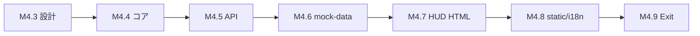

# PHASE 4 ロードマップ改訂草案（案 Z）

**日付**: 2026-05-28  
**ステータス**: DRAFT — マスター承認待ち（確認事項 **D** のみ未決）  
**前提**: M4.1〜M4.2 ✅（`dea96e0` / `02edfa0`）、PHASE 3 コード Exit ✅

---

## ゴール再定義

参照画像（Hermes 型 HUD）相当の **単一画面体験** を、**元本概念（A-2/B-2）** を正しく扱う形で実現する。

---

## 現行 `00_ROADMAP.md` との関係（確認事項 C = 回答済み）

| 観点 | 実態 |
|------|------|
| 進捗表 | M4.1 SSE ✅、M4.2 静的 UI ✅、次は旧文言の「M4.3 REST」 |
| 旧 M4.1〜M4.5 表 | PHASE 2 モック分割の名残。**本改訂で M4.3〜M4.9 に置換** |
| PHASE 3 残 | lab 24h → **PHASE 5 送り**（HUD 完成後に観察セット） |
| ch10 severity | **M4.3 設計追補に統合** |

承認後: `00_ROADMAP.md` PHASE 4 節を本草案で差し替え。

---

## 改訂マイルストン

| ID | 名称 | 領域 | 出口条件（要約） |
|----|------|------|----------------|
| **M4.3** | 設計章追補（元本 + ch10 v1.2） | Opus | ch10/13/16/22 APPROVED、INDEX 更新 |
| **M4.4** | 元本コア実装 | Composer | DB 移行、PrincipalService、D11 v2、INV 拡張、119+ tests 維持 |
| **M4.5** | REST + CLI + SSE `principal_changed` | Composer | API/CLI 動作、SSE 契約追補 |
| **M4.6** | `mock-data.js` 拡張 | Composer | 既存 10 画面モック不変 |
| **M4.7** | `00_hud.html` 新規 | Composer | 参照画像 8 割一致、プレースホルダチャート |
| **M4.8** | i18n + static 反映 | Composer | `build_web_static`、serve で HUD 動作 |
| **M4.9** | PHASE 4 Exit 宣言 | Opus | `PHASE4_EXIT_DECLARATION.md` |

### PHASE 5（仮）切り出し

- **M5.x ローソク足 + エントリーマーカー**（データソース設計含む）
- **lab 24h paper + HUD 観察**（PHASE 3 運用残）

---

## `index.html` と `00_hud.html`（確認事項 D）

| 選択肢 | 内容 | 整合性 |
|--------|------|--------|
| **I-1** | Hub 温存、`00_hud` へリンク 1 行 | **既存温存・影響最小（推奨）** |
| I-2 | `index` を HUD 化 | 入口統合、Hub テスト/i18n 影響 |
| I-3 | Hub 残しデフォルト遷移を HUD | 体験は HUD 中心 |

**未決**: マスターが I-1 / I-2 / I-3 を指定するまで M4.7 では I-1 を前提にスケルトン作成可。

---

## 依存関係

---

## テンプレ 14

投入手順・スコープ全文: [`PHASE3_PARALLEL_CHAT_TEMPLATES.md`](./PHASE3_PARALLEL_CHAT_TEMPLATES.md) **テンプレート 14**。
