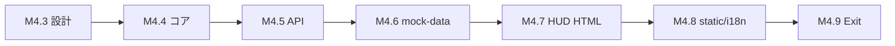

# PHASE 4 ロードマップ v1（採用済）

**日付**: 2026-05-28  
**ステータス**: **ADOPTED**（マスター承認・I-1 / 案 P 確定、`140437f` 系）  
**前提**: M4.1〜M4.2 ✅、PHASE 3 コード Exit ✅  
**旧草案**: [`PHASE4_ROADMAP_REVISION_DRAFT_2026-05-28.md`](./PHASE4_ROADMAP_REVISION_DRAFT_2026-05-28.md)（履歴）

### 進行原則（2026-05-28 確定）

Opus の設計判断は **推奨採用を既定** とし、マスターが明示的に修正指示しない限り推奨内容で確定として進める。確定済み論点は下表および [`ch10_v1.2_ROLLING_DRAFT.md`](./ch10_v1.2_ROLLING_DRAFT.md) に追記する。

### 確定事項一覧（追補）

| ID | 論点 | 確定 |
|----|------|------|
| U | 通貨単位 | **U-2** REAL / 内部 USD |
| E | HUD 通貨切替 | **E-1** 表示変換のみ |
| F | 為替レート | **F-2** `GET /api/v1/fx/usd_jpy`（外部 API キャッシュ） |
| G | マイルストン | **M4.7/M4.8** に組込（独立 M4.10 なし） |
| H | D11 会計 | **H-1** balance=自由資金、open/close v1 維持 |
| D | Hub vs HUD | **I-1** 温存・相互リンク、主入口 `00_hud.html` |
| P/Q | M4.6/M4.7 順 | **案 P** |
| W | 本体ローリング順 | **W-2**（ch18 `E_PRINCIPAL_*` 先行 → ch10/13/16/18/22 一括） |
| X | M4.3 完了後の Opus 関与 | **X-2** Composer が M4.4〜M4.6 を主導。SSOT 疑義時のみ Opus 判断 |

---

## ゴール

参照画像（Hermes 型 HUD）相当の **単一画面体験** を、**元本概念（A-2/B-2）** を正しく扱う形で実現する。

---

## Hub / HUD ナビ（I-1 確定）

| 画面 | 役割 | パス |
|------|------|------|
| **HUD（主入口）** | 情報密集型ビューア・ボット実感 | `docs/mockups/00_hud.html` |
| **Hub** | 10 画面ナビ + 業務サマリ | `docs/mockups/index.html` |

**運用ルール**

- ブックマーク・README・Quick Start の「最初に開くページ」は **`00_hud.html`**（serve 時は `/pages/00_hud.html`）。
- Hub と HUD は **両画面温存**。相互リンクで双方向動線（M4.7 出口条件）。
- `index.html` の i18n / `hub_meta` は **削除・吸収しない**（I-2 相当の変更は行わない）。

---

## マイルストン（案 P: M4.6 → M4.7 順序維持）

| ID | 名称 | 領域 | 状態 | 出口条件（要約） |
|----|------|------|------|----------------|
| M4.1 | FastAPI + SSE 契約 | Composer | ✅ `dea96e0` | |
| M4.2 | 静的モック + EventSource | Composer | ✅ `02edfa0` | |
| **M4.3** | 設計章追補（元本 + ch10 v1.2） | Opus | **✅ 完了** | ch10 v1.2 / ch13 v1.0.5 / ch16 v1.0.3 / ch18 v1.1.1 / ch22 v1.0.5 ローリング済 |
| **M4.4** | 元本コア実装 | Composer | **✅ 完了** | migrate / PrincipalService / INV-D-06 v2 + 07/08/09、127 pytest・≈88% |
| **M4.5** | REST + CLI + SSE `principal_changed` | Composer | **✅ 完了** | principal/fx REST、CLI 4 本、SSE #12、**141** pytest |
| **M4.6** | `mock-data.js` 拡張 | Composer | **✅ 完了** | principal 5 値 / FX mock / SSE #12 mock / HUD aggregates、10 画面不変 |
| **M4.7** | `00_hud.html` 新規 | Composer | **着手可** | 参照 8 割一致、I-1 相互リンク、チャート placeholder |
| M4.8 | i18n + static 反映 | Composer | ⏳ | `build_web_static`、serve で HUD |
| M4.9 | PHASE 4 Exit 宣言 | Opus | ⏳ | `PHASE4_EXIT_DECLARATION.md` |

**案 Q**（M4.6/M4.7 順序入替・スケルトン先行）は **不採用**。M4.7 内でダミー値スケルトンの中間レビューは可。

### PHASE 3 Exit 残の扱い

| 項目 | 扱い |
|------|------|
| lab 24h paper | **PHASE 5**（HUD 完成後に観察セット） |
| ch10 全 SSE severity 必須 | **M4.3** に統合 |

### PHASE 5（仮）

- M5.x ローソク足 + エントリーマーカー
- lab 24h paper + HUD 観察

---

## 依存関係

---

## 関連正本

- 突き合わせ: [`../mockups/REF_IMAGE_GAP_MATRIX_v2.md`](../mockups/REF_IMAGE_GAP_MATRIX_v2.md)
- 元本ドラフト: [`PRINCIPAL_CONCEPT_V1_DRAFT.md`](./PRINCIPAL_CONCEPT_V1_DRAFT.md)
- 投入テンプレ: [`PHASE3_PARALLEL_CHAT_TEMPLATES.md`](./PHASE3_PARALLEL_CHAT_TEMPLATES.md) テンプレート 14
