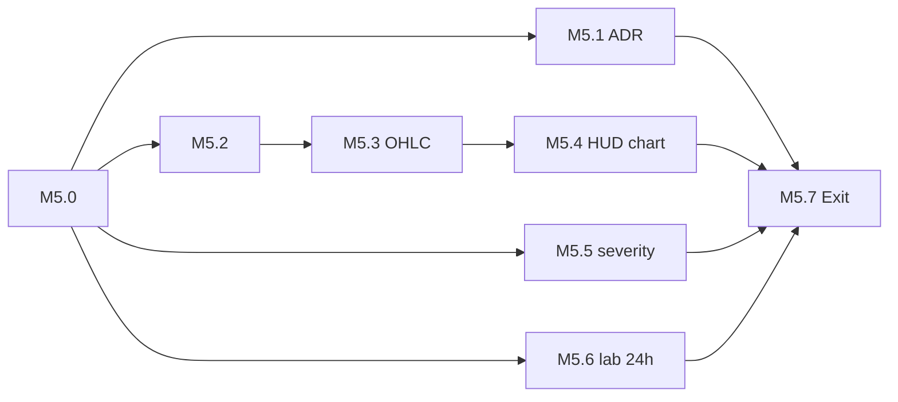

# PHASE 5 ロードマップ v1（採用済）

**日付**: 2026-05-28  
**ステータス**: **ADOPTED**（推奨案 A〜I 確定）  
**前提**: PHASE 4 Exit（[`PHASE4_EXIT_DECLARATION.md`](./PHASE4_EXIT_DECLARATION.md) `feaa328`）

---

## ゴール

観察と統合: **ローソク足 HUD**、**lab 24h paper レポート**、**設計ドラフト本体マージ（ADR-001）**。

---

## マイルストン

| ID | 名称 | 状態 | 出口条件（要約） |
|----|------|------|----------------|
| **M5.0** | ロードマップ確定 | **✅ 完了** | 本ファイル |
| **M5.1** | ADR-001 + archive クリーンアップ | **✅ 完了** | M4.3 本体反映済み確認、draft → `archive/principal-rollout-2026-05-28/` |
| **M5.2** | ローソク足 SSOT | **✅ 完了** | ch10 §10.3.15 + §10.6.14、`GET /api/v1/ohlc` |
| **M5.3** | OHLC API | **✅ 完了** | `GET /api/v1/ohlc`、ring buffer 60 本 |
| **M5.4** | HUD チャート SVG | **✅ 完了** | `00_hud.html` SVG + polling |
| **M5.5** | SSE severity 必須 | **✅ 完了** | 12 イベント全モデル + fixtures |
| **M5.6** | lab 24h paper | ⏳ 運用 | マスター実行 → `docs/operations/LAB_PAPER_24H_*.md` |
| **M5.7** | PHASE 5 Exit | ⏳ | `PHASE5_EXIT_DECLARATION.md`、v0.6.0 |

---

## 設計判断（確定）

| 論点 | 決定 |
|------|------|
| チャート | 純粋 SVG、依存なし |
| OHLC 配信 | REST polling 5s、`GET /api/v1/ohlc?bars=60` |
| データソース | Binance 5min（lab: 合成バー seed） |
| 永続化 | PHASE 5 ではしない |
| ADR-001 | 5 章一括 1 コミット |
| severity default | `INFO`（`emergency_stop_triggered` = `CRITICAL`） |
| lab 実行 | マスター、Composer はレポート起草 |

---

## 依存

---

## 非ゴール

- OHLC 永続 DB、SSE OHLC 増分、本格 backtest、LIVE 移行（PHASE 6/7）

---

## 関連

- PHASE 4: [`PHASE4_ROADMAP_v1.md`](./PHASE4_ROADMAP_v1.md)
- ADR: [`../adr/ADR-001_principal_concept_rollup.md`](../adr/ADR-001_principal_concept_rollup.md)
- 全体: [`00_ROADMAP.md`](./00_ROADMAP.md)
