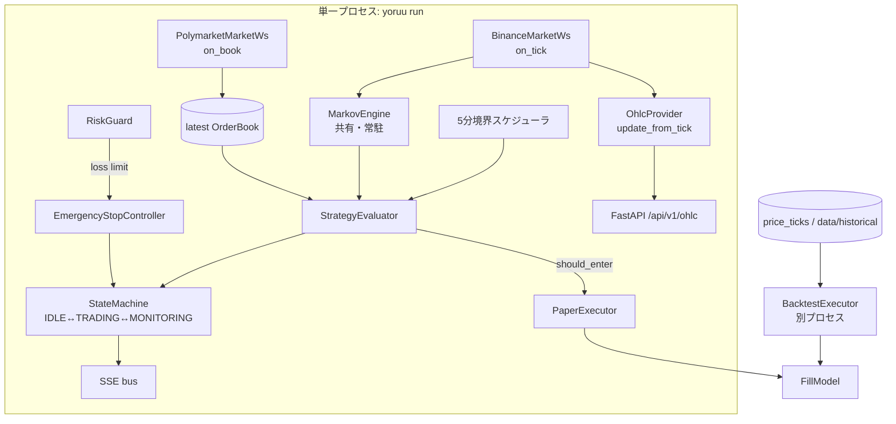

# PHASE 6 詳細設計 v1（実装指示書）

**日付**: 2026-05-31  
**ステータス**: **DRAFT**（M6.0 承認で ADOPTED）  
**位置づけ**: [`PHASE6_ROADMAP_v1.md`](./PHASE6_ROADMAP_v1.md) のマイルストン（M6.1〜M6.5）を、別チャット/別モデルが文脈なしで実装着手できる粒度まで具体化した設計書。マイルストン定義の SSOT はロードマップ、**実装インターフェースの SSOT は本ファイル**。  
**前提コミット**: `113570e`（PHASE 5 完了、v0.6.0）  
**設計章の根拠**: ch11（戦略）・ch12（モード）・ch13（約定 §13.5/§13.6）・ch16（不変条件）・ch19（キルスイッチ）

> 本書は **設計のみ**。コードは含めない。各節の「新規/変更ファイル」「インターフェース」「テスト基準」を実装の受け入れ条件とする。コーディング規約は `02-coding-style`（型ヒント必須・Google docstring・依存最小・early return）に従う。

---

## 0. 現状アーキテクチャと PHASE 6 の差分

### 0.1 現状（v0.6.0）の主要経路

| 経路 | 実装 | 限界 |
|------|------|------|
| `yoruu market run` | `infra/market_runner.py::run_market_feeds` が Binance/Polymarket WS を接続し DB に tick/book を書く | 戦略評価・約定とは**接続されていない**（feed のみ） |
| `yoruu paper evaluate-once` | `cli.py::paper_cmd` が **毎回** `MarkovEngine` を新規生成し合成価格 22 本を投入 → 1 回評価 | プロセス内で状態を保持しない、モック種値が固定 |
| `yoruu paper-24h` | `evaluate-once` を subprocess で反復 | サイクル間で Markov 状態が蓄積しない（C4）、約定が起きない |
| `yoruu serve` | FastAPI（`web/app.py`）。HUD は `OhlcProvider` の lab seed を返す | `OhlcProvider.update_from_tick` の呼出元なし（C2）、ライブ feed と非接続 |
| backtest | **存在しない**（C1） |
| `/emergency/stop` | `web/routes/api_v1.py` が SSE を publish するのみ | ポジション決済・状態遷移・記録なし（**スタブ**） |

### 0.2 PHASE 6 後の目標アーキテクチャ



要点: **(1)** WS feed・Markov・評価・約定を 1 プロセスに統合（M6.1）、**(2)** 同一プロセスで `OhlcProvider` をライブ更新し API へ供給（M6.2）、**(3)** backtest は状態機械を使わない独立プロセス（M6.3）、**(4)** 損失上限/不変条件違反を `EMERGENCY_STOP` に配線（M6.5）。

---

## M6.1 常駐評価ループ統合（C4）

### 1.1 目的

WS feed → Markov 更新 → 5 分境界評価 → ペーパー約定 → 状態遷移を、**単一の asyncio プロセス**で連続実行する。`paper-24h`（subprocess 反復）を置換し、Markov 状態をプロセス内で蓄積する。ch12 §12.10.1 の起動フロー（`INITIALIZING → IDLE → 評価ループ`）に準拠。

### 1.2 新規コンポーネント `TradingLoop`

**ファイル**: `src/yoruu/core/trading_loop.py`（新規）

責務: feed のライフサイクル管理、共有 `MarkovEngine` と最新 `OrderBook` の保持、5 分境界での評価実行、約定と状態遷移の駆動。

```text
class TradingLoop:
    def __init__(
        self,
        settings: AppSettings,
        db: Database,
        *,
        markov: MarkovEngine,
        evaluator: StrategyEvaluator,
        executor: PaperExecutor,
        state_machine: StateMachine,
        risk_guard: RiskGuard,
        invariants: InvariantChecker,
        ohlc: OhlcProvider | None = None,     # M6.2 で接続
        clock: Clock | None = None,           # テスト用に注入可能（既定 system clock）
    ) -> None: ...

    async def on_tick(self, tick: PriceTick) -> None:
        """Binance tick: Markov へ close 投入 + OHLC 更新（M6.2）。"""

    async def on_book(self, book: OrderBook) -> None:
        """Polymarket book: latest book を更新。"""

    async def run(self, *, max_evaluations: int | None = None,
                  deadline_sec: float | None = None) -> LoopStats:
        """feed 接続 → 評価ループ → 正常停止。max_evaluations はテスト/スモーク用。"""

    async def evaluate_cycle(self) -> EvaluationResult:
        """1 評価サイクル（状態遷移 + 約定含む）。"""
```

**統合点（既存フックを利用、新規配線は最小）**:

- `BinanceMarketWs(settings.websocket, symbol=..., db=db, on_tick=loop.on_tick)` — `on_tick` フックは既存（`infra/binance_ws.py` L29/L72）。
- `PolymarketMarketWs(..., on_book=loop.on_book)` — `on_book` フックは既存（`infra/polymarket_ws.py` L29/L95）。
- stale 判定は `AsyncWsClient.is_stale`（既存、`ws_client.py` L59）を利用。`BinanceMarketWs.client` / `PolymarketMarketWs.client` で参照可能。

### 1.3 5 分境界スケジューラ

- BTC 5min Up/Down は 5 分足が判定単位。**ティック到着駆動ではなく、5 分境界（00,05,10,…分）で評価**を 1 回行う。
- 実装方針: `run()` 内で「次の 5 分境界までの秒数」を計算し `asyncio.sleep`。境界で `evaluate_cycle()` を呼ぶ。`interval_sec` は設定可能（既定 300、テストは短縮）。
- `Clock` 抽象（`now()` と `sleep()`）を注入可能にし、テストで仮想時間を使う（決定論・高速）。

### 1.4 評価サイクルの状態遷移（ch12 §12.4 準拠）

```text
IDLE
  └ evaluate_cycle():
       snap = markov.snapshot()
       result = evaluator.evaluate(latest_market_state, balance, max_trade_size, snap, risk_guard)
       if result.should_enter:
            sm.transition(TRADING, "loop entry")
            fill = executor.open(OpenRequest(...))
            sm.transition(MONITORING_POSITION, "order placed")
       else:
            stay IDLE (wait)
MONITORING_POSITION
  └ 満期（5分）到達:
       executor.close(CloseRequest(reason=EXPIRATION))
       sm.transition(IDLE, "position expired")
```

- `MONITORING_POSITION` では新規エントリーしない（並行ポジション不可、ch12 §12.3）。
- Markov の `add_close` は **Binance tick** から供給（`on_tick`）。評価は 5 分境界の `snapshot()` を使う。
- 約定の有無は実データ次第。決定論モックと異なり、persistence が閾値を超えれば実際に約定が発生する（PHASE 5 で検証できなかった経路）。

### 1.5 CLI

**新規コマンド**: `yoruu run`（`cli.py`）

```text
yoruu run --config config/yoruu.yaml [--max-evaluations N] [--deadline-sec S]
```

- `mode` は `PAPER`/`SIMMER` のみ許可（LIVE は PHASE 7、`--confirm-live` 経路は未実装で良い）。`BACKTEST` は拒否し `yoruu backtest` を案内（ch12 §12.5.4）。
- 起動: `INITIALIZING` → WS 接続 → `strategy.json` 読込 → 初期 Markov 構築 → `IDLE` → `TradingLoop.run()`。
- SIGTERM: `SHUTDOWN` 遷移（ch12 §12.10.2）。`asyncio` のシグナルハンドラで graceful stop。
- `--max-evaluations` はスモーク/CI 用（`paper-24h --max-cycles` の後継）。

`paper-24h` は当面**残置**（後方互換）し、`run` 安定後に deprecation 注記。本 M6.1 では削除しない（Surgical）。

### 1.6 新規/変更ファイル

| 操作 | ファイル | 内容 |
|------|----------|------|
| + | `src/yoruu/core/trading_loop.py` | `TradingLoop`、`LoopStats`、`Clock` 抽象 |
| ~ | `src/yoruu/cli.py` | `run` コマンド追加（feed 配線 + signal handler） |
| ~ | `src/yoruu/infra/market_runner.py` | `on_tick`/`on_book` を受け取り `TradingLoop` と接続する薄いオーケストレータ（任意で `run` から流用） |
| + | `tests/test_trading_loop.py` | 仮想 Clock + mock feed で評価サイクル・状態遷移・約定経路 |

### 1.7 テスト基準（受け入れ条件）

- 仮想 Clock で「上昇継続→persistence 上昇→約定発生→満期決済→IDLE 復帰」を 1 ケースで再現し、`trades` に 1 行・PnL 計算・`balance` 更新を検証。
- `--max-evaluations 3` で `LoopStats.evaluations == 3`、INV 違反 0、exit 0。
- WS stale 時に評価をスキップ（`wait` 相当）し、クラッシュしないこと。
- 既存 146 テストが回帰しないこと、カバレッジ ≥ 80%。

---

## M6.2 OHLC 実データ接続（C2）

### 2.1 目的

`OhlcProvider.update_from_tick(price, ts_iso)`（既存・未配線、`infra/ohlc_provider.py` L80）を Binance tick に接続し、HUD チャートが**ライブの 5 分足**を反映する。オフライン時は lab seed フォールバックを維持。

### 2.2 設計上の論点（重要・要決定）: プロセス境界

現状 `yoruu serve`（FastAPI）と `yoruu run`（loop）は**別プロセス**。`OhlcProvider` は API プロセス内（`web/deps.py` 管理）にあり、loop プロセスが `update_from_tick` を呼んでも API 側のインスタンスには反映されない。PHASE 5 で **OHLC 永続化は非ゴール**と確定済み（`PHASE5_ROADMAP_v1` 非ゴール）。

→ **推奨案 A（同一プロセス統合）**: `yoruu serve` の FastAPI lifespan で `TradingLoop` をバックグラウンド task として起動し、`TradingLoop` と API が**同一 `OhlcProvider` インスタンス**を共有する。これにより loop の `on_tick` → `update_from_tick` が API `/api/v1/ohlc` に即反映。`yoruu run` は loop 単独（HUD 不要時）、`yoruu serve` は loop + API（HUD 必要時）という役割分担。

代替案 B（別プロセス + 永続化）は PHASE 5 非ゴールに抵触するため**不採用**。代替案 C（API は常に lab seed、loop と非接続）は HUD がライブにならず M6.2 の目的を満たさないため**不採用**。

> **要決定（M6.0）**: 案 A を採用する場合、`serve` に `--with-loop`（既定 on）フラグを設けるか、`run` に `--serve`（API 同梱）フラグを設けるかの一本化。推奨は **`serve` を主入口とし lifespan で loop を起動**、`run` は loop 単独の軽量経路として残す。

### 2.3 配線

- `TradingLoop.on_tick` 内で `self._ohlc.update_from_tick(tick.price, tick.ts_iso)` を呼ぶ（`ohlc` が注入されている場合のみ）。
- `update_from_tick` は現在の 5 分バーに tick をマージする実装が既存（high/low/close 更新）。**5 分境界での新バー切り出し**は現状 `seed_lab_fixture` のみが境界生成しているため、`update_from_tick` に「バー境界をまたいだら新バーを push」するロジック追加が必要（下記）。

### 2.4 `OhlcProvider` の小改修

| 操作 | 内容 |
|------|------|
| ~ | `update_from_tick`: tick の ts が現在バーの 5 分枠を超えたら、新バー（open=前バー close、その後 high/low/close=price）を ring buffer に push。`max_bars` 超過で先頭を drop |
| + | `is_live` 相当の内部フラグ（lab seed のままか、ライブ tick を受けたか）。API レスポンスに `source: "lab" | "live"` を含めると HUD 表示の誠実性が上がる（任意） |

ロジック非自明（境界判定）なため日本語コメントを付す。lab seed フォールバックは `ensure_seeded` を維持。

### 2.5 新規/変更ファイル

| 操作 | ファイル | 内容 |
|------|----------|------|
| ~ | `src/yoruu/infra/ohlc_provider.py` | 5 分境界での新バー push、`source` フラグ（任意） |
| ~ | `src/yoruu/web/app.py` / `web/deps.py` | lifespan で `TradingLoop` 起動 + `OhlcProvider` 共有（案 A） |
| ~ | `src/yoruu/cli.py` | `serve` に loop 起動の結線 |
| ~ | `tests/infra/test_ohlc_provider.py` | 境界跨ぎで新バー生成・本数上限・lab フォールバック |
| + | `tests/web/test_ohlc_live.py` | tick 注入 → `/api/v1/ohlc` がライブ値を返す |

### 2.6 テスト基準

- 連続 tick を 5 分境界をまたいで投入し、バー数が増え、最新バーの close が最後の tick 値になること。
- tick 未受信時は lab seed 60 本を返すこと（既存挙動の非回帰）。
- 案 A: lifespan task が起動/停止でき、API がライブバーを返すこと。

---

## M6.3 BacktestExecutor（C1）

### 3.1 目的

過去データで戦略を検証する `BACKTEST` モードを実装。ch13 §13.5 の設計（FillModel 共有・状態機械不使用・決定論）に厳密準拠。KPI（勝率・最大ドローダウン）を出力し M6.6 の初期パラメータ確定に使う。

### 3.2 新規コンポーネント

**ファイル**: `src/yoruu/execution/backtest_executor.py`、`src/yoruu/infra/historical_loader.py`（新規）

```text
class HistoricalLoader:
    """price_ticks（7日以内）または data/historical/*.csv|json から 5分足を供給。"""
    def load_closes(self, *, start: str, end: str, symbol: str) -> list[PriceTick]: ...

class BacktestExecutor:
    def __init__(self, loader: HistoricalLoader, fill_model: FillModel,
                 markov: MarkovEngine, evaluator: StrategyEvaluator,
                 *, max_trade_size_usd: float, initial_balance: float) -> None: ...
    def run(self, *, start: str, end: str, rng_seed: int = 42) -> BacktestResult: ...

@dataclass(frozen=True)
class BacktestResult:
    trades: int
    wins: int
    win_rate: float
    pnl_total: float
    max_drawdown: float          # KPI（PHASE 6 Exit 基準）
    final_balance: float
    params: dict                 # 使用した戦略パラメータ
    period: tuple[str, str]
```

### 3.3 設計詳細（ch13 §13.5）

- **状態機械を使わない**（ch12 §12.4.2、`StateMachine` を生成しない）。`bot_state` も更新しない。
- **FillModel を PaperExecutor と共有**（同一パラメータ・同一 `rng_seed` で生成）。これにより BACKTEST と PAPER の結果比較が公正（§13.5.1）。
- **OrderBook 構築**（履歴にブックがないため、§13.5.3）: `best_ask = mid + spread_assumed/2`、`best_bid = mid - spread_assumed/2`。`spread_assumed` は内部定数 or 設定（ch22 と整合、既定は控えめに）。
- **仮想時刻**（§13.5.4）: `now` を履歴の 5 分足クローズ時刻から算出。`daily_loss_limit` は適用しない（§12.7.2）が `max_trade_size_usd` は適用。
- **再生ループ**: 5 分足クローズごとに `markov.add_close` → `evaluator.evaluate` → should_enter なら仮想 open、次足で満期 close。`max_drawdown` は balance 系列の peak-to-trough で算出。

### 3.4 格納先（ch12 §12.8.4 既定 A）

- 既定: `what_if_scenarios` テーブルに `name="backtest_<YYYYMMDD>_<run_id>"` で保存。
- CLI オプションで `data/backtest/<run_id>/result.json`（案 B）も選択可。
- `trades` テーブルには**書き込まない**（モード分離、§12.8.1）。

### 3.5 CLI

```text
yoruu backtest run --start 2026-05-01 --end 2026-05-30 [--seed 42] [--out json|db]
```

- `mode` 検証は不要（独立実行）。終了時に `BacktestResult` を JSON で stdout 出力 + 格納先へ保存。

### 3.6 新規/変更ファイル

| 操作 | ファイル | 内容 |
|------|----------|------|
| + | `src/yoruu/execution/backtest_executor.py` | `BacktestExecutor`、`BacktestResult` |
| + | `src/yoruu/infra/historical_loader.py` | `HistoricalLoader`（price_ticks / CSV / JSON） |
| ~ | `src/yoruu/cli.py` | `backtest run` コマンド |
| ~ | `src/yoruu/data/database.py` | `what_if_scenarios` への backtest 保存 helper（既存テーブル想定、なければ追加要否を確認） |
| + | `tests/test_backtest_executor.py` | 既知の履歴系列で決定論的 KPI、同 seed で再現一致 |

> **[要確認]** `what_if_scenarios` テーブルが現スキーマに存在するか（ch10 §10.3.13 では定義されているが DB 実装の有無は未確認）。無ければ M6.3 に「スキーマ追加 + migrate」を含める。

### 3.7 テスト基準

- 上昇トレンドの合成履歴で約定が発生し、`win_rate`/`max_drawdown`/`pnl_total` が決定論的に一致。
- 同一 `rng_seed` で 2 回実行 → 完全一致（§13.1.1 再現性）。
- `daily_loss_limit` 不適用、`max_trade_size_usd` 適用を検証。

---

## M6.4 夜間レビュー自動化（V1）

### 4.1 目的

`yoruu nightly generate`（既存）を毎日 04:00（JST）に自動起動する。ランタイム LLM・常駐スケジューラを増やさない方針（依存最小）に従い、**OS タイマー**を使う。

### 4.2 方式（依存追加なし）

| OS | 仕組み | 成果物 |
|----|--------|--------|
| Windows | タスクスケジューラ（`schtasks`） | `docs/operations/NIGHTLY_SCHEDULE_WINDOWS.md` + `tools/nightly_run.ps1`（薄い wrapper） |
| Linux (VPS) | systemd timer | `docs/operations/NIGHTLY_SCHEDULE_LINUX.md` + `*.service` / `*.timer` ユニット例 |

- wrapper は `cd <repo> && uv run yoruu nightly generate` を実行し、終了コードと出力をログファイルへ追記するだけ。in-process スケジューラ（APScheduler 等）は**導入しない**。
- 失敗時の通知は「ローカルファイル + CLI」方針（README 設計思想）に沿い、ログ追記のみ。

### 4.3 新規/変更ファイル

| 操作 | ファイル | 内容 |
|------|----------|------|
| + | `docs/operations/NIGHTLY_SCHEDULE_WINDOWS.md` | schtasks 登録手順 + 確認方法 |
| + | `docs/operations/NIGHTLY_SCHEDULE_LINUX.md` | systemd timer ユニット例 |
| + | `tools/nightly_run.ps1` / `tools/nightly_run.sh` | ログ追記付き wrapper |

### 4.4 受け入れ条件

- wrapper を手動実行 → `reports/` にレポート生成、ログに exit 0。
- スケジュール登録手順がコピペで再現でき、登録後に次回実行時刻が確認できる。
- コードベースに新規 Python 依存が増えていないこと。

---

## M6.5 安全リハーサル（カオス + キルスイッチ）

### 5.1 現状ギャップ（実装が必要）

| 項目 | 現状 | 必要 |
|------|------|------|
| `/emergency/stop` API | SSE publish のみ（`api_v1.py` L263、**スタブ**） | ポジション決済 + 状態遷移 + 記録 |
| 自動トリガ | `RiskGuard.daily_loss_exceeded()` はあるが遷移未配線 | loop で検知 → `EMERGENCY_STOP` |
| CLI | `emergency-stop` 不在 | `yoruu emergency-stop --confirm` |
| ポジション一括処理 | `close_all` 不在 | 全 open ポジションを `close(reason=EMERGENCY_STOP)` |

### 5.2 新規コンポーネント `EmergencyStopController`

**ファイル**: `src/yoruu/safety/emergency_stop.py`（新規）

ch19 §19.4.1 の手順を実装:

```text
class EmergencyStopController:
    def trigger(self, *, source: str, detail: str) -> EmergencyStopResult:
        # 1. 評価ループ停止（新規エントリー禁止フラグ）
        # 2. オープンポジションを close(reason=EMERGENCY_STOP) 順次
        # 3. (LIVE のみ) 未約定注文キャンセル — PHASE 6 は paper のみのため no-op
        # 4. sm.transition(EMERGENCY_STOP)
        # 5. emergency_stops INSERT（ch10 §10.3.11）
        # 6. audit_log INSERT（action=EMERGENCY_STOP）
        # 7. SSE emergency_stop_triggered（severity=CRITICAL）
```

- `trigger_source`: `USER`（手動）/ `RISK_GUARD`（損失上限）/ `SYSTEM`（不変条件）。
- 部分失敗時は `audit_log.result=PARTIAL`（ch19 §19.4.3）。

### 5.3 自動トリガ配線（ch19 §19.3）

`TradingLoop.evaluate_cycle` 内で:

- `risk_guard.daily_loss_exceeded()` → `EmergencyStopController.trigger(source="RISK_GUARD", detail="AUTO_LOSS_LIMIT")`。
- `InvariantChecker` が違反を raise → catch して `trigger(source="SYSTEM", detail="AUTO_INVARIANT")`。
- 連続 Fill 失敗 ≥ 3（15 分以内）→ `AUTO_CONSECUTIVE_FAIL`（loop が失敗回数を保持）。

### 5.4 CLI + API 実装

- `yoruu emergency-stop --confirm`（`cli.py`）: `EmergencyStopController.trigger(source="USER")`。`--confirm` 無しは拒否。
- `/emergency/stop` API: スタブを実装に置換（`confirm_token` 2 段階は ch19 §19.4.2、PHASE 6 では最小実装でも可、要決定）。

### 5.5 カオステスト（ch12 §12.10 / 旧 PHASE 5 統合テスト）

| シナリオ | 注入方法 | 期待 |
|----------|----------|------|
| WS 切断 | mock feed が例外 → `AsyncWsClient` 再接続。stale 中は評価 skip | クラッシュせず、復帰後に評価再開 |
| API/Fill 障害 | `FillModel` が `ValueError` 連発 | `FillResult.success=False`、連続 3 回で `AUTO_CONSECUTIVE_FAIL` → EMERGENCY_STOP |
| ディスクフル | DB write が `sqlite3.OperationalError` | 例外を握り潰さずログ + 安全停止（ERROR 遷移） |
| 損失上限 | `daily_pnl` を限度超に設定 | 次サイクルで `AUTO_LOSS_LIMIT` → EMERGENCY_STOP |
| 手動キル | `emergency-stop --confirm` | open ポジション close、状態 EMERGENCY_STOP、`emergency_stops` 1 行 |

### 5.6 新規/変更ファイル

| 操作 | ファイル | 内容 |
|------|----------|------|
| + | `src/yoruu/safety/emergency_stop.py` | `EmergencyStopController` |
| ~ | `src/yoruu/core/trading_loop.py` | 自動トリガ配線（M6.1 と連動） |
| ~ | `src/yoruu/cli.py` | `emergency-stop` コマンド |
| ~ | `src/yoruu/web/routes/api_v1.py` | `/emergency/stop` 実装化（要決定: 2 段階） |
| ~ | `src/yoruu/data/database.py` | `emergency_stops` INSERT helper（無ければ追加） |
| + | `tests/safety/test_emergency_stop.py` | trigger 手順、状態遷移、記録 |
| + | `tests/test_chaos.py` | 上表 5 シナリオ |

> **[要確認]** `emergency_stops` テーブルの DB 実装有無（ch10 §10.3.11 で定義）。無ければスキーマ追加 + migrate を本 M6.5 に含める。

### 5.7 テスト基準

- 手動キル: `current() == EMERGENCY_STOP`、open ポジション 0、`emergency_stops` 1 行、SSE severity=CRITICAL。
- 自動キル 3 種（損失/不変/連続失敗）がそれぞれ `EMERGENCY_STOP` へ遷移。
- カオス各シナリオで「握り潰しなし」（`except: pass` を作らない、ログ必須）。

---

## M6.6 / M6.7 / M6.8（運用・設計薄め）

| ID | 設計メモ |
|----|----------|
| M6.6 初期パラメータ | M6.3 backtest を複数パラメータで回し、`max_drawdown < 20%` かつ `win_rate > 50%`（参考）を満たす `strategy.json` をベースライン化。結果を `docs/operations/` に記録 |
| M6.7 14 日運用 | `yoruu serve`（loop 同梱、案 A）を SIMMER で 14 日。日次 KPI を `daily_reports` 拡張（`max_drawdown`/`win_rate` カラム）に記録。夜間レビュー（M6.4）と連動 |
| M6.8 Exit | `PHASE6_EXIT_DECLARATION.md` + v0.7.0。Exit 基準はロードマップ §Exit Criteria |

---

## 9. 横断的関心事

### 9.1 設定キー追加（ch22 と要整合）

| キー（案） | 用途 | M |
|-----------|------|---|
| `loop.interval_sec` | 評価間隔（既定 300） | M6.1 |
| `backtest.spread_assumed` | 履歴 OrderBook 構築用スプレッド | M6.3 |
| `daily_reports.kpi`（DB） | max_drawdown/win_rate 永続 | M6.7 |

設定追加は ch22（設定仕様）の APPROVED 章への追補となるため、`00_ROADMAP §5` の「注記・型追記はマイナーバージョンのローリング更新」ルールに従い `REVIEW_CHECKLIST_ch22.md` に 1 行追記する。

### 9.2 DB スキーマ

- `what_if_scenarios`（M6.3）・`emergency_stops`（M6.5）・`daily_reports` KPI 列（M6.7）の DB 実装有無を着手時に確認。無ければ `data/migrate.py` に migration を追加（既存 principal migration と同パターン）。

### 9.3 依存・規約

- 新規 Python 依存は**追加しない**（asyncio/標準ライブラリ + 既存 websockets/fastapi で完結）。
- 不変条件（ch16、INV-*）は既存 `InvariantChecker` 経由で全約定・遷移に適用。
- `02-coding-style`: 型ヒント必須、Google docstring、I/O・パース・subprocess は try/except で文脈付きログ、`except: pass` 禁止。

---

## 10. 実装順序と検証ゲート

```text
M6.1 TradingLoop      → verify: test_trading_loop（仮想Clockで約定経路）+ 既存146非回帰
  ↓
M6.2 OHLC live wiring  → verify: test_ohlc_live（tick→/api/v1/ohlc）+ lab fallback非回帰
  ↓ (M6.3 は M6.1 と独立、並行可)
M6.3 Backtest          → verify: test_backtest_executor（決定論KPI・seed再現）
  ↓
M6.5 Emergency/Chaos   → verify: test_emergency_stop + test_chaos（5シナリオ）
  ↓
M6.4 Nightly schedule  → verify: wrapper手動実行でレポート生成
  ↓
M6.6 → M6.7 → M6.8（運用 + Exit + v0.7.0）
```

各ゲートで `uv run --no-sync pytest -q` が **pass**、カバレッジ ≥ 80% を必須とする。

---

## 11. リスク・未確定事項（M6.0 で確定）

| # | 論点 | 推奨 | 状態 |
|---|------|------|------|
| 1 | OHLC ライブ配信のプロセス境界（M6.2 §2.2） | 案 A: `serve` lifespan で loop 起動・OhlcProvider 共有 | 要決定 |
| 2 | `run` と `serve` の役割分担 | `serve`=loop+API（主入口）、`run`=loop 単独（軽量） | 要決定 |
| 3 | `what_if_scenarios` / `emergency_stops` の DB 実装有無 | 着手時に確認、無ければ migrate 追加 | [要確認] |
| 4 | `/emergency/stop` の 2 段階確認（confirm_token） | PHASE 6 は最小実装（`--confirm`）、2 段階は PHASE 7 | 要決定 |
| 5 | backtest 履歴データの入手（price_ticks 7日 or CSV） | lab は合成、実データは別途取得 | 運用依存 |

---

## 12. 関連

- ロードマップ: [`PHASE6_ROADMAP_v1.md`](./PHASE6_ROADMAP_v1.md)
- 前フェーズ Exit: [`PHASE5_EXIT_DECLARATION.md`](./PHASE5_EXIT_DECLARATION.md)
- 設計章: [`12_mode_specification.md`](./12_mode_specification.md) · [`13_paper_execution.md`](./13_paper_execution.md) · [`19_kill_switch.md`](./19_kill_switch.md) · [`16_invariants.md`](./16_invariants.md)
- 実装ギャップ初出: `docs/2026-05-29_開発日記.html`（C1〜C4 / V1〜V3）
