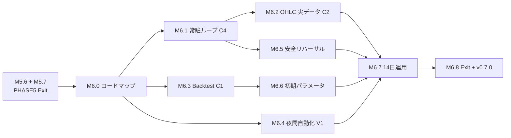

# PHASE 6 ロードマップ v1（計画）

**日付**: 2026-05-31  
**ステータス**: **PROPOSED**（M6.0 承認待ち）  
**前提**: PHASE 5 完了（M5.0–M5.7、v0.6.0、`113570e`）。  
**正本**: 本ファイル（PHASE 6 マイルストン SSOT）／全体は [`00_ROADMAP.md`](./00_ROADMAP.md)  
**実装詳細設計**: [`PHASE6_DETAILED_DESIGN_v1.md`](./PHASE6_DETAILED_DESIGN_v1.md)（M6.1〜M6.5 のインターフェース・ファイル・テスト基準の SSOT。別モデルでの実装着手はこちらを参照）

---

## ゴール

**実市場データでのペーパー運用**を安全に 14 日間継続できる状態にする。具体的には、(1) 単一プロセスの常駐評価ループ、(2) OHLC の実データ接続、(3) backtest による初期パラメータ検証、(4) 夜間レビューサイクルの自動化、(5) 安全系（カオス・キルスイッチ）リハーサルを揃える。

PHASE 5（観察・統合）で先送りした実装ギャップ（diary 2026-05-29 の C1〜C4）と、再スコープ時に PHASE 5 から外れた統合テスト項目（カオス・キルスイッチ・backtest）を本フェーズで吸収する。

---

## 着手ゲート（PHASE 5 残）

| ID | 項目 | 担当 | 状態 |
|----|------|------|------|
| M5.6 | lab paper ハーネス安定性（短縮スモーク） | マスター（運用） | ✅ 完了（2026-05-31） |
| M5.7 | PHASE 5 Exit 確定 + `pyproject.toml` v0.6.0 bump | Composer + マスター承認 | ✅ 完了（2026-05-31、`de77f0d`） |

> PHASE 5 ゲートは充足。**残るゲートは M6.0 承認**（本ロードマップ + [`PHASE6_DETAILED_DESIGN_v1.md`](./PHASE6_DETAILED_DESIGN_v1.md) の §11 未確定事項を確定）。承認後 M6.1 着手可。

---

## マイルストン

| ID | 名称 | 由来 | 出口条件（要約） |
|----|------|------|----------------|
| **M6.0** | PHASE 6 ロードマップ確定 | — | 本ファイル PROPOSED → ADOPTED（マスター承認） |
| **M6.1** | 常駐評価ループ統合 | C4 | market WS → markov → evaluate → paper fill を**単一 asyncio プロセス**で連続実行。`paper-24h`（subprocess 反復）を置換。長時間スモークで INV 違反 0 |
| **M6.2** | OHLC 実データ接続 | C2 | `OhlcProvider.update_from_tick` を Binance フィードに配線。HUD が実ティック反映、オフライン時は lab seed フォールバック維持 |
| **M6.3** | BacktestExecutor | C1 | `BACKTEST` モード + CLI `backtest run`。履歴バー再生 → 戦略 → FillModel。決定論テスト + KPI（勝率・最大DD）出力 |
| **M6.4** | 夜間レビュー自動化 | V1 | 04:00 起動の `nightly generate`（OS タイマー: systemd timer / Task Scheduler を推奨、追加依存なし）。手順を `docs/operations/` に文書化 |
| **M6.5** | 安全リハーサル | 旧 PHASE5 統合テスト | カオス（WS 切断・API 障害・ディスクフル）で安全停止、キルスイッチ → `EMERGENCY_STOP` 遷移を pytest で担保 |
| **M6.6** | 初期戦略パラメータ確定 | 旧 M6.1 | M6.3 backtest + lab データでベースライン `strategy.json` を決定・記録 |
| **M6.7** | paper 運用 14 日 + 日次レビュー | 旧 M6.2/M6.3 | 実データ paper を 14 日継続、KPI（勝率・最大DD）を日次記録、夜間レビューサイクル安定 |
| **M6.8** | PHASE 6 Exit 宣言 + v0.7.0 | — | `PHASE6_EXIT_DECLARATION.md`、`pyproject.toml` v0.7.0 |

---

## 設計判断（要決定 / 推奨）

| 論点 | 選択肢 | 推奨 |
|------|--------|------|
| 常駐ループ（M6.1） | (a) 単一 asyncio プロセスで feed 共有 / (b) subprocess 反復継続 | **(a)**。`market run` の feed と `evaluate-once` を同一プロセスに統合し、WS stale 判定を共有 |
| OHLC ソース（M6.2） | Binance live WS / REST poll | **WS**（`binance_ws` 既存）。`update_from_tick` を tick ハンドラから呼ぶ |
| backtest データ（M6.3） | 記録済みティック再生 / 合成バー | **記録済みティック優先**、無い区間は合成バーで補完（lab） |
| スケジューラ（M6.4） | in-process（依存追加）/ OS タイマー | **OS タイマー**。`02-coding-style` の「依存最小」と整合、ランタイム LLM/常駐スケジューラを増やさない |
| KPI 永続化 | 既存 `daily_reports` 拡張 / 新テーブル | **既存 `daily_reports` 拡張**（max_drawdown / win_rate カラム） |

> 上記は M6.0 承認時に確定。確定後 `00_ROADMAP.md` §6 変更履歴へ反映。

---

## 依存

---

## Exit Criteria（PHASE 6）

- 全自動テスト pass、行カバレッジ ≥ 80%（`fail_under` 維持）
- 実データ paper を **14 日連続**稼働（M6.7）、INV 違反 0・CRITICAL エラー 0
- カオス全シナリオで安全停止確認（M6.5）
- 夜間レビューサイクルが自動起動で安定稼働（M6.4）
- 参考 KPI: 累積勝率 > 50%（絶対基準ではない）、最大ドローダウン < 20%

---

## 非ゴール

- **LIVE 移行・実資金**（C3 = `LiveExecutor` CLI 公開）は **PHASE 7**
- OHLC の長期永続 DB（運用に必要な範囲を超える保持）
- 戦略アルゴリズム自体の刷新（Markov + Kelly を維持）
- ランタイム LLM の導入（設計思想に反する）

---

## 関連

- 前フェーズ: [`PHASE5_ROADMAP_v1.md`](./PHASE5_ROADMAP_v1.md) · [`PHASE5_EXIT_DECLARATION.md`](./PHASE5_EXIT_DECLARATION.md)
- 実装ギャップの初出: `docs/2026-05-29_開発日記.html`（entry-1001、C1〜C4 / V1〜V3）
- モード仕様: [`12_mode_specification.md`](./12_mode_specification.md)（backtest / paper / simmer / live）
- 安全設計: [`17_risk_matrix.md`](./17_risk_matrix.md) · [`18_error_handling.md`](./18_error_handling.md) · [`19_kill_switch.md`](./19_kill_switch.md)
- 全体: [`00_ROADMAP.md`](./00_ROADMAP.md)
